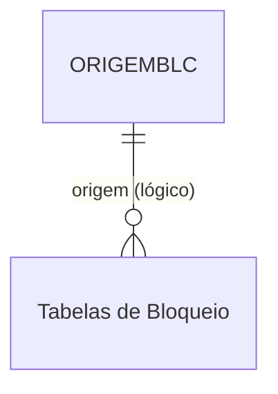

# ORIGEMBLC - Documentação Completa de Relacionamentos

## 📊 Informações Gerais

- **Nome da Tabela**: ORIGEMBLC (Origem de Bloqueio)
- **Total de Registros**: 4
- **Total de Colunas**: 3
- **Chave Primária**: ORIGEM
- **Chaves Estrangeiras**: 0
- **Índices**: 0
- **Tabelas Dependentes**: 0
- **Banco de Dados**: Firebird

## 📝 Descrição

**ORIGEMBLC** é uma tabela mestre de referência que define os tipos de origem possíveis para bloqueios no sistema. Com apenas **4 registros**, é uma tabela de configuração simples que serve como catálogo de valores para identificar a origem de bloqueios de produtos, pedidos ou outras entidades.

Esta tabela é essencial para:
- **Classificação**: Identificar a origem de bloqueios (ex: Manual, Automático, Sistema, etc.)
- **Relatórios**: Agrupar bloqueios por origem para análises
- **Validação**: Garantir que apenas origens válidas sejam utilizadas
- **Auditoria**: Rastrear de onde vieram os bloqueios

---

## 🔑 Estrutura de Colunas

| Coluna | Tipo | Descrição |
|--------|------|-----------|
| **ORIGEM** 🔑 | VARCHAR(37) | Código único da origem (PK) |
| **DESCRICAO** | VARCHAR(37) | Descrição da origem |
| **ATIVO** | VARCHAR(14) | Flag indicando se a origem está ativa |

---

## 🔗 Relacionamentos - Nível 1 (Diretos)

### Nenhum Relacionamento Formal

Esta tabela não possui chaves estrangeiras formais e não é referenciada por outras tabelas no momento.

---

## 🔗 Relacionamentos - Nível 2 (Indiretos)

### Relacionamentos Lógicos Potenciais

Embora não existam relacionamentos formais, esta tabela pode ser referenciada logicamente por:

#### Tabelas de Bloqueio (Relacionamento Lógico Potencial)
```
Tabelas de bloqueio.ORIGEM → ORIGEMBLC.ORIGEM (N:1)
```

**Descrição:** Tabelas relacionadas a bloqueios podem referenciar esta tabela para identificar a origem do bloqueio.

**Tabelas potenciais:**
- Tabelas de bloqueio de produtos
- Tabelas de bloqueio de pedidos
- Tabelas de bloqueio de clientes
- Tabelas de controle de estoque

---

## 🗺️ Diagrama de Relacionamentos



---

## 💡 Casos de Uso Práticos

### 1. Consultar Todas as Origens de Bloqueio Disponíveis

```sql
SELECT ORIGEM, DESCRICAO, ATIVO
FROM ORIGEMBLC
WHERE ATIVO = 'S'
ORDER BY ORIGEM;
```

### 2. Relatório de Bloqueios por Origem (Preparado para Futuro Uso)

```sql
SELECT 
    ob.ORIGEM,
    ob.DESCRICAO,
    COUNT(*) AS QTD_BLOQUEIOS
FROM ORIGEMBLC ob
LEFT JOIN (
    -- Exemplo de uso futuro quando tabelas de bloqueio referenciarem ORIGEMBLC
    SELECT ORIGEM FROM TABELA_BLOQUEIO
    UNION ALL
    SELECT ORIGEM FROM OUTRA_TABELA
) bloqueios ON ob.ORIGEM = bloqueios.ORIGEM
WHERE ob.ATIVO = 'S'
GROUP BY ob.ORIGEM, ob.DESCRICAO
ORDER BY QTD_BLOQUEIOS DESC;
```

### 3. Validar Origem Antes de Criar Bloqueio

```sql
SELECT COUNT(*) AS ORIGEM_VALIDA
FROM ORIGEMBLC
WHERE ORIGEM = :origem
    AND ATIVO = 'S';
```

### 4. Consultar Apenas Origens Ativas

```sql
SELECT ORIGEM, DESCRICAO
FROM ORIGEMBLC
WHERE ATIVO = 'S'
ORDER BY DESCRICAO;
```

---

## 📈 Estatísticas e Insights

### Volume de Dados
- **Total de Origens**: 4 registros
- **Uso**: Tabela de referência/catálogo
- **Frequência de Alteração**: Baixa (tabela de configuração)

---

## ⚡ Performance e Otimização

Como tabela pequena (4 registros), índices não são necessários. A tabela inteira pode ser carregada em memória.

---

## 🔒 Integridade de Dados

### Validações Importantes

1. **Código Único**: `ORIGEM` deve ser único
2. **Descrição Obrigatória**: `DESCRICAO` deve estar preenchida
3. **Consistência**: Códigos utilizados em tabelas de bloqueio devem existir nesta tabela (quando implementado)

---

## 📚 Integração com Aplicação (Laravel)

### Model ORIGEMBLC

```php
<?php

namespace App\Models;

use Illuminate\Database\Eloquent\Model;

final class ORIGEMBLC extends Model
{
    protected $table = 'ORIGEMBLC';
    
    protected $primaryKey = 'ORIGEM';
    
    public $incrementing = false;
    
    protected $fillable = [
        'ORIGEM',
        'DESCRICAO',
        'ATIVO',
    ];
    
    protected $casts = [
        'ATIVO' => 'boolean',
    ];
    
    /**
     * Scope para buscar apenas origens ativas
     */
    public function scopeAtivas($query)
    {
        return $query->where('ATIVO', 'S');
    }
    
    /**
     * Verificar se está ativa
     */
    public function isAtiva(): bool
    {
        return $this->ATIVO === 'S' || $this->ATIVO === true;
    }
}
```

---

## ✅ Boas Práticas

### Design
1. **Manter códigos consistentes** com o padrão do sistema
2. **Descrições claras** e objetivas
3. **Usar flag ATIVO** para controlar disponibilidade

### Performance
1. **Cachear valores** em memória devido ao pequeno volume
2. **Usar em dropdowns** e listas de seleção
3. **Filtrar por ATIVO** nas consultas

### Integridade
1. **Validar existência** antes de usar em tabelas de bloqueio (quando implementado)
2. **Não permitir exclusão** de origens em uso
3. **Usar flag ATIVO** em vez de exclusão física

### Manutenção
1. **Documentar significado** de cada código
2. **Revisar periodicamente** se novos códigos são necessários
3. **Preparar integração** com tabelas de bloqueio quando necessário

---

**Documentação gerada em**: 2025-01-27

**Banco de dados**: Firebird

