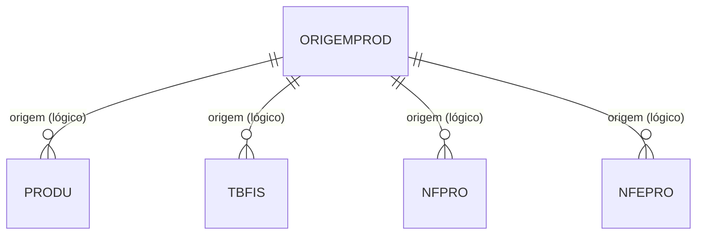

# ORIGEMPROD - Documentação Completa de Relacionamentos

## 📊 Informações Gerais

- **Nome da Tabela**: ORIGEMPROD (Origem de Produto)
- **Total de Registros**: 9
- **Total de Colunas**: 6
- **Chave Primária**: ORPCODIGO
- **Chaves Estrangeiras**: 0
- **Índices**: 0
- **Tabelas Dependentes**: 0
- **Banco de Dados**: Firebird

## 📝 Descrição

**ORIGEMPROD** é uma tabela mestre de referência que define os tipos de origem possíveis para produtos, incluindo configurações tributárias padrão por origem. Com **9 registros**, esta tabela serve como catálogo de valores para identificar a origem de produtos (ex: Nacional, Estrangeira, Importação, etc.) e define configurações fiscais padrão (ICMS, IPI, PIS, COFINS) para cada tipo de origem.

Esta tabela é essencial para:
- **Classificação**: Identificar a origem de produtos (Nacional, Estrangeira, etc.)
- **Configuração Fiscal**: Definir configurações tributárias padrão por origem
- **Relatórios**: Agrupar produtos por origem para análises fiscais
- **Validação**: Garantir que apenas origens válidas sejam utilizadas
- **Conformidade Fiscal**: Garantir tratamento tributário correto por origem

---

## 🔑 Estrutura de Colunas

| Coluna | Tipo | Descrição |
|--------|------|-----------|
| **ORPCODIGO** 🔑 | VARCHAR(14) | Código único da origem (PK) |
| **ORPDESCRICAO** | VARCHAR(37) | Descrição da origem |
| **ORPICMS** | VARCHAR(14) | Configuração padrão de ICMS |
| **ORPIPI** | VARCHAR(14) | Configuração padrão de IPI |
| **ORPPIS** | VARCHAR(14) | Configuração padrão de PIS |
| **ORPCOFINS** | VARCHAR(14) | Configuração padrão de COFINS |

---

## 🔗 Relacionamentos - Nível 1 (Diretos)

### Nenhum Relacionamento Formal

Esta tabela não possui chaves estrangeiras formais e não é referenciada por outras tabelas no momento.

---

## 🔗 Relacionamentos - Nível 2 (Indiretos)

### Relacionamentos Lógicos Potenciais

Embora não existam relacionamentos formais, esta tabela pode ser referenciada logicamente por:

#### PRODU - Produto (Relacionamento Lógico Potencial)
```
PRODU.ORIGEM → ORIGEMPROD.ORPCODIGO (N:1)
```

**Descrição:** Produtos podem referenciar esta tabela para identificar sua origem e aplicar configurações fiscais padrão.

---

#### TBFIS - Tabela Fiscal (Relacionamento Lógico Potencial)
```
TBFIS.ORIGEM → ORIGEMPROD.ORPCODIGO (N:1)
```

**Descrição:** Configurações fiscais podem referenciar esta tabela para aplicar configurações padrão por origem.

---

#### NFPRO - Produtos em Notas Fiscais (Relacionamento Lógico Potencial)
```
NFPRO.ORIGEM → ORIGEMPROD.ORPCODIGO (N:1)
```

**Descrição:** Produtos em notas fiscais podem referenciar esta tabela para identificar origem e aplicar tributação.

---

#### NFEPRO - Produtos em NF-e (Relacionamento Lógico Potencial)
```
NFEPRO.ORIGEM → ORIGEMPROD.ORPCODIGO (N:1)
```

**Descrição:** Produtos em NF-e podem referenciar esta tabela para identificar origem e aplicar tributação.

---

## 🗺️ Diagrama de Relacionamentos



---

## 💡 Casos de Uso Práticos

### 1. Consultar Todas as Origens de Produto

```sql
SELECT 
    ORPCODIGO,
    ORPDESCRICAO,
    ORPICMS,
    ORPIPI,
    ORPPIS,
    ORPCOFINS
FROM ORIGEMPROD
ORDER BY ORPCODIGO;
```

### 2. Relatório de Produtos por Origem (Preparado para Futuro Uso)

```sql
SELECT 
    op.ORPCODIGO,
    op.ORPDESCRICAO,
    COUNT(DISTINCT prod.PROCODIGO) AS QTD_PRODUTOS,
    SUM(nfp.NFPQTDE) AS QTD_VENDIDA,
    SUM(nfp.NFPVRUNIT * nfp.NFPQTDE) AS VALOR_TOTAL
FROM ORIGEMPROD op
LEFT JOIN PRODU prod ON prod.ORIGEM = op.ORPCODIGO
LEFT JOIN NFPRO nfp ON nfp.PROCODIGO = prod.PROCODIGO
GROUP BY op.ORPCODIGO, op.ORPDESCRICAO
ORDER BY VALOR_TOTAL DESC;
```

### 3. Validar Origem e Aplicar Configurações Fiscais Padrão

```sql
SELECT 
    op.ORPCODIGO,
    op.ORPDESCRICAO,
    op.ORPICMS AS ICMS_PADRAO,
    op.ORPIPI AS IPI_PADRAO,
    op.ORPPIS AS PIS_PADRAO,
    op.ORPCOFINS AS COFINS_PADRAO
FROM ORIGEMPROD op
WHERE op.ORPCODIGO = :origem;
```

### 4. Análise Tributária por Origem

```sql
SELECT 
    op.ORPCODIGO,
    op.ORPDESCRICAO,
    COUNT(DISTINCT CASE WHEN op.ORPICMS IS NOT NULL THEN 1 END) AS TEM_ICMS,
    COUNT(DISTINCT CASE WHEN op.ORPIPI IS NOT NULL THEN 1 END) AS TEM_IPI,
    COUNT(DISTINCT CASE WHEN op.ORPPIS IS NOT NULL THEN 1 END) AS TEM_PIS,
    COUNT(DISTINCT CASE WHEN op.ORPCOFINS IS NOT NULL THEN 1 END) AS TEM_COFINS
FROM ORIGEMPROD op
GROUP BY op.ORPCODIGO, op.ORPDESCRICAO
ORDER BY op.ORPCODIGO;
```

---

## 📈 Estatísticas e Insights

### Volume de Dados
- **Total de Origens**: 9 registros
- **Uso**: Tabela de referência/catálogo com configurações fiscais
- **Frequência de Alteração**: Baixa (tabela de configuração)

### Análise Fiscal
- Permite análise de tributação por origem de produto
- Facilita aplicação de configurações fiscais padrão
- Suporta conformidade tributária por origem

---

## ⚡ Performance e Otimização

Como tabela pequena (9 registros), índices não são necessários. A tabela inteira pode ser carregada em memória.

---

## 🔒 Integridade de Dados

### Validações Importantes

1. **Código Único**: `ORPCODIGO` deve ser único
2. **Descrição Obrigatória**: `ORPDESCRICAO` deve estar preenchida
3. **Configurações Fiscais**: Campos de configuração fiscal devem ser válidos quando preenchidos
4. **Consistência**: Códigos utilizados em produtos devem existir nesta tabela (quando implementado)

---

## 📚 Integração com Aplicação (Laravel)

### Model ORIGEMPROD

```php
<?php

namespace App\Models;

use Illuminate\Database\Eloquent\Model;

final class ORIGEMPROD extends Model
{
    protected $table = 'ORIGEMPROD';
    
    protected $primaryKey = 'ORPCODIGO';
    
    public $incrementing = false;
    
    protected $fillable = [
        'ORPCODIGO',
        'ORPDESCRICAO',
        'ORPICMS',
        'ORPIPI',
        'ORPPIS',
        'ORPCOFINS',
    ];
    
    /**
     * Relacionamento lógico com PRODU
     */
    public function produtos()
    {
        return $this->hasMany(PRODU::class, 'ORIGEM', 'ORPCODIGO');
    }
    
    /**
     * Verificar se tem configuração ICMS
     */
    public function temICMS(): bool
    {
        return !empty($this->ORPICMS);
    }
    
    /**
     * Verificar se tem configuração IPI
     */
    public function temIPI(): bool
    {
        return !empty($this->ORPIPI);
    }
    
    /**
     * Verificar se tem configuração PIS/COFINS
     */
    public function temPISCOFINS(): bool
    {
        return !empty($this->ORPPIS) || !empty($this->ORPCOFINS);
    }
}
```

---

## ✅ Boas Práticas

### Design
1. **Manter códigos consistentes** com o padrão do sistema
2. **Descrições claras** e objetivas
3. **Configurações fiscais válidas** quando preenchidas
4. **Documentar significado** de cada código de origem

### Performance
1. **Cachear valores** em memória devido ao pequeno volume
2. **Usar em dropdowns** e listas de seleção
3. **Aplicar configurações padrão** automaticamente quando possível

### Integridade
1. **Validar existência** antes de usar em produtos (quando implementado)
2. **Validar configurações fiscais** quando preenchidas
3. **Não permitir exclusão** de origens em uso

### Manutenção
1. **Documentar significado** de cada código
2. **Revisar periodicamente** configurações fiscais padrão
3. **Atualizar configurações** quando necessário para conformidade fiscal
4. **Preparar integração** com tabelas de produtos quando necessário

---

**Documentação gerada em**: 2025-01-27

**Banco de dados**: Firebird

