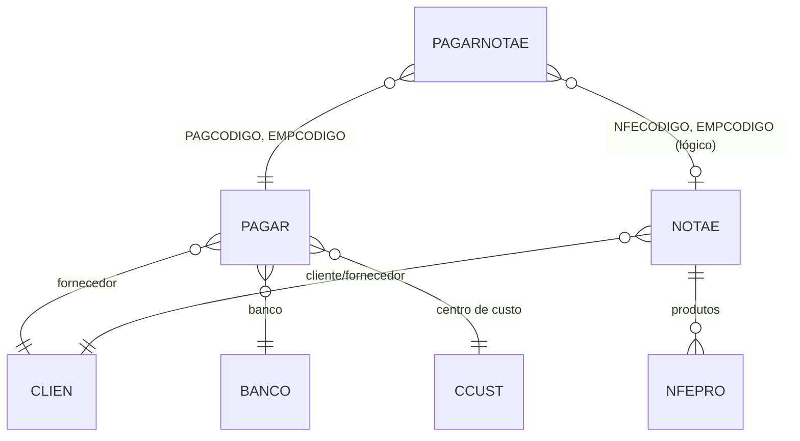

# PAGARNOTAE - Documentação Completa de Relacionamentos

## 📊 Informações Gerais

- **Nome da Tabela**: PAGARNOTAE (Contas a Pagar x Nota Fiscal Eletrônica)
- **Total de Registros**: 162.436
- **Total de Colunas**: 4
- **Chave Primária**: PAGCODIGO, EMPCODIGO, NFECODIGO, PNSEQ (composite)
- **Chaves Estrangeiras**: 2
- **Índices**: 1
- **Tabelas Dependentes**: 0
- **Banco de Dados**: Firebird

## 📝 Descrição

**PAGARNOTAE** é uma tabela de relacionamento que vincula contas a pagar (`PAGAR`) a notas fiscais eletrônicas (`NOTAE`). Com **162.436 registros**, esta tabela permite que uma conta a pagar seja vinculada a múltiplas NF-e e vice-versa, através do campo sequencial `PNSEQ`.

Esta tabela é essencial para:
- **Rastreabilidade Fiscal**: Rastrear quais NF-e estão relacionadas a cada conta a pagar
- **Conciliação**: Facilitar conciliação entre documentos fiscais e contas a pagar
- **Auditoria**: Manter histórico completo de relacionamentos fiscais-financeiros
- **Relatórios**: Gerar relatórios que cruzam dados fiscais e financeiros

---

## 🔑 Estrutura de Colunas

| Coluna | Tipo | Descrição |
|--------|------|-----------|
| **PAGCODIGO** 🔑 🔗 | INT | Código da conta a pagar (PK, FK → PAGAR) |
| **EMPCODIGO** 🔑 🔗 | INT | Código da empresa (PK, FK → PAGAR) |
| **NFECODIGO** 🔑 | INT | Código da NF-e (PK) |
| **PNSEQ** 🔑 | INT | Sequência da vinculação (PK) |

---

## 🔗 Relacionamentos - Nível 1 (Diretos)

### PAGAR - Conta a Pagar (FK Obrigatória)
**Volume:** 259.801 registros

**Relacionamento:**
```
PAGARNOTAE.PAGCODIGO → PAGAR.PAGCODIGO (N:1)
PAGARNOTAE.EMPCODIGO → PAGAR.EMPCODIGO (N:1)
Constraint: PAGARNOTAE_PAGAR
```

**Descrição:** Cada registro vincula uma conta a pagar a uma NF-e.

**Proporção:** ~0,6 NF-e por conta a pagar em média (162.436 / 259.801)

---

### NOTAE - Nota Fiscal Eletrônica (Relacionamento Lógico)
**Volume:** 204.952 registros

**Relacionamento Lógico:**
```
PAGARNOTAE.NFECODIGO → NOTAE.NFECODIGO (N:1)
PAGARNOTAE.EMPCODIGO → NOTAE.EMPCODIGO (N:1)
```

**Descrição:** Cada registro referencia uma NF-e específica.

**Nota:** Embora não exista FK formal, o relacionamento é lógico através de `NFECODIGO` e `EMPCODIGO`.

---

## 🔗 Relacionamentos - Nível 2 (Indiretos)

### Através de PAGAR

#### CLIEN - Fornecedor
```
PAGARNOTAE → PAGAR → CLIEN
```
**Descrição:** Permite identificar o fornecedor através da conta a pagar.

---

#### BANCO - Banco
```
PAGARNOTAE → PAGAR → BANCO
```
**Descrição:** Permite identificar o banco através da conta a pagar.

---

#### CCUST - Centro de Custo
```
PAGARNOTAE → PAGAR → CCUST
```
**Descrição:** Permite identificar o centro de custo através da conta a pagar.

---

### Através de NOTAE

#### CLIEN - Cliente/Fornecedor
```
PAGARNOTAE → NOTAE → CLIEN
```
**Descrição:** Permite identificar o cliente/fornecedor através da NF-e.

---

#### NFEPRO - Produtos da NF-e
```
PAGARNOTAE → NOTAE → NFEPRO → PRODU
```
**Descrição:** Permite identificar produtos relacionados à NF-e vinculada.

---

## 🗺️ Diagrama de Relacionamentos



---

## 💡 Casos de Uso Práticos

### 1. Consultar NF-e Relacionadas a uma Conta a Pagar

```sql
SELECT 
    pn.PAGCODIGO,
    pn.NFECODIGO,
    pn.PNSEQ,
    nfe.NFENRNOTA,
    nfe.NFEDTEMIS,
    nfe.NFEVRTOTAL,
    pag.PAGVALOR,
    cli.CLINOME AS FORNECEDOR
FROM PAGARNOTAE pn
INNER JOIN PAGAR pag ON pn.PAGCODIGO = pag.PAGCODIGO 
    AND pn.EMPCODIGO = pag.EMPCODIGO
LEFT JOIN NOTAE nfe ON pn.NFECODIGO = nfe.NFECODIGO 
    AND pn.EMPCODIGO = nfe.EMPCODIGO
LEFT JOIN CLIEN cli ON pag.CLICODIGO = cli.CLICODIGO
WHERE pn.PAGCODIGO = :pagcodigo
    AND pn.EMPCODIGO = :empcodigo
ORDER BY pn.PNSEQ;
```

### 2. Contas a Pagar Relacionadas a uma NF-e

```sql
SELECT 
    pn.NFECODIGO,
    pn.PAGCODIGO,
    pn.PNSEQ,
    pag.PAGNRDOC,
    pag.PAGDTVENCTO,
    pag.PAGVALOR,
    pag.PAGVALORABERTO,
    pag.PAGSITUACAO
FROM PAGARNOTAE pn
INNER JOIN PAGAR pag ON pn.PAGCODIGO = pag.PAGCODIGO 
    AND pn.EMPCODIGO = pag.EMPCODIGO
WHERE pn.NFECODIGO = :nfecodigo
    AND pn.EMPCODIGO = :empcodigo
ORDER BY pn.PNSEQ;
```

### 3. Relatório de Conciliação Fiscal-Financeira

```sql
SELECT 
    nfe.NFECODIGO,
    nfe.NFENRNOTA,
    nfe.NFEDTEMIS,
    nfe.NFEVRTOTAL AS VALOR_NFE,
    COUNT(DISTINCT pn.PAGCODIGO) AS QTD_CONTAS_PAGAR,
    SUM(pag.PAGVALOR) AS VALOR_CONTAS_PAGAR,
    SUM(pag.PAGVALORABERTO) AS VALOR_ABERTO
FROM NOTAE nfe
LEFT JOIN PAGARNOTAE pn ON nfe.NFECODIGO = pn.NFECODIGO 
    AND nfe.EMPCODIGO = pn.EMPCODIGO
LEFT JOIN PAGAR pag ON pn.PAGCODIGO = pag.PAGCODIGO 
    AND pn.EMPCODIGO = pag.EMPCODIGO
WHERE nfe.NFEDTEMIS BETWEEN :data_inicio AND :data_fim
GROUP BY nfe.NFECODIGO, nfe.NFENRNOTA, nfe.NFEDTEMIS, nfe.NFEVRTOTAL
ORDER BY nfe.NFEDTEMIS DESC;
```

---

## 📈 Estatísticas e Insights

### Volume de Dados
- **Total de Vinculações**: 162.436 registros
- **Média**: ~0,6 NF-e por conta a pagar
- **Distribuição**: Permite análise de relacionamentos fiscais-financeiros

---

## ⚡ Performance e Otimização

### Índices Existentes

| Nome | Colunas |
|------|---------|
| INDPGNFECODEMPCOD | NFECODIGO, EMPCODIGO |

### Índices Recomendados Adicionais

```sql
-- Índice para consultas por conta a pagar
CREATE INDEX IDX_PAGARNOTAE_PAGAR ON PAGARNOTAE (PAGCODIGO, EMPCODIGO);

-- Índice composto para consultas completas
CREATE INDEX IDX_PAGARNOTAE_COMPLETO ON PAGARNOTAE (PAGCODIGO, EMPCODIGO, NFECODIGO);
```

---

## 🔒 Integridade de Dados

### Validações Importantes

1. **Chave Composta**: `PAGCODIGO` + `EMPCODIGO` + `NFECODIGO` + `PNSEQ` deve ser única
2. **Conta a Pagar**: `PAGCODIGO` + `EMPCODIGO` deve existir em `PAGAR`
3. **NF-e**: `NFECODIGO` + `EMPCODIGO` deve existir em `NOTAE` (validação lógica)
4. **Sequência**: `PNSEQ` deve ser sequencial para cada conta a pagar

---

## 📚 Integração com Aplicação (Laravel)

### Model PAGARNOTAE

```php
<?php

namespace App\Models;

use Illuminate\Database\Eloquent\Model;
use Illuminate\Database\Eloquent\Relations\BelongsTo;

final class PAGARNOTAE extends Model
{
    protected $table = 'PAGARNOTAE';
    
    protected $primaryKey = ['PAGCODIGO', 'EMPCODIGO', 'NFECODIGO', 'PNSEQ'];
    
    public $incrementing = false;
    
    protected $fillable = [
        'PAGCODIGO',
        'EMPCODIGO',
        'NFECODIGO',
        'PNSEQ',
    ];
    
    /**
     * Relacionamento com PAGAR
     */
    public function contaPagar(): BelongsTo
    {
        return $this->belongsTo(PAGAR::class, ['PAGCODIGO', 'EMPCODIGO'], ['PAGCODIGO', 'EMPCODIGO']);
    }
    
    /**
     * Relacionamento lógico com NOTAE
     */
    public function notaFiscal(): BelongsTo
    {
        return $this->belongsTo(NOTAE::class, ['NFECODIGO', 'EMPCODIGO'], ['NFECODIGO', 'EMPCODIGO']);
    }
}
```

---

## ✅ Boas Práticas

### Design
1. **Manter unicidade** da chave composta
2. **Validar existência** de conta a pagar e NF-e antes de inserir
3. **Usar sequência** (`PNSEQ`) para múltiplas vinculações

### Performance
1. **Usar índices** nas consultas frequentes
2. **Evitar JOINs desnecessários** quando possível

### Integridade
1. **Validar existência** de todas as entidades relacionadas
2. **Garantir consistência** entre conta a pagar e NF-e

---

**Documentação gerada em**: 2025-01-27

**Banco de dados**: Firebird

