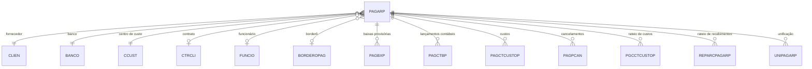

# PAGARP - Documentação Completa de Relacionamentos

## 📊 Informações Gerais

- **Nome da Tabela**: PAGARP (Contas a Pagar Provisórias)
- **Total de Registros**: 37
- **Total de Colunas**: 49
- **Chave Primária**: PAGCODIGO, EMPCODIGO (composite)
- **Chaves Estrangeiras**: 8
- **Índices**: 4
- **Tabelas Dependentes**: 14
- **Banco de Dados**: Firebird

## 📝 Descrição

**PAGARP** é uma tabela de contas a pagar provisórias, similar à tabela `PAGAR`, mas utilizada para contas temporárias ou em processo de aprovação. Com apenas **37 registros**, esta tabela mantém a mesma estrutura de `PAGAR` mas com relacionamentos específicos para tabelas provisórias (sufixo "P").

Esta tabela é essencial para:
- **Controle de Aprovação**: Manter contas a pagar em processo de aprovação
- **Workflow**: Gerenciar fluxo de aprovação antes de transferir para `PAGAR`
- **Auditoria**: Manter histórico de contas provisórias
- **Separação de Dados**: Separar contas provisórias das definitivas

---

## 🔑 Estrutura de Colunas

A estrutura é idêntica à `PAGAR`, com 49 colunas incluindo:
- Identificação: `PAGCODIGO`, `EMPCODIGO`
- Fornecedor: `CLICODIGO`, `CLICODIGO2`
- Valores: `PAGVALOR`, `PAGVALORABERTO`
- Datas: `PAGDTEMISSAO`, `PAGDTVENCTO`, `PAGDTENTRA`
- Financeiro: `BCOCODIGO`, `CUSCODIGO`
- Controle: `PAGSITUACAO`, `PAGORIGEM`

---

## 🔗 Relacionamentos - Nível 1 (Diretos)

### CLIEN - Fornecedor (2 FKs)
```
PAGARP.CLICODIGO → CLIEN.CLICODIGO (N:1) [FK: CLLIEN_PAGARP]
PAGARP.CLICODIGO2 → CLIEN.CLICODIGO (N:1) [FK: CLIEN2_PAGARP]
```

### BANCO - Banco
```
PAGARP.BCOCODIGO → BANCO.BCOCODIGO (N:1) [FK: BANCOS_PAGARP]
```

### CCUST - Centro de Custo
```
PAGARP.CUSCODIGO → CCUST.CUSCODIGO (N:1) [FK: CCUST_PAGARP]
```

### CTRCLI - Contrato (2 FKs)
```
PAGARP.CTCNUMERO → CTRCLI.CTCNUMERO (N:1) [FK: CTRCLI_PAGARP]
PAGARP.EMPCODIGO → CTRCLI.EMPCODIGO (N:1) [FK: CTRCLI_PAGARP]
```

### FUNCIO - Funcionário
```
PAGARP.FUNCODIGO → FUNCIO.FUNCODIGO (N:1) [FK: FUNCIO_PAGARP]
```

### BORDEROPAG - Borderô
```
PAGARP.ID_BORDERO → BORDEROPAG.ID_BORDERO (N:1) [FK: INTEG_1772]
```

---

## 📊 Tabelas que Referenciam PAGARP

### Tabelas Provisórias (sufixo "P")

#### PAGBXP - Baixas Provisórias
```
PAGBXP.PAGCODIGO → PAGARP.PAGCODIGO (N:1)
PAGBXP.EMPCODIGO → PAGARP.EMPCODIGO (N:1)
```

#### PAGCTBP - Lançamentos Contábeis Provisórios
```
PAGCTBP.PAGCODIGO → PAGARP.PAGCODIGO (N:1)
PAGCTBP.EMPCODIGO → PAGARP.EMPCODIGO (N:1)
```

#### PAGCTCUSTOP - Custos Provisórios
```
PAGCTCUSTOP.PAGCODIGO → PAGARP.PAGCODIGO (N:1)
PAGCTCUSTOP.EMPCODIGO → PAGARP.EMPCODIGO (N:1)
```

#### PAGPCAN - Cancelamentos Provisórios
```
PAGPCAN.PAGCODIGO → PAGARP.PAGCODIGO (N:1)
PAGPCAN.EMPCODIGO → PAGARP.EMPCODIGO (N:1)
```

#### PGCCTCUSTOP - Rateio de Custos Provisórios
```
PGCCTCUSTOP.PAGCODIGO → PAGARP.PAGCODIGO (N:1)
PGCCTCUSTOP.EMPCODIGO → PAGARP.EMPCODIGO (N:1)
```

#### REPARCPAGARP - Rateio de Recebimentos Provisórios
```
REPARCPAGARP.PAGCODIGO → PAGARP.PAGCODIGO (N:1)
REPARCPAGARP.EMPCODIGO → PAGARP.EMPCODIGO (N:1)
```

#### UNIPAGARP - Unificação Provisória
```
UNIPAGARP.PAGCODIGO → PAGARP.PAGCODIGO (N:1)
UNIPAGARP.EMPCODIGO → PAGARP.EMPCODIGO (N:1)
```

---

## 🗺️ Diagrama de Relacionamentos



---

## 💡 Casos de Uso Práticos

### 1. Consultar Contas Provisórias Pendentes de Aprovação

```sql
SELECT 
    pagp.PAGCODIGO,
    pagp.PAGNRDOC,
    pagp.PAGDTVENCTO,
    pagp.PAGVALOR,
    cli.CLINOME AS FORNECEDOR,
    pagp.PAGSITUACAO
FROM PAGARP pagp
INNER JOIN CLIEN cli ON pagp.CLICODIGO = cli.CLICODIGO
WHERE pagp.PAGSITUACAO = 'PENDENTE'
ORDER BY pagp.PAGDTVENCTO;
```

### 2. Transferir Conta Provisória para Definitiva

```sql
-- Inserir em PAGAR
INSERT INTO PAGAR (
    PAGCODIGO, EMPCODIGO, CLICODIGO, BCOCODIGO, CUSCODIGO,
    PAGDTEMISSAO, PAGDTVENCTO, PAGVALOR, PAGSITUACAO, PAGORIGEM
)
SELECT 
    PAGCODIGO, EMPCODIGO, CLICODIGO, BCOCODIGO, CUSCODIGO,
    PAGDTEMISSAO, PAGDTVENCTO, PAGVALOR, 'APROVADO', PAGORIGEM
FROM PAGARP
WHERE PAGCODIGO = :pagcodigo
    AND EMPCODIGO = :empcodigo;
```

---

## 📈 Estatísticas e Insights

### Volume de Dados
- **Total de Contas Provisórias**: 37 registros
- **Uso**: Tabela de workflow para aprovação
- **Frequência**: Baixa em relação a `PAGAR`

---

## ⚡ Performance e Otimização

### Índices Existentes

| Nome | Colunas |
|------|---------|
| INDPAGDTEMISSAOP | PAGDTEMISSAO |
| INDPAGDTENTRAP | PAGDTENTRA |
| INDPAGDTPREVISP | PAGDTPREVIS |
| INDPAGDTVENCTOP | PAGDTVENCTO |

---

## 📚 Integração com Aplicação (Laravel)

### Model PAGARP

```php
<?php

namespace App\Models;

use Illuminate\Database\Eloquent\Model;

final class PAGARP extends Model
{
    protected $table = 'PAGARP';
    
    protected $primaryKey = ['PAGCODIGO', 'EMPCODIGO'];
    
    public $incrementing = false;
    
    // Estrutura similar a PAGAR
    protected $fillable = [
        'PAGCODIGO', 'EMPCODIGO', 'CLICODIGO', 'BCOCODIGO',
        'CUSCODIGO', 'PAGDTEMISSAO', 'PAGDTVENCTO', 'PAGVALOR',
        'PAGSITUACAO', 'PAGORIGEM',
        // ... outros campos
    ];
    
    /**
     * Relacionamento com CLIEN
     */
    public function fornecedor()
    {
        return $this->belongsTo(CLIEN::class, 'CLICODIGO', 'CLICODIGO');
    }
    
    /**
     * Scope para contas pendentes
     */
    public function scopePendentes($query)
    {
        return $query->where('PAGSITUACAO', 'PENDENTE');
    }
}
```

---

## ✅ Boas Práticas

### Design
1. **Manter estrutura** similar a `PAGAR`
2. **Validar workflow** de aprovação antes de transferir
3. **Limpar registros** após transferência para `PAGAR`

### Performance
1. **Usar índices** nas consultas frequentes
2. **Monitorar crescimento** da tabela

### Integridade
1. **Validar existência** de todas as entidades relacionadas
2. **Garantir consistência** antes de transferir para `PAGAR`

---

**Documentação gerada em**: 2025-01-27

**Banco de dados**: Firebird

