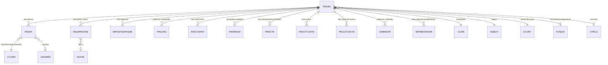

# PAGAR - Documentação Completa de Relacionamentos

## 📊 Informações Gerais

- **Nome da Tabela**: PAGAR (Contas a Pagar)
- **Total de Registros**: 259.801
- **Total de Colunas**: 52
- **Chave Primária**: PAGCODIGO, EMPCODIGO (composite)
- **Chaves Estrangeiras**: 7
- **Índices**: 4
- **Tabelas Dependentes**: 22
- **Banco de Dados**: Firebird

## 📝 Descrição

**PAGAR** é a tabela central de contas a pagar do sistema financeiro. Com **259.801 registros** e **52 colunas**, é uma das tabelas mais importantes do módulo financeiro, contendo informações completas sobre cada conta a pagar, incluindo dados do fornecedor, valores, datas, juros, multas, descontos, situação, origem e configurações financeiras.

Esta tabela é essencial para:
- **Gestão Financeira**: Controle completo de contas a pagar
- **Fluxo de Caixa**: Planejamento e controle de pagamentos
- **Conciliação Bancária**: Base para conciliação de extratos bancários
- **Integração Contábil**: Base para lançamentos contábeis
- **Relatórios Financeiros**: Geração de relatórios de despesas e pagamentos
- **Controle de Fornecedores**: Gestão de relacionamento com fornecedores

---

## 🔑 Estrutura de Colunas (Principais)

### Identificação e Controle
| Coluna | Tipo | Descrição |
|--------|------|-----------|
| **PAGCODIGO** 🔑 | INT | Código único da conta a pagar (PK) |
| **EMPCODIGO** 🔑 🔗 | INT | Código da empresa (PK, FK → EMPRESA via CTRCLI) |
| **PAGNRDOC** | VARCHAR(14) | Número do documento |
| **PAGDTDOC** | TIMESTAMP | Data do documento |
| **PAGPARCELA** | VARCHAR(14) | Número da parcela |
| **PAGNRDUPLI** | VARCHAR(37) | Número da duplicata |

### Fornecedor e Endereços
| Coluna | Tipo | Descrição |
|--------|------|-----------|
| **CLICODIGO** 🔗 | INT | Código do fornecedor/cliente (FK → CLIEN) |
| **CLICODIGO2** 🔗 | INT | Código do fornecedor/cliente secundário (FK → CLIEN) |
| **ENDFAT** | INT | Código do endereço de faturamento |
| **ENDCOB** | INT | Código do endereço de cobrança |

### Datas e Períodos
| Coluna | Tipo | Descrição |
|--------|------|-----------|
| **PAGDTEMISSAO** | TIMESTAMP | Data de emissão (INDEXADO) |
| **PAGDTVENCTO** | TIMESTAMP | Data de vencimento (INDEXADO) |
| **PAGDTENTRA** | TIMESTAMP | Data de entrada (INDEXADO) |
| **PAGDTPREVIS** | TIMESTAMP | Data prevista de pagamento (INDEXADO) |
| **PAGVENCPROT** | TIMESTAMP | Data de vencimento do protesto |
| **PAGDTREMESSA** | DATE | Data de remessa |
| **PAGDTRETORNO** | DATE | Data de retorno |
| **PAGDTAPROVADO** | TIMESTAMP | Data de aprovação |

### Valores e Totais
| Coluna | Tipo | Descrição |
|--------|------|-----------|
| **PAGVALOR** | DECIMAL(27,2) | Valor original da conta |
| **PAGVALORABERTO** | DECIMAL(27,2) | Valor em aberto |
| **PAGVALORORIGINAL** | DECIMAL(16,2) | Valor original |
| **PAGVRDESC** | DECIMAL(27,2) | Valor do desconto |
| **PAGVRMULTA** | DECIMAL(27,2) | Valor da multa |
| **PAGVRJUROS** | DECIMAL(27,2) | Valor dos juros |
| **PAGVRJUROSDIA** | DECIMAL(16,2) | Valor de juros por dia |

### Percentuais e Cálculos
| Coluna | Tipo | Descrição |
|--------|------|-----------|
| **PAGPCJUROS** | DECIMAL(27,2) | Percentual de juros |
| **PAGPRZPROT** | INT | Prazo de protesto |
| **PAGPCACRES** | DECIMAL(27,2) | Percentual de acréscimo financeiro |
| **PAGVRACRESFIN** | DECIMAL(27,2) | Valor de acréscimo financeiro |

### Financeiro e Bancário
| Coluna | Tipo | Descrição |
|--------|------|-----------|
| **BCOCODIGO** 🔗 | INT | Banco (FK → BANCO) |
| **CUSCODIGO** 🔗 | VARCHAR(14) | Centro de custo (FK → CCUST) |
| **COBCODIGO** | VARCHAR(14) | Código de cobrança |
| **COBSEQ** | INT | Sequência de cobrança |
| **PAGTPPAGTO** | VARCHAR(14) | Tipo de pagamento |
| **PAGLINHADG** | VARCHAR(37) | Linha digitável |
| **PAGTPLINHADG** | VARCHAR(14) | Tipo de linha digitável |

### Controle e Situação
| Coluna | Tipo | Descrição |
|--------|------|-----------|
| **PAGSITUACAO** | VARCHAR(14) | Situação da conta (Aberto, Pago, Cancelado, etc.) |
| **PAGORIGEM** | VARCHAR(14) | Origem da conta |
| **PAGTIPODOCTO** | VARCHAR(14) | Tipo de documento |
| **PAGCARTPROT** | VARCHAR(14) | Carteira de protesto |
| **PAGCONFERIDO** | VARCHAR(14) | Flag de conferido |
| **PAGCONFERIDOERRO** | VARCHAR(37) | Erro na conferência |
| **PAGCONFERIDOOBS** | VARCHAR(37) | Observação da conferência |
| **PAGCONFERIDOUSU** | INT | Usuário que conferiu |

### Histórico e Observações
| Coluna | Tipo | Descrição |
|--------|------|-----------|
| **PAGHISTORICO** | VARCHAR(37) | Histórico da conta |
| **PAGROTGRFATURA** | VARCHAR(14) | Rotina de geração de fatura |

### Funcionário e Contrato
| Coluna | Tipo | Descrição |
|--------|------|-----------|
| **FUNCODIGO** 🔗 | INT | Funcionário responsável (FK → FUNCIO) |
| **CTCNUMERO** 🔗 | INT | Número do contrato (FK → CTRCLI) |
| **ID_BORDERO** | INT | Código do borderô |

### Tributação
| Coluna | Tipo | Descrição |
|--------|------|-----------|
| **PAGBASEPIS** | DECIMAL(16,2) | Base de cálculo de PIS |
| **PAGBASECOFINS** | DECIMAL(16,2) | Base de cálculo de COFINS |
| **PAGBASECSLL** | DECIMAL(16,2) | Base de cálculo de CSLL |
| **ID_RETENCOES** | INT | Código de retenções |
| **PAGNRREMESSA** | INT | Número de remessa |

---

## 🔗 Relacionamentos - Nível 1 (Diretos)

### CLIEN - Fornecedor/Cliente (FK Obrigatória)
**Volume:** 9.251 registros

**Relacionamento:**
```
PAGAR.CLICODIGO → CLIEN.CLICODIGO (N:1) [FK: CLIEN_PAGAR]
PAGAR.CLICODIGO2 → CLIEN.CLICODIGO (N:1) [FK: CLIEN2_PAGAR]
```

**Descrição:** Cada conta a pagar está vinculada a um fornecedor/cliente. O campo `CLICODIGO2` permite referenciar um fornecedor secundário quando necessário.

**Proporção:** ~28 contas a pagar por fornecedor em média (259.801 / 9.251)

---

### BANCO - Banco (FK Obrigatória)
**Volume:** 1.000 registros

**Relacionamento:**
```
PAGAR.BCOCODIGO → BANCO.BCOCODIGO (N:1) [FK: BANCO_PAGAR]
```

**Descrição:** Identifica o banco utilizado para pagamento da conta.

---

### CCUST - Centro de Custo (FK Obrigatória)
**Volume:** Variável conforme centros de custo cadastrados

**Relacionamento:**
```
PAGAR.CUSCODIGO → CCUST.CUSCODIGO (N:1) [FK: CCUST_PAGAR]
```

**Descrição:** Identifica o centro de custo para contabilização da conta a pagar.

---

### FUNCIO - Funcionário (FK Opcional)
**Volume:** 435 registros

**Relacionamento:**
```
PAGAR.FUNCODIGO → FUNCIO.FUNCODIGO (N:1) [FK: FUNCIO_PAGAR]
```

**Descrição:** Identifica o funcionário responsável pela conta a pagar.

---

### CTRCLI - Contrato de Cliente (FK Opcional)
**Volume:** Variável conforme contratos cadastrados

**Relacionamento:**
```
PAGAR.CTCNUMERO → CTRCLI.CTCNUMERO (N:1) [FK: CTRCLI_PAGAR]
PAGAR.EMPCODIGO → CTRCLI.EMPCODIGO (N:1) [FK: CTRCLI_PAGAR]
```

**Descrição:** Vincula a conta a pagar a um contrato específico do fornecedor.

---

## 📊 Tabelas que Referenciam PAGAR

### Tabelas de Baixa e Pagamento

#### PAGBX - Baixas de Pagamento
**Volume:** 138.447 registros

**Relacionamento:**
```
PAGBX.PAGCODIGO → PAGAR.PAGCODIGO (N:1)
PAGBX.EMPCODIGO → PAGAR.EMPCODIGO (N:1)
```

**Descrição:** Registra as baixas/pagamentos efetivos da conta a pagar.

---

#### PAGCAN - Cancelamentos de Pagamento
**Volume:** Variável

**Relacionamento:**
```
PAGCAN.PAGCODIGO → PAGAR.PAGCODIGO (N:1)
PAGCAN.EMPCODIGO → PAGAR.EMPCODIGO (N:1)
```

**Descrição:** Registra cancelamentos de contas a pagar.

---

### Tabelas de Detalhes e Relacionamentos

#### PAGARNOTAE - Contas a Pagar x NF-e
**Volume:** 162.436 registros

**Relacionamento:**
```
PAGARNOTAE.PAGCODIGO → PAGAR.PAGCODIGO (N:1)
PAGARNOTAE.EMPCODIGO → PAGAR.EMPCODIGO (N:1)
```

**Descrição:** Vincula contas a pagar a notas fiscais eletrônicas.

---

#### IMPOSTOSPAGAR - Impostos de Contas a Pagar
**Volume:** 2 registros

**Relacionamento:**
```
IMPOSTOSPAGAR.PAGCODIGO → PAGAR.PAGCODIGO (N:1)
IMPOSTOSPAGAR.EMPCODIGO → PAGAR.EMPCODIGO (N:1)
```

**Descrição:** Registra impostos relacionados à conta a pagar.

---

#### PAGCOMISS - Comissões de Pagamento
**Volume:** Variável

**Relacionamento:**
```
PAGCOMISS.PAGCODIGO → PAGAR.PAGCODIGO (N:1)
PAGCOMISS.EMPCODIGO → PAGAR.EMPCODIGO (N:1)
```

**Descrição:** Registra comissões relacionadas à conta a pagar.

---

#### PAGPEDID - Contas a Pagar x Pedidos
**Volume:** Variável

**Relacionamento:**
```
PAGPEDID.PAGCODIGO → PAGAR.PAGCODIGO (N:1)
PAGPEDID.EMPCODIGO → PAGAR.EMPCODIGO (N:1)
```

**Descrição:** Vincula contas a pagar a pedidos de compra.

---

### Tabelas Contábeis e de Custos

#### PAGCTB - Lançamentos Contábeis
**Volume:** Variável

**Relacionamento:**
```
PAGCTB.PAGCODIGO → PAGAR.PAGCODIGO (N:1)
PAGCTB.EMPCODIGO → PAGAR.EMPCODIGO (N:1)
```

**Descrição:** Lançamentos contábeis relacionados à conta a pagar.

---

#### PAGCTCUSTO - Custos de Pagamento
**Volume:** Variável

**Relacionamento:**
```
PAGCTCUSTO.PAGCODIGO → PAGAR.PAGCODIGO (N:1)
PAGCTCUSTO.EMPCODIGO → PAGAR.EMPCODIGO (N:1)
```

**Descrição:** Custos relacionados à conta a pagar.

---

#### PGCCTCUSTO - Rateio de Custos
**Volume:** Variável

**Relacionamento:**
```
PGCCTCUSTO.PAGCODIGO → PAGAR.PAGCODIGO (N:1)
PGCCTCUSTO.EMPCODIGO → PAGAR.EMPCODIGO (N:1)
```

**Descrição:** Rateio de custos relacionados à conta a pagar.

---

#### UNIPAGAR - Unificação de Pagamentos
**Volume:** Variável

**Relacionamento:**
```
UNIPAGAR.PAGCODIGO → PAGAR.PAGCODIGO (N:1)
UNIPAGAR.EMPCODIGO → PAGAR.EMPCODIGO (N:1)
```

**Descrição:** Unificação de múltiplas contas a pagar.

---

#### REPARCPAGAR - Rateio de Recebimentos
**Volume:** Variável

**Relacionamento:**
```
REPARCPAGAR.PAGCODIGO → PAGAR.PAGCODIGO (N:1)
REPARCPAGAR.EMPCODIGO → PAGAR.EMPCODIGO (N:1)
```

**Descrição:** Rateio de recebimentos relacionados à conta a pagar.

---

## 🔗 Relacionamentos - Nível 2 (Indiretos)

### Através de PAGBX

#### CCORR - Movimentações Bancárias
```
PAGAR → PAGBX → CCORR
```
**Descrição:** Permite identificar movimentações bancárias relacionadas aos pagamentos.

---

#### BANCO - Banco
```
PAGAR → PAGBX → BANCO
```
**Descrição:** Permite identificar o banco utilizado para pagamento.

---

#### USUARIO - Usuário
```
PAGAR → PAGBX → USUARIO
```
**Descrição:** Permite identificar quem realizou o pagamento.

---

### Através de PAGARNOTAE

#### NOTAE - Nota Fiscal Eletrônica
```
PAGAR → PAGARNOTAE → NOTAE (via NFECODIGO)
```
**Descrição:** Permite identificar notas fiscais relacionadas à conta a pagar.

---

### Através de CLIEN

#### PEDID - Pedidos
```
PAGAR → CLIEN → PEDID
```
**Descrição:** Permite identificar pedidos relacionados ao fornecedor da conta a pagar.

---

#### NOTAS - Notas Fiscais
```
PAGAR → CLIEN → NOTAS
```
**Descrição:** Permite identificar notas fiscais relacionadas ao fornecedor da conta a pagar.

---

## 🗺️ Diagrama de Relacionamentos



---

## 💡 Casos de Uso Práticos

### 1. Consultar Conta a Pagar Completa

```sql
SELECT 
    pag.PAGCODIGO,
    pag.EMPCODIGO,
    pag.PAGNRDOC,
    pag.PAGDTEMISSAO,
    pag.PAGDTVENCTO,
    pag.PAGVALOR,
    pag.PAGVALORABERTO,
    pag.PAGSITUACAO,
    cli.CLINOME AS FORNECEDOR,
    cli.CLICGC AS CNPJ_FORNECEDOR,
    ban.BCONOME AS BANCO,
    ccust.CUSDESCRICAO AS CENTRO_CUSTO,
    COUNT(pbx.PABCONTADOR) AS QTD_BAIXAS,
    SUM(pbx.PABVALOR) AS VALOR_PAGO
FROM PAGAR pag
INNER JOIN CLIEN cli ON pag.CLICODIGO = cli.CLICODIGO
LEFT JOIN BANCO ban ON pag.BCOCODIGO = ban.BCOCODIGO
LEFT JOIN CCUST ccust ON pag.CUSCODIGO = ccust.CUSCODIGO
LEFT JOIN PAGBX pbx ON pag.PAGCODIGO = pbx.PAGCODIGO 
    AND pag.EMPCODIGO = pbx.EMPCODIGO
WHERE pag.PAGCODIGO = :pagcodigo
    AND pag.EMPCODIGO = :empcodigo
GROUP BY pag.PAGCODIGO, pag.EMPCODIGO, pag.PAGNRDOC, pag.PAGDTEMISSAO, 
    pag.PAGDTVENCTO, pag.PAGVALOR, pag.PAGVALORABERTO, pag.PAGSITUACAO,
    cli.CLINOME, cli.CLICGC, ban.BCONOME, ccust.CUSDESCRICAO;
```

### 2. Relatório de Contas a Pagar por Período

```sql
SELECT 
    DATE(pag.PAGDTVENCTO) AS DATA_VENCIMENTO,
    emp.EMPNOME AS EMPRESA,
    COUNT(DISTINCT pag.PAGCODIGO) AS QTD_CONTAS,
    SUM(pag.PAGVALOR) AS VALOR_TOTAL,
    SUM(pag.PAGVALORABERTO) AS VALOR_ABERTO,
    SUM(pag.PAGVRJUROS) AS VALOR_JUROS,
    SUM(pag.PAGVRMULTA) AS VALOR_MULTA
FROM PAGAR pag
INNER JOIN EMPRESA emp ON pag.EMPCODIGO = emp.EMPCODIGO
WHERE pag.PAGDTVENCTO BETWEEN :data_inicio AND :data_fim
GROUP BY DATE(pag.PAGDTVENCTO), emp.EMPNOME
ORDER BY DATA_VENCIMENTO DESC, VALOR_TOTAL DESC;
```

### 3. Contas a Pagar Vencidas

```sql
SELECT 
    pag.PAGCODIGO,
    pag.PAGNRDOC,
    pag.PAGDTVENCTO,
    pag.PAGVALORABERTO,
    cli.CLINOME AS FORNECEDOR,
    DATEDIFF(DAY FROM pag.PAGDTVENCTO TO CURRENT_DATE) AS DIAS_VENCIDO,
    pag.PAGVRJUROSDIA * DATEDIFF(DAY FROM pag.PAGDTVENCTO TO CURRENT_DATE) AS JUROS_CALCULADO
FROM PAGAR pag
INNER JOIN CLIEN cli ON pag.CLICODIGO = cli.CLICODIGO
WHERE pag.PAGSITUACAO = 'ABERTO'
    AND pag.PAGDTVENCTO < CURRENT_DATE
    AND pag.PAGVALORABERTO > 0
ORDER BY DIAS_VENCIDO DESC, pag.PAGVALORABERTO DESC;
```

### 4. Análise de Pagamentos por Fornecedor

```sql
SELECT 
    cli.CLICODIGO,
    cli.CLINOME AS FORNECEDOR,
    COUNT(DISTINCT pag.PAGCODIGO) AS QTD_CONTAS,
    SUM(pag.PAGVALOR) AS VALOR_TOTAL,
    SUM(pag.PAGVALORABERTO) AS VALOR_ABERTO,
    SUM(pbx.PABVALOR) AS VALOR_PAGO,
    COUNT(DISTINCT pbx.PABCONTADOR) AS QTD_PAGAMENTOS
FROM PAGAR pag
INNER JOIN CLIEN cli ON pag.CLICODIGO = cli.CLICODIGO
LEFT JOIN PAGBX pbx ON pag.PAGCODIGO = pbx.PAGCODIGO 
    AND pag.EMPCODIGO = pbx.EMPCODIGO
WHERE pag.PAGDTEMISSAO BETWEEN :data_inicio AND :data_fim
GROUP BY cli.CLICODIGO, cli.CLINOME
ORDER BY VALOR_TOTAL DESC;
```

### 5. Contas a Pagar com NF-e Relacionadas

```sql
SELECT 
    pag.PAGCODIGO,
    pag.PAGNRDOC,
    pag.PAGVALOR,
    cli.CLINOME AS FORNECEDOR,
    COUNT(DISTINCT pn.NFECODIGO) AS QTD_NFES,
    LIST(DISTINCT nfe.NFENRNOTA, ', ') AS NUMEROS_NFES
FROM PAGAR pag
INNER JOIN CLIEN cli ON pag.CLICODIGO = cli.CLICODIGO
LEFT JOIN PAGARNOTAE pn ON pag.PAGCODIGO = pn.PAGCODIGO 
    AND pag.EMPCODIGO = pn.EMPCODIGO
LEFT JOIN NOTAE nfe ON pn.NFECODIGO = nfe.NFECODIGO 
    AND pn.EMPCODIGO = nfe.EMPCODIGO
WHERE pag.PAGCODIGO = :pagcodigo
    AND pag.EMPCODIGO = :empcodigo
GROUP BY pag.PAGCODIGO, pag.PAGNRDOC, pag.PAGVALOR, cli.CLINOME;
```

---

## 📈 Estatísticas e Insights

### Volume de Dados
- **Total de Contas a Pagar**: 259.801 registros
- **Média**: Aproximadamente 28 contas por fornecedor
- **Distribuição**: Permite análise de despesas por período, fornecedor, empresa, centro de custo, etc.

### Análise Financeira
- Permite análise completa de fluxo de caixa
- Facilita geração de relatórios financeiros
- Suporta controle de vencimentos e inadimplência

### Integração
- **22 tabelas dependentes** mostram a centralidade de PAGAR no sistema
- Integração completa com baixas, cancelamentos, NF-e, impostos, comissões
- Suporte a integração contábil e de custos

---

## ⚡ Performance e Otimização

### Índices Existentes

| Nome | Colunas |
|------|---------|
| INDPAGDTEMISSAO | PAGDTEMISSAO |
| INDPAGDTENTRA | PAGDTENTRA |
| INDPAGDTPREVIS | PAGDTPREVIS |
| INDPAGDTVENCTO | PAGDTVENCTO |

### Índices Recomendados Adicionais

```sql
-- Índice para consultas por fornecedor
CREATE INDEX IDX_PAGAR_FORNECEDOR ON PAGAR (CLICODIGO);

-- Índice para consultas por empresa e situação
CREATE INDEX IDX_PAGAR_EMP_SITUACAO ON PAGAR (EMPCODIGO, PAGSITUACAO);

-- Índice para consultas por empresa e vencimento
CREATE INDEX IDX_PAGAR_EMP_VENCIMENTO ON PAGAR (EMPCODIGO, PAGDTVENCTO);

-- Índice composto para relatórios financeiros
CREATE INDEX IDX_PAGAR_EMP_FORN_DATA ON PAGAR (EMPCODIGO, CLICODIGO, PAGDTVENCTO);
```

---

## 🔒 Integridade de Dados

### Validações Importantes

1. **Chave Composta**: `PAGCODIGO` + `EMPCODIGO` deve ser única
2. **Fornecedor**: `CLICODIGO` deve existir em `CLIEN`
3. **Banco**: `BCOCODIGO` deve existir em `BANCO`
4. **Centro de Custo**: `CUSCODIGO` deve existir em `CCUST`
5. **Soma de Baixas**: Soma de `PAGBX.PABVALOR` deve ser menor ou igual a `PAGVALOR`
6. **Valor Aberto**: `PAGVALORABERTO` deve ser igual a `PAGVALOR` menos soma das baixas

---

## 📚 Integração com Aplicação (Laravel)

### Model PAGAR

```php
<?php

namespace App\Models;

use Illuminate\Database\Eloquent\Model;
use Illuminate\Database\Eloquent\Relations\BelongsTo;
use Illuminate\Database\Eloquent\Relations\HasMany;

final class PAGAR extends Model
{
    protected $table = 'PAGAR';
    
    protected $primaryKey = ['PAGCODIGO', 'EMPCODIGO'];
    
    public $incrementing = false;
    
    protected $fillable = [
        'PAGCODIGO', 'EMPCODIGO', 'CLICODIGO', 'BCOCODIGO',
        'CUSCODIGO', 'PAGDTEMISSAO', 'PAGDTVENCTO', 'PAGVALOR',
        'PAGSITUACAO', 'PAGORIGEM',
        // ... outros campos
    ];
    
    protected $casts = [
        'PAGDTEMISSAO' => 'datetime',
        'PAGDTVENCTO' => 'datetime',
        'PAGDTENTRA' => 'datetime',
        'PAGDTPREVIS' => 'datetime',
        'PAGVALOR' => 'decimal:2',
        'PAGVALORABERTO' => 'decimal:2',
        // ... outros casts
    ];
    
    /**
     * Relacionamento com CLIEN
     */
    public function fornecedor(): BelongsTo
    {
        return $this->belongsTo(CLIEN::class, 'CLICODIGO', 'CLICODIGO');
    }
    
    /**
     * Relacionamento com BANCO
     */
    public function banco(): BelongsTo
    {
        return $this->belongsTo(BANCO::class, 'BCOCODIGO', 'BCOCODIGO');
    }
    
    /**
     * Relacionamento com CCUST
     */
    public function centroCusto(): BelongsTo
    {
        return $this->belongsTo(CCUST::class, 'CUSCODIGO', 'CUSCODIGO');
    }
    
    /**
     * Relacionamento com PAGBX
     */
    public function baixas(): HasMany
    {
        return $this->hasMany(PAGBX::class, ['PAGCODIGO', 'EMPCODIGO'], ['PAGCODIGO', 'EMPCODIGO']);
    }
    
    /**
     * Relacionamento com PAGARNOTAE
     */
    public function notasFiscais(): HasMany
    {
        return $this->hasMany(PAGARNOTAE::class, ['PAGCODIGO', 'EMPCODIGO'], ['PAGCODIGO', 'EMPCODIGO']);
    }
    
    /**
     * Scope para contas abertas
     */
    public function scopeAbertas($query)
    {
        return $query->where('PAGSITUACAO', 'ABERTO')
            ->where('PAGVALORABERTO', '>', 0);
    }
    
    /**
     * Scope para contas vencidas
     */
    public function scopeVencidas($query)
    {
        return $query->where('PAGSITUACAO', 'ABERTO')
            ->where('PAGDTVENCTO', '<', now())
            ->where('PAGVALORABERTO', '>', 0);
    }
    
    /**
     * Scope para contas por período
     */
    public function scopePorPeriodo($query, $dataInicio, $dataFim)
    {
        return $query->whereBetween('PAGDTVENCTO', [$dataInicio, $dataFim]);
    }
}
```

---

## ✅ Boas Práticas

### Design
1. **Manter unicidade** da chave composta
2. **Validar soma** das baixas igual ao valor total
3. **Manter consistência** entre `PAGVALOR` e `PAGVALORABERTO`
4. **Validar datas** (vencimento >= emissão)

### Performance
1. **Usar índices** nas consultas frequentes
2. **Evitar SELECT *** devido ao grande número de colunas
3. **Usar filtros de data** para reduzir volume de dados
4. **Considerar particionamento** por data para grandes volumes

### Integridade
1. **Validar existência** de todas as entidades relacionadas antes de inserir
2. **Verificar cálculos** de juros e multas para consistência
3. **Manter referência** ao banco e centro de custo quando aplicável
4. **Garantir consistência** entre conta a pagar e suas baixas

### Manutenção
1. **Monitorar crescimento** da tabela
2. **Revisar periodicamente** contas a pagar vencidas
3. **Garantir integração** contábil através de `PAGCTB`
4. **Manter histórico** de alterações através de tabelas de log

---

**Documentação gerada em**: 2025-01-27

**Banco de dados**: Firebird

