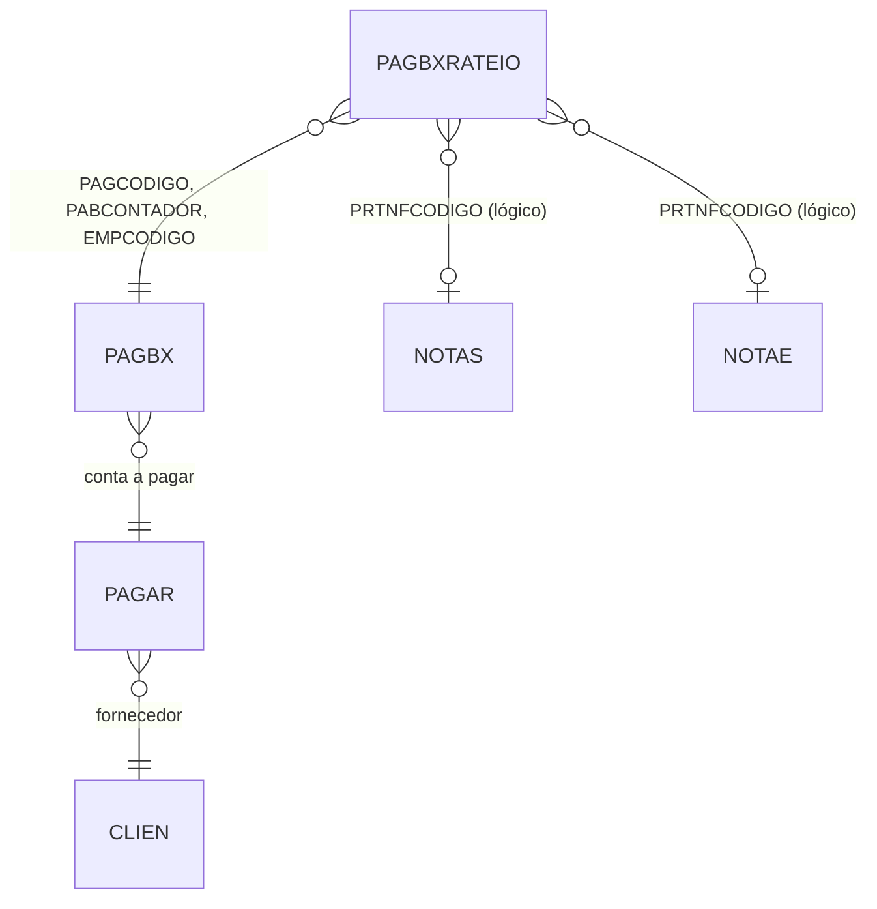

# PAGBXRATEIO - Documentação Completa de Relacionamentos

## 📊 Informações Gerais

- **Nome da Tabela**: PAGBXRATEIO (Rateio de Baixas de Contas a Pagar)
- **Total de Registros**: 135.641
- **Total de Colunas**: 12
- **Chave Primária**: PAGCODIGO, EMPCODIGO, PABCONTADOR, PRTSEQ (composite)
- **Chaves Estrangeiras**: 3
- **Índices**: 0
- **Tabelas Dependentes**: 0
- **Banco de Dados**: Firebird

## 📝 Descrição

**PAGBXRATEIO** é uma tabela de detalhamento que permite ratear uma baixa de conta a pagar (`PAGBX`) entre múltiplas notas fiscais ou documentos. Com **135.641 registros**, esta tabela permite que um pagamento seja distribuído proporcionalmente entre diferentes documentos fiscais.

Esta tabela é essencial para:
- **Rateio de Pagamentos**: Distribuir um pagamento entre múltiplas notas fiscais
- **Conciliação Detalhada**: Conciliação precisa entre pagamentos e documentos fiscais
- **Rastreabilidade**: Rastrear exatamente qual parte do pagamento se refere a cada documento
- **Relatórios Fiscais**: Gerar relatórios detalhados de pagamentos por documento

---

## 🔑 Estrutura de Colunas

| Coluna | Tipo | Descrição |
|--------|------|-----------|
| **PAGCODIGO** 🔑 🔗 | INT | Código da conta a pagar (PK, FK → PAGBX) |
| **EMPCODIGO** 🔑 🔗 | INT | Código da empresa (PK, FK → PAGBX) |
| **PABCONTADOR** 🔑 🔗 | INT | Contador da baixa (PK, FK → PAGBX) |
| **PRTSEQ** 🔑 | INT | Sequência do rateio (PK) |
| **PRTNRDOCTO** | VARCHAR(14) | Número do documento |
| **PRTNFCODIGO** | INT | Código da nota fiscal |
| **PRTDATA** | TIMESTAMP | Data do documento |
| **PRTVALOR** | DECIMAL(16,2) | Valor rateado |
| **PRTVALORJUROS** | DECIMAL(16,2) | Valor de juros rateado |
| **PRTVALORDESCONTOS** | DECIMAL(16,2) | Valor de descontos rateado |
| **PRTSALDONF** | DECIMAL(16,2) | Saldo da nota fiscal |
| **PRTDATALIQ** | TIMESTAMP | Data de liquidação |

---

## 🔗 Relacionamentos - Nível 1 (Diretos)

### PAGBX - Baixa de Conta a Pagar (FK Obrigatória)
**Volume:** 138.447 registros

**Relacionamento:**
```
PAGBXRATEIO.PAGCODIGO → PAGBX.PAGCODIGO (N:1)
PAGBXRATEIO.PABCONTADOR → PAGBX.PABCONTADOR (N:1)
PAGBXRATEIO.EMPCODIGO → PAGBX.EMPCODIGO (N:1)
Constraint: FK_PAGBXRATEIO_PAGBX
```

**Descrição:** Cada registro de rateio está vinculado a uma baixa específica.

**Proporção:** ~0,98 rateios por baixa em média (135.641 / 138.447)

---

## 🔗 Relacionamentos - Nível 2 (Indiretos)

### Através de PAGBX

#### PAGAR - Conta a Pagar
```
PAGBXRATEIO → PAGBX → PAGAR
```
**Descrição:** Permite identificar a conta a pagar através da baixa.

---

#### CLIEN - Fornecedor
```
PAGBXRATEIO → PAGBX → PAGAR → CLIEN
```
**Descrição:** Permite identificar o fornecedor através da conta a pagar.

---

### Relacionamentos Lógicos Potenciais

#### NOTAS - Nota Fiscal (Relacionamento Lógico)
```
PAGBXRATEIO.PRTNFCODIGO → NOTAS.NFCODIGO (N:1)
PAGBXRATEIO.EMPCODIGO → NOTAS.EMPCODIGO (N:1)
```

**Descrição:** O campo `PRTNFCODIGO` pode referenciar logicamente notas fiscais.

---

#### NOTAE - Nota Fiscal Eletrônica (Relacionamento Lógico)
```
PAGBXRATEIO.PRTNFCODIGO → NOTAE.NFECODIGO (N:1)
PAGBXRATEIO.EMPCODIGO → NOTAE.EMPCODIGO (N:1)
```

**Descrição:** O campo `PRTNFCODIGO` pode referenciar logicamente NF-e.

---

## 🗺️ Diagrama de Relacionamentos



---

## 💡 Casos de Uso Práticos

### 1. Consultar Rateio de uma Baixa

```sql
SELECT 
    prt.PRTSEQ,
    prt.PRTNRDOCTO,
    prt.PRTNFCODIGO,
    prt.PRTDATA,
    prt.PRTVALOR,
    prt.PRTVALORJUROS,
    prt.PRTVALORDESCONTOS,
    prt.PRTSALDONF,
    nfe.NFENRNOTA AS NUMERO_NFE,
    nfe.NFEVRTOTAL AS VALOR_NFE
FROM PAGBXRATEIO prt
LEFT JOIN NOTAE nfe ON prt.PRTNFCODIGO = nfe.NFECODIGO 
    AND prt.EMPCODIGO = nfe.EMPCODIGO
WHERE prt.PAGCODIGO = :pagcodigo
    AND prt.EMPCODIGO = :empcodigo
    AND prt.PABCONTADOR = :pabcontador
ORDER BY prt.PRTSEQ;
```

### 2. Verificar Soma do Rateio

```sql
SELECT 
    pbx.PABCONTADOR,
    pbx.PABVALOR AS VALOR_BAIXA,
    SUM(prt.PRTVALOR) AS VALOR_RATEADO,
    SUM(prt.PRTVALORJUROS) AS JUROS_RATEADO,
    SUM(prt.PRTVALORDESCONTOS) AS DESCONTOS_RATEADO,
    CASE 
        WHEN ABS(pbx.PABVALOR - SUM(prt.PRTVALOR)) < 0.01 THEN 'OK'
        ELSE 'DIVERGENTE'
    END AS STATUS_RATEIO
FROM PAGBX pbx
LEFT JOIN PAGBXRATEIO prt ON pbx.PAGCODIGO = prt.PAGCODIGO 
    AND pbx.EMPCODIGO = prt.EMPCODIGO
    AND pbx.PABCONTADOR = prt.PABCONTADOR
WHERE pbx.PAGCODIGO = :pagcodigo
    AND pbx.EMPCODIGO = :empcodigo
GROUP BY pbx.PABCONTADOR, pbx.PABVALOR;
```

### 3. Relatório de Rateio por Nota Fiscal

```sql
SELECT 
    prt.PRTNFCODIGO,
    nfe.NFENRNOTA,
    nfe.NFEDTEMIS,
    COUNT(DISTINCT prt.PAGCODIGO) AS QTD_CONTAS_PAGAR,
    COUNT(prt.PRTSEQ) AS QTD_RATEIOS,
    SUM(prt.PRTVALOR) AS VALOR_TOTAL_RATEADO,
    SUM(prt.PRTVALORJUROS) AS JUROS_TOTAL,
    SUM(prt.PRTVALORDESCONTOS) AS DESCONTOS_TOTAL
FROM PAGBXRATEIO prt
LEFT JOIN NOTAE nfe ON prt.PRTNFCODIGO = nfe.NFECODIGO 
    AND prt.EMPCODIGO = nfe.EMPCODIGO
WHERE prt.PRTDATA BETWEEN :data_inicio AND :data_fim
GROUP BY prt.PRTNFCODIGO, nfe.NFENRNOTA, nfe.NFEDTEMIS
ORDER BY VALOR_TOTAL_RATEADO DESC;
```

---

## 📈 Estatísticas e Insights

### Volume de Dados
- **Total de Rateios**: 135.641 registros
- **Média**: ~0,98 rateios por baixa
- **Distribuição**: Permite análise detalhada de pagamentos por documento fiscal

---

## ⚡ Performance e Otimização

### Índices Recomendados

```sql
-- Índice para consultas por baixa
CREATE INDEX IDX_PAGBXRATEIO_PAGBX ON PAGBXRATEIO (PAGCODIGO, EMPCODIGO, PABCONTADOR);

-- Índice para consultas por nota fiscal
CREATE INDEX IDX_PAGBXRATEIO_NF ON PAGBXRATEIO (PRTNFCODIGO, EMPCODIGO);

-- Índice para consultas por data
CREATE INDEX IDX_PAGBXRATEIO_DATA ON PAGBXRATEIO (PRTDATA);
```

---

## 🔒 Integridade de Dados

### Validações Importantes

1. **Chave Composta**: `PAGCODIGO` + `EMPCODIGO` + `PABCONTADOR` + `PRTSEQ` deve ser única
2. **Baixa**: `PAGCODIGO` + `EMPCODIGO` + `PABCONTADOR` deve existir em `PAGBX`
3. **Soma do Rateio**: Soma de `PRTVALOR` deve ser igual ao valor da baixa (`PAGBX.PABVALOR`)
4. **Nota Fiscal**: `PRTNFCODIGO` deve existir em `NOTAS` ou `NOTAE` quando preenchido

---

## 📚 Integração com Aplicação (Laravel)

### Model PAGBXRATEIO

```php
<?php

namespace App\Models;

use Illuminate\Database\Eloquent\Model;

final class PAGBXRATEIO extends Model
{
    protected $table = 'PAGBXRATEIO';
    
    protected $primaryKey = ['PAGCODIGO', 'EMPCODIGO', 'PABCONTADOR', 'PRTSEQ'];
    
    public $incrementing = false;
    
    protected $fillable = [
        'PAGCODIGO', 'EMPCODIGO', 'PABCONTADOR', 'PRTSEQ',
        'PRTNRDOCTO', 'PRTNFCODIGO', 'PRTDATA', 'PRTVALOR',
        'PRTVALORJUROS', 'PRTVALORDESCONTOS', 'PRTSALDONF', 'PRTDATALIQ',
    ];
    
    protected $casts = [
        'PRTDATA' => 'datetime',
        'PRTDATALIQ' => 'datetime',
        'PRTVALOR' => 'decimal:2',
        'PRTVALORJUROS' => 'decimal:2',
        'PRTVALORDESCONTOS' => 'decimal:2',
        'PRTSALDONF' => 'decimal:2',
    ];
    
    /**
     * Relacionamento com PAGBX
     */
    public function baixa()
    {
        return $this->belongsTo(PAGBX::class, ['PAGCODIGO', 'EMPCODIGO', 'PABCONTADOR'], 
            ['PAGCODIGO', 'EMPCODIGO', 'PABCONTADOR']);
    }
    
    /**
     * Relacionamento lógico com NOTAE
     */
    public function notaFiscal()
    {
        return $this->belongsTo(NOTAE::class, ['PRTNFCODIGO', 'EMPCODIGO'], 
            ['NFECODIGO', 'EMPCODIGO']);
    }
}
```

---

## ✅ Boas Práticas

### Design
1. **Manter unicidade** da chave composta
2. **Validar soma** do rateio igual ao valor da baixa
3. **Validar existência** de nota fiscal quando preenchida

### Performance
1. **Usar índices** nas consultas frequentes
2. **Evitar JOINs desnecessários** quando possível

### Integridade
1. **Validar existência** de baixa antes de inserir
2. **Verificar soma** do rateio para consistência
3. **Garantir consistência** entre rateio e documentos fiscais

---

**Documentação gerada em**: 2025-01-27

**Banco de dados**: Firebird

