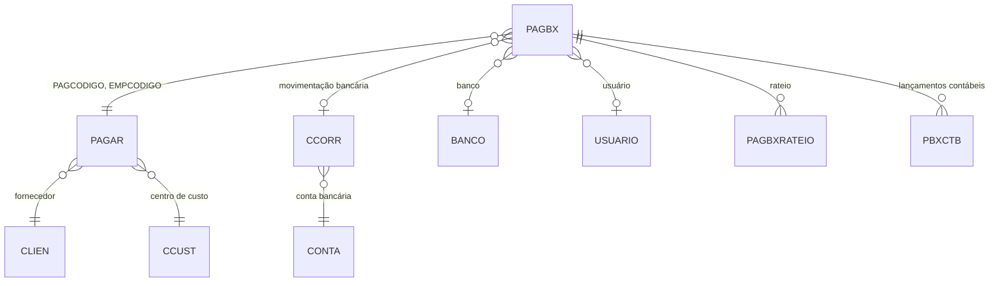

# PAGBX - Documentação Completa de Relacionamentos

## 📊 Informações Gerais

- **Nome da Tabela**: PAGBX (Baixas de Contas a Pagar)
- **Total de Registros**: 138.447
- **Total de Colunas**: 19
- **Chave Primária**: PAGCODIGO, EMPCODIGO, PABCONTADOR (composite)
- **Chaves Estrangeiras**: 8
- **Índices**: 2
- **Tabelas Dependentes**: 6
- **Banco de Dados**: Firebird

## 📝 Descrição

**PAGBX** é a tabela que registra as baixas (pagamentos efetivos) de contas a pagar. Com **138.447 registros**, esta tabela permite que uma conta a pagar tenha múltiplas baixas, registrando cada pagamento realizado com detalhes de data, valor, banco, conta corrente e outras informações.

Esta tabela é essencial para:
- **Controle de Pagamentos**: Registrar cada pagamento efetivo de contas a pagar
- **Conciliação Bancária**: Vincular pagamentos a movimentações bancárias (`CCORR`)
- **Rastreabilidade**: Manter histórico completo de pagamentos
- **Relatórios Financeiros**: Gerar relatórios de fluxo de caixa e desembolsos

---

## 🔑 Estrutura de Colunas (Principais)

| Coluna | Tipo | Descrição |
|--------|------|-----------|
| **PAGCODIGO** 🔑 🔗 | INT | Código da conta a pagar (PK, FK → PAGAR) |
| **EMPCODIGO** 🔑 🔗 | INT | Código da empresa (PK, FK → PAGAR) |
| **PABCONTADOR** 🔑 | INT | Contador sequencial da baixa (PK) |
| **PABDTPAGTO** | TIMESTAMP | Data do pagamento (INDEXADO) |
| **PABDTLIQ** | TIMESTAMP | Data de liquidação (INDEXADO) |
| **PABVALOR** | DECIMAL(27,2) | Valor do pagamento |
| **PABVRDESC** | DECIMAL(27,2) | Valor do desconto |
| **PABVRJUROS** | DECIMAL(27,2) | Valor dos juros |
| **PABDEVOLUCAO** | VARCHAR(14) | Flag de devolução |
| **PABDOCTOBX** | VARCHAR(14) | Documento da baixa |
| **PABNRCHEQUE** | VARCHAR(37) | Número do cheque |
| **BCOCODIGO** 🔗 | INT | Banco (FK → BANCO, CCORR) |
| **CTANRCONTA** 🔗 | VARCHAR(37) | Número da conta (FK → CCORR) |
| **CCONRLANCTO** 🔗 | INT | Lançamento bancário (FK → CCORR) |
| **EMPCCORR** 🔗 | INT | Empresa da conta corrente (FK → CCORR) |
| **USUCODIGO** 🔗 | INT | Usuário que realizou a baixa (FK → USUARIO) |
| **PABOBSER** | VARCHAR(37) | Observações |
| **PABORIGEM** | VARCHAR(14) | Origem da baixa |
| **PABLESTCREDCLI** | VARCHAR(14) | Flag de lançamento de crédito ao cliente |

---

## 🔗 Relacionamentos - Nível 1 (Diretos)

### PAGAR - Conta a Pagar (FK Obrigatória)
**Volume:** 259.801 registros

**Relacionamento:**
```
PAGBX.PAGCODIGO → PAGAR.PAGCODIGO (N:1)
PAGBX.EMPCODIGO → PAGAR.EMPCODIGO (N:1)
Constraint: PAGAR_PAGBX
```

**Descrição:** Cada baixa está vinculada a uma conta a pagar específica.

**Proporção:** ~0,5 baixas por conta a pagar em média (138.447 / 259.801)

---

### CCORR - Movimentação Bancária (4 FKs)
**Volume:** Variável conforme movimentações

**Relacionamento:**
```
PAGBX.BCOCODIGO → CCORR.BCOCODIGO (N:1)
PAGBX.CTANRCONTA → CCORR.CTANRCONTA (N:1)
PAGBX.CCONRLANCTO → CCORR.CCONRLANCTO (N:1)
PAGBX.EMPCCORR → CCORR.EMPCODIGO (N:1)
Constraint: CCORR_PAGBX
```

**Descrição:** Vincula a baixa a uma movimentação bancária específica.

---

### BANCO - Banco (FK Opcional)
**Volume:** 1.000 registros

**Relacionamento:**
```
PAGBX.BCOCODIGO → BANCO.BCOCODIGO (N:1)
Constraint: BANCO_PAGBX
```

**Descrição:** Identifica o banco utilizado para o pagamento.

---

### USUARIO - Usuário (FK Opcional)
**Volume:** Variável conforme usuários

**Relacionamento:**
```
PAGBX.USUCODIGO → USUARIO.USUCODIGO (N:1)
Constraint: USUARIO_PAGBX
```

**Descrição:** Identifica o usuário que realizou a baixa.

---

## 📊 Tabelas que Referenciam PAGBX

### PAGBXRATEIO - Rateio de Baixas
**Volume:** 135.641 registros

**Relacionamento:**
```
PAGBXRATEIO.PAGCODIGO → PAGBX.PAGCODIGO (N:1)
PAGBXRATEIO.PABCONTADOR → PAGBX.PABCONTADOR (N:1)
PAGBXRATEIO.EMPCODIGO → PAGBX.EMPCODIGO (N:1)
```

**Descrição:** Permite ratear uma baixa entre múltiplas notas fiscais ou documentos.

---

### PBXCTB - Lançamentos Contábeis de Baixas
**Volume:** Variável

**Relacionamento:**
```
PBXCTB.PAGCODIGO → PAGBX.PAGCODIGO (N:1)
PBXCTB.PABCONTADOR → PAGBX.PABCONTADOR (N:1)
PBXCTB.EMPCODIGO → PAGBX.EMPCODIGO (N:1)
```

**Descrição:** Lançamentos contábeis relacionados à baixa.

---

## 🔗 Relacionamentos - Nível 2 (Indiretos)

### Através de PAGAR

#### CLIEN - Fornecedor
```
PAGBX → PAGAR → CLIEN
```
**Descrição:** Permite identificar o fornecedor através da conta a pagar.

---

#### CCUST - Centro de Custo
```
PAGBX → PAGAR → CCUST
```
**Descrição:** Permite identificar o centro de custo através da conta a pagar.

---

### Através de CCORR

#### CONTA - Conta Bancária
```
PAGBX → CCORR → CONTA
```
**Descrição:** Permite identificar a conta bancária através da movimentação.

---

## 🗺️ Diagrama de Relacionamentos



---

## 💡 Casos de Uso Práticos

### 1. Consultar Baixas de uma Conta a Pagar

```sql
SELECT 
    pbx.PABCONTADOR,
    pbx.PABDTPAGTO,
    pbx.PABDTLIQ,
    pbx.PABVALOR,
    pbx.PABVRDESC,
    pbx.PABVRJUROS,
    ban.BCONOME AS BANCO,
    cc.CCONRDATA AS DATA_MOVIMENTACAO,
    usu.USUNOME AS USUARIO
FROM PAGBX pbx
LEFT JOIN BANCO ban ON pbx.BCOCODIGO = ban.BCOCODIGO
LEFT JOIN CCORR cc ON pbx.BCOCODIGO = cc.BCOCODIGO 
    AND pbx.CTANRCONTA = cc.CTANRCONTA
    AND pbx.CCONRLANCTO = cc.CCONRLANCTO
LEFT JOIN USUARIO usu ON pbx.USUCODIGO = usu.USUCODIGO
WHERE pbx.PAGCODIGO = :pagcodigo
    AND pbx.EMPCODIGO = :empcodigo
ORDER BY pbx.PABDTPAGTO DESC;
```

### 2. Relatório de Pagamentos por Período

```sql
SELECT 
    DATE(pbx.PABDTPAGTO) AS DATA_PAGAMENTO,
    COUNT(DISTINCT pbx.PAGCODIGO) AS QTD_CONTAS_PAGAS,
    COUNT(pbx.PABCONTADOR) AS QTD_BAIXAS,
    SUM(pbx.PABVALOR) AS VALOR_TOTAL_PAGO,
    SUM(pbx.PABVRDESC) AS VALOR_DESCONTO,
    SUM(pbx.PABVRJUROS) AS VALOR_JUROS
FROM PAGBX pbx
WHERE pbx.PABDTPAGTO BETWEEN :data_inicio AND :data_fim
GROUP BY DATE(pbx.PABDTPAGTO)
ORDER BY DATA_PAGAMENTO DESC;
```

### 3. Conciliação Bancária

```sql
SELECT 
    pbx.PABCONTADOR,
    pbx.PABDTPAGTO,
    pbx.PABVALOR,
    pag.PAGNRDOC,
    cli.CLINOME AS FORNECEDOR,
    cc.CCONRDATA AS DATA_MOVIMENTACAO,
    cc.CCONRVALOR AS VALOR_MOVIMENTACAO,
    CASE 
        WHEN ABS(pbx.PABVALOR - cc.CCONRVALOR) < 0.01 THEN 'CONCILIADO'
        ELSE 'DIVERGENTE'
    END AS STATUS_CONCILIACAO
FROM PAGBX pbx
INNER JOIN PAGAR pag ON pbx.PAGCODIGO = pag.PAGCODIGO 
    AND pbx.EMPCODIGO = pag.EMPCODIGO
INNER JOIN CLIEN cli ON pag.CLICODIGO = cli.CLICODIGO
LEFT JOIN CCORR cc ON pbx.BCOCODIGO = cc.BCOCODIGO 
    AND pbx.CTANRCONTA = cc.CTANRCONTA
    AND pbx.CCONRLANCTO = cc.CCONRLANCTO
WHERE pbx.PABDTPAGTO BETWEEN :data_inicio AND :data_fim
ORDER BY pbx.PABDTPAGTO DESC;
```

---

## 📈 Estatísticas e Insights

### Volume de Dados
- **Total de Baixas**: 138.447 registros
- **Média**: ~0,5 baixas por conta a pagar
- **Distribuição**: Permite análise de pagamentos por período, banco, fornecedor, etc.

---

## ⚡ Performance e Otimização

### Índices Existentes

| Nome | Colunas |
|------|---------|
| INDPABDTLIQ | PABDTLIQ |
| INDPABDTPAGTO | PABDTPAGTO |

### Índices Recomendados Adicionais

```sql
-- Índice para consultas por conta a pagar
CREATE INDEX IDX_PAGBX_PAGAR ON PAGBX (PAGCODIGO, EMPCODIGO);

-- Índice para conciliação bancária
CREATE INDEX IDX_PAGBX_CCORR ON PAGBX (BCOCODIGO, CTANRCONTA, CCONRLANCTO, EMPCCORR);
```

---

## 🔒 Integridade de Dados

### Validações Importantes

1. **Chave Composta**: `PAGCODIGO` + `EMPCODIGO` + `PABCONTADOR` deve ser única
2. **Conta a Pagar**: `PAGCODIGO` + `EMPCODIGO` deve existir em `PAGAR`
3. **Soma de Baixas**: Soma de `PABVALOR` deve ser menor ou igual ao valor da conta a pagar
4. **Data**: `PABDTLIQ` deve ser maior ou igual a `PABDTPAGTO`

---

## 📚 Integração com Aplicação (Laravel)

### Model PAGBX

```php
<?php

namespace App\Models;

use Illuminate\Database\Eloquent\Model;

final class PAGBX extends Model
{
    protected $table = 'PAGBX';
    
    protected $primaryKey = ['PAGCODIGO', 'EMPCODIGO', 'PABCONTADOR'];
    
    public $incrementing = false;
    
    protected $fillable = [
        'PAGCODIGO', 'EMPCODIGO', 'PABCONTADOR',
        'PABDTPAGTO', 'PABDTLIQ', 'PABVALOR',
        'BCOCODIGO', 'USUCODIGO',
        // ... outros campos
    ];
    
    protected $casts = [
        'PABDTPAGTO' => 'datetime',
        'PABDTLIQ' => 'datetime',
        'PABVALOR' => 'decimal:2',
        // ... outros casts
    ];
    
    /**
     * Relacionamento com PAGAR
     */
    public function contaPagar()
    {
        return $this->belongsTo(PAGAR::class, ['PAGCODIGO', 'EMPCODIGO'], ['PAGCODIGO', 'EMPCODIGO']);
    }
    
    /**
     * Relacionamento com CCORR
     */
    public function movimentacaoBancaria()
    {
        return $this->belongsTo(CCORR::class, ['BCOCODIGO', 'CTANRCONTA', 'CCONRLANCTO', 'EMPCCORR'], 
            ['BCOCODIGO', 'CTANRCONTA', 'CCONRLANCTO', 'EMPCODIGO']);
    }
    
    /**
     * Scope para pagamentos por período
     */
    public function scopePorPeriodo($query, $dataInicio, $dataFim)
    {
        return $query->whereBetween('PABDTPAGTO', [$dataInicio, $dataFim]);
    }
}
```

---

## ✅ Boas Práticas

### Design
1. **Manter unicidade** da chave composta
2. **Validar soma** das baixas igual ao valor da conta a pagar
3. **Validar datas** (liquidação >= pagamento)

### Performance
1. **Usar índices** nas consultas frequentes
2. **Evitar JOINs desnecessários** quando possível

### Integridade
1. **Validar existência** de conta a pagar antes de inserir
2. **Verificar soma** de baixas para consistência
3. **Garantir conciliação** com movimentações bancárias

---

**Documentação gerada em**: 2025-01-27

**Banco de dados**: Firebird

