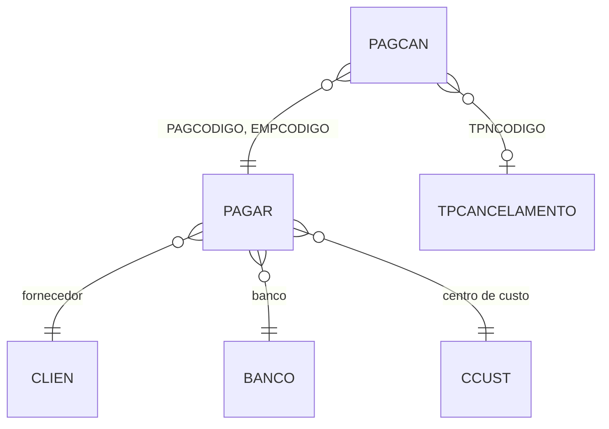

# PAGCAN - Documentação Completa de Relacionamentos

## 📊 Informações Gerais

- **Nome da Tabela**: PAGCAN (Cancelamentos de Contas a Pagar)
- **Total de Registros**: 119.164
- **Total de Colunas**: 5
- **Chave Primária**: PAGCODIGO, EMPCODIGO (composite)
- **Chaves Estrangeiras**: 3
- **Índices**: 0
- **Tabelas Dependentes**: 0
- **Banco de Dados**: Firebird

## 📝 Descrição

**PAGCAN** é a tabela que registra cancelamentos de contas a pagar. Com **119.164 registros**, esta tabela mantém histórico completo de todas as contas a pagar que foram canceladas, incluindo data do cancelamento, histórico e motivo do cancelamento.

Esta tabela é essencial para:
- **Auditoria**: Manter histórico completo de cancelamentos
- **Rastreabilidade**: Rastrear quando e por que contas foram canceladas
- **Relatórios**: Gerar relatórios de cancelamentos para análise gerencial
- **Conformidade**: Atender requisitos de auditoria e compliance
- **Análise**: Identificar padrões de cancelamento para melhorias de processo

---

## 🔑 Estrutura de Colunas

| Coluna | Tipo | Descrição |
|--------|------|-----------|
| **PAGCODIGO** 🔑 🔗 | INT | Código da conta a pagar (PK, FK → PAGAR) |
| **EMPCODIGO** 🔑 🔗 | INT | Código da empresa (PK, FK → PAGAR) |
| **PCADATA** | TIMESTAMP | Data do cancelamento |
| **PCAHISTORICO** | VARCHAR(37) | Histórico/motivo do cancelamento |
| **TPNCODIGO** 🔗 | INT | Tipo de cancelamento (FK → TPCANCELAMENTO) |

---

## 🔗 Relacionamentos - Nível 1 (Diretos)

### PAGAR - Conta a Pagar (FK Obrigatória)
**Volume:** 259.801 registros

**Relacionamento:**
```
PAGCAN.PAGCODIGO → PAGAR.PAGCODIGO (N:1)
PAGCAN.EMPCODIGO → PAGAR.EMPCODIGO (N:1)
Constraint: PAGAR_PAGCAN
```

**Descrição:** Cada cancelamento está vinculado a uma conta a pagar específica.

**Proporção:** ~46% das contas a pagar foram canceladas (119.164 / 259.801)

---

### TPCANCELAMENTO - Tipo de Cancelamento (FK Opcional)
**Volume:** 10 registros

**Relacionamento:**
```
PAGCAN.TPNCODIGO → TPCANCELAMENTO.TPNCODIGO (N:1)
Constraint: TPCANCELAMENTO_PAGCAN
```

**Descrição:** Define o motivo/tipo do cancelamento.

**Valores Típicos:**
- Cancelamento por solicitação do fornecedor
- Cancelamento por erro de digitação
- Cancelamento por substituição
- Cancelamento por determinação judicial
- Outros motivos administrativos

---

## 🔗 Relacionamentos - Nível 2 (Indiretos)

### Através de PAGAR

#### CLIEN - Fornecedor
```
PAGCAN → PAGAR → CLIEN
```
**Descrição:** Permite identificar o fornecedor da conta cancelada.

---

#### BANCO - Banco
```
PAGCAN → PAGAR → BANCO
```
**Descrição:** Permite identificar o banco relacionado à conta cancelada.

---

#### CCUST - Centro de Custo
```
PAGCAN → PAGAR → CCUST
```
**Descrição:** Permite identificar o centro de custo da conta cancelada.

---

## 🗺️ Diagrama de Relacionamentos



---

## 💡 Casos de Uso Práticos

### 1. Consultar Cancelamento de uma Conta a Pagar

```sql
SELECT 
    pcan.PCADATA,
    pcan.PCAHISTORICO,
    tpn.TPNDESCRICAO AS TIPO_CANCELAMENTO,
    pag.PAGNRDOC,
    pag.PAGVALOR,
    cli.CLINOME AS FORNECEDOR
FROM PAGCAN pcan
INNER JOIN PAGAR pag ON pcan.PAGCODIGO = pag.PAGCODIGO 
    AND pcan.EMPCODIGO = pag.EMPCODIGO
LEFT JOIN TPCANCELAMENTO tpn ON pcan.TPNCODIGO = tpn.TPNCODIGO
LEFT JOIN CLIEN cli ON pag.CLICODIGO = cli.CLICODIGO
WHERE pcan.PAGCODIGO = :pagcodigo
    AND pcan.EMPCODIGO = :empcodigo;
```

### 2. Relatório de Cancelamentos por Período

```sql
SELECT 
    DATE(pcan.PCADATA) AS DATA_CANCELAMENTO,
    COUNT(DISTINCT pcan.PAGCODIGO) AS QTD_CONTAS_CANCELADAS,
    SUM(pag.PAGVALOR) AS VALOR_TOTAL_CANCELADO,
    tpn.TPNDESCRICAO AS TIPO_CANCELAMENTO,
    COUNT(*) AS QTD_POR_TIPO
FROM PAGCAN pcan
INNER JOIN PAGAR pag ON pcan.PAGCODIGO = pag.PAGCODIGO 
    AND pcan.EMPCODIGO = pag.EMPCODIGO
LEFT JOIN TPCANCELAMENTO tpn ON pcan.TPNCODIGO = tpn.TPNCODIGO
WHERE pcan.PCADATA BETWEEN :data_inicio AND :data_fim
GROUP BY DATE(pcan.PCADATA), tpn.TPNDESCRICAO
ORDER BY DATA_CANCELAMENTO DESC, VALOR_TOTAL_CANCELADO DESC;
```

### 3. Análise de Cancelamentos por Fornecedor

```sql
SELECT 
    cli.CLICODIGO,
    cli.CLINOME AS FORNECEDOR,
    COUNT(DISTINCT pcan.PAGCODIGO) AS QTD_CONTAS_CANCELADAS,
    SUM(pag.PAGVALOR) AS VALOR_TOTAL_CANCELADO,
    COUNT(DISTINCT pcan.TPNCODIGO) AS QTD_TIPOS_DIFERENTES
FROM PAGCAN pcan
INNER JOIN PAGAR pag ON pcan.PAGCODIGO = pag.PAGCODIGO 
    AND pcan.EMPCODIGO = pag.EMPCODIGO
INNER JOIN CLIEN cli ON pag.CLICODIGO = cli.CLICODIGO
WHERE pcan.PCADATA BETWEEN :data_inicio AND :data_fim
GROUP BY cli.CLICODIGO, cli.CLINOME
ORDER BY VALOR_TOTAL_CANCELADO DESC;
```

### 4. Cancelamentos por Tipo

```sql
SELECT 
    tpn.TPNCODIGO,
    tpn.TPNDESCRICAO,
    COUNT(DISTINCT pcan.PAGCODIGO) AS QTD_CANCELAMENTOS,
    SUM(pag.PAGVALOR) AS VALOR_TOTAL,
    AVG(pag.PAGVALOR) AS VALOR_MEDIO
FROM PAGCAN pcan
INNER JOIN PAGAR pag ON pcan.PAGCODIGO = pag.PAGCODIGO 
    AND pcan.EMPCODIGO = pag.EMPCODIGO
LEFT JOIN TPCANCELAMENTO tpn ON pcan.TPNCODIGO = tpn.TPNCODIGO
GROUP BY tpn.TPNCODIGO, tpn.TPNDESCRICAO
ORDER BY QTD_CANCELAMENTOS DESC;
```

---

## 📈 Estatísticas e Insights

### Volume de Dados
- **Total de Cancelamentos**: 119.164 registros
- **Taxa de Cancelamento**: ~46% das contas a pagar foram canceladas
- **Distribuição**: Permite análise de padrões de cancelamento

---

## ⚡ Performance e Otimização

### Índices Recomendados

```sql
-- Índice para consultas por conta a pagar
CREATE INDEX IDX_PAGCAN_PAGAR ON PAGCAN (PAGCODIGO, EMPCODIGO);

-- Índice para consultas por data
CREATE INDEX IDX_PAGCAN_DATA ON PAGCAN (PCADATA);

-- Índice para consultas por tipo de cancelamento
CREATE INDEX IDX_PAGCAN_TIPO ON PAGCAN (TPNCODIGO);
```

---

## 🔒 Integridade de Dados

### Validações Importantes

1. **Chave Composta**: `PAGCODIGO` + `EMPCODIGO` deve ser única
2. **Conta a Pagar**: `PAGCODIGO` + `EMPCODIGO` deve existir em `PAGAR`
3. **Tipo de Cancelamento**: `TPNCODIGO` deve existir em `TPCANCELAMENTO` quando preenchido
4. **Data**: `PCADATA` deve ser maior ou igual à data de emissão da conta a pagar

---

## 📚 Integração com Aplicação (Laravel)

### Model PAGCAN

```php
<?php

namespace App\Models;

use Illuminate\Database\Eloquent\Model;

final class PAGCAN extends Model
{
    protected $table = 'PAGCAN';
    
    protected $primaryKey = ['PAGCODIGO', 'EMPCODIGO'];
    
    public $incrementing = false;
    
    protected $fillable = [
        'PAGCODIGO',
        'EMPCODIGO',
        'PCADATA',
        'PCAHISTORICO',
        'TPNCODIGO',
    ];
    
    protected $casts = [
        'PCADATA' => 'datetime',
    ];
    
    /**
     * Relacionamento com PAGAR
     */
    public function contaPagar()
    {
        return $this->belongsTo(PAGAR::class, ['PAGCODIGO', 'EMPCODIGO'], ['PAGCODIGO', 'EMPCODIGO']);
    }
    
    /**
     * Relacionamento com TPCANCELAMENTO
     */
    public function tipoCancelamento()
    {
        return $this->belongsTo(TPCANCELAMENTO::class, 'TPNCODIGO', 'TPNCODIGO');
    }
    
    /**
     * Scope para cancelamentos por período
     */
    public function scopePorPeriodo($query, $dataInicio, $dataFim)
    {
        return $query->whereBetween('PCADATA', [$dataInicio, $dataFim]);
    }
}
```

---

## ✅ Boas Práticas

### Design
1. **Manter unicidade** da chave composta
2. **Registrar histórico** completo do cancelamento
3. **Validar existência** de conta a pagar antes de cancelar

### Performance
1. **Usar índices** nas consultas frequentes
2. **Evitar JOINs desnecessários** quando possível

### Integridade
1. **Validar existência** de conta a pagar antes de inserir
2. **Garantir consistência** entre cancelamento e conta a pagar
3. **Registrar motivo** do cancelamento sempre que possível

---

**Documentação gerada em**: 2025-01-27

**Banco de dados**: Firebird

