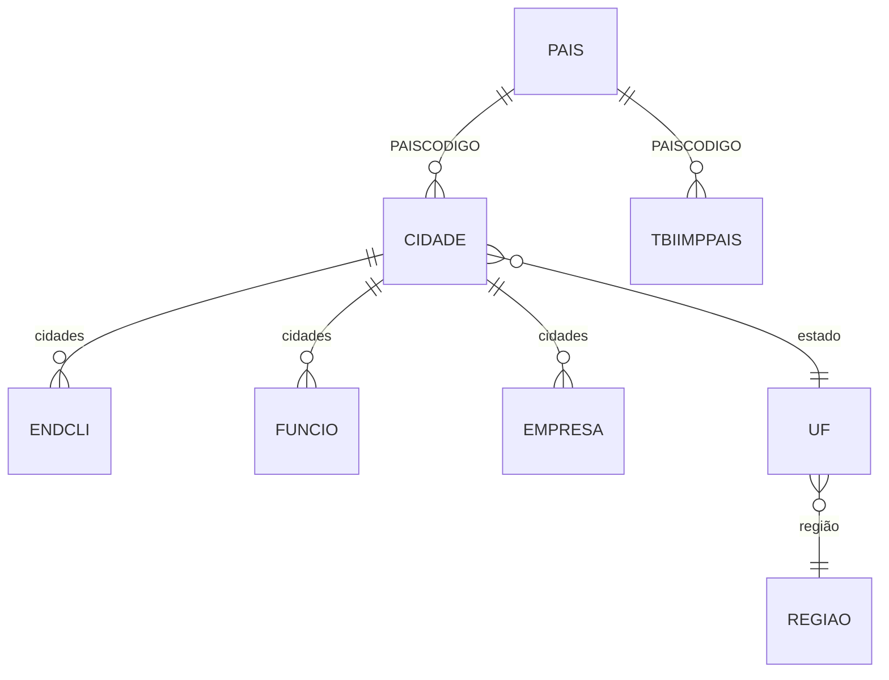

# PAIS - Documentação Completa de Relacionamentos

## 📊 Informações Gerais

- **Nome da Tabela**: PAIS (Países)
- **Total de Registros**: 12
- **Total de Colunas**: 5
- **Chave Primária**: PAISCODIGO
- **Chaves Estrangeiras**: 0
- **Índices**: 0
- **Tabelas Dependentes**: 2
- **Banco de Dados**: Firebird

## 📝 Descrição

**PAIS** é uma tabela mestre geográfica que define os países disponíveis no sistema. Com apenas **12 registros**, esta tabela serve como catálogo de valores para identificação de países, incluindo informações como nome, abreviação, máscara de CEP e código bancário.

Esta tabela é essencial para:
- **Classificação Geográfica**: Identificar países em endereços e documentos
- **Validação**: Garantir que apenas países válidos sejam utilizados
- **Relatórios**: Agrupar dados por país para análises geográficas
- **Conformidade Fiscal**: Atender requisitos fiscais que exigem identificação de país
- **Integração**: Suportar integrações com sistemas externos que utilizam códigos de país

---

## 🔑 Estrutura de Colunas

| Coluna | Tipo | Descrição |
|--------|------|-----------|
| **PAISCODIGO** 🔑 | INT | Código único do país (PK) |
| **PAISNOME** | VARCHAR(37) | Nome completo do país |
| **PAISABREV** | VARCHAR(37) | Abreviação do país |
| **PAISMASCCEP** | VARCHAR(37) | Máscara de CEP do país |
| **PAISCODBC** | INT | Código bancário do país |

---

## 🔗 Relacionamentos - Nível 1 (Diretos)

### Nenhum Relacionamento Formal

Esta tabela não possui chaves estrangeiras formais, mas é referenciada por 2 tabelas através de campos de país.

---

## 📊 Tabelas que Referenciam PAIS

### CIDADE - Cidades
**Volume:** 736 registros

**Relacionamento:**
```
CIDADE.PAISCODIGO → PAIS.PAISCODIGO (N:1) [FK: PAIS_CIDADE]
```

**Descrição:** Cada cidade está vinculada a um país específico.

**Uso:** Identificar o país de uma cidade, validação de endereços, relatórios geográficos.

---

### TBIIMPPAIS - Tabela de Impostos por País
**Volume:** Variável

**Relacionamento:**
```
TBIIMPPAIS.PAISCODIGO → PAIS.PAISCODIGO (N:1) [FK: PAIS_TBIIMPPAIS]
```

**Descrição:** Configurações de impostos específicas por país.

**Uso:** Aplicar regras tributárias específicas por país, conformidade fiscal internacional.

---

## 🔗 Relacionamentos - Nível 2 (Indiretos)

### Através de CIDADE

#### ENDCLI - Endereços de Clientes
```
PAIS → CIDADE → ENDCLI
```
**Descrição:** Permite identificar países através dos endereços de clientes.

---

#### FUNCIO - Funcionários
```
PAIS → CIDADE → FUNCIO
```
**Descrição:** Permite identificar países através dos endereços de funcionários.

---

#### EMPRESA - Empresas
```
PAIS → CIDADE → EMPRESA
```
**Descrição:** Permite identificar países através dos endereços de empresas.

---

### Através de CIDADE → UF

#### REGIAO - Região
```
PAIS → CIDADE → UF → REGIAO
```
**Descrição:** Permite identificar países através da hierarquia geográfica completa.

---

## 🗺️ Diagrama de Relacionamentos



---

## 💡 Casos de Uso Práticos

### 1. Consultar Todos os Países

```sql
SELECT 
    PAISCODIGO,
    PAISNOME,
    PAISABREV,
    PAISMASCCEP,
    PAISCODBC
FROM PAIS
ORDER BY PAISNOME;
```

### 2. Relatório de Clientes por País

```sql
SELECT 
    p.PAISCODIGO,
    p.PAISNOME,
    COUNT(DISTINCT cli.CLICODIGO) AS QTD_CLIENTES,
    COUNT(DISTINCT endcli.ENDCODIGO) AS QTD_ENDERECOS
FROM PAIS p
LEFT JOIN CIDADE cid ON p.PAISCODIGO = cid.PAISCODIGO
LEFT JOIN ENDCLI endcli ON cid.CIDCODIGO = endcli.CIDCODIGO
LEFT JOIN CLIEN cli ON endcli.CLICODIGO = cli.CLICODIGO
GROUP BY p.PAISCODIGO, p.PAISNOME
ORDER BY QTD_CLIENTES DESC;
```

### 3. Validação de País em Endereço

```sql
SELECT 
    p.PAISCODIGO,
    p.PAISNOME,
    cid.CIDNOME AS CIDADE,
    uf.UFNOME AS ESTADO
FROM PAIS p
INNER JOIN CIDADE cid ON p.PAISCODIGO = cid.PAISCODIGO
LEFT JOIN UF uf ON cid.CIDUF = uf.UFCODIGO
WHERE p.PAISCODIGO = :paiscodigo
    AND cid.CIDCODIGO = :cidcodigo;
```

### 4. Configurações Fiscais por País

```sql
SELECT 
    p.PAISCODIGO,
    p.PAISNOME,
    COUNT(DISTINCT tbi.TBICODIGO) AS QTD_CONFIGURACOES_FISCAIS
FROM PAIS p
LEFT JOIN TBIIMPPAIS tbi ON p.PAISCODIGO = tbi.PAISCODIGO
GROUP BY p.PAISCODIGO, p.PAISNOME
ORDER BY p.PAISNOME;
```

---

## 📈 Estatísticas e Insights

### Volume de Dados
- **Total de Países**: 12 registros
- **Uso**: Tabela de referência/catálogo geográfico
- **Frequência de Alteração**: Baixa (tabela de configuração)

---

## ⚡ Performance e Otimização

Como tabela pequena (12 registros), índices não são necessários. A tabela inteira pode ser carregada em memória.

---

## 🔒 Integridade de Dados

### Validações Importantes

1. **Código Único**: `PAISCODIGO` deve ser único
2. **Nome Obrigatório**: `PAISNOME` deve estar preenchido
3. **Consistência**: Códigos utilizados em `CIDADE` e `TBIIMPPAIS` devem existir nesta tabela

---

## 📚 Integração com Aplicação (Laravel)

### Model PAIS

```php
<?php

namespace App\Models;

use Illuminate\Database\Eloquent\Model;

final class PAIS extends Model
{
    protected $table = 'PAIS';
    
    protected $primaryKey = 'PAISCODIGO';
    
    public $incrementing = false;
    
    protected $fillable = [
        'PAISCODIGO',
        'PAISNOME',
        'PAISABREV',
        'PAISMASCCEP',
        'PAISCODBC',
    ];
    
    /**
     * Relacionamento com CIDADE
     */
    public function cidades()
    {
        return $this->hasMany(CIDADE::class, 'PAISCODIGO', 'PAISCODIGO');
    }
    
    /**
     * Relacionamento com TBIIMPPAIS
     */
    public function configuracoesFiscais()
    {
        return $this->hasMany(TBIIMPPAIS::class, 'PAISCODIGO', 'PAISCODIGO');
    }
    
    /**
     * Scope para buscar por nome
     */
    public function scopePorNome($query, $nome)
    {
        return $query->where('PAISNOME', 'LIKE', "%{$nome}%");
    }
}
```

---

## ✅ Boas Práticas

### Design
1. **Manter códigos consistentes** com padrões internacionais (ex: ISO 3166)
2. **Nomes completos** e bem formatados
3. **Abreviações padronizadas** quando aplicável

### Performance
1. **Cachear valores** em memória devido ao pequeno volume
2. **Usar em dropdowns** e listas de seleção

### Integridade
1. **Validar existência** antes de usar em cidades e configurações fiscais
2. **Não permitir exclusão** de países em uso

### Manutenção
1. **Documentar significado** de cada código
2. **Revisar periodicamente** se novos países são necessários
3. **Manter consistência** com padrões internacionais

---

**Documentação gerada em**: 2025-01-27

**Banco de dados**: Firebird

