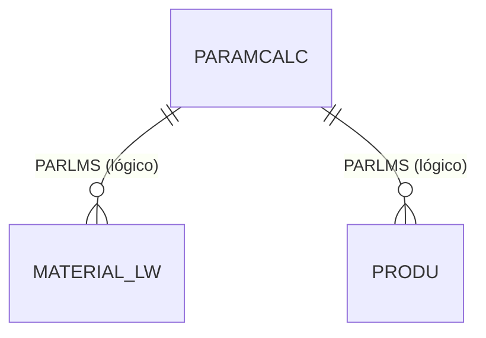

# PARAMCALC - Documentação Completa de Relacionamentos

## 📊 Informações Gerais

- **Nome da Tabela**: PARAMCALC (Parâmetros de Cálculo)
- **Total de Registros**: 54
- **Total de Colunas**: 4
- **Chave Primária**: PARLMS, PARNOME (composite)
- **Chaves Estrangeiras**: 0
- **Índices**: 0
- **Tabelas Dependentes**: 0
- **Banco de Dados**: Firebird

## 📝 Descrição

**PARAMCALC** é uma tabela de configuração que armazena parâmetros específicos para cálculos do sistema, possivelmente relacionados a cálculos de lentes ou produtos ópticos. Com **54 registros**, esta tabela permite configurar valores e fórmulas de cálculo por tipo de lente/material (`PARLMS`) e nome do parâmetro (`PARNOME`).

Esta tabela é essencial para:
- **Cálculos Específicos**: Configurar parâmetros de cálculo por tipo de material/lente
- **Personalização**: Permitir ajustes de fórmulas sem alteração de código
- **Manutenção**: Facilitar atualização de parâmetros de cálculo
- **Flexibilidade**: Suportar diferentes tipos de materiais com cálculos específicos

---

## 🔑 Estrutura de Colunas

| Coluna | Tipo | Descrição |
|--------|------|-----------|
| **PARLMS** 🔑 | VARCHAR(37) | Código do tipo de lente/material (PK) |
| **PARNOME** 🔑 | VARCHAR(37) | Nome do parâmetro (PK) |
| **PARVALOR** | VARCHAR(37) | Valor do parâmetro |
| **PARDESCRICAO** | VARCHAR(37) | Descrição do parâmetro |

---

## 🔗 Relacionamentos - Nível 1 (Diretos)

### Nenhum Relacionamento Formal

Esta tabela não possui chaves estrangeiras formais e não é referenciada por outras tabelas no momento.

---

## 🔗 Relacionamentos - Nível 2 (Indiretos)

### Relacionamentos Lógicos Potenciais

Embora não existam relacionamentos formais, esta tabela pode ser referenciada logicamente por:

#### MATERIAL_LW - Material de Lente (Relacionamento Lógico Potencial)
```
PARAMCALC.PARLMS → MATERIAL_LW.MATCODIGO (N:1)
```

**Descrição:** O campo `PARLMS` pode referenciar logicamente materiais de lente para aplicar parâmetros de cálculo específicos.

---

#### PRODU - Produto (Relacionamento Lógico Potencial)
```
PARAMCALC.PARLMS → PRODU.MATCODIGO (N:1)
```

**Descrição:** O campo `PARLMS` pode referenciar logicamente produtos para aplicar parâmetros de cálculo específicos.

---

## 🗺️ Diagrama de Relacionamentos



---

## 💡 Casos de Uso Práticos

### 1. Consultar Parâmetros de Cálculo por Material

```sql
SELECT 
    PARLMS,
    PARNOME,
    PARVALOR,
    PARDESCRICAO
FROM PARAMCALC
WHERE PARLMS = :parlms
ORDER BY PARNOME;
```

### 2. Consultar Valor Específico de Parâmetro

```sql
SELECT PARVALOR, PARDESCRICAO
FROM PARAMCALC
WHERE PARLMS = :parlms
    AND PARNOME = :parnome;
```

### 3. Listar Todos os Materiais com Parâmetros

```sql
SELECT DISTINCT PARLMS
FROM PARAMCALC
ORDER BY PARLMS;
```

### 4. Relatório de Parâmetros por Material

```sql
SELECT 
    PARLMS,
    COUNT(*) AS QTD_PARAMETROS,
    LIST(PARNOME, ', ') AS PARAMETROS
FROM PARAMCALC
GROUP BY PARLMS
ORDER BY PARLMS;
```

---

## 📈 Estatísticas e Insights

### Volume de Dados
- **Total de Parâmetros**: 54 registros
- **Uso**: Tabela de configuração de cálculos
- **Frequência de Alteração**: Baixa (tabela de configuração)

---

## ⚡ Performance e Otimização

Como tabela pequena (54 registros), índices não são necessários. A tabela inteira pode ser carregada em memória.

---

## 🔒 Integridade de Dados

### Validações Importantes

1. **Chave Composta**: `PARLMS` + `PARNOME` deve ser única
2. **Campos Obrigatórios**: `PARLMS` e `PARNOME` devem estar preenchidos
3. **Consistência**: Valores devem ser válidos conforme o tipo esperado do parâmetro

---

## 📚 Integração com Aplicação (Laravel)

### Model PARAMCALC

```php
<?php

namespace App\Models;

use Illuminate\Database\Eloquent\Model;

final class PARAMCALC extends Model
{
    protected $table = 'PARAMCALC';
    
    protected $primaryKey = ['PARLMS', 'PARNOME'];
    
    public $incrementing = false;
    
    protected $fillable = [
        'PARLMS',
        'PARNOME',
        'PARVALOR',
        'PARDESCRICAO',
    ];
    
    /**
     * Obter valor de parâmetro por material
     */
    public static function getValor(string $parlms, string $parnome, ?string $default = null): ?string
    {
        $param = static::where('PARLMS', $parlms)
            ->where('PARNOME', $parnome)
            ->first();
        
        return $param ? $param->PARVALOR : $default;
    }
    
    /**
     * Scope para buscar por material
     */
    public function scopePorMaterial($query, $parlms)
    {
        return $query->where('PARLMS', $parlms);
    }
    
    /**
     * Scope para buscar por nome
     */
    public function scopePorNome($query, $parnome)
    {
        return $query->where('PARNOME', $parnome);
    }
}
```

---

## ✅ Boas Práticas

### Design
1. **Nomes descritivos** e consistentes
2. **Documentar significado** de cada parâmetro
3. **Manter consistência** entre material e parâmetros

### Performance
1. **Cachear valores** em memória devido ao pequeno volume
2. **Evitar consultas repetitivas** para o mesmo parâmetro

### Integridade
1. **Validar valores** antes de inserir/atualizar
2. **Manter consistência** entre nome e descrição
3. **Validar existência** de material quando referenciado logicamente

### Manutenção
1. **Documentar significado** de cada parâmetro
2. **Revisar periodicamente** parâmetros não utilizados
3. **Manter backup** de configurações importantes

---

**Documentação gerada em**: 2025-01-27

**Banco de dados**: Firebird

