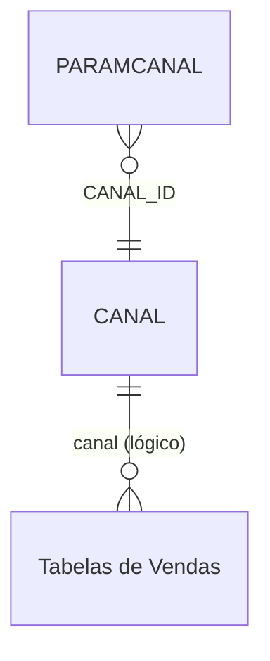

# PARAMCANAL - Documentação Completa de Relacionamentos

## 📊 Informações Gerais

- **Nome da Tabela**: PARAMCANAL (Parâmetros por Canal)
- **Total de Registros**: 1.004
- **Total de Colunas**: 4
- **Chave Primária**: ID
- **Chaves Estrangeiras**: 1
- **Índices**: 0
- **Tabelas Dependentes**: 0
- **Banco de Dados**: Firebird

## 📝 Descrição

**PARAMCANAL** é uma tabela de configuração que armazena parâmetros específicos por canal de venda ou distribuição. Com **1.004 registros**, esta tabela permite configurar valores e comportamentos específicos para cada canal, permitindo personalização do sistema conforme o canal utilizado.

Esta tabela é essencial para:
- **Configuração por Canal**: Definir parâmetros específicos para cada canal de venda
- **Personalização**: Permitir ajustes de comportamento por canal sem alteração de código
- **Manutenção**: Facilitar atualização de parâmetros por canal
- **Flexibilidade**: Suportar diferentes canais com configurações específicas

---

## 🔑 Estrutura de Colunas

| Coluna | Tipo | Descrição |
|--------|------|-----------|
| **ID** 🔑 | INT | Código único do registro (PK) |
| **CANAL_ID** 🔗 | INT | Código do canal (FK → CANAL) |
| **PCNOME** | VARCHAR(37) | Nome do parâmetro |
| **PCVALOR** | VARCHAR(37) | Valor do parâmetro |

---

## 🔗 Relacionamentos - Nível 1 (Diretos)

### CANAL - Canal de Venda (FK Obrigatória)
**Volume:** 8 registros

**Relacionamento:**
```
PARAMCANAL.CANAL_ID → CANAL.ID (N:1)
Constraint: CANAL_PARAMCANAL
```

**Descrição:** Cada parâmetro está vinculado a um canal específico.

**Proporção:** ~125 parâmetros por canal em média (1.004 / 8)

---

## 🔗 Relacionamentos - Nível 2 (Indiretos)

### Através de CANAL

#### Tabelas de Vendas (Relacionamento Lógico Potencial)
```
PARAMCANAL → CANAL → Tabelas de Vendas
```
**Descrição:** Permite identificar vendas relacionadas a cada canal através dos parâmetros configurados.

---

## 🗺️ Diagrama de Relacionamentos



---

## 💡 Casos de Uso Práticos

### 1. Consultar Parâmetros de um Canal

```sql
SELECT 
    pc.ID,
    pc.PCNOME,
    pc.PCVALOR,
    c.DESCRICAO AS CANAL
FROM PARAMCANAL pc
INNER JOIN CANAL c ON pc.CANAL_ID = c.ID
WHERE pc.CANAL_ID = :canal_id
ORDER BY pc.PCNOME;
```

### 2. Consultar Valor Específico de Parâmetro por Canal

```sql
SELECT PCVALOR
FROM PARAMCANAL
WHERE CANAL_ID = :canal_id
    AND PCNOME = :pcnome;
```

### 3. Relatório de Parâmetros por Canal

```sql
SELECT 
    c.ID AS CANAL_ID,
    c.DESCRICAO AS CANAL,
    COUNT(pc.ID) AS QTD_PARAMETROS,
    LIST(pc.PCNOME, ', ') AS PARAMETROS
FROM CANAL c
LEFT JOIN PARAMCANAL pc ON c.ID = pc.CANAL_ID
GROUP BY c.ID, c.DESCRICAO
ORDER BY c.DESCRICAO;
```

---

## 📈 Estatísticas e Insights

### Volume de Dados
- **Total de Parâmetros**: 1.004 registros
- **Média**: ~125 parâmetros por canal
- **Distribuição**: Permite análise de configurações por canal

---

## ⚡ Performance e Otimização

### Índices Recomendados

```sql
-- Índice para consultas por canal
CREATE INDEX IDX_PARAMCANAL_CANAL ON PARAMCANAL (CANAL_ID);

-- Índice para consultas por nome
CREATE INDEX IDX_PARAMCANAL_NOME ON PARAMCANAL (PCNOME);
```

---

## 🔒 Integridade de Dados

### Validações Importantes

1. **ID Único**: `ID` deve ser único
2. **Canal**: `CANAL_ID` deve existir em `CANAL`
3. **Consistência**: Valores devem ser válidos conforme o tipo esperado do parâmetro

---

## 📚 Integração com Aplicação (Laravel)

### Model PARAMCANAL

```php
<?php

namespace App\Models;

use Illuminate\Database\Eloquent\Model;

final class PARAMCANAL extends Model
{
    protected $table = 'PARAMCANAL';
    
    protected $primaryKey = 'ID';
    
    protected $fillable = [
        'ID',
        'CANAL_ID',
        'PCNOME',
        'PCVALOR',
    ];
    
    /**
     * Relacionamento com CANAL
     */
    public function canal()
    {
        return $this->belongsTo(CANAL::class, 'CANAL_ID', 'ID');
    }
    
    /**
     * Obter valor de parâmetro por canal
     */
    public static function getValor(int $canalId, string $pcnome, ?string $default = null): ?string
    {
        $param = static::where('CANAL_ID', $canalId)
            ->where('PCNOME', $pcnome)
            ->first();
        
        return $param ? $param->PCVALOR : $default;
    }
    
    /**
     * Scope para buscar por canal
     */
    public function scopePorCanal($query, $canalId)
    {
        return $query->where('CANAL_ID', $canalId);
    }
}
```

---

## ✅ Boas Práticas

### Design
1. **Nomes descritivos** e consistentes
2. **Documentar significado** de cada parâmetro
3. **Manter consistência** entre canal e parâmetros

### Performance
1. **Usar índices** nas consultas frequentes
2. **Cachear valores** por canal quando possível

### Integridade
1. **Validar existência** de canal antes de inserir
2. **Validar valores** antes de inserir/atualizar

---

**Documentação gerada em**: 2025-01-27

**Banco de dados**: Firebird

