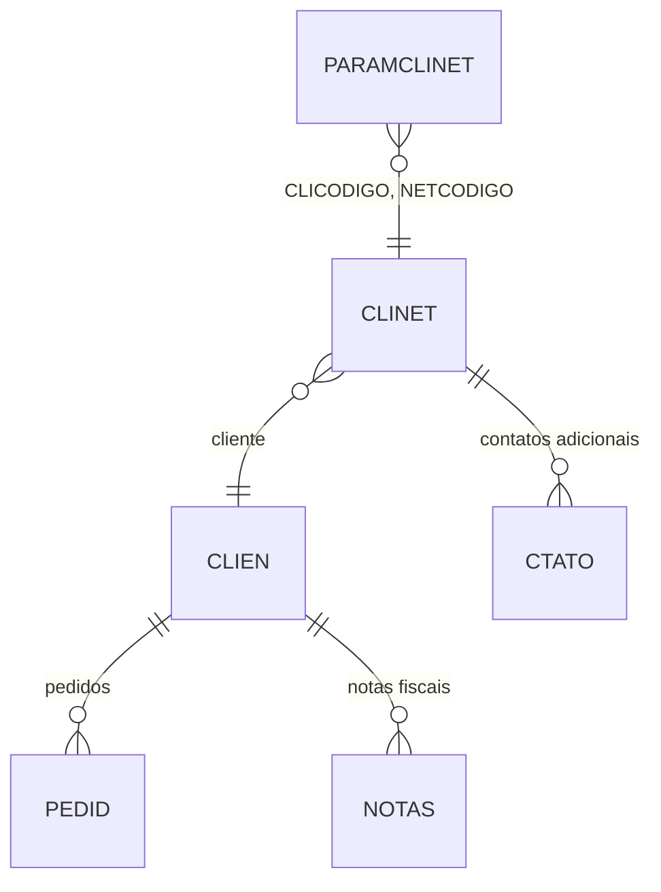

# PARAMCLINET - Documentação Completa de Relacionamentos

## 📊 Informações Gerais

- **Nome da Tabela**: PARAMCLINET (Parâmetros de Contato de Cliente)
- **Total de Registros**: 15.663
- **Total de Colunas**: 4
- **Chave Primária**: CLICODIGO, NETCODIGO, PARNOME (composite)
- **Chaves Estrangeiras**: 2
- **Índices**: 0
- **Tabelas Dependentes**: 0
- **Banco de Dados**: Firebird

## 📝 Descrição

**PARAMCLINET** é uma tabela de configuração que armazena parâmetros específicos por contato de cliente, utilizando um padrão chave-valor (EAV - Entity-Attribute-Value). Com **15.663 registros**, esta tabela permite configurar valores personalizados para cada contato de cliente, permitindo extensibilidade sem alteração de estrutura.

Esta tabela é essencial para:
- **Personalização por Contato**: Definir parâmetros específicos para cada contato de cliente
- **Extensibilidade**: Adicionar novos parâmetros sem alterar estrutura de tabelas
- **Configuração Flexível**: Permitir ajustes de comportamento por contato sem alteração de código
- **Manutenção**: Facilitar atualização de parâmetros por contato

---

## 🔑 Estrutura de Colunas

| Coluna | Tipo | Descrição |
|--------|------|-----------|
| **CLICODIGO** 🔑 🔗 | INT | Código do cliente (PK, FK → CLINET) |
| **NETCODIGO** 🔑 🔗 | INT | Código do contato (PK, FK → CLINET) |
| **PARNOME** 🔑 | VARCHAR(37) | Nome do parâmetro (PK) |
| **PARVALOR** | VARCHAR(37) | Valor do parâmetro |

---

## 🔗 Relacionamentos - Nível 1 (Diretos)

### CLINET - Contato de Cliente (FK Obrigatória - 2 FKs)
**Volume:** 2.868 registros

**Relacionamento:**
```
PARAMCLINET.CLICODIGO → CLINET.CLICODIGO (N:1)
PARAMCLINET.NETCODIGO → CLINET.NETCODIGO (N:1)
Constraint: FK_PARAMCLINET_CLINET
```

**Descrição:** Cada parâmetro está vinculado a um contato específico de um cliente.

**Proporção:** ~5,5 parâmetros por contato em média (15.663 / 2.868)

---

## 🔗 Relacionamentos - Nível 2 (Indiretos)

### Através de CLINET

#### CLIEN - Cliente
```
PARAMCLINET → CLINET → CLIEN
```
**Descrição:** Permite identificar o cliente através do contato.

---

#### CTATO - Contatos Adicionais
```
PARAMCLINET → CLINET → CTATO
```
**Descrição:** Permite identificar contatos adicionais relacionados ao mesmo contato base.

---

### Através de CLINET → CLIEN

#### PEDID - Pedidos
```
PARAMCLINET → CLINET → CLIEN → PEDID
```
**Descrição:** Permite identificar pedidos relacionados ao cliente através dos parâmetros de contato.

---

#### NOTAS - Notas Fiscais
```
PARAMCLINET → CLINET → CLIEN → NOTAS
```
**Descrição:** Permite identificar notas fiscais relacionadas ao cliente através dos parâmetros de contato.

---

## 🗺️ Diagrama de Relacionamentos



---

## 💡 Casos de Uso Práticos

### 1. Consultar Parâmetros de um Contato

```sql
SELECT 
    pcn.CLICODIGO,
    pcn.NETCODIGO,
    pcn.PARNOME,
    pcn.PARVALOR,
    cn.NETTIPO AS TIPO_CONTATO,
    cn.NETENDERECO AS ENDERECO_CONTATO,
    cli.CLINOME AS CLIENTE
FROM PARAMCLINET pcn
INNER JOIN CLINET cn ON pcn.CLICODIGO = cn.CLICODIGO 
    AND pcn.NETCODIGO = cn.NETCODIGO
INNER JOIN CLIEN cli ON cn.CLICODIGO = cli.CLICODIGO
WHERE pcn.CLICODIGO = :clicodigo
    AND pcn.NETCODIGO = :netcodigo
ORDER BY pcn.PARNOME;
```

### 2. Consultar Valor Específico de Parâmetro

```sql
SELECT PARVALOR
FROM PARAMCLINET
WHERE CLICODIGO = :clicodigo
    AND NETCODIGO = :netcodigo
    AND PARNOME = :parnome;
```

### 3. Relatório de Parâmetros por Cliente

```sql
SELECT 
    cli.CLICODIGO,
    cli.CLINOME AS CLIENTE,
    COUNT(DISTINCT pcn.NETCODIGO) AS QTD_CONTATOS_COM_PARAMETROS,
    COUNT(pcn.PARNOME) AS QTD_PARAMETROS_TOTAL
FROM CLIEN cli
LEFT JOIN PARAMCLINET pcn ON cli.CLICODIGO = pcn.CLICODIGO
GROUP BY cli.CLICODIGO, cli.CLINOME
HAVING COUNT(pcn.PARNOME) > 0
ORDER BY QTD_PARAMETROS_TOTAL DESC;
```

### 4. Parâmetros Mais Utilizados

```sql
SELECT 
    PARNOME,
    COUNT(*) AS QTD_USOS,
    COUNT(DISTINCT CLICODIGO) AS QTD_CLIENTES_DISTINTOS
FROM PARAMCLINET
GROUP BY PARNOME
ORDER BY QTD_USOS DESC;
```

---

## 📈 Estatísticas e Insights

### Volume de Dados
- **Total de Parâmetros**: 15.663 registros
- **Média**: ~5,5 parâmetros por contato
- **Distribuição**: Permite análise de configurações por contato

### Padrão EAV
- **Estrutura Flexível**: Permite adicionar novos parâmetros sem alterar estrutura
- **Extensibilidade**: Facilita evolução do sistema
- **Consulta**: Requer pivot ou múltiplas consultas para obter todos os parâmetros de um contato

---

## ⚡ Performance e Otimização

### Índices Recomendados

```sql
-- Índice para consultas por contato
CREATE INDEX IDX_PARAMCLINET_CONTATO ON PARAMCLINET (CLICODIGO, NETCODIGO);

-- Índice para consultas por nome de parâmetro
CREATE INDEX IDX_PARAMCLINET_NOME ON PARAMCLINET (PARNOME);
```

### Otimizações Recomendadas

1. **Cachear parâmetros** por contato quando possível
2. **Usar pivot** para transformar linhas em colunas quando necessário
3. **Evitar consultas repetitivas** para o mesmo contato

---

## 🔒 Integridade de Dados

### Validações Importantes

1. **Chave Composta**: `CLICODIGO` + `NETCODIGO` + `PARNOME` deve ser única
2. **Contato**: `CLICODIGO` + `NETCODIGO` deve existir em `CLINET`
3. **Consistência**: Valores devem ser válidos conforme o tipo esperado do parâmetro

---

## 📚 Integração com Aplicação (Laravel)

### Model PARAMCLINET

```php
<?php

namespace App\Models;

use Illuminate\Database\Eloquent\Model;

final class PARAMCLINET extends Model
{
    protected $table = 'PARAMCLINET';
    
    protected $primaryKey = ['CLICODIGO', 'NETCODIGO', 'PARNOME'];
    
    public $incrementing = false;
    
    protected $fillable = [
        'CLICODIGO',
        'NETCODIGO',
        'PARNOME',
        'PARVALOR',
    ];
    
    /**
     * Relacionamento com CLINET
     */
    public function contato()
    {
        return $this->belongsTo(CLINET::class, ['CLICODIGO', 'NETCODIGO'], ['CLICODIGO', 'NETCODIGO']);
    }
    
    /**
     * Obter valor de parâmetro por contato
     */
    public static function getValor(int $clicodigo, int $netcodigo, string $parnome, ?string $default = null): ?string
    {
        $param = static::where('CLICODIGO', $clicodigo)
            ->where('NETCODIGO', $netcodigo)
            ->where('PARNOME', $parnome)
            ->first();
        
        return $param ? $param->PARVALOR : $default;
    }
    
    /**
     * Obter todos os parâmetros de um contato como array
     */
    public static function getParametrosPorContato(int $clicodigo, int $netcodigo): array
    {
        return static::where('CLICODIGO', $clicodigo)
            ->where('NETCODIGO', $netcodigo)
            ->pluck('PARVALOR', 'PARNOME')
            ->toArray();
    }
    
    /**
     * Scope para buscar por contato
     */
    public function scopePorContato($query, $clicodigo, $netcodigo)
    {
        return $query->where('CLICODIGO', $clicodigo)
            ->where('NETCODIGO', $netcodigo);
    }
}
```

---

## ✅ Boas Práticas

### Design
1. **Manter unicidade** da chave composta
2. **Documentar significado** de cada nome de parâmetro
3. **Usar nomes consistentes** para parâmetros similares

### Performance
1. **Usar índices** nas consultas frequentes
2. **Cachear parâmetros** por contato quando possível
3. **Considerar pivot** para transformar em estrutura mais amigável

### Integridade
1. **Validar existência** de contato antes de inserir
2. **Validar valores** antes de inserir/atualizar
3. **Garantir consistência** entre nome e valor do parâmetro

### Manutenção
1. **Documentar significado** de cada nome de parâmetro
2. **Revisar periodicamente** parâmetros não utilizados
3. **Manter padrão** de nomenclatura consistente

---

**Documentação gerada em**: 2025-01-27

**Banco de dados**: Firebird

