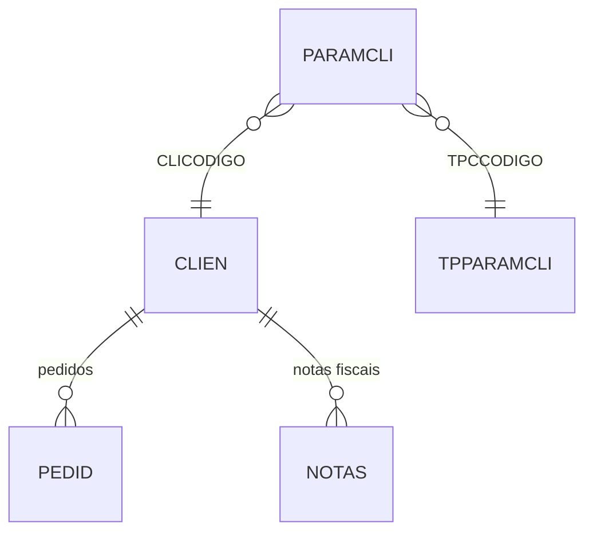

# PARAMCLI - Documentação Completa de Relacionamentos

## 📊 Informações Gerais

- **Nome da Tabela**: PARAMCLI (Parâmetros por Cliente)
- **Total de Registros**: 20
- **Total de Colunas**: 3
- **Chave Primária**: CLICODIGO, TPCCODIGO (composite)
- **Chaves Estrangeiras**: 2
- **Índices**: 0
- **Tabelas Dependentes**: 0
- **Banco de Dados**: Firebird

## 📝 Descrição

**PARAMCLI** é uma tabela de configuração que armazena parâmetros específicos por cliente e tipo de parâmetro. Com apenas **20 registros**, esta tabela permite configurar valores personalizados para clientes específicos, permitindo customização do comportamento do sistema por cliente.

Esta tabela é essencial para:
- **Personalização por Cliente**: Definir parâmetros específicos para cada cliente
- **Configuração Flexível**: Permitir ajustes de comportamento por cliente sem alteração de código
- **Manutenção**: Facilitar atualização de parâmetros por cliente
- **Flexibilidade**: Suportar diferentes clientes com configurações específicas

---

## 🔑 Estrutura de Colunas

| Coluna | Tipo | Descrição |
|--------|------|-----------|
| **CLICODIGO** 🔑 🔗 | INT | Código do cliente (PK, FK → CLIEN) |
| **TPCCODIGO** 🔑 🔗 | INT | Código do tipo de parâmetro (PK, FK → TPPARAMCLI) |
| **PRCVALOR** | VARCHAR(37) | Valor do parâmetro |

---

## 🔗 Relacionamentos - Nível 1 (Diretos)

### CLIEN - Cliente (FK Obrigatória)
**Volume:** 9.251 registros

**Relacionamento:**
```
PARAMCLI.CLICODIGO → CLIEN.CLICODIGO (N:1)
Constraint: CLIEN_PARAMCLI
```

**Descrição:** Cada parâmetro está vinculado a um cliente específico.

**Proporção:** ~0,002 parâmetros por cliente em média (20 / 9.251)

---

### TPPARAMCLI - Tipo de Parâmetro de Cliente (FK Obrigatória)
**Volume:** 39 registros

**Relacionamento:**
```
PARAMCLI.TPCCODIGO → TPPARAMCLI.TPCCODIGO (N:1)
Constraint: TPPARAMCLI_PARAMCLI
```

**Descrição:** Define o tipo de parâmetro configurado para o cliente.

**Valores Típicos:**
- Parâmetros de desconto
- Parâmetros de prazo
- Parâmetros de forma de pagamento
- Outros parâmetros comerciais específicos

---

## 🔗 Relacionamentos - Nível 2 (Indiretos)

### Através de CLIEN

#### PEDID - Pedidos
```
PARAMCLI → CLIEN → PEDID
```
**Descrição:** Permite identificar pedidos relacionados ao cliente com parâmetros configurados.

---

#### NOTAS - Notas Fiscais
```
PARAMCLI → CLIEN → NOTAS
```
**Descrição:** Permite identificar notas fiscais relacionadas ao cliente com parâmetros configurados.

---

## 🗺️ Diagrama de Relacionamentos



---

## 💡 Casos de Uso Práticos

### 1. Consultar Parâmetros de um Cliente

```sql
SELECT 
    pc.CLICODIGO,
    pc.TPCCODIGO,
    pc.PRCVALOR,
    cli.CLINOME AS CLIENTE,
    tpc.TPCDESCRICAO AS TIPO_PARAMETRO
FROM PARAMCLI pc
INNER JOIN CLIEN cli ON pc.CLICODIGO = cli.CLICODIGO
INNER JOIN TPPARAMCLI tpc ON pc.TPCCODIGO = tpc.TPCCODIGO
WHERE pc.CLICODIGO = :clicodigo
ORDER BY tpc.TPCDESCRICAO;
```

### 2. Consultar Valor Específico de Parâmetro por Cliente

```sql
SELECT PRCVALOR
FROM PARAMCLI
WHERE CLICODIGO = :clicodigo
    AND TPCCODIGO = :tpccodigo;
```

### 3. Relatório de Parâmetros por Tipo

```sql
SELECT 
    tpc.TPCCODIGO,
    tpc.TPCDESCRICAO,
    COUNT(DISTINCT pc.CLICODIGO) AS QTD_CLIENTES,
    COUNT(pc.CLICODIGO) AS QTD_PARAMETROS
FROM TPPARAMCLI tpc
LEFT JOIN PARAMCLI pc ON tpc.TPCCODIGO = pc.TPCCODIGO
GROUP BY tpc.TPCCODIGO, tpc.TPCDESCRICAO
ORDER BY QTD_CLIENTES DESC;
```

---

## 📈 Estatísticas e Insights

### Volume de Dados
- **Total de Parâmetros**: 20 registros
- **Uso**: Tabela de configuração personalizada por cliente
- **Frequência de Alteração**: Baixa (tabela de configuração)

---

## ⚡ Performance e Otimização

Como tabela pequena (20 registros), índices não são necessários. A tabela inteira pode ser carregada em memória.

---

## 🔒 Integridade de Dados

### Validações Importantes

1. **Chave Composta**: `CLICODIGO` + `TPCCODIGO` deve ser única
2. **Cliente**: `CLICODIGO` deve existir em `CLIEN`
3. **Tipo de Parâmetro**: `TPCCODIGO` deve existir em `TPPARAMCLI`
4. **Consistência**: Valores devem ser válidos conforme o tipo esperado do parâmetro

---

## 📚 Integração com Aplicação (Laravel)

### Model PARAMCLI

```php
<?php

namespace App\Models;

use Illuminate\Database\Eloquent\Model;

final class PARAMCLI extends Model
{
    protected $table = 'PARAMCLI';
    
    protected $primaryKey = ['CLICODIGO', 'TPCCODIGO'];
    
    public $incrementing = false;
    
    protected $fillable = [
        'CLICODIGO',
        'TPCCODIGO',
        'PRCVALOR',
    ];
    
    /**
     * Relacionamento com CLIEN
     */
    public function cliente()
    {
        return $this->belongsTo(CLIEN::class, 'CLICODIGO', 'CLICODIGO');
    }
    
    /**
     * Relacionamento com TPPARAMCLI
     */
    public function tipoParametro()
    {
        return $this->belongsTo(TPPARAMCLI::class, 'TPCCODIGO', 'TPCCODIGO');
    }
    
    /**
     * Obter valor de parâmetro por cliente e tipo
     */
    public static function getValor(int $clicodigo, int $tpccodigo, ?string $default = null): ?string
    {
        $param = static::where('CLICODIGO', $clicodigo)
            ->where('TPCCODIGO', $tpccodigo)
            ->first();
        
        return $param ? $param->PRCVALOR : $default;
    }
}
```

---

## ✅ Boas Práticas

### Design
1. **Manter unicidade** da chave composta
2. **Documentar significado** de cada tipo de parâmetro
3. **Validar valores** antes de inserir/atualizar

### Performance
1. **Cachear valores** em memória devido ao pequeno volume
2. **Evitar consultas repetitivas** para o mesmo parâmetro

### Integridade
1. **Validar existência** de cliente e tipo de parâmetro antes de inserir
2. **Garantir consistência** entre valor e tipo de parâmetro

---

**Documentação gerada em**: 2025-01-27

**Banco de dados**: Firebird

