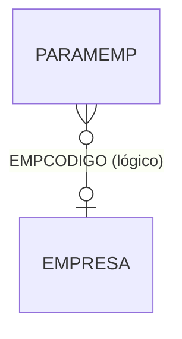

# PARAMEMP - Documentação Completa de Relacionamentos

## 📊 Informações Gerais

- **Nome da Tabela**: PARAMEMP (Parâmetros por Empresa)
- **Total de Registros**: 6.746
- **Total de Colunas**: 5
- **Chave Primária**: PARNOME, EMPCODIGO (composite)
- **Chaves Estrangeiras**: 0
- **Índices**: 1
- **Tabelas Dependentes**: 0
- **Banco de Dados**: Firebird

## 📝 Descrição

**PARAMEMP** é uma tabela de configuração que armazena parâmetros específicos por empresa/filial. Com **6.746 registros**, esta tabela permite configurar valores e comportamentos específicos para cada empresa, permitindo personalização do sistema conforme a empresa utilizada.

Esta tabela é essencial para:
- **Configuração por Empresa**: Definir parâmetros específicos para cada empresa/filial
- **Multi-empresa**: Suportar diferentes configurações em ambiente multi-empresa
- **Personalização**: Permitir ajustes de comportamento por empresa sem alteração de código
- **Manutenção**: Facilitar atualização de parâmetros por empresa

---

## 🔑 Estrutura de Colunas

| Coluna | Tipo | Descrição |
|--------|------|-----------|
| **PARNOME** 🔑 | VARCHAR(37) | Nome do parâmetro (PK) |
| **EMPCODIGO** 🔑 | INT | Código da empresa (PK) |
| **PARVALOR** | VARCHAR(37) | Valor do parâmetro (INDEXADO) |
| **PARLOCAL** | VARCHAR(37) | Localização/escopo do parâmetro |
| **PARDESCRICAO** | VARCHAR(37) | Descrição do parâmetro |

---

## 🔗 Relacionamentos - Nível 1 (Diretos)

### Nenhum Relacionamento Formal

Esta tabela não possui chaves estrangeiras formais, mas pode referenciar logicamente `EMPRESA` através de `EMPCODIGO`.

---

## 🔗 Relacionamentos - Nível 2 (Indiretos)

### Relacionamentos Lógicos Potenciais

#### EMPRESA - Empresa (Relacionamento Lógico)
```
PARAMEMP.EMPCODIGO → EMPRESA.EMPCODIGO (N:1)
```

**Descrição:** O campo `EMPCODIGO` referencia logicamente empresas para aplicar parâmetros específicos.

---

## 🗺️ Diagrama de Relacionamentos



---

## 💡 Casos de Uso Práticos

### 1. Consultar Parâmetros de uma Empresa

```sql
SELECT 
    PARNOME,
    PARVALOR,
    PARLOCAL,
    PARDESCRICAO
FROM PARAMEMP
WHERE EMPCODIGO = :empcodigo
ORDER BY PARLOCAL, PARNOME;
```

### 2. Consultar Valor Específico de Parâmetro por Empresa

```sql
SELECT PARVALOR, PARDESCRICAO
FROM PARAMEMP
WHERE EMPCODIGO = :empcodigo
    AND PARNOME = :parnome;
```

### 3. Comparar Parâmetros entre Empresas

```sql
SELECT 
    PARNOME,
    MAX(CASE WHEN EMPCODIGO = :emp1 THEN PARVALOR END) AS EMPRESA_1,
    MAX(CASE WHEN EMPCODIGO = :emp2 THEN PARVALOR END) AS EMPRESA_2
FROM PARAMEMP
WHERE EMPCODIGO IN (:emp1, :emp2)
GROUP BY PARNOME
ORDER BY PARNOME;
```

### 4. Relatório de Parâmetros por Empresa

```sql
SELECT 
    emp.EMPCODIGO,
    emp.EMPNOME AS EMPRESA,
    COUNT(pem.PARNOME) AS QTD_PARAMETROS,
    COUNT(DISTINCT pem.PARLOCAL) AS QTD_LOCALIZACOES
FROM EMPRESA emp
LEFT JOIN PARAMEMP pem ON emp.EMPCODIGO = pem.EMPCODIGO
GROUP BY emp.EMPCODIGO, emp.EMPNOME
ORDER BY QTD_PARAMETROS DESC;
```

---

## 📈 Estatísticas e Insights

### Volume de Dados
- **Total de Parâmetros**: 6.746 registros
- **Média**: ~1.124 parâmetros por empresa (6.746 / 6 empresas)
- **Distribuição**: Permite análise de configurações por empresa

---

## ⚡ Performance e Otimização

### Índices Existentes

| Nome | Colunas |
|------|---------|
| PARAMEMP_IDX1 | PARVALOR |

### Índices Recomendados Adicionais

```sql
-- Índice para consultas por empresa
CREATE INDEX IDX_PARAMEMP_EMPRESA ON PARAMEMP (EMPCODIGO);

-- Índice composto para consultas por empresa e nome
CREATE INDEX IDX_PARAMEMP_EMP_NOME ON PARAMEMP (EMPCODIGO, PARNOME);

-- Índice para consultas por localização
CREATE INDEX IDX_PARAMEMP_LOCAL ON PARAMEMP (PARLOCAL);
```

---

## 🔒 Integridade de Dados

### Validações Importantes

1. **Chave Composta**: `PARNOME` + `EMPCODIGO` deve ser única
2. **Empresa**: `EMPCODIGO` deve existir em `EMPRESA` quando referenciado logicamente
3. **Consistência**: Valores devem ser válidos conforme o tipo esperado do parâmetro

---

## 📚 Integração com Aplicação (Laravel)

### Model PARAMEMP

```php
<?php

namespace App\Models;

use Illuminate\Database\Eloquent\Model;

final class PARAMEMP extends Model
{
    protected $table = 'PARAMEMP';
    
    protected $primaryKey = ['PARNOME', 'EMPCODIGO'];
    
    public $incrementing = false;
    
    protected $fillable = [
        'PARNOME',
        'EMPCODIGO',
        'PARVALOR',
        'PARLOCAL',
        'PARDESCRICAO',
    ];
    
    /**
     * Relacionamento lógico com EMPRESA
     */
    public function empresa()
    {
        return $this->belongsTo(EMPRESA::class, 'EMPCODIGO', 'EMPCODIGO');
    }
    
    /**
     * Obter valor de parâmetro por empresa
     */
    public static function getValor(int $empcodigo, string $parnome, ?string $default = null): ?string
    {
        $param = static::where('EMPCODIGO', $empcodigo)
            ->where('PARNOME', $parnome)
            ->first();
        
        return $param ? $param->PARVALOR : $default;
    }
    
    /**
     * Scope para buscar por empresa
     */
    public function scopePorEmpresa($query, $empcodigo)
    {
        return $query->where('EMPCODIGO', $empcodigo);
    }
    
    /**
     * Scope para buscar por localização
     */
    public function scopePorLocal($query, $local)
    {
        return $query->where('PARLOCAL', $local);
    }
}
```

---

## ✅ Boas Práticas

### Design
1. **Manter unicidade** da chave composta
2. **Documentar significado** de cada parâmetro
3. **Usar localização** para agrupar parâmetros relacionados

### Performance
1. **Usar índices** nas consultas frequentes
2. **Cachear valores** por empresa quando possível

### Integridade
1. **Validar existência** de empresa quando referenciada logicamente
2. **Validar valores** antes de inserir/atualizar

---

**Documentação gerada em**: 2025-01-27

**Banco de dados**: Firebird

