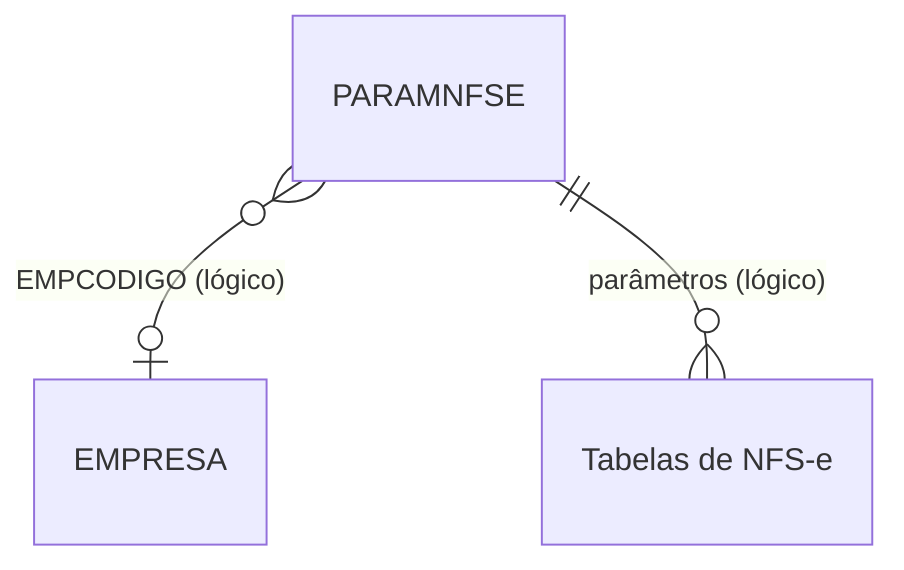

# PARAMNFSE - Documentação Completa de Relacionamentos

## 📊 Informações Gerais

- **Nome da Tabela**: PARAMNFSE (Parâmetros de NFS-e)
- **Total de Registros**: 212
- **Total de Colunas**: 7
- **Chave Primária**: EMPCODIGO, VERSAO, PARNOME (composite)
- **Chaves Estrangeiras**: 0
- **Índices**: 0
- **Tabelas Dependentes**: 0
- **Banco de Dados**: Firebird

## 📝 Descrição

**PARAMNFSE** é uma tabela de configuração que armazena parâmetros específicos para Nota Fiscal de Serviço Eletrônica (NFS-e) por empresa e versão. Com **212 registros**, esta tabela permite configurar valores e comportamentos específicos para cada versão de NFS-e por empresa, permitindo suporte a diferentes versões e configurações específicas.

Esta tabela é essencial para:
- **Configuração de NFS-e**: Definir parâmetros específicos para cada versão de NFS-e
- **Multi-versão**: Suportar diferentes versões de NFS-e simultaneamente
- **Personalização por Empresa**: Permitir configurações específicas por empresa
- **Manutenção**: Facilitar atualização de parâmetros conforme novas versões são lançadas

---

## 🔑 Estrutura de Colunas

| Coluna | Tipo | Descrição |
|--------|------|-----------|
| **EMPCODIGO** 🔑 | INT | Código da empresa (PK) |
| **VERSAO** 🔑 | VARCHAR(37) | Versão da NFS-e (PK) |
| **PARNOME** 🔑 | VARCHAR(37) | Nome do parâmetro (PK) |
| **PARVALOR** | VARCHAR(37) | Valor do parâmetro |
| **PARESPECIFICO** | VARCHAR(14) | Flag indicando se é específico |
| **PARDESCRICAO** | VARCHAR(37) | Descrição do parâmetro |
| **PARAJUDA** | VARCHAR(37) | Texto de ajuda/documentação |

---

## 🔗 Relacionamentos - Nível 1 (Diretos)

### Nenhum Relacionamento Formal

Esta tabela não possui chaves estrangeiras formais, mas pode referenciar logicamente `EMPRESA` através de `EMPCODIGO`.

---

## 🔗 Relacionamentos - Nível 2 (Indiretos)

### Relacionamentos Lógicos Potenciais

#### EMPRESA - Empresa (Relacionamento Lógico)
```
PARAMNFSE.EMPCODIGO → EMPRESA.EMPCODIGO (N:1)
```

**Descrição:** O campo `EMPCODIGO` referencia logicamente empresas para aplicar parâmetros específicos de NFS-e.

---

#### Tabelas de NFS-e (Relacionamento Lógico Potencial)
```
PARAMNFSE.EMPCODIGO, PARAMNFSE.VERSAO → Tabelas de NFS-e
```

**Descrição:** Parâmetros podem ser utilizados por tabelas relacionadas a NFS-e para aplicar configurações específicas.

---

## 🗺️ Diagrama de Relacionamentos



---

## 💡 Casos de Uso Práticos

### 1. Consultar Parâmetros de NFS-e por Empresa e Versão

```sql
SELECT 
    PARNOME,
    PARVALOR,
    PARESPECIFICO,
    PARDESCRICAO,
    PARAJUDA
FROM PARAMNFSE
WHERE EMPCODIGO = :empcodigo
    AND VERSAO = :versao
ORDER BY PARNOME;
```

### 2. Consultar Valor Específico de Parâmetro

```sql
SELECT PARVALOR, PARDESCRICAO, PARAJUDA
FROM PARAMNFSE
WHERE EMPCODIGO = :empcodigo
    AND VERSAO = :versao
    AND PARNOME = :parnome;
```

### 3. Comparar Parâmetros entre Versões

```sql
SELECT 
    PARNOME,
    MAX(CASE WHEN VERSAO = :versao1 THEN PARVALOR END) AS VERSAO_1,
    MAX(CASE WHEN VERSAO = :versao2 THEN PARVALOR END) AS VERSAO_2
FROM PARAMNFSE
WHERE EMPCODIGO = :empcodigo
    AND VERSAO IN (:versao1, :versao2)
GROUP BY PARNOME
ORDER BY PARNOME;
```

### 4. Relatório de Parâmetros por Versão

```sql
SELECT 
    VERSAO,
    COUNT(*) AS QTD_PARAMETROS,
    COUNT(CASE WHEN PARESPECIFICO = 'S' THEN 1 END) AS QTD_ESPECIFICOS,
    LIST(PARNOME, ', ') AS PARAMETROS
FROM PARAMNFSE
WHERE EMPCODIGO = :empcodigo
GROUP BY VERSAO
ORDER BY VERSAO DESC;
```

---

## 📈 Estatísticas e Insights

### Volume de Dados
- **Total de Parâmetros**: 212 registros
- **Distribuição**: Permite análise de configurações por empresa e versão
- **Versões**: Suporta múltiplas versões de NFS-e simultaneamente

---

## ⚡ Performance e Otimização

### Índices Recomendados

```sql
-- Índice para consultas por empresa e versão
CREATE INDEX IDX_PARAMNFSE_EMP_VERSAO ON PARAMNFSE (EMPCODIGO, VERSAO);

-- Índice composto para consultas completas
CREATE INDEX IDX_PARAMNFSE_COMPLETO ON PARAMNFSE (EMPCODIGO, VERSAO, PARNOME);
```

---

## 🔒 Integridade de Dados

### Validações Importantes

1. **Chave Composta**: `EMPCODIGO` + `VERSAO` + `PARNOME` deve ser única
2. **Empresa**: `EMPCODIGO` deve existir em `EMPRESA` quando referenciado logicamente
3. **Versão**: `VERSAO` deve ser uma versão válida de NFS-e
4. **Consistência**: Valores devem ser válidos conforme o tipo esperado do parâmetro

---

## 📚 Integração com Aplicação (Laravel)

### Model PARAMNFSE

```php
<?php

namespace App\Models;

use Illuminate\Database\Eloquent\Model;

final class PARAMNFSE extends Model
{
    protected $table = 'PARAMNFSE';
    
    protected $primaryKey = ['EMPCODIGO', 'VERSAO', 'PARNOME'];
    
    public $incrementing = false;
    
    protected $fillable = [
        'EMPCODIGO',
        'VERSAO',
        'PARNOME',
        'PARVALOR',
        'PARESPECIFICO',
        'PARDESCRICAO',
        'PARAJUDA',
    ];
    
    /**
     * Relacionamento lógico com EMPRESA
     */
    public function empresa()
    {
        return $this->belongsTo(EMPRESA::class, 'EMPCODIGO', 'EMPCODIGO');
    }
    
    /**
     * Obter valor de parâmetro por empresa e versão
     */
    public static function getValor(int $empcodigo, string $versao, string $parnome, ?string $default = null): ?string
    {
        $param = static::where('EMPCODIGO', $empcodigo)
            ->where('VERSAO', $versao)
            ->where('PARNOME', $parnome)
            ->first();
        
        return $param ? $param->PARVALOR : $default;
    }
    
    /**
     * Scope para buscar por empresa e versão
     */
    public function scopePorEmpresaVersao($query, $empcodigo, $versao)
    {
        return $query->where('EMPCODIGO', $empcodigo)
            ->where('VERSAO', $versao);
    }
    
    /**
     * Verificar se é específico
     */
    public function isEspecifico(): bool
    {
        return $this->PARESPECIFICO === 'S' || $this->PARESPECIFICO === true;
    }
}
```

---

## ✅ Boas Práticas

### Design
1. **Manter unicidade** da chave composta
2. **Documentar significado** de cada parâmetro
3. **Usar versão** para suportar múltiplas versões simultaneamente

### Performance
1. **Usar índices** nas consultas frequentes
2. **Cachear valores** por empresa e versão quando possível

### Integridade
1. **Validar existência** de empresa quando referenciada logicamente
2. **Validar versão** antes de inserir/atualizar
3. **Garantir consistência** entre versão e parâmetros

---

**Documentação gerada em**: 2025-01-27

**Banco de dados**: Firebird

