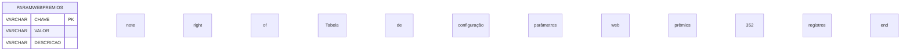

# PARAMWEBPREMIOS - Documentação Completa de Relacionamentos

## 📊 Informações Gerais

- **Nome da Tabela**: PARAMWEBPREMIOS (Parâmetros Web de Prêmios)
- **Total de Registros**: 352
- **Total de Colunas**: 3
- **Chave Primária**: CHAVE
- **Chaves Estrangeiras**: 0
- **Índices**: 0
- **Tabelas Dependentes**: 0
- **Banco de Dados**: Firebird

## 📝 Descrição

**PARAMWEBPREMIOS** é uma tabela de configuração que armazena parâmetros específicos para funcionalidades de prêmios no sistema web. Com **352 registros**, esta tabela permite configurar valores e comportamentos específicos para programas de fidelidade, pontos e prêmios em interfaces web, permitindo personalização sem alteração de código.

Esta tabela é essencial para:
- **Configuração de Prêmios Web**: Definir parâmetros específicos para programas de prêmios e fidelidade
- **Personalização**: Permitir ajustes de comportamento de prêmios web sem alteração de código
- **Manutenção**: Facilitar atualização de parâmetros de prêmios web
- **Flexibilidade**: Suportar diferentes configurações para diferentes tipos de prêmios

---

## 🔑 Estrutura de Colunas

| Coluna | Tipo | Descrição |
|--------|------|-----------|
| **CHAVE** 🔑 | VARCHAR(37) | Chave única do parâmetro (PK) |
| **VALOR** | VARCHAR(37) | Valor do parâmetro |
| **DESCRICAO** | VARCHAR(261) | Descrição detalhada do parâmetro |

---

## 🔗 Relacionamentos - Nível 1 (Diretos)

### Nenhum Relacionamento Formal

Esta tabela não possui chaves estrangeiras formais e não é referenciada por outras tabelas no momento.

---

## 🔗 Relacionamentos - Nível 2 (Indiretos)

### Relacionamentos Lógicos Potenciais

Embora não existam relacionamentos formais, esta tabela pode ser referenciada logicamente por:

#### Tabelas de Prêmios e Fidelidade (Relacionamento Lógico Potencial)
```
Tabelas de prêmios.PARAMETRO → PARAMWEBPREMIOS.CHAVE (N:1)
```

**Descrição:** Tabelas relacionadas a programas de prêmios e fidelidade podem referenciar esta tabela para obter valores de configuração.

**Tabelas potenciais:**
- Tabelas de pontos e prêmios
- Tabelas de fidelidade
- Tabelas de resgate de prêmios
- Outras tabelas relacionadas a programas de incentivo

---

## 🔗 Relacionamentos - Nível 3 (Fluxo Completo)

### Fluxo de Configuração de Prêmios

```
PARAMWEBPREMIOS (Configuração)
    ↓ (lógica)
Tabelas de Prêmios/Fidelidade
    ↓ (lógica)
Tabelas de Usuários Web
    ↓ (FK)
USUARIOWEB
```

**Descrição:** Os parâmetros configurados em PARAMWEBPREMIOS influenciam o comportamento de sistemas de prêmios que afetam usuários web do sistema.

---

## 🗺️ Diagrama de Relacionamentos



---

## 💡 Exemplos de Uso

### Consulta Básica

```sql
SELECT CHAVE, VALOR, DESCRICAO
FROM PARAMWEBPREMIOS
WHERE CHAVE = ?;
```

### Consulta de Todos os Parâmetros

```sql
SELECT CHAVE, VALOR, DESCRICAO
FROM PARAMWEBPREMIOS
ORDER BY CHAVE;
```

### Busca por Descrição

```sql
SELECT CHAVE, VALOR, DESCRICAO
FROM PARAMWEBPREMIOS
WHERE UPPER(DESCRICAO) LIKE UPPER('%prêmio%')
ORDER BY CHAVE;
```

### Atualização de Parâmetro

```sql
UPDATE PARAMWEBPREMIOS
SET VALOR = ?
WHERE CHAVE = ?;
```

### Inserção de Novo Parâmetro

```sql
INSERT INTO PARAMWEBPREMIOS (CHAVE, VALOR, DESCRICAO)
VALUES (?, ?, ?);
```

---

## ⚡ Performance e Otimização

### Índices Existentes

Nenhum índice foi identificado nesta tabela.

### Índices Recomendados

#### 1. Índice na Chave Primária (Já implícito)
```sql
-- Índice primário já existe implicitamente
-- CHAVE é a chave primária
```

#### 2. Índice para Busca por Descrição (Opcional)
```sql
CREATE INDEX IDX_PARAMWEBPREMIOS_DESCRICAO 
ON PARAMWEBPREMIOS (DESCRICAO);
```

**Justificativa:** Facilita buscas por descrição quando necessário.

---

## 📊 Estatísticas e Insights

### Volume de Dados

- **Total de Registros**: 352
- **Tamanho Médio Estimado**: ~100 bytes por registro
- **Tamanho Total Estimado**: ~35 KB

### Distribuição de Dados

- **Parâmetros Únicos**: 352 chaves distintas
- **Taxa de Utilização**: Configuração ativa para sistema web de prêmios

### Análise de Uso

- **Tipo de Tabela**: Configuração/Parâmetros
- **Frequência de Acesso**: Média (acessada durante operações de prêmios)
- **Padrão de Acesso**: Leitura frequente, escrita ocasional

---

## 🔧 Integração com Código Laravel

### Model Eloquent

```php
<?php

namespace App\Models;

use Illuminate\Database\Eloquent\Model;

final class ParamWebPremios extends Model
{
    protected $table = 'PARAMWEBPREMIOS';
    protected $primaryKey = 'CHAVE';
    public $incrementing = false;
    public $timestamps = false;

    protected $fillable = [
        'CHAVE',
        'VALOR',
        'DESCRICAO',
    ];

    protected $casts = [
        'CHAVE' => 'string',
        'VALOR' => 'string',
        'DESCRICAO' => 'string',
    ];

    /**
     * Buscar valor de parâmetro por chave
     */
    public static function getValor(string $chave): ?string
    {
        $param = self::find($chave);
        return $param ? $param->VALOR : null;
    }

    /**
     * Buscar todos os parâmetros de prêmios
     */
    public static function getAllPremios(): \Illuminate\Database\Eloquent\Collection
    {
        return self::orderBy('CHAVE')->get();
    }
}
```

### Uso no Controller

```php
use App\Models\ParamWebPremios;

// Buscar valor de parâmetro
$valor = ParamWebPremios::getValor('PONTOS_POR_REAL');

// Buscar todos os parâmetros
$parametros = ParamWebPremios::getAllPremios();
```

---

## ✅ Boas Práticas

### Design

1. **Chave Única**: Garantir que cada CHAVE seja única e descritiva
2. **Validação**: Validar valores antes de inserir/atualizar
3. **Documentação**: Manter DESCRICAO sempre atualizada

### Performance

1. **Cache**: Considerar cache para parâmetros frequentemente acessados
2. **Índices**: Manter índice na chave primária (já existe)
3. **Consultas**: Usar busca direta por CHAVE quando possível

### Manutenção

1. **Backup**: Fazer backup regular desta tabela
2. **Auditoria**: Considerar tabela de histórico para mudanças
3. **Validação**: Validar valores antes de atualizações

### Segurança

1. **Acesso**: Restringir acesso de escrita a administradores
2. **Validação**: Validar todos os valores antes de inserir
3. **Logs**: Registrar mudanças em parâmetros críticos

---

**Documentação gerada em**: 2025-01-27

**Banco de dados**: Firebird

