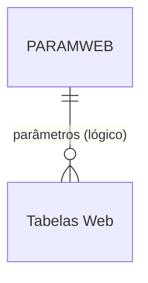

# PARAMWEB - Documentação Completa de Relacionamentos

## 📊 Informações Gerais

- **Nome da Tabela**: PARAMWEB (Parâmetros Web)
- **Total de Registros**: 291
- **Total de Colunas**: 2
- **Chave Primária**: PARWNOME
- **Chaves Estrangeiras**: 0
- **Índices**: 0
- **Tabelas Dependentes**: 0
- **Banco de Dados**: Firebird

## 📝 Descrição

**PARAMWEB** é uma tabela de configuração que armazena parâmetros específicos para funcionalidades web do sistema. Com **291 registros**, esta tabela permite configurar valores e comportamentos específicos para interfaces web, permitindo personalização sem alteração de código.

Esta tabela é essencial para:
- **Configuração Web**: Definir parâmetros específicos para interfaces web
- **Personalização**: Permitir ajustes de comportamento web sem alteração de código
- **Manutenção**: Facilitar atualização de parâmetros web
- **Flexibilidade**: Suportar diferentes configurações para diferentes ambientes web

---

## 🔑 Estrutura de Colunas

| Coluna | Tipo | Descrição |
|--------|------|-----------|
| **PARWNOME** 🔑 | VARCHAR(37) | Nome único do parâmetro (PK) |
| **PARWVALOR** | VARCHAR(37) | Valor do parâmetro |

---

## 🔗 Relacionamentos - Nível 1 (Diretos)

### Nenhum Relacionamento Formal

Esta tabela não possui chaves estrangeiras formais e não é referenciada por outras tabelas no momento.

---

## 🔗 Relacionamentos - Nível 2 (Indiretos)

### Relacionamentos Lógicos Potenciais

Embora não existam relacionamentos formais, esta tabela pode ser referenciada logicamente por:

#### Tabelas Web (Relacionamento Lógico Potencial)
```
Tabelas web.PARWNOME → PARAMWEB.PARWNOME (N:1)
```

**Descrição:** Tabelas relacionadas a funcionalidades web podem referenciar esta tabela para obter valores de configuração.

**Tabelas potenciais:**
- Tabelas de usuários web
- Tabelas de sessões web
- Tabelas de configurações de interface
- Outras tabelas relacionadas a funcionalidades web

---

## 🗺️ Diagrama de Relacionamentos



---

## 💡 Casos de Uso Práticos

### 1. Consultar Parâmetro Específico

```sql
SELECT PARWNOME, PARWVALOR
FROM PARAMWEB
WHERE PARWNOME = :parwnome;
```

### 2. Listar Todos os Parâmetros Web

```sql
SELECT PARWNOME, PARWVALOR
FROM PARAMWEB
ORDER BY PARWNOME;
```

### 3. Buscar Parâmetros por Padrão

```sql
SELECT PARWNOME, PARWVALOR
FROM PARAMWEB
WHERE PARWNOME LIKE '%' || :padrao || '%'
ORDER BY PARWNOME;
```

### 4. Relatório de Parâmetros Web

```sql
SELECT 
    COUNT(*) AS QTD_PARAMETROS,
    COUNT(CASE WHEN PARWVALOR IS NOT NULL THEN 1 END) AS QTD_COM_VALOR,
    COUNT(CASE WHEN PARWVALOR IS NULL THEN 1 END) AS QTD_SEM_VALOR
FROM PARAMWEB;
```

---

## 📈 Estatísticas e Insights

### Volume de Dados
- **Total de Parâmetros**: 291 registros
- **Uso**: Tabela de configuração web
- **Frequência de Alteração**: Variável conforme necessidade

---

## ⚡ Performance e Otimização

Como tabela de configuração, recomenda-se:

```sql
-- Índice para consultas por nome (já é PK, mas pode ser útil para outras consultas)
-- A PK já serve como índice

-- Considerar cache em memória devido ao volume moderado
```

### Otimizações Recomendadas

1. **Cachear parâmetros** em memória devido ao volume moderado
2. **Usar cache** para parâmetros frequentemente acessados
3. **Evitar consultas repetitivas** para o mesmo parâmetro

---

## 🔒 Integridade de Dados

### Validações Importantes

1. **Nome Único**: `PARWNOME` deve ser único
2. **Nome Obrigatório**: `PARWNOME` deve estar preenchido
3. **Consistência**: Valores devem ser válidos conforme o tipo esperado do parâmetro

---

## 📚 Integração com Aplicação (Laravel)

### Model PARAMWEB

```php
<?php

namespace App\Models;

use Illuminate\Database\Eloquent\Model;

final class PARAMWEB extends Model
{
    protected $table = 'PARAMWEB';
    
    protected $primaryKey = 'PARWNOME';
    
    public $incrementing = false;
    
    protected $fillable = [
        'PARWNOME',
        'PARWVALOR',
    ];
    
    /**
     * Obter valor de parâmetro
     */
    public static function getValor(string $parwnome, ?string $default = null): ?string
    {
        $param = static::find($parwnome);
        return $param ? $param->PARWVALOR : $default;
    }
    
    /**
     * Definir valor de parâmetro
     */
    public static function setValor(string $parwnome, string $valor): self
    {
        return static::updateOrCreate(
            ['PARWNOME' => $parwnome],
            ['PARWVALOR' => $valor]
        );
    }
    
    /**
     * Scope para buscar por padrão
     */
    public function scopePorPadrao($query, $padrao)
    {
        return $query->where('PARWNOME', 'LIKE', "%{$padrao}%");
    }
}
```

---

## ✅ Boas Práticas

### Design
1. **Nomes descritivos** e consistentes
2. **Documentar significado** de cada parâmetro
3. **Manter padrão** de nomenclatura consistente

### Performance
1. **Cachear valores** em memória devido ao volume moderado
2. **Evitar consultas repetitivas** para o mesmo parâmetro
3. **Usar cache** para parâmetros frequentemente acessados

### Integridade
1. **Validar valores** antes de inserir/atualizar
2. **Manter consistência** entre nome e valor
3. **Documentar formato** esperado de cada valor

### Manutenção
1. **Documentar significado** de cada parâmetro
2. **Revisar periodicamente** parâmetros não utilizados
3. **Manter backup** de configurações importantes

---

**Documentação gerada em**: 2025-01-27

**Banco de dados**: Firebird

