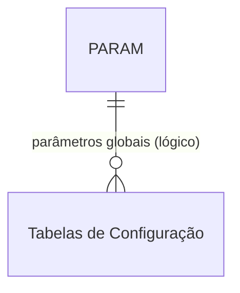

# PARAM - Documentação Completa de Relacionamentos

## 📊 Informações Gerais

- **Nome da Tabela**: PARAM (Parâmetros Gerais do Sistema)
- **Total de Registros**: 779
- **Total de Colunas**: 4
- **Chave Primária**: PARNOME
- **Chaves Estrangeiras**: 0
- **Índices**: 0
- **Tabelas Dependentes**: 0
- **Banco de Dados**: Firebird

## 📝 Descrição

**PARAM** é uma tabela de configuração geral do sistema que armazena parâmetros nomeados com seus valores correspondentes. Com **779 registros**, esta tabela serve como repositório centralizado de configurações do sistema, permitindo ajustes sem necessidade de alterar código.

Esta tabela é essencial para:
- **Configuração do Sistema**: Armazenar configurações gerais do sistema
- **Personalização**: Permitir ajustes sem alteração de código
- **Manutenção**: Facilitar atualização de configurações em um único local
- **Flexibilidade**: Suportar diferentes ambientes (desenvolvimento, produção, etc.)

---

## 🔑 Estrutura de Colunas

| Coluna | Tipo | Descrição |
|--------|------|-----------|
| **PARNOME** 🔑 | VARCHAR(37) | Nome único do parâmetro (PK) |
| **PARVALOR** | VARCHAR(37) | Valor do parâmetro |
| **PARLOCAL** | VARCHAR(37) | Localização/escopo do parâmetro |
| **PARDESCRICAO** | VARCHAR(37) | Descrição do parâmetro |

---

## 🔗 Relacionamentos - Nível 1 (Diretos)

### Nenhum Relacionamento Formal

Esta tabela não possui chaves estrangeiras formais e não é referenciada por outras tabelas no momento.

---

## 🔗 Relacionamentos - Nível 2 (Indiretos)

### Relacionamentos Lógicos Potenciais

Embora não existam relacionamentos formais, esta tabela pode ser referenciada logicamente por:

#### Tabelas de Configuração (Relacionamento Lógico Potencial)
```
Tabelas de configuração.PARNOME → PARAM.PARNOME (N:1)
```

**Descrição:** Outras tabelas de parâmetros podem referenciar esta tabela para valores padrão ou configurações globais.

**Tabelas potenciais:**
- `PARAMEMP` - Parâmetros por empresa
- `PARAMCLI` - Parâmetros por cliente
- `PARAMWEB` - Parâmetros web
- Outras tabelas de configuração

---

## 🗺️ Diagrama de Relacionamentos



---

## 💡 Casos de Uso Práticos

### 1. Consultar Parâmetro Específico

```sql
SELECT PARNOME, PARVALOR, PARLOCAL, PARDESCRICAO
FROM PARAM
WHERE PARNOME = :parnome;
```

### 2. Consultar Parâmetros por Localização

```sql
SELECT PARNOME, PARVALOR, PARDESCRICAO
FROM PARAM
WHERE PARLOCAL = :local
ORDER BY PARNOME;
```

### 3. Listar Todos os Parâmetros

```sql
SELECT PARNOME, PARVALOR, PARLOCAL, PARDESCRICAO
FROM PARAM
ORDER BY PARLOCAL, PARNOME;
```

### 4. Buscar Parâmetros por Descrição

```sql
SELECT PARNOME, PARVALOR, PARLOCAL, PARDESCRICAO
FROM PARAM
WHERE PARDESCRICAO LIKE '%' || :busca || '%'
ORDER BY PARNOME;
```

---

## 📈 Estatísticas e Insights

### Volume de Dados
- **Total de Parâmetros**: 779 registros
- **Uso**: Tabela de configuração do sistema
- **Frequência de Alteração**: Variável conforme necessidade

---

## ⚡ Performance e Otimização

Como tabela de configuração, recomenda-se:

```sql
-- Índice para consultas por nome (já é PK, mas pode ser útil para outras consultas)
-- A PK já serve como índice

-- Índice para consultas por localização
CREATE INDEX IDX_PARAM_LOCAL ON PARAM (PARLOCAL);
```

### Otimizações Recomendadas

1. **Cachear parâmetros** em memória devido ao volume moderado
2. **Usar cache** para parâmetros frequentemente acessados
3. **Evitar consultas repetitivas** para o mesmo parâmetro

---

## 🔒 Integridade de Dados

### Validações Importantes

1. **Nome Único**: `PARNOME` deve ser único
2. **Nome Obrigatório**: `PARNOME` deve estar preenchido
3. **Consistência**: Valores devem ser válidos conforme o tipo esperado do parâmetro

---

## 📚 Integração com Aplicação (Laravel)

### Model PARAM

```php
<?php

namespace App\Models;

use Illuminate\Database\Eloquent\Model;

final class PARAM extends Model
{
    protected $table = 'PARAM';
    
    protected $primaryKey = 'PARNOME';
    
    public $incrementing = false;
    
    protected $fillable = [
        'PARNOME',
        'PARVALOR',
        'PARLOCAL',
        'PARDESCRICAO',
    ];
    
    /**
     * Obter valor de parâmetro
     */
    public static function getValor(string $nome, ?string $default = null): ?string
    {
        $param = static::find($nome);
        return $param ? $param->PARVALOR : $default;
    }
    
    /**
     * Definir valor de parâmetro
     */
    public static function setValor(string $nome, string $valor, ?string $local = null, ?string $descricao = null): self
    {
        return static::updateOrCreate(
            ['PARNOME' => $nome],
            [
                'PARVALOR' => $valor,
                'PARLOCAL' => $local,
                'PARDESCRICAO' => $descricao,
            ]
        );
    }
    
    /**
     * Scope para buscar por localização
     */
    public function scopePorLocal($query, $local)
    {
        return $query->where('PARLOCAL', $local);
    }
}
```

---

## ✅ Boas Práticas

### Design
1. **Nomes descritivos** e consistentes
2. **Documentar significado** de cada parâmetro
3. **Usar localização** para agrupar parâmetros relacionados

### Performance
1. **Cachear valores** em memória devido ao volume moderado
2. **Evitar consultas repetitivas** para o mesmo parâmetro
3. **Usar cache** para parâmetros frequentemente acessados

### Integridade
1. **Validar valores** antes de inserir/atualizar
2. **Manter consistência** entre nome e descrição
3. **Documentar formato** esperado de cada valor

### Manutenção
1. **Documentar significado** de cada parâmetro
2. **Revisar periodicamente** parâmetros não utilizados
3. **Manter backup** de configurações importantes

---

**Documentação gerada em**: 2025-01-27

**Banco de dados**: Firebird

