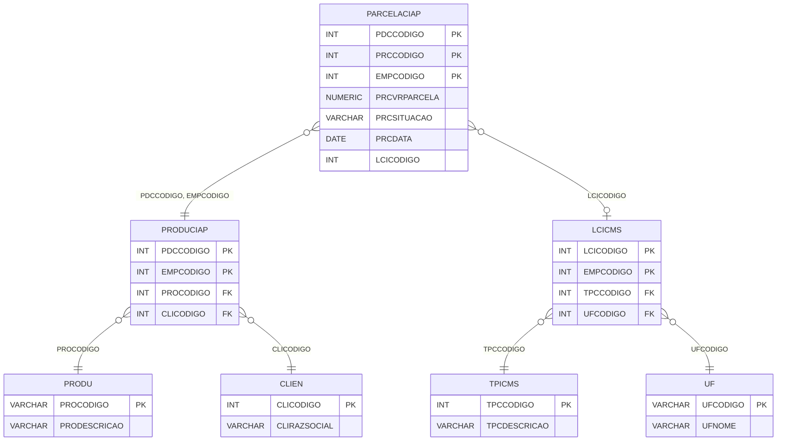

# PARCELACIAP - Documentação Completa de Relacionamentos

## 📊 Informações Gerais

- **Nome da Tabela**: PARCELACIAP (Parcelas de CIAP - Controle de Crédito do Ativo Permanente)
- **Total de Registros**: 161.664
- **Total de Colunas**: 20
- **Chave Primária**: PDCCODIGO, PRCCODIGO, EMPCODIGO (composite)
- **Chaves Estrangeiras**: 2
- **Índices**: 1 (PARCELACIAP_IDX1 em PDCCODIGO)
- **Tabelas Dependentes**: 0
- **Banco de Dados**: Firebird

## 📝 Descrição

**PARCELACIAP** é uma tabela de detalhamento que armazena as parcelas de crédito do CIAP (Controle de Crédito do Ativo Permanente) para produtos imobilizados. Com **161.664 registros**, esta tabela registra cada parcela de crédito relacionada a um produto CIAP, incluindo valores, datas, situações e informações fiscais.

Esta tabela é essencial para:
- **Controle Fiscal**: Registrar parcelas de crédito do CIAP para produtos imobilizados
- **Rastreamento**: Acompanhar cada parcela de crédito relacionada a produtos
- **Conciliação**: Facilitar conciliação de créditos fiscais
- **Relatórios Fiscais**: Suportar geração de relatórios fiscais e SPED

**Contexto Fiscal:**
O CIAP é um controle obrigatório para empresas que adquirem ativos permanentes (imobilizados) e precisam controlar o crédito de ICMS relacionado a essas aquisições. Cada produto imobilizado pode gerar múltiplas parcelas de crédito que são registradas nesta tabela.

---

## 🔑 Estrutura de Colunas

### Identificação e Controle
| Coluna | Tipo | Descrição |
|--------|------|-----------|
| **PDCCODIGO** 🔑 🔗 | INT | Código do produto CIAP (PK, FK → PRODUCIAP) |
| **PRCCODIGO** 🔑 | INT | Código sequencial da parcela (PK) |
| **EMPCODIGO** 🔑 🔗 | INT | Código da empresa (PK, FK → PRODUCIAP) |
| **PRCPARCELA** | VARCHAR(14) | Número/identificação da parcela |
| **PRCSITUACAO** | VARCHAR(14) | Situação da parcela (ATIVA, UTILIZADA, CANCELADA) |

### Valores e Tributação
| Coluna | Tipo | Descrição |
|--------|------|-----------|
| **PRCVRPARCELA** | NUMERIC(16,2) | Valor da parcela de crédito |
| **PRCVRCREDITO** | NUMERIC(16,2) | Valor do crédito utilizado |
| **PRCVRDEVTRIB** | NUMERIC(16,2) | Valor de débito tributário |
| **PRCVRDEVISE** | NUMERIC(16,2) | Valor de débito de ISE |
| **PRCVRTRIB** | NUMERIC(16,2) | Valor tributário |
| **PRCVRCOEFICIENTE** | NUMERIC(16,2) | Coeficiente de cálculo |
| **PRCVRFRACAO** | NUMERIC(16,2) | Fração do valor |
| **PRCVRTOTSAIDA** | NUMERIC(16,2) | Valor total de saída |

### Documentos Fiscais
| Coluna | Tipo | Descrição |
|--------|------|-----------|
| **PRCNRNOTADEPRE** | VARCHAR(14) | Número da nota de depreciação |
| **PRCNRNOTAVENDA** | VARCHAR(14) | Número da nota de venda |
| **PRCFISCFOP** | VARCHAR(37) | CFOP utilizado na parcela |

### Datas e Controle
| Coluna | Tipo | Descrição |
|--------|------|-----------|
| **PRCDATA** | DATE | Data da parcela |
| **PRCDTATUALIZA** | TIMESTAMP | Data/hora da última atualização |

### Outros Campos
| Coluna | Tipo | Descrição |
|--------|------|-----------|
| **LCICODIGO** | INT | Código do lançamento de ICMS (FK → LCICMS) |
| **PRCTIPOMOV** | VARCHAR(14) | Tipo de movimentação |

---

## 🔗 Relacionamentos - Nível 1 (Diretos)

### PRODUCIAP - Produto CIAP (FK Obrigatória)
**Volume:** 3.368 registros

**Relacionamento:**
```
PARCELACIAP.PDCCODIGO, EMPCODIGO → PRODUCIAP.PDCCODIGO, EMPCODIGO (N:1)
Constraint: FK_PARCELACIAP_PRODUCIAP
```

**Descrição:** Cada parcela está vinculada a um produto CIAP específico. O relacionamento é composto pelas chaves PDCCODIGO e EMPCODIGO.

**Proporção:** ~48 parcelas por produto CIAP em média (161.664 / 3.368)

**Campos relacionados:**
- `PDCCODIGO` - Código do produto CIAP
- `EMPCODIGO` - Código da empresa

---

### LCICMS - Lançamento de ICMS (FK Opcional)
**Volume:** 5 registros

**Relacionamento Lógico:**
```
PARCELACIAP.LCICODIGO → LCICMS.LCICODIGO (N:1)
```

**Descrição:** Relaciona a parcela com o lançamento de ICMS correspondente, quando aplicável.

---

## 🔗 Relacionamentos - Nível 2 (Indiretos)

### PRODUCIAP → PRODU (Produto)
**Volume:** 178.187 registros

**Relacionamento:**
```
PARCELACIAP → PRODUCIAP → PRODU
```

**Descrição:** Através de PRODUCIAP, é possível acessar informações do produto relacionado.

**Campos úteis em PRODU:**
- `PROCODIGO` - Código do produto
- `PRODESCRICAO` - Descrição do produto
- `MARCODIGO` - Marca do produto

---

### PRODUCIAP → CLIEN (Cliente/Fornecedor)
**Volume:** 9.251 registros

**Relacionamento:**
```
PARCELACIAP → PRODUCIAP → CLIEN
```

**Descrição:** Através de PRODUCIAP, é possível identificar o cliente/fornecedor relacionado ao produto CIAP.

**Campos úteis em CLIEN:**
- `CLICODIGO` - Código do cliente
- `CLIRAZSOCIAL` - Razão social
- `CLICNPJCPF` - CNPJ/CPF

---

### LCICMS → TPICMS (Tipo de ICMS)
**Volume:** Variável

**Relacionamento:**
```
PARCELACIAP → LCICMS → TPICMS
```

**Descrição:** Através de LCICMS, é possível identificar o tipo de ICMS aplicado.

---

### LCICMS → UF (Unidade Federativa)
**Volume:** 26 registros

**Relacionamento:**
```
PARCELACIAP → LCICMS → UF
```

**Descrição:** Através de LCICMS, é possível identificar a UF relacionada ao crédito de ICMS.

---

## 🔗 Relacionamentos - Nível 3 (Fluxo Completo)

### Fluxo Completo: Parcela → Produto CIAP → Produto → Cliente

```
PARCELACIAP (Parcela de Crédito)
    ↓ FK (PDCCODIGO, EMPCODIGO)
PRODUCIAP (Produto CIAP)
    ↓ FK (PROCODIGO)
PRODU (Produto)
    ↓ (informações do produto)
PRODUCIAP
    ↓ FK (CLICODIGO)
CLIEN (Cliente/Fornecedor)
```

**Descrição:** Permite rastrear desde uma parcela específica até o produto e cliente relacionados.

---

### Fluxo Fiscal: Parcela → Lançamento ICMS → Tipo ICMS → UF

```
PARCELACIAP (Parcela)
    ↓ FK (LCICODIGO)
LCICMS (Lançamento ICMS)
    ↓ FK (TPCCODIGO)
TPICMS (Tipo de ICMS)
    ↓ FK (UFCODIGO)
UF (Unidade Federativa)
```

**Descrição:** Permite rastrear informações fiscais completas relacionadas à parcela.

---

## 🗺️ Diagrama de Relacionamentos



---

## 💡 Exemplos de Uso

### Consulta Básica de Parcelas

```sql
SELECT 
    PDCCODIGO,
    PRCCODIGO,
    PRCVRPARCELA,
    PRCDATA,
    PRCSITUACAO
FROM PARCELACIAP
WHERE PDCCODIGO = ?
ORDER BY PRCDATA;
```

### Consulta com Informações do Produto CIAP

```sql
SELECT 
    p.PDCCODIGO,
    p.PRCCODIGO,
    p.PRCVRPARCELA,
    p.PRCDATA,
    p.PRCSITUACAO,
    pc.PROCODIGO,
    pr.PRODESCRICAO
FROM PARCELACIAP p
INNER JOIN PRODUCIAP pc
    ON p.PDCCODIGO = pc.PDCCODIGO
    AND p.EMPCODIGO = pc.EMPCODIGO
INNER JOIN PRODU pr
    ON pc.PROCODIGO = pr.PROCODIGO
WHERE p.PDCCODIGO = ?
ORDER BY p.PRCDATA;
```

### Consulta de Parcelas por Situação

```sql
SELECT 
    PRCSITUACAO,
    COUNT(*) AS TOTAL_PARCELAS,
    SUM(PRCVRPARCELA) AS VALOR_TOTAL
FROM PARCELACIAP
WHERE PDCCODIGO = ?
GROUP BY PRCSITUACAO;
```

### Consulta de Parcelas Pendentes

```sql
SELECT 
    p.*,
    pc.PROCODIGO,
    pr.PRODESCRICAO,
    c.CLIRAZSOCIAL
FROM PARCELACIAP p
INNER JOIN PRODUCIAP pc
    ON p.PDCCODIGO = pc.PDCCODIGO
    AND p.EMPCODIGO = pc.EMPCODIGO
INNER JOIN PRODU pr
    ON pc.PROCODIGO = pr.PROCODIGO
INNER JOIN CLIEN c
    ON pc.CLICODIGO = c.CLICODIGO
WHERE p.PRCSITUACAO = 'ATIVA'
    AND p.PRCDATA <= CURRENT_DATE
ORDER BY p.PRCDATA;
```

### Consulta com Informações Fiscais

```sql
SELECT 
    p.*,
    l.LCICODIGO,
    t.TPCDESCRICAO,
    u.UFNOME
FROM PARCELACIAP p
LEFT JOIN LCICMS l
    ON p.LCICODIGO = l.LCICODIGO
LEFT JOIN TPICMS t
    ON l.TPCCODIGO = t.TPCCODIGO
LEFT JOIN UF u
    ON l.UFCODIGO = u.UFCODIGO
WHERE p.PDCCODIGO = ?
ORDER BY p.PRCDATA;
```

### Inserção de Nova Parcela

```sql
INSERT INTO PARCELACIAP (
    PDCCODIGO,
    PRCCODIGO,
    EMPCODIGO,
    PRCVRPARCELA,
    PRCDATA,
    PRCSITUACAO,
    PRCPARCELA
)
VALUES (?, ?, ?, ?, ?, ?, ?);
```

### Atualização de Situação da Parcela

```sql
UPDATE PARCELACIAP
SET PRCSITUACAO = ?,
    PRCDTATUALIZA = CURRENT_TIMESTAMP
WHERE PDCCODIGO = ?
    AND PRCCODIGO = ?
    AND EMPCODIGO = ?;
```

---

## ⚡ Performance e Otimização

### Índices Existentes

#### 1. Índice em PDCCODIGO
```sql
-- Índice: PARCELACIAP_IDX1
CREATE INDEX PARCELACIAP_IDX1 ON PARCELACIAP (PDCCODIGO);
```

**Justificativa:** Facilita buscas por produto CIAP, que é o relacionamento mais comum.

### Índices Recomendados

#### 1. Índice Composto para Busca por Produto e Data
```sql
CREATE INDEX IDX_PARCELACIAP_PDC_DATA 
ON PARCELACIAP (PDCCODIGO, PRCDATA);
```

**Justificativa:** Otimiza consultas que filtram por produto e ordenam por data.

#### 2. Índice em Situação
```sql
CREATE INDEX IDX_PARCELACIAP_SITUACAO 
ON PARCELACIAP (PRCSITUACAO);
```

**Justificativa:** Facilita buscas por situação da parcela (ATIVA, UTILIZADA, etc.).

#### 3. Índice Composto para Chave Primária Completa
```sql
-- Já existe implicitamente pela chave primária
-- Mas pode ser útil para garantir performance
```

---

## 📊 Estatísticas e Insights

### Volume de Dados

- **Total de Registros**: 161.664
- **Tamanho Médio Estimado**: ~200 bytes por registro
- **Tamanho Total Estimado**: ~32 MB

### Distribuição de Dados

- **Produtos CIAP**: 3.368 produtos com parcelas
- **Média de Parcelas por Produto**: ~48 parcelas
- **Taxa de Utilização**: Alta (tabela ativa para controle fiscal)

### Análise de Uso

- **Tipo de Tabela**: Detalhamento fiscal
- **Frequência de Acesso**: Alta (consultas frequentes para relatórios fiscais)
- **Padrão de Acesso**: Leitura frequente, escrita durante lançamentos

### Proporções Importantes

- **Parcelas por Produto**: ~48 parcelas em média
- **Taxa de Crescimento**: Dependente de novos produtos CIAP

---

## 🔧 Integração com Código Laravel

### Model Eloquent

```php
<?php

namespace App\Models;

use Illuminate\Database\Eloquent\Model;
use Illuminate\Database\Eloquent\Relations\BelongsTo;

final class ParcelaCiap extends Model
{
    protected $table = 'PARCELACIAP';
    public $incrementing = false;
    public $timestamps = false;

    protected $primaryKey = ['PDCCODIGO', 'PRCCODIGO', 'EMPCODIGO'];

    protected $fillable = [
        'PDCCODIGO',
        'PRCCODIGO',
        'EMPCODIGO',
        'PRCVRPARCELA',
        'PRCDATA',
        'PRCSITUACAO',
        'PRCPARCELA',
        'PRCNRNOTADEPRE',
        'PRCNRNOTAVENDA',
        'PRCDTATUALIZA',
        'PRCVRTRIB',
        'PRCVRCOEFICIENTE',
        'PRCVRFRACAO',
        'PRCVRTOTSAIDA',
        'LCICODIGO',
        'PRCTIPOMOV',
        'PRCFISCFOP',
        'PRCVRCREDITO',
        'PRCVRDEVTRIB',
        'PRCVRDEVISE',
    ];

    protected $casts = [
        'PDCCODIGO' => 'integer',
        'PRCCODIGO' => 'integer',
        'EMPCODIGO' => 'integer',
        'PRCVRPARCELA' => 'decimal:2',
        'PRCDATA' => 'date',
        'PRCSITUACAO' => 'string',
        'PRCDTATUALIZA' => 'datetime',
        'PRCVRTRIB' => 'decimal:2',
        'PRCVRCOEFICIENTE' => 'decimal:2',
        'PRCVRFRACAO' => 'decimal:2',
        'PRCVRTOTSAIDA' => 'decimal:2',
        'LCICODIGO' => 'integer',
        'PRCVRCREDITO' => 'decimal:2',
        'PRCVRDEVTRIB' => 'decimal:2',
        'PRCVRDEVISE' => 'decimal:2',
    ];

    /**
     * Relacionamento com Produto CIAP
     */
    public function produtoCiap(): BelongsTo
    {
        return $this->belongsTo(
            ProduCiap::class,
            ['PDCCODIGO', 'EMPCODIGO'],
            ['PDCCODIGO', 'EMPCODIGO']
        );
    }

    /**
     * Relacionamento com Lançamento ICMS
     */
    public function lcIcms(): BelongsTo
    {
        return $this->belongsTo(LcIcms::class, 'LCICODIGO', 'LCICODIGO');
    }

    /**
     * Buscar parcelas por produto CIAP
     */
    public static function porProdutoCiap(int $pdcCodigo, int $empCodigo)
    {
        return self::where('PDCCODIGO', $pdcCodigo)
            ->where('EMPCODIGO', $empCodigo)
            ->orderBy('PRCDATA')
            ->get();
    }

    /**
     * Buscar parcelas por situação
     */
    public static function porSituacao(string $situacao)
    {
        return self::where('PRCSITUACAO', $situacao)
            ->orderBy('PRCDATA')
            ->get();
    }

    /**
     * Calcular total de parcelas por produto
     */
    public static function totalPorProduto(int $pdcCodigo, int $empCodigo): float
    {
        return self::where('PDCCODIGO', $pdcCodigo)
            ->where('EMPCODIGO', $empCodigo)
            ->sum('PRCVRPARCELA');
    }
}
```

### Uso no Controller

```php
use App\Models\ParcelaCiap;

// Buscar parcelas de um produto CIAP
$parcelas = ParcelaCiap::porProdutoCiap($pdcCodigo, $empCodigo);

// Buscar parcelas pendentes
$pendentes = ParcelaCiap::porSituacao('ATIVA')
    ->where('PRCDATA', '<=', now())
    ->get();

// Calcular total
$total = ParcelaCiap::totalPorProduto($pdcCodigo, $empCodigo);
```

---

## ✅ Boas Práticas

### Design

1. **Chave Composta**: Manter integridade da chave composta (PDCCODIGO, PRCCODIGO, EMPCODIGO)
2. **Validação**: Validar valores antes de inserir/atualizar
3. **Situação**: Manter PRCSITUACAO sempre atualizada

### Performance

1. **Índices**: Usar índices para buscas frequentes
2. **Consultas**: Evitar SELECT * em tabelas grandes
3. **Agregações**: Usar SUM/COUNT com GROUP BY quando necessário

### Manutenção

1. **Backup**: Fazer backup regular desta tabela
2. **Auditoria**: Considerar tabela de histórico para mudanças
3. **Validação**: Validar valores antes de atualizações

### Segurança

1. **Acesso**: Restringir acesso de escrita a usuários autorizados
2. **Validação**: Validar todos os valores antes de inserir
3. **Logs**: Registrar mudanças em parcelas críticas

---

**Documentação gerada em**: 2025-01-27

**Banco de dados**: Firebird

