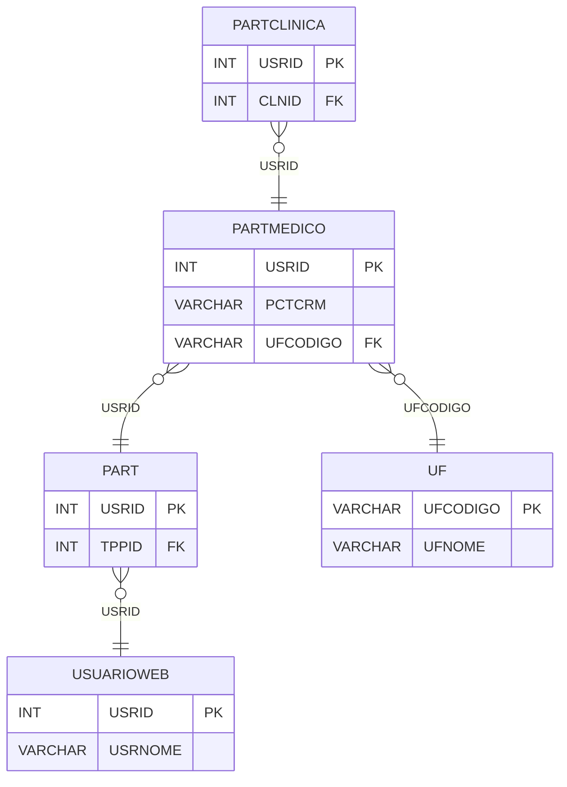

# PARTMEDICO - Documentação Completa de Relacionamentos

## 📊 Informações Gerais

- **Nome da Tabela**: PARTMEDICO (Participante Médico)
- **Total de Registros**: 2.118
- **Total de Colunas**: 3
- **Chave Primária**: USRID
- **Chaves Estrangeiras**: 2
- **Índices**: 0
- **Tabelas Dependentes**: 1
- **Banco de Dados**: Firebird

## 📝 Descrição

**PARTMEDICO** é uma tabela de detalhamento que armazena informações específicas de participantes do tipo médico no sistema de fidelidade. Com **2.118 registros**, esta tabela registra o CRM (Conselho Regional de Medicina) e a UF (Unidade Federativa) de cada médico participante.

Esta tabela é essencial para:
- **Identificação Médica**: Registrar CRM e UF de médicos participantes
- **Validação**: Validar informações profissionais de médicos
- **Relatórios**: Gerar relatórios específicos para médicos
- **Rastreamento**: Rastrear médicos por região

**Contexto de Negócio:**
Médicos podem participar do programa de fidelidade e precisam ter suas informações profissionais registradas (CRM e UF) para validação e rastreamento.

---

## 🔑 Estrutura de Colunas

| Coluna | Tipo | Descrição |
|--------|------|-----------|
| **USRID** 🔑 🔗 | INT | Código do usuário/participante (PK, FK → PART) |
| **PCTCRM** | VARCHAR(37) | Número do CRM (Conselho Regional de Medicina) |
| **UFCODIGO** 🔗 | VARCHAR(14) | Código da UF onde o CRM foi registrado (FK → UF) |

---

## 🔗 Relacionamentos - Nível 1 (Diretos)

### PART - Participante (FK Obrigatória)
**Volume:** 3.133 registros

**Relacionamento:**
```
PARTMEDICO.USRID → PART.USRID (1:1)
Constraint: PART_PARTMEDICO
```

**Descrição:** Cada registro médico está vinculado a um participante específico. Relacionamento 1:1, onde cada participante do tipo médico tem exatamente um registro nesta tabela.

**Proporção:** ~67,6% dos participantes são médicos (2.118 / 3.133)

---

### UF - Unidade Federativa (FK Obrigatória)
**Volume:** 26 registros

**Relacionamento:**
```
PARTMEDICO.UFCODIGO → UF.UFCODIGO (N:1)
Constraint: UF_PARTMEDICO
```

**Descrição:** Identifica a UF onde o CRM do médico foi registrado.

---

## 🔗 Relacionamentos - Nível 2 (Indiretos)

### PART → USUARIOWEB (Usuário Web)
**Volume:** 7.366 registros

**Relacionamento:**
```
PARTMEDICO → PART → USUARIOWEB
```

**Descrição:** Através de PART, é possível acessar informações do usuário web relacionado.

---

### PART → PARTTIPO (Tipo de Participante)
**Volume:** 6 registros

**Relacionamento:**
```
PARTMEDICO → PART → PARTTIPO
```

**Descrição:** Através de PART, é possível identificar o tipo de participante (deve ser tipo "Médico").

---

### UF → CIDADE (Cidades da UF)
**Volume:** Variável

**Relacionamento:**
```
PARTMEDICO → UF → CIDADE
```

**Descrição:** Através de UF, é possível identificar cidades relacionadas.

---

## 🔗 Relacionamentos - Nível 3 (Fluxo Completo)

### Fluxo: Médico → Participante → Usuário → Cliente

```
PARTMEDICO (Médico)
    ↓ FK (USRID)
PART (Participante)
    ↓ FK (USRID)
USUARIOWEB (Usuário Web)
    ↓ (CLICODIGO)
CLIEN (Cliente)
```

**Descrição:** Permite rastrear desde um médico específico até o cliente relacionado.

---

## 📊 Tabelas que Referenciam Esta

Esta tabela é referenciada por 1 tabela:

### PARTCLINICA - Participante x Clínica
**Volume:** 0 registros

**Relacionamento:**
```
PARTCLINICA.USRID → PARTMEDICO.USRID (N:1)
Constraint: PARTMEDICO_PARTCLINICA
```

**Descrição:** Relaciona médicos participantes com clínicas específicas.

---

## 🗺️ Diagrama de Relacionamentos



---

## 💡 Exemplos de Uso

### Consulta Básica

```sql
SELECT USRID, PCTCRM, UFCODIGO
FROM PARTMEDICO
WHERE USRID = ?;
```

### Consulta com Informações do Participante

```sql
SELECT 
    pm.*,
    p.PCTSALDOPENDENTE,
    p.PCTSALDOLIBERADO,
    u.USRNOME,
    u.EMAIL
FROM PARTMEDICO pm
INNER JOIN PART p
    ON pm.USRID = p.USRID
INNER JOIN USUARIOWEB u
    ON pm.USRID = u.USRID
WHERE pm.USRID = ?;
```

### Consulta com Informações da UF

```sql
SELECT 
    pm.*,
    u.UFNOME
FROM PARTMEDICO pm
INNER JOIN UF u
    ON pm.UFCODIGO = u.UFCODIGO
WHERE pm.UFCODIGO = ?;
```

### Busca por CRM

```sql
SELECT 
    pm.*,
    u.USRNOME,
    uf.UFNOME
FROM PARTMEDICO pm
INNER JOIN USUARIOWEB u
    ON pm.USRID = u.USRID
INNER JOIN UF uf
    ON pm.UFCODIGO = uf.UFCODIGO
WHERE pm.PCTCRM = ?;
```

### Estatísticas por UF

```sql
SELECT 
    u.UFNOME,
    COUNT(*) AS TOTAL_MEDICOS,
    COUNT(DISTINCT pm.PCTCRM) AS CRM_UNICOS
FROM PARTMEDICO pm
INNER JOIN UF u
    ON pm.UFCODIGO = u.UFCODIGO
GROUP BY u.UFCODIGO, u.UFNOME
ORDER BY TOTAL_MEDICOS DESC;
```

### Inserção de Novo Médico

```sql
INSERT INTO PARTMEDICO (USRID, PCTCRM, UFCODIGO)
VALUES (?, ?, ?);
```

---

## ⚡ Performance e Otimização

### Índices Recomendados

#### 1. Índice na Chave Primária (Já existe implicitamente)
```sql
-- Índice primário já existe implicitamente
```

#### 2. Índice em UFCODIGO
```sql
CREATE INDEX IDX_PARTMEDICO_UFCODIGO 
ON PARTMEDICO (UFCODIGO);
```

**Justificativa:** Facilita buscas por UF.

#### 3. Índice em PCTCRM
```sql
CREATE INDEX IDX_PARTMEDICO_PCTCRM 
ON PARTMEDICO (PCTCRM);
```

**Justificativa:** Facilita buscas por CRM.

---

## 📊 Estatísticas e Insights

### Volume de Dados

- **Total de Registros**: 2.118
- **Tamanho Médio Estimado**: ~30 bytes por registro
- **Tamanho Total Estimado**: ~64 KB

### Distribuição de Dados

- **Médicos Únicos**: 2.118 médicos participantes
- **Taxa de Participação Médica**: ~67,6% dos participantes são médicos
- **Taxa de Utilização**: Alta (sistema ativo)

---

## 🔧 Integração com Código Laravel

### Model Eloquent

```php
<?php

namespace App\Models;

use Illuminate\Database\Eloquent\Model;
use Illuminate\Database\Eloquent\Relations\BelongsTo;
use Illuminate\Database\Eloquent\Relations\HasMany;

final class PartMedico extends Model
{
    protected $table = 'PARTMEDICO';
    protected $primaryKey = 'USRID';
    public $incrementing = false;
    public $timestamps = false;

    protected $fillable = [
        'USRID',
        'PCTCRM',
        'UFCODIGO',
    ];

    protected $casts = [
        'USRID' => 'integer',
        'PCTCRM' => 'string',
        'UFCODIGO' => 'string',
    ];

    /**
     * Relacionamento com Participante
     */
    public function participante(): BelongsTo
    {
        return $this->belongsTo(Part::class, 'USRID', 'USRID');
    }

    /**
     * Relacionamento com UF
     */
    public function uf(): BelongsTo
    {
        return $this->belongsTo(Uf::class, 'UFCODIGO', 'UFCODIGO');
    }

    /**
     * Relacionamento com Clínicas
     */
    public function clinicas(): HasMany
    {
        return $this->hasMany(PartClinica::class, 'USRID', 'USRID');
    }

    /**
     * Buscar médico por CRM
     */
    public static function porCrm(string $crm): ?self
    {
        return self::where('PCTCRM', $crm)
            ->with(['participante', 'uf'])
            ->first();
    }

    /**
     * Buscar médicos por UF
     */
    public static function porUf(string $ufCodigo)
    {
        return self::where('UFCODIGO', $ufCodigo)
            ->with(['participante', 'uf'])
            ->get();
    }
}
```

---

## ✅ Boas Práticas

### Design

1. **Chave Primária**: USRID deve corresponder a um PART válido do tipo médico
2. **Validação**: Validar formato do CRM antes de inserir
3. **UF**: Validar UFCODIGO antes de inserir

### Performance

1. **Índices**: Usar índices para buscas por CRM e UF
2. **Consultas**: Usar eager loading para relacionamentos

### Segurança

1. **Validação**: Validar CRM e UF antes de inserir
2. **Acesso**: Restringir acesso de escrita a usuários autorizados

---

**Documentação gerada em**: 2025-01-27

**Banco de dados**: Firebird

