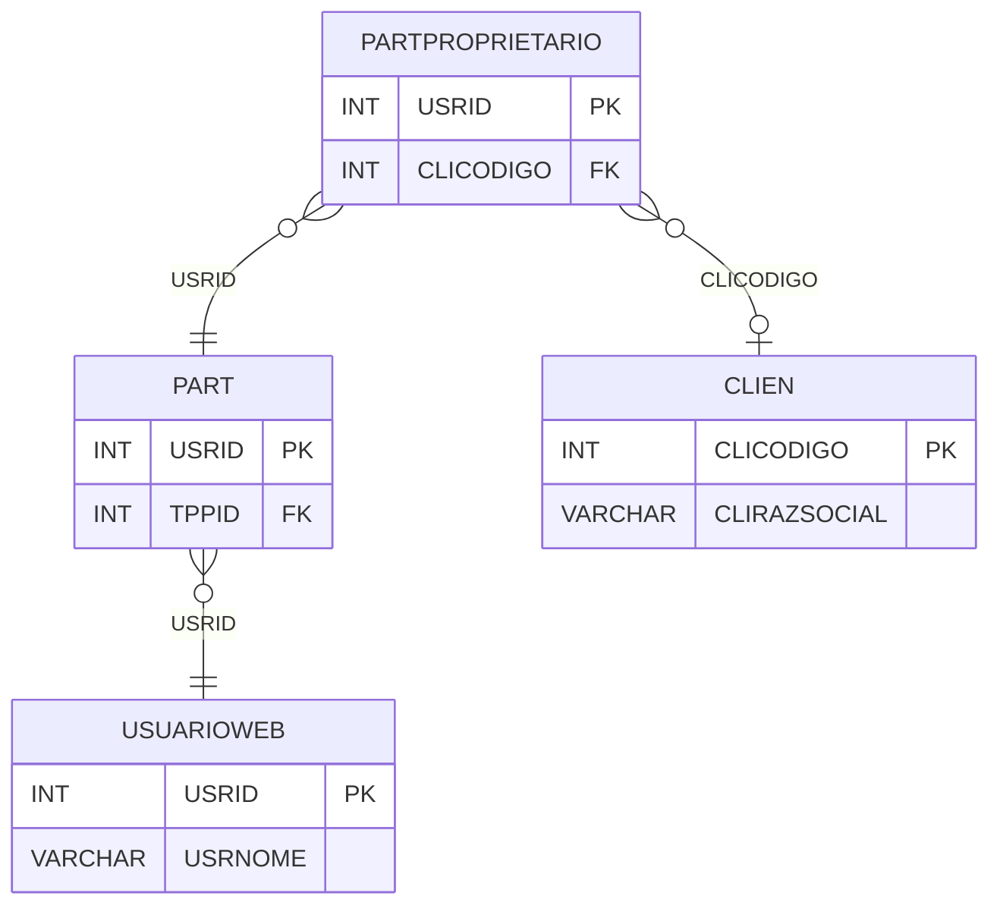

# PARTPROPRIETARIO - Documentação Completa de Relacionamentos

## 📊 Informações Gerais

- **Nome da Tabela**: PARTPROPRIETARIO (Participante Proprietário)
- **Total de Registros**: 198
- **Total de Colunas**: 2
- **Chave Primária**: USRID
- **Chaves Estrangeiras**: 2
- **Índices**: 0
- **Tabelas Dependentes**: 0
- **Banco de Dados**: Firebird

## 📝 Descrição

**PARTPROPRIETARIO** é uma tabela de detalhamento que relaciona participantes do tipo proprietário com clientes específicos. Com **198 registros**, esta tabela permite identificar qual cliente está associado a cada participante proprietário.

Esta tabela é essencial para:
- **Identificação**: Relacionar proprietários participantes com clientes
- **Rastreamento**: Rastrear quais clientes têm proprietários no programa
- **Relatórios**: Gerar relatórios específicos para proprietários

**Contexto de Negócio:**
Proprietários de empresas/clientes podem participar do programa de fidelidade e precisam estar vinculados ao cliente que representam.

---

## 🔑 Estrutura de Colunas

| Coluna | Tipo | Descrição |
|--------|------|-----------|
| **USRID** 🔑 🔗 | INT | Código do usuário/participante (PK, FK → PART) |
| **CLICODIGO** 🔗 | INT | Código do cliente relacionado (FK → CLIEN) |

---

## 🔗 Relacionamentos - Nível 1 (Diretos)

### PART - Participante (FK Obrigatória)
**Volume:** 3.133 registros

**Relacionamento:**
```
PARTPROPRIETARIO.USRID → PART.USRID (1:1)
Constraint: PART_PARTPROPRIETARIO
```

**Descrição:** Cada registro de proprietário está vinculado a um participante específico. Relacionamento 1:1.

**Proporção:** ~6,3% dos participantes são proprietários (198 / 3.133)

---

### CLIEN - Cliente (FK Opcional)
**Volume:** 9.251 registros

**Relacionamento:**
```
PARTPROPRIETARIO.CLICODIGO → CLIEN.CLICODIGO (N:1)
Constraint: CLIEN_PARTPROPRIETARIO
```

**Descrição:** Identifica o cliente relacionado ao proprietário participante.

---

## 🔗 Relacionamentos - Nível 2 (Indiretos)

### PART → USUARIOWEB (Usuário Web)
**Volume:** 7.366 registros

**Relacionamento:**
```
PARTPROPRIETARIO → PART → USUARIOWEB
```

**Descrição:** Através de PART, é possível acessar informações do usuário web relacionado.

---

### CLIEN → ENDCLI (Endereços do Cliente)
**Volume:** 9.272 registros

**Relacionamento:**
```
PARTPROPRIETARIO → CLIEN → ENDCLI
```

**Descrição:** Através de CLIEN, é possível acessar endereços do cliente.

---

## 🗺️ Diagrama de Relacionamentos



---

## 💡 Exemplos de Uso

### Consulta Básica

```sql
SELECT USRID, CLICODIGO
FROM PARTPROPRIETARIO
WHERE USRID = ?;
```

### Consulta com Informações do Cliente

```sql
SELECT 
    pp.*,
    c.CLIRAZSOCIAL,
    c.CLINOMEFANT,
    c.CLICNPJCPF
FROM PARTPROPRIETARIO pp
INNER JOIN CLIEN c
    ON pp.CLICODIGO = c.CLICODIGO
WHERE pp.USRID = ?;
```

### Consulta com Informações do Participante

```sql
SELECT 
    pp.*,
    p.PCTSALDOPENDENTE,
    p.PCTSALDOLIBERADO,
    u.USRNOME,
    u.EMAIL
FROM PARTPROPRIETARIO pp
INNER JOIN PART p
    ON pp.USRID = p.USRID
INNER JOIN USUARIOWEB u
    ON pp.USRID = u.USRID
WHERE pp.USRID = ?;
```

### Busca por Cliente

```sql
SELECT 
    pp.*,
    u.USRNOME,
    c.CLIRAZSOCIAL
FROM PARTPROPRIETARIO pp
INNER JOIN USUARIOWEB u
    ON pp.USRID = u.USRID
INNER JOIN CLIEN c
    ON pp.CLICODIGO = c.CLICODIGO
WHERE pp.CLICODIGO = ?;
```

### Inserção de Novo Proprietário

```sql
INSERT INTO PARTPROPRIETARIO (USRID, CLICODIGO)
VALUES (?, ?);
```

---

## ⚡ Performance e Otimização

### Índices Recomendados

#### 1. Índice na Chave Primária (Já existe implicitamente)
```sql
-- Índice primário já existe implicitamente
```

#### 2. Índice em CLICODIGO
```sql
CREATE INDEX IDX_PARTPROPRIETARIO_CLICODIGO 
ON PARTPROPRIETARIO (CLICODIGO);
```

**Justificativa:** Facilita buscas por cliente.

---

## 📊 Estatísticas e Insights

### Volume de Dados

- **Total de Registros**: 198
- **Tamanho Médio Estimado**: ~20 bytes por registro
- **Tamanho Total Estimado**: ~4 KB

### Distribuição de Dados

- **Proprietários Únicos**: 198 proprietários participantes
- **Taxa de Participação**: ~6,3% dos participantes são proprietários

---

## 🔧 Integração com Código Laravel

### Model Eloquent

```php
<?php

namespace App\Models;

use Illuminate\Database\Eloquent\Model;
use Illuminate\Database\Eloquent\Relations\BelongsTo;

final class PartProprietario extends Model
{
    protected $table = 'PARTPROPRIETARIO';
    protected $primaryKey = 'USRID';
    public $incrementing = false;
    public $timestamps = false;

    protected $fillable = [
        'USRID',
        'CLICODIGO',
    ];

    protected $casts = [
        'USRID' => 'integer',
        'CLICODIGO' => 'integer',
    ];

    /**
     * Relacionamento com Participante
     */
    public function participante(): BelongsTo
    {
        return $this->belongsTo(Part::class, 'USRID', 'USRID');
    }

    /**
     * Relacionamento com Cliente
     */
    public function cliente(): BelongsTo
    {
        return $this->belongsTo(Clien::class, 'CLICODIGO', 'CLICODIGO');
    }

    /**
     * Buscar proprietário por cliente
     */
    public static function porCliente(int $cliCodigo)
    {
        return self::where('CLICODIGO', $cliCodigo)
            ->with(['participante', 'cliente'])
            ->get();
    }
}
```

---

## ✅ Boas Práticas

### Design

1. **Chave Primária**: USRID deve corresponder a um PART válido do tipo proprietário
2. **Validação**: Validar CLICODIGO antes de inserir
3. **Integridade**: Manter consistência entre PART e CLIEN

### Performance

1. **Índices**: Usar índice para busca por cliente
2. **Consultas**: Usar eager loading para relacionamentos

### Segurança

1. **Validação**: Validar CLICODIGO antes de inserir
2. **Acesso**: Restringir acesso de escrita a usuários autorizados

---

**Documentação gerada em**: 2025-01-27

**Banco de dados**: Firebird

