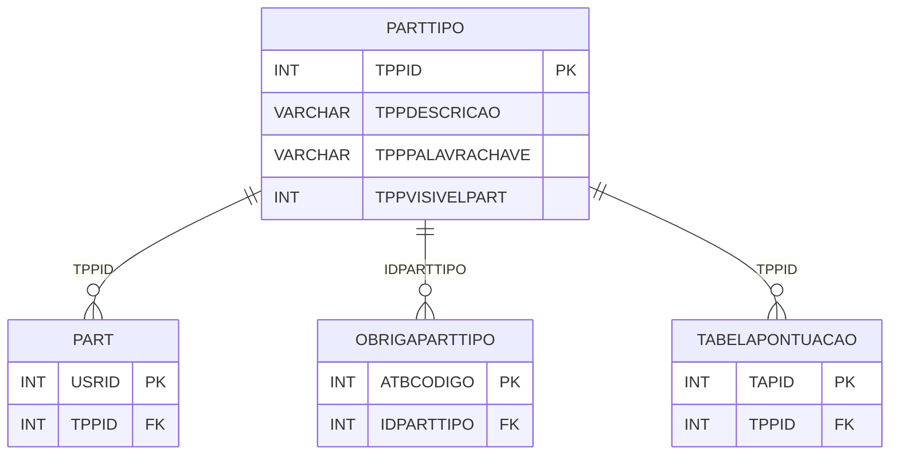

# PARTTIPO - Documentação Completa de Relacionamentos

## 📊 Informações Gerais

- **Nome da Tabela**: PARTTIPO (Tipo de Participante)
- **Total de Registros**: 6
- **Total de Colunas**: 4
- **Chave Primária**: TPPID
- **Chaves Estrangeiras**: 0
- **Índices**: 0
- **Tabelas Dependentes**: 6
- **Banco de Dados**: Firebird

## 📝 Descrição

**PARTTIPO** é uma tabela mestre que define os tipos de participantes no sistema de fidelidade. Com apenas **6 registros**, esta tabela categoriza os participantes em diferentes tipos como Médico, Vendedor, Proprietário, etc.

Esta tabela é essencial para:
- **Classificação**: Categorizar participantes por tipo
- **Regras**: Definir regras específicas por tipo de participante
- **Relatórios**: Gerar relatórios segmentados por tipo
- **Validação**: Validar informações específicas por tipo

**Contexto de Negócio:**
Diferentes tipos de participantes podem ter regras diferentes de pontuação, obrigações específicas e funcionalidades distintas no sistema de fidelidade.

---

## 🔑 Estrutura de Colunas

| Coluna | Tipo | Descrição |
|--------|------|-----------|
| **TPPID** 🔑 | INT | Código do tipo de participante (PK) |
| **TPPDESCRICAO** | VARCHAR(37) | Descrição do tipo |
| **TPPPALAVRACHAVE** | VARCHAR(37) | Palavra-chave para identificação |
| **TPPVISIVELPART** | INT | Flag indicando se é visível para participantes |

---

## 🔗 Relacionamentos - Nível 1 (Diretos)

### Nenhum Relacionamento Formal

Esta tabela não possui chaves estrangeiras formais, mas é referenciada por várias tabelas.

---

## 📊 Tabelas que Referenciam Esta

Esta tabela é referenciada por 6 tabelas:

### 1. PART - Participante
**Volume:** 3.133 registros

**Relacionamento:**
```
PART.TPPID → PARTTIPO.TPPID (N:1)
Constraint: PARTTIPO_PART
```

**Descrição:** Cada participante possui um tipo específico.

---

### 2. OBRIGAPARTTIPO - Obrigações por Tipo
**Volume:** 68 registros

**Relacionamento:**
```
OBRIGAPARTTIPO.IDPARTTIPO → PARTTIPO.TPPID (N:1)
Constraint: FK_OBRIGAPARTTIPO_PARTTIPO
```

**Descrição:** Define obrigações específicas para cada tipo de participante.

---

### 3. OBRIGAPARTTIPOFINALIDADE - Obrigações por Tipo e Finalidade
**Volume:** Variável

**Relacionamento:**
```
OBRIGAPARTTIPOFINALIDADE.IDPARTTIPO → PARTTIPO.TPPID (N:1)
Constraint: FK_PARTTIPOFINALIDADE_PARTTIPO
```

**Descrição:** Define obrigações por tipo e finalidade.

---

### 4. OBRIGAPARTTIPOPRO - Obrigações por Tipo e Produto
**Volume:** Variável

**Relacionamento:**
```
OBRIGAPARTTIPOPRO.IDPARTTIPO → PARTTIPO.TPPID (N:1)
Constraint: FK_OBRIGAPARTTIPOPRO_PARTTIPO
```

**Descrição:** Define obrigações por tipo e produto.

---

### 5. OBRIGAPARTTIPOSER - Obrigações por Tipo e Serviço
**Volume:** Variável

**Relacionamento:**
```
OBRIGAPARTTIPOSER.IDPARTTIPO → PARTTIPO.TPPID (N:1)
Constraint: FK_OBRIGAPARTTIPOSER_PARTTIPO
```

**Descrição:** Define obrigações por tipo e serviço.

---

### 6. TABELAPONTUACAO - Tabela de Pontuação
**Volume:** 0 registros

**Relacionamento:**
```
TABELAPONTUACAO.TPPID → PARTTIPO.TPPID (N:1)
Constraint: PARTTIPO_TABELAPONTUACAO
```

**Descrição:** Relaciona tabelas de pontuação com tipos de participantes.

---

## 🔗 Relacionamentos - Nível 2 (Indiretos)

### PART → USUARIOWEB (Usuários Web)
**Volume:** 7.366 registros

**Relacionamento:**
```
PARTTIPO → PART → USUARIOWEB
```

**Descrição:** Através de PART, é possível identificar usuários web por tipo.

---

### PART → MOVPONT (Movimentações)
**Volume:** Variável

**Relacionamento:**
```
PARTTIPO → PART → MOVPONT
```

**Descrição:** Através de PART, é possível analisar movimentações por tipo.

---

## 🗺️ Diagrama de Relacionamentos



---

## 💡 Exemplos de Uso

### Consulta Básica

```sql
SELECT TPPID, TPPDESCRICAO, TPPPALAVRACHAVE, TPPVISIVELPART
FROM PARTTIPO
WHERE TPPID = ?;
```

### Consulta de Todos os Tipos

```sql
SELECT TPPID, TPPDESCRICAO, TPPPALAVRACHAVE
FROM PARTTIPO
ORDER BY TPPDESCRICAO;
```

### Consulta com Contagem de Participantes

```sql
SELECT 
    pt.TPPID,
    pt.TPPDESCRICAO,
    COUNT(p.USRID) AS TOTAL_PARTICIPANTES
FROM PARTTIPO pt
LEFT JOIN PART p
    ON pt.TPPID = p.TPPID
GROUP BY pt.TPPID, pt.TPPDESCRICAO
ORDER BY TOTAL_PARTICIPANTES DESC;
```

### Consulta com Obrigações

```sql
SELECT 
    pt.*,
    COUNT(DISTINCT opt.ATBCODIGO) AS TOTAL_OBRIGACOES
FROM PARTTIPO pt
LEFT JOIN OBRIGAPARTTIPO opt
    ON pt.TPPID = opt.IDPARTTIPO
GROUP BY pt.TPPID, pt.TPPDESCRICAO, pt.TPPPALAVRACHAVE, pt.TPPVISIVELPART;
```

### Inserção de Novo Tipo

```sql
INSERT INTO PARTTIPO (TPPDESCRICAO, TPPPALAVRACHAVE, TPPVISIVELPART)
VALUES (?, ?, ?);
```

---

## ⚡ Performance e Otimização

### Índices Recomendados

#### 1. Índice na Chave Primária (Já existe implicitamente)
```sql
-- Índice primário já existe implicitamente
```

#### 2. Índice em TPPDESCRICAO (Opcional)
```sql
CREATE INDEX IDX_PARTTIPO_DESCRICAO 
ON PARTTIPO (TPPDESCRICAO);
```

**Justificativa:** Facilita buscas por descrição (pouco necessário devido ao volume pequeno).

---

## 📊 Estatísticas e Insights

### Volume de Dados

- **Total de Registros**: 6
- **Tamanho Médio Estimado**: ~50 bytes por registro
- **Tamanho Total Estimado**: ~300 bytes

### Distribuição de Dados

- **Tipos Únicos**: 6 tipos distintos
- **Taxa de Utilização**: Alta (tabela mestre referenciada por várias tabelas)

---

## 🔧 Integração com Código Laravel

### Model Eloquent

```php
<?php

namespace App\Models;

use Illuminate\Database\Eloquent\Model;
use Illuminate\Database\Eloquent\Relations\HasMany;

final class PartTipo extends Model
{
    protected $table = 'PARTTIPO';
    protected $primaryKey = 'TPPID';
    public $incrementing = true;
    public $timestamps = false;

    protected $fillable = [
        'TPPDESCRICAO',
        'TPPPALAVRACHAVE',
        'TPPVISIVELPART',
    ];

    protected $casts = [
        'TPPID' => 'integer',
        'TPPDESCRICAO' => 'string',
        'TPPPALAVRACHAVE' => 'string',
        'TPPVISIVELPART' => 'integer',
    ];

    /**
     * Relacionamento com Participantes
     */
    public function participantes(): HasMany
    {
        return $this->hasMany(Part::class, 'TPPID', 'TPPID');
    }

    /**
     * Relacionamento com Obrigações
     */
    public function obrigacoes(): HasMany
    {
        return $this->hasMany(ObrigaPartTipo::class, 'IDPARTTIPO', 'TPPID');
    }

    /**
     * Relacionamento com Tabelas de Pontuação
     */
    public function tabelasPontuacao(): HasMany
    {
        return $this->hasMany(TabelaPontuacao::class, 'TPPID', 'TPPID');
    }

    /**
     * Buscar tipo por palavra-chave
     */
    public static function porPalavraChave(string $palavraChave): ?self
    {
        return self::where('TPPPALAVRACHAVE', $palavraChave)->first();
    }

    /**
     * Tipos visíveis para participantes
     */
    public static function visiveis()
    {
        return self::where('TPPVISIVELPART', 1)->get();
    }
}
```

---

## ✅ Boas Práticas

### Design

1. **Chave Primária**: TPPID deve ser único e sequencial
2. **Descrição**: Manter TPPDESCRICAO sempre atualizada e clara
3. **Palavra-chave**: Usar TPPPALAVRACHAVE para identificação programática

### Performance

1. **Cache**: Considerar cache para esta tabela (volume pequeno)
2. **Consultas**: Tabela pequena, não requer otimizações especiais

### Manutenção

1. **Backup**: Fazer backup regular desta tabela
2. **Validação**: Validar descrições antes de inserir/atualizar

### Segurança

1. **Acesso**: Restringir acesso de escrita a administradores
2. **Validação**: Validar todos os valores antes de inserir

---

**Documentação gerada em**: 2025-01-27

**Banco de dados**: Firebird

