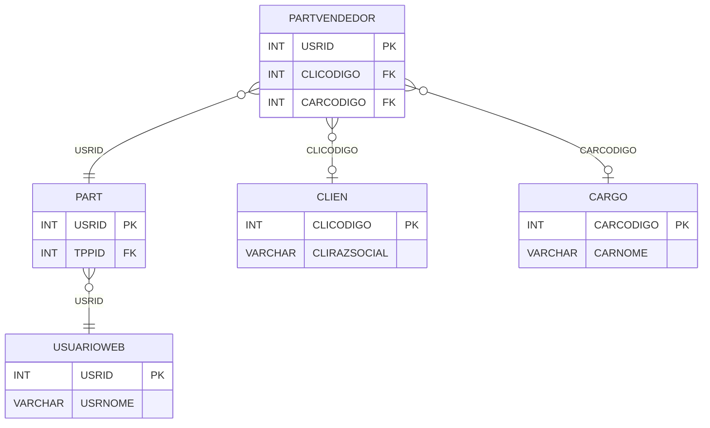

# PARTVENDEDOR - Documentação Completa de Relacionamentos

## 📊 Informações Gerais

- **Nome da Tabela**: PARTVENDEDOR (Participante Vendedor)
- **Total de Registros**: 802
- **Total de Colunas**: 3
- **Chave Primária**: USRID
- **Chaves Estrangeiras**: 3
- **Índices**: 0
- **Tabelas Dependentes**: 0
- **Banco de Dados**: Firebird

## 📝 Descrição

**PARTVENDEDOR** é uma tabela de detalhamento que armazena informações específicas de participantes do tipo vendedor no sistema de fidelidade. Com **802 registros**, esta tabela relaciona vendedores participantes com clientes específicos e cargos.

Esta tabela é essencial para:
- **Identificação**: Relacionar vendedores participantes com clientes e cargos
- **Rastreamento**: Rastrear quais clientes têm vendedores no programa
- **Relatórios**: Gerar relatórios específicos para vendedores

**Contexto de Negócio:**
Vendedores podem participar do programa de fidelidade e precisam estar vinculados ao cliente que representam e ao cargo que ocupam.

---

## 🔑 Estrutura de Colunas

| Coluna | Tipo | Descrição |
|--------|------|-----------|
| **USRID** 🔑 🔗 | INT | Código do usuário/participante (PK, FK → PART) |
| **CLICODIGO** 🔗 | INT | Código do cliente relacionado (FK → CLIEN) |
| **CARCODIGO** 🔗 | INT | Código do cargo do vendedor (FK → CARGO) |

---

## 🔗 Relacionamentos - Nível 1 (Diretos)

### PART - Participante (FK Obrigatória)
**Volume:** 3.133 registros

**Relacionamento:**
```
PARTVENDEDOR.USRID → PART.USRID (1:1)
Constraint: PART_PARTVENDEDOR
```

**Descrição:** Cada registro de vendedor está vinculado a um participante específico. Relacionamento 1:1.

**Proporção:** ~25,6% dos participantes são vendedores (802 / 3.133)

---

### CLIEN - Cliente (FK Opcional)
**Volume:** 9.251 registros

**Relacionamento:**
```
PARTVENDEDOR.CLICODIGO → CLIEN.CLICODIGO (N:1)
Constraint: CLIEN_PARTVENDEDOR
```

**Descrição:** Identifica o cliente relacionado ao vendedor participante.

---

### CARGO - Cargo (FK Opcional)
**Volume:** 10 registros

**Relacionamento:**
```
PARTVENDEDOR.CARCODIGO → CARGO.CARCODIGO (N:1)
Constraint: CARGO_PARTVENDEDOR
```

**Descrição:** Identifica o cargo do vendedor participante.

---

## 🔗 Relacionamentos - Nível 2 (Indiretos)

### PART → USUARIOWEB (Usuário Web)
**Volume:** 7.366 registros

**Relacionamento:**
```
PARTVENDEDOR → PART → USUARIOWEB
```

**Descrição:** Através de PART, é possível acessar informações do usuário web relacionado.

---

### CARGO → FUNCIO (Funcionários com o Cargo)
**Volume:** 435 registros

**Relacionamento:**
```
PARTVENDEDOR → CARGO → FUNCIO
```

**Descrição:** Através de CARGO, é possível identificar funcionários com o mesmo cargo.

---

## 🗺️ Diagrama de Relacionamentos



---

## 💡 Exemplos de Uso

### Consulta Básica

```sql
SELECT USRID, CLICODIGO, CARCODIGO
FROM PARTVENDEDOR
WHERE USRID = ?;
```

### Consulta com Informações do Cliente e Cargo

```sql
SELECT 
    pv.*,
    c.CLIRAZSOCIAL,
    c.CLINOMEFANT,
    car.CARNOME
FROM PARTVENDEDOR pv
LEFT JOIN CLIEN c
    ON pv.CLICODIGO = c.CLICODIGO
LEFT JOIN CARGO car
    ON pv.CARCODIGO = car.CARCODIGO
WHERE pv.USRID = ?;
```

### Consulta com Informações do Participante

```sql
SELECT 
    pv.*,
    p.PCTSALDOPENDENTE,
    p.PCTSALDOLIBERADO,
    u.USRNOME,
    u.EMAIL
FROM PARTVENDEDOR pv
INNER JOIN PART p
    ON pv.USRID = p.USRID
INNER JOIN USUARIOWEB u
    ON pv.USRID = u.USRID
WHERE pv.USRID = ?;
```

### Busca por Cliente

```sql
SELECT 
    pv.*,
    u.USRNOME,
    c.CLIRAZSOCIAL,
    car.CARNOME
FROM PARTVENDEDOR pv
INNER JOIN USUARIOWEB u
    ON pv.USRID = u.USRID
INNER JOIN CLIEN c
    ON pv.CLICODIGO = c.CLICODIGO
LEFT JOIN CARGO car
    ON pv.CARCODIGO = car.CARCODIGO
WHERE pv.CLICODIGO = ?;
```

### Estatísticas por Cargo

```sql
SELECT 
    car.CARNOME,
    COUNT(*) AS TOTAL_VENDEDORES
FROM PARTVENDEDOR pv
INNER JOIN CARGO car
    ON pv.CARCODIGO = car.CARCODIGO
GROUP BY car.CARCODIGO, car.CARNOME
ORDER BY TOTAL_VENDEDORES DESC;
```

### Inserção de Novo Vendedor

```sql
INSERT INTO PARTVENDEDOR (USRID, CLICODIGO, CARCODIGO)
VALUES (?, ?, ?);
```

---

## ⚡ Performance e Otimização

### Índices Recomendados

#### 1. Índice na Chave Primária (Já existe implicitamente)
```sql
-- Índice primário já existe implicitamente
```

#### 2. Índice em CLICODIGO
```sql
CREATE INDEX IDX_PARTVENDEDOR_CLICODIGO 
ON PARTVENDEDOR (CLICODIGO);
```

**Justificativa:** Facilita buscas por cliente.

#### 3. Índice em CARCODIGO
```sql
CREATE INDEX IDX_PARTVENDEDOR_CARCODIGO 
ON PARTVENDEDOR (CARCODIGO);
```

**Justificativa:** Facilita buscas por cargo.

---

## 📊 Estatísticas e Insights

### Volume de Dados

- **Total de Registros**: 802
- **Tamanho Médio Estimado**: ~20 bytes por registro
- **Tamanho Total Estimado**: ~16 KB

### Distribuição de Dados

- **Vendedores Únicos**: 802 vendedores participantes
- **Taxa de Participação**: ~25,6% dos participantes são vendedores

---

## 🔧 Integração com Código Laravel

### Model Eloquent

```php
<?php

namespace App\Models;

use Illuminate\Database\Eloquent\Model;
use Illuminate\Database\Eloquent\Relations\BelongsTo;

final class PartVendedor extends Model
{
    protected $table = 'PARTVENDEDOR';
    protected $primaryKey = 'USRID';
    public $incrementing = false;
    public $timestamps = false;

    protected $fillable = [
        'USRID',
        'CLICODIGO',
        'CARCODIGO',
    ];

    protected $casts = [
        'USRID' => 'integer',
        'CLICODIGO' => 'integer',
        'CARCODIGO' => 'integer',
    ];

    /**
     * Relacionamento com Participante
     */
    public function participante(): BelongsTo
    {
        return $this->belongsTo(Part::class, 'USRID', 'USRID');
    }

    /**
     * Relacionamento com Cliente
     */
    public function cliente(): BelongsTo
    {
        return $this->belongsTo(Clien::class, 'CLICODIGO', 'CLICODIGO');
    }

    /**
     * Relacionamento com Cargo
     */
    public function cargo(): BelongsTo
    {
        return $this->belongsTo(Cargo::class, 'CARCODIGO', 'CARCODIGO');
    }

    /**
     * Buscar vendedores por cliente
     */
    public static function porCliente(int $cliCodigo)
    {
        return self::where('CLICODIGO', $cliCodigo)
            ->with(['participante', 'cliente', 'cargo'])
            ->get();
    }

    /**
     * Buscar vendedores por cargo
     */
    public static function porCargo(int $carCodigo)
    {
        return self::where('CARCODIGO', $carCodigo)
            ->with(['participante', 'cliente', 'cargo'])
            ->get();
    }
}
```

---

## ✅ Boas Práticas

### Design

1. **Chave Primária**: USRID deve corresponder a um PART válido do tipo vendedor
2. **Validação**: Validar CLICODIGO e CARCODIGO antes de inserir
3. **Integridade**: Manter consistência entre PART, CLIEN e CARGO

### Performance

1. **Índices**: Usar índices para busca por cliente e cargo
2. **Consultas**: Usar eager loading para relacionamentos

### Segurança

1. **Validação**: Validar CLICODIGO e CARCODIGO antes de inserir
2. **Acesso**: Restringir acesso de escrita a usuários autorizados

---

**Documentação gerada em**: 2025-01-27

**Banco de dados**: Firebird

