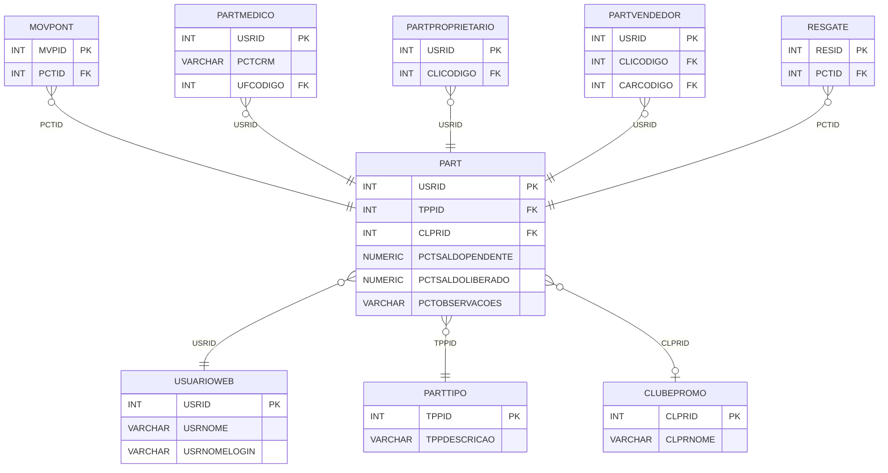

# PART - Documentação Completa de Relacionamentos

## 📊 Informações Gerais

- **Nome da Tabela**: PART (Participante - Sistema de Fidelidade/Prêmios)
- **Total de Registros**: 3.133
- **Total de Colunas**: 6
- **Chave Primária**: USRID
- **Chaves Estrangeiras**: 3
- **Índices**: 0
- **Tabelas Dependentes**: 9
- **Banco de Dados**: Firebird

## 📝 Descrição

**PART** é a tabela central do sistema de fidelidade e prêmios. Ela representa cada participante (usuário web) cadastrado no programa de pontos e prêmios. Com **3.133 registros**, esta tabela armazena informações sobre saldos pendentes e liberados de pontos, observações e relaciona o participante com seu tipo e clube de promoção.

Esta tabela é essencial para:
- **Gestão de Participantes**: Controlar todos os participantes do programa de fidelidade
- **Saldos de Pontos**: Manter saldos pendentes e liberados de cada participante
- **Classificação**: Relacionar participantes com tipos e clubes de promoção
- **Rastreamento**: Permitir rastreamento de movimentações e resgates

**Contexto de Negócio:**
O sistema de fidelidade permite que usuários web acumulem pontos através de compras e outras ações, que podem ser convertidos em prêmios. A tabela PART é o registro central de cada participante.

---

## 🔑 Estrutura de Colunas

### Identificação e Controle
| Coluna | Tipo | Descrição |
|--------|------|-----------|
| **USRID** 🔑 🔗 | INT | Código do usuário web (PK, FK → USUARIOWEB) |
| **TPPID** 🔗 | INT | Código do tipo de participante (FK → PARTTIPO) |
| **CLPRID** 🔗 | INT | Código do clube de promoção (FK → CLUBEPROMO) |

### Saldos e Valores
| Coluna | Tipo | Descrição |
|--------|------|-----------|
| **PCTSALDOPENDENTE** | NUMERIC(16,2) | Saldo de pontos pendente de liberação |
| **PCTSALDOLIBERADO** | NUMERIC(16,2) | Saldo de pontos liberado para uso |

### Observações
| Coluna | Tipo | Descrição |
|--------|------|-----------|
| **PCTOBSERVACOES** | VARCHAR(37) | Observações sobre o participante |

---

## 🔗 Relacionamentos - Nível 1 (Diretos)

### USUARIOWEB - Usuário Web (FK Obrigatória)
**Volume:** 7.366 registros

**Relacionamento:**
```
PART.USRID → USUARIOWEB.USRID (1:1)
Constraint: USUARIOWEB_PART
```

**Descrição:** Cada participante está vinculado a um usuário web específico. Relacionamento 1:1, onde cada usuário pode ter no máximo um registro de participante.

**Proporção:** ~42,5% dos usuários web são participantes (3.133 / 7.366)

---

### PARTTIPO - Tipo de Participante (FK Obrigatória)
**Volume:** 6 registros

**Relacionamento:**
```
PART.TPPID → PARTTIPO.TPPID (N:1)
Constraint: PARTTIPO_PART
```

**Descrição:** Define o tipo de participante (Médico, Vendedor, Proprietário, etc.).

**Valores possíveis:**
- Tipos específicos definidos em PARTTIPO
- Cada tipo pode ter regras diferentes de pontuação

---

### CLUBEPROMO - Clube de Promoção (FK Opcional)
**Volume:** 0 registros (tabela vazia no momento)

**Relacionamento:**
```
PART.CLPRID → CLUBEPROMO.CLPRID (N:1)
Constraint: CLUBEPROMO_PART
```

**Descrição:** Relaciona o participante com um clube de promoção específico, quando aplicável.

---

## 🔗 Relacionamentos - Nível 2 (Indiretos)

### USUARIOWEB → GRUPOCLI (Grupo de Clientes)
**Volume:** 320 registros

**Relacionamento:**
```
PART → USUARIOWEB → GRUPOCLI
```

**Descrição:** Através de USUARIOWEB, é possível identificar o grupo de clientes do participante.

---

### PARTTIPO → OBRIGAPARTTIPO (Obrigações por Tipo)
**Volume:** 68 registros

**Relacionamento:**
```
PART → PARTTIPO → OBRIGAPARTTIPO
```

**Descrição:** Através de PARTTIPO, é possível identificar obrigações específicas para cada tipo de participante.

---

## 🔗 Relacionamentos - Nível 3 (Fluxo Completo)

### Fluxo: Participante → Movimentações → Produtos/Serviços

```
PART (Participante)
    ↓ FK (USRID)
MOVPONT (Movimentação de Pontos)
    ↓ FK (PCTID = USRID)
TABELAPONTUACAO (Tabela de Pontuação)
    ↓ FK (TAPID)
PONTPRODU / PONTSERVI (Regras de Pontuação)
    ↓ (informações de produtos/serviços)
PRODU / SERVI
```

**Descrição:** Permite rastrear desde um participante até as movimentações de pontos e produtos/serviços relacionados.

---

### Fluxo: Participante → Resgates → Prêmios

```
PART (Participante)
    ↓ FK (PCTID = USRID)
RESGATE (Resgate de Prêmios)
    ↓ (informações de resgate)
PREMIO (Prêmios disponíveis)
```

**Descrição:** Permite rastrear resgates de prêmios realizados por cada participante.

---

## 📊 Tabelas que Referenciam Esta

Esta tabela é referenciada por 9 tabelas:

### 1. FOLLOWUP - Acompanhamento
**Volume:** 0 registros

**Relacionamento:**
```
FOLLOWUP.USRID → PART.USRID (N:1)
Constraint: USER_FK
```

**Descrição:** Registra acompanhamentos relacionados ao participante.

---

### 2. MOVPONT - Movimentação de Pontos
**Volume:** 0 registros

**Relacionamento:**
```
MOVPONT.PCTID → PART.USRID (N:1)
Constraint: PART_MOVPONT
```

**Descrição:** Registra todas as movimentações de pontos do participante (créditos e débitos).

---

### 3. PARTMEDICO - Participante Médico
**Volume:** 2.118 registros

**Relacionamento:**
```
PARTMEDICO.USRID → PART.USRID (1:1)
Constraint: PART_PARTMEDICO
```

**Descrição:** Informações específicas de participantes do tipo médico (CRM, UF).

---

### 4. PARTPROPRIETARIO - Participante Proprietário
**Volume:** 198 registros

**Relacionamento:**
```
PARTPROPRIETARIO.USRID → PART.USRID (1:1)
Constraint: PART_PARTPROPRIETARIO
```

**Descrição:** Relaciona participantes proprietários com clientes específicos.

---

### 5. PARTVENDEDOR - Participante Vendedor
**Volume:** 802 registros

**Relacionamento:**
```
PARTVENDEDOR.USRID → PART.USRID (1:1)
Constraint: PART_PARTVENDEDOR
```

**Descrição:** Informações específicas de participantes do tipo vendedor (cliente, cargo).

---

### 6. PONTCOMBINADO - Pontos Combinados
**Volume:** Variável

**Relacionamento:**
```
PONTCOMBINADO.USRID → PART.USRID (N:1)
Constraint: USRID_PONTCOMBINADO
```

**Descrição:** Registra pontos combinados do participante.

---

### 7. PONTPRODUPART - Pontos por Produto e Participante
**Volume:** Variável

**Relacionamento:**
```
PONTPRODUPART.USRID → PART.USRID (N:1)
Constraint: PONTPRODUPART_PART
```

**Descrição:** Relaciona produtos com participantes para cálculo de pontos.

---

### 8. PONTSERVIPART - Pontos por Serviço e Participante
**Volume:** Variável

**Relacionamento:**
```
PONTSERVIPART.USRID → PART.USRID (N:1)
Constraint: PONTSERVIPART_PART
```

**Descrição:** Relaciona serviços com participantes para cálculo de pontos.

---

### 9. RESGATE - Resgate de Prêmios
**Volume:** Variável

**Relacionamento:**
```
RESGATE.PCTID → PART.USRID (N:1)
Constraint: PART_RESGATE
```

**Descrição:** Registra resgates de prêmios realizados pelo participante.

---

## 🗺️ Diagrama de Relacionamentos



---

## 💡 Exemplos de Uso

### Consulta Básica de Participante

```sql
SELECT 
    USRID,
    TPPID,
    CLPRID,
    PCTSALDOPENDENTE,
    PCTSALDOLIBERADO,
    PCTOBSERVACOES
FROM PART
WHERE USRID = ?;
```

### Consulta com Informações do Usuário

```sql
SELECT 
    p.*,
    u.USRNOME,
    u.USRNOMELOGIN,
    u.EMAIL
FROM PART p
INNER JOIN USUARIOWEB u
    ON p.USRID = u.USRID
WHERE p.USRID = ?;
```

### Consulta com Tipo de Participante

```sql
SELECT 
    p.*,
    pt.TPPDESCRICAO,
    pt.TPPPALAVRACHAVE
FROM PART p
INNER JOIN PARTTIPO pt
    ON p.TPPID = pt.TPPID
WHERE p.USRID = ?;
```

### Consulta de Saldos por Tipo

```sql
SELECT 
    pt.TPPDESCRICAO,
    COUNT(*) AS TOTAL_PARTICIPANTES,
    SUM(p.PCTSALDOPENDENTE) AS SALDO_PENDENTE_TOTAL,
    SUM(p.PCTSALDOLIBERADO) AS SALDO_LIBERADO_TOTAL
FROM PART p
INNER JOIN PARTTIPO pt
    ON p.TPPID = pt.TPPID
GROUP BY pt.TPPID, pt.TPPDESCRICAO
ORDER BY TOTAL_PARTICIPANTES DESC;
```

### Consulta de Participantes com Movimentações

```sql
SELECT 
    p.*,
    COUNT(m.MVPID) AS TOTAL_MOVIMENTACOES,
    SUM(CASE WHEN m.MVPOPERACAO = 'CREDITO' THEN m.MVPVRPONTUACAO ELSE 0 END) AS TOTAL_CREDITOS,
    SUM(CASE WHEN m.MVPOPERACAO = 'DEBITO' THEN m.MVPVRPONTUACAO ELSE 0 END) AS TOTAL_DEBITOS
FROM PART p
LEFT JOIN MOVPONT m
    ON p.USRID = m.PCTID
GROUP BY p.USRID, p.TPPID, p.CLPRID, p.PCTSALDOPENDENTE, p.PCTSALDOLIBERADO, p.PCTOBSERVACOES
ORDER BY TOTAL_MOVIMENTACOES DESC;
```

### Consulta de Participantes Médicos

```sql
SELECT 
    p.*,
    pm.PCTCRM,
    u.UFNOME
FROM PART p
INNER JOIN PARTMEDICO pm
    ON p.USRID = pm.USRID
INNER JOIN UF u
    ON pm.UFCODIGO = u.UFCODIGO
WHERE p.TPPID = (SELECT TPPID FROM PARTTIPO WHERE TPPDESCRICAO = 'MEDICO')
ORDER BY pm.PCTCRM;
```

### Inserção de Novo Participante

```sql
INSERT INTO PART (
    USRID,
    TPPID,
    CLPRID,
    PCTSALDOPENDENTE,
    PCTSALDOLIBERADO,
    PCTOBSERVACOES
)
VALUES (?, ?, ?, 0, 0, ?);
```

### Atualização de Saldo

```sql
UPDATE PART
SET PCTSALDOLIBERADO = PCTSALDOLIBERADO + ?,
    PCTSALDOPENDENTE = PCTSALDOPENDENTE - ?
WHERE USRID = ?;
```

---

## ⚡ Performance e Otimização

### Índices Recomendados

#### 1. Índice na Chave Primária (Já existe implicitamente)
```sql
-- Índice primário já existe implicitamente
-- USRID é a chave primária
```

#### 2. Índice em TPPID
```sql
CREATE INDEX IDX_PART_TPPID 
ON PART (TPPID);
```

**Justificativa:** Facilita buscas por tipo de participante.

#### 3. Índice em CLPRID
```sql
CREATE INDEX IDX_PART_CLPRID 
ON PART (CLPRID);
```

**Justificativa:** Facilita buscas por clube de promoção.

---

## 📊 Estatísticas e Insights

### Volume de Dados

- **Total de Registros**: 3.133
- **Tamanho Médio Estimado**: ~50 bytes por registro
- **Tamanho Total Estimado**: ~157 KB

### Distribuição de Dados

- **Participantes Únicos**: 3.133 usuários
- **Taxa de Participação**: ~42,5% dos usuários web são participantes
- **Taxa de Utilização**: Alta (sistema ativo de fidelidade)

### Análise de Uso

- **Tipo de Tabela**: Mestre de participantes
- **Frequência de Acesso**: Alta (consultas frequentes para sistema de pontos)
- **Padrão de Acesso**: Leitura frequente, escrita durante cadastros e atualizações de saldo

---

## 🔧 Integração com Código Laravel

### Model Eloquent

```php
<?php

namespace App\Models;

use Illuminate\Database\Eloquent\Model;
use Illuminate\Database\Eloquent\Relations\BelongsTo;
use Illuminate\Database\Eloquent\Relations\HasMany;
use Illuminate\Database\Eloquent\Relations\HasOne;

final class Part extends Model
{
    protected $table = 'PART';
    protected $primaryKey = 'USRID';
    public $incrementing = false;
    public $timestamps = false;

    protected $fillable = [
        'USRID',
        'TPPID',
        'CLPRID',
        'PCTSALDOPENDENTE',
        'PCTSALDOLIBERADO',
        'PCTOBSERVACOES',
    ];

    protected $casts = [
        'USRID' => 'integer',
        'TPPID' => 'integer',
        'CLPRID' => 'integer',
        'PCTSALDOPENDENTE' => 'decimal:2',
        'PCTSALDOLIBERADO' => 'decimal:2',
        'PCTOBSERVACOES' => 'string',
    ];

    /**
     * Relacionamento com Usuário Web
     */
    public function usuarioWeb(): BelongsTo
    {
        return $this->belongsTo(UsuarioWeb::class, 'USRID', 'USRID');
    }

    /**
     * Relacionamento com Tipo de Participante
     */
    public function tipo(): BelongsTo
    {
        return $this->belongsTo(PartTipo::class, 'TPPID', 'TPPID');
    }

    /**
     * Relacionamento com Clube de Promoção
     */
    public function clubePromo(): BelongsTo
    {
        return $this->belongsTo(ClubePromo::class, 'CLPRID', 'CLPRID');
    }

    /**
     * Relacionamento com Movimentações de Pontos
     */
    public function movimentacoes(): HasMany
    {
        return $this->hasMany(MovPont::class, 'PCTID', 'USRID');
    }

    /**
     * Relacionamento com Participante Médico
     */
    public function medico(): HasOne
    {
        return $this->hasOne(PartMedico::class, 'USRID', 'USRID');
    }

    /**
     * Relacionamento com Participante Proprietário
     */
    public function proprietario(): HasOne
    {
        return $this->hasOne(PartProprietario::class, 'USRID', 'USRID');
    }

    /**
     * Relacionamento com Participante Vendedor
     */
    public function vendedor(): HasOne
    {
        return $this->hasOne(PartVendedor::class, 'USRID', 'USRID');
    }

    /**
     * Relacionamento com Resgates
     */
    public function resgates(): HasMany
    {
        return $this->hasMany(Resgate::class, 'PCTID', 'USRID');
    }

    /**
     * Buscar participante por usuário
     */
    public static function porUsuario(int $usrId): ?self
    {
        return self::with(['usuarioWeb', 'tipo', 'clubePromo'])
            ->find($usrId);
    }

    /**
     * Buscar participantes por tipo
     */
    public static function porTipo(int $tppId)
    {
        return self::where('TPPID', $tppId)
            ->with(['usuarioWeb', 'tipo'])
            ->get();
    }

    /**
     * Calcular saldo total
     */
    public function getSaldoTotalAttribute(): float
    {
        return (float) $this->PCTSALDOPENDENTE + (float) $this->PCTSALDOLIBERADO;
    }

    /**
     * Adicionar pontos pendentes
     */
    public function adicionarPontosPendentes(float $valor): bool
    {
        $this->PCTSALDOPENDENTE += $valor;
        return $this->save();
    }

    /**
     * Liberar pontos pendentes
     */
    public function liberarPontos(float $valor): bool
    {
        if ($this->PCTSALDOPENDENTE < $valor) {
            return false;
        }

        $this->PCTSALDOPENDENTE -= $valor;
        $this->PCTSALDOLIBERADO += $valor;
        return $this->save();
    }

    /**
     * Utilizar pontos liberados
     */
    public function utilizarPontos(float $valor): bool
    {
        if ($this->PCTSALDOLIBERADO < $valor) {
            return false;
        }

        $this->PCTSALDOLIBERADO -= $valor;
        return $this->save();
    }
}
```

### Uso no Controller

```php
use App\Models\Part;

// Buscar participante
$participante = Part::porUsuario($usrId);

// Adicionar pontos
$participante->adicionarPontosPendentes(100.00);

// Liberar pontos
$participante->liberarPontos(50.00);

// Utilizar pontos
$participante->utilizarPontos(25.00);

// Saldo total
$saldoTotal = $participante->saldo_total;
```

---

## ✅ Boas Práticas

### Design

1. **Chave Primária**: USRID deve ser único e corresponder a um USUARIOWEB válido
2. **Validação**: Validar TPPID e CLPRID antes de inserir/atualizar
3. **Saldos**: Manter consistência entre saldos pendentes e liberados

### Performance

1. **Índices**: Usar índices para buscas por tipo e clube
2. **Consultas**: Usar eager loading para relacionamentos
3. **Agregações**: Usar SUM/COUNT com GROUP BY quando necessário

### Manutenção

1. **Backup**: Fazer backup regular desta tabela
2. **Auditoria**: Considerar tabela de histórico para mudanças de saldo
3. **Validação**: Validar valores antes de atualizações

### Segurança

1. **Acesso**: Restringir acesso de escrita a usuários autorizados
2. **Validação**: Validar todos os valores antes de inserir
3. **Logs**: Registrar mudanças em saldos críticos

---

**Documentação gerada em**: 2025-01-27

**Banco de dados**: Firebird

