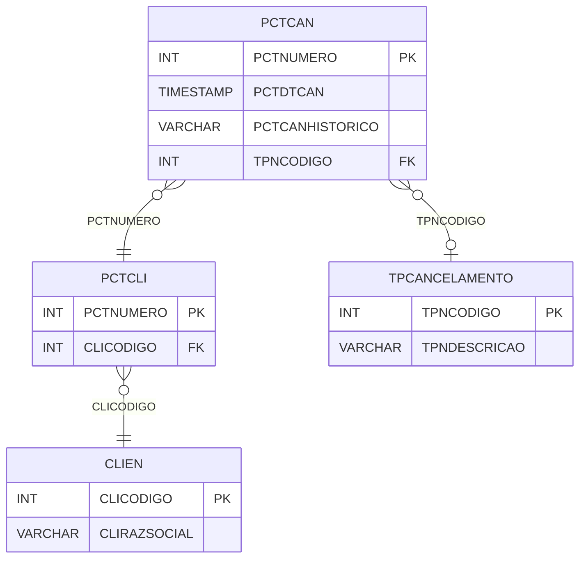

# PCTCAN - Documentação Completa de Relacionamentos

## 📊 Informações Gerais

- **Nome da Tabela**: PCTCAN (Parcela Cliente - Cancelamento)
- **Total de Registros**: 31
- **Total de Colunas**: 4
- **Chave Primária**: PCTNUMERO
- **Chaves Estrangeiras**: 2
- **Índices**: 0
- **Tabelas Dependentes**: 0
- **Banco de Dados**: Firebird

## 📝 Descrição

**PCTCAN** é uma tabela de auditoria que registra cancelamentos de parcelas de clientes. Com **31 registros**, esta tabela armazena informações sobre quando e por que uma parcela foi cancelada, mantendo histórico para rastreamento e auditoria.

Esta tabela é essencial para:
- **Auditoria**: Manter histórico de cancelamentos de parcelas
- **Rastreamento**: Rastrear motivos de cancelamento
- **Compliance**: Atender requisitos de auditoria e compliance
- **Análise**: Analisar padrões de cancelamento

**Contexto de Negócio:**
Quando uma parcela de cliente é cancelada, esta tabela registra a data do cancelamento, o motivo (tipo de cancelamento) e um histórico descritivo do cancelamento.

---

## 🔑 Estrutura de Colunas

| Coluna | Tipo | Descrição |
|--------|------|-----------|
| **PCTNUMERO** 🔑 🔗 | INT | Código da parcela cancelada (PK, FK → PCTCLI) |
| **PCTDTCAN** | TIMESTAMP | Data/hora do cancelamento |
| **PCTCANHISTORICO** | VARCHAR(37) | Histórico/descrição do cancelamento |
| **TPNCODIGO** 🔗 | INT | Código do tipo de cancelamento (FK → TPCANCELAMENTO) |

---

## 🔗 Relacionamentos - Nível 1 (Diretos)

### PCTCLI - Parcela Cliente (FK Obrigatória)
**Volume:** 1.301 registros

**Relacionamento:**
```
PCTCAN.PCTNUMERO → PCTCLI.PCTNUMERO (1:1)
Constraint: PCTCLI_PCTCAN
```

**Descrição:** Cada registro de cancelamento está vinculado a uma parcela específica. Relacionamento 1:1, onde cada parcela pode ter no máximo um registro de cancelamento.

**Proporção:** ~2,4% das parcelas foram canceladas (31 / 1.301)

---

### TPCANCELAMENTO - Tipo de Cancelamento (FK Opcional)
**Volume:** 10 registros

**Relacionamento:**
```
PCTCAN.TPNCODIGO → TPCANCELAMENTO.TPNCODIGO (N:1)
Constraint: TPCANCELAMENTO_PCTCAN
```

**Descrição:** Define o motivo/tipo do cancelamento (erro de digitação, solicitação do cliente, etc.).

---

## 🔗 Relacionamentos - Nível 2 (Indiretos)

### PCTCLI → CLIEN (Cliente)
**Volume:** 9.251 registros

**Relacionamento:**
```
PCTCAN → PCTCLI → CLIEN
```

**Descrição:** Através de PCTCLI, é possível identificar o cliente relacionado à parcela cancelada.

---

### PCTCLI → BCOCOB (Banco/Cobrança)
**Volume:** 11 registros

**Relacionamento:**
```
PCTCAN → PCTCLI → BCOCOB
```

**Descrição:** Através de PCTCLI, é possível identificar informações bancárias relacionadas.

---

## 🗺️ Diagrama de Relacionamentos



---

## 💡 Exemplos de Uso

### Consulta Básica

```sql
SELECT PCTNUMERO, PCTDTCAN, PCTCANHISTORICO, TPNCODIGO
FROM PCTCAN
WHERE PCTNUMERO = ?;
```

### Consulta com Informações da Parcela e Cliente

```sql
SELECT 
    pc.*,
    pct.PCTDESCRICAO,
    pct.PCTVRTOTAL,
    c.CLIRAZSOCIAL,
    c.CLINOMEFANT
FROM PCTCAN pc
INNER JOIN PCTCLI pct
    ON pc.PCTNUMERO = pct.PCTNUMERO
INNER JOIN CLIEN c
    ON pct.CLICODIGO = c.CLICODIGO
WHERE pc.PCTNUMERO = ?;
```

### Consulta com Tipo de Cancelamento

```sql
SELECT 
    pc.*,
    tp.TPNDESCRICAO
FROM PCTCAN pc
LEFT JOIN TPCANCELAMENTO tp
    ON pc.TPNCODIGO = tp.TPNCODIGO
ORDER BY pc.PCTDTCAN DESC;
```

### Estatísticas de Cancelamento por Tipo

```sql
SELECT 
    tp.TPNDESCRICAO,
    COUNT(*) AS TOTAL_CANCELAMENTOS
FROM PCTCAN pc
INNER JOIN TPCANCELAMENTO tp
    ON pc.TPNCODIGO = tp.TPNCODIGO
GROUP BY tp.TPNCODIGO, tp.TPNDESCRICAO
ORDER BY TOTAL_CANCELAMENTOS DESC;
```

### Inserção de Cancelamento

```sql
INSERT INTO PCTCAN (PCTNUMERO, PCTDTCAN, PCTCANHISTORICO, TPNCODIGO)
VALUES (?, CURRENT_TIMESTAMP, ?, ?);
```

---

## ⚡ Performance e Otimização

### Índices Recomendados

#### 1. Índice na Chave Primária (Já existe implicitamente)
```sql
-- Índice primário já existe implicitamente
```

#### 2. Índice em PCTDTCAN
```sql
CREATE INDEX IDX_PCTCAN_PCTDTCAN 
ON PCTCAN (PCTDTCAN);
```

**Justificativa:** Facilita buscas por data de cancelamento.

---

## 📊 Estatísticas e Insights

### Volume de Dados

- **Total de Registros**: 31
- **Tamanho Médio Estimado**: ~50 bytes por registro
- **Tamanho Total Estimado**: ~1.5 KB

### Distribuição de Dados

- **Parcelas Canceladas**: 31 parcelas
- **Taxa de Cancelamento**: ~2,4% das parcelas foram canceladas

---

## 🔧 Integração com Código Laravel

### Model Eloquent

```php
<?php

namespace App\Models;

use Illuminate\Database\Eloquent\Model;
use Illuminate\Database\Eloquent\Relations\BelongsTo;

final class PctCan extends Model
{
    protected $table = 'PCTCAN';
    protected $primaryKey = 'PCTNUMERO';
    public $incrementing = false;
    public $timestamps = false;

    protected $fillable = [
        'PCTNUMERO',
        'PCTDTCAN',
        'PCTCANHISTORICO',
        'TPNCODIGO',
    ];

    protected $casts = [
        'PCTNUMERO' => 'integer',
        'PCTDTCAN' => 'datetime',
        'PCTCANHISTORICO' => 'string',
        'TPNCODIGO' => 'integer',
    ];

    /**
     * Relacionamento com Parcela Cliente
     */
    public function parcelaCliente(): BelongsTo
    {
        return $this->belongsTo(PctCli::class, 'PCTNUMERO', 'PCTNUMERO');
    }

    /**
     * Relacionamento com Tipo de Cancelamento
     */
    public function tipoCancelamento(): BelongsTo
    {
        return $this->belongsTo(TpCancelamento::class, 'TPNCODIGO', 'TPNCODIGO');
    }

    /**
     * Cancelar parcela
     */
    public static function cancelar(int $pctNumero, int $tpnCodigo, string $historico): self
    {
        return self::create([
            'PCTNUMERO' => $pctNumero,
            'PCTDTCAN' => now(),
            'PCTCANHISTORICO' => $historico,
            'TPNCODIGO' => $tpnCodigo,
        ]);
    }
}
```

---

## ✅ Boas Práticas

### Design

1. **Chave Primária**: PCTNUMERO deve corresponder a uma PCTCLI válida
2. **Validação**: Validar TPNCODIGO antes de inserir
3. **Histórico**: Sempre preencher PCTCANHISTORICO com descrição clara

### Performance

1. **Índices**: Usar índice para busca por data
2. **Consultas**: Usar eager loading para relacionamentos

### Segurança

1. **Validação**: Validar todos os valores antes de inserir
2. **Acesso**: Restringir acesso de escrita a usuários autorizados
3. **Auditoria**: Manter histórico completo de cancelamentos

---

**Documentação gerada em**: 2025-01-27

**Banco de dados**: Firebird

