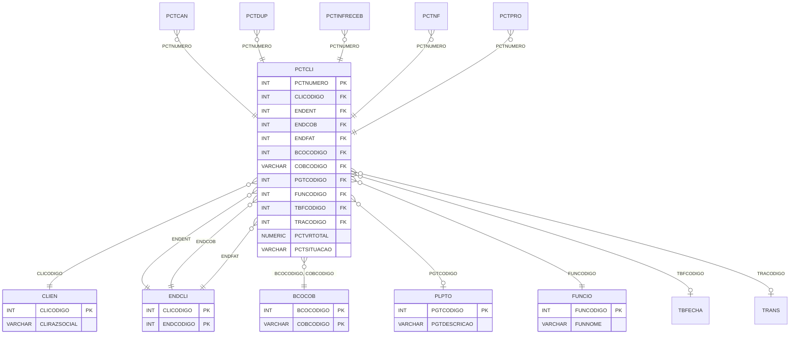

# PCTCLI - Documentação Completa de Relacionamentos

## 📊 Informações Gerais

- **Nome da Tabela**: PCTCLI (Parcela Cliente)
- **Total de Registros**: 1.301
- **Total de Colunas**: 28
- **Chave Primária**: PCTNUMERO
- **Chaves Estrangeiras**: 13
- **Índices**: 0
- **Tabelas Dependentes**: 12
- **Banco de Dados**: Firebird

## 📝 Descrição

**PCTCLI** é a tabela central de parcelas de clientes, representando contratos ou acordos de pagamento parcelado com clientes. Com **1.301 registros**, esta tabela armazena informações sobre valores, datas, situações, endereços, formas de pagamento e outras configurações relacionadas a parcelas de clientes.

Esta tabela é essencial para:
- **Gestão de Parcelas**: Controlar todas as parcelas de clientes
- **Financeiro**: Gerenciar valores e situações de parcelas
- **Endereços**: Relacionar endereços de entrega, cobrança e faturamento
- **Formas de Pagamento**: Configurar formas de recebimento

**Contexto de Negócio:**
Parcelas de clientes representam acordos de pagamento parcelado, onde um cliente pode ter múltiplas parcelas com diferentes valores, datas e formas de pagamento.

---

## 🔑 Estrutura de Colunas

### Identificação e Controle
| Coluna | Tipo | Descrição |
|--------|------|-----------|
| **PCTNUMERO** 🔑 | INT | Código único da parcela (PK) |
| **PCTDESCRICAO** | VARCHAR(37) | Descrição da parcela |
| **PCTSITUACAO** | VARCHAR(14) | Situação da parcela (ATIVA, SUSPENSA, FECHADA) |
| **PCTALTERADO** | VARCHAR(14) | Flag indicando se foi alterado |

### Datas
| Coluna | Tipo | Descrição |
|--------|------|-----------|
| **PCTDTCAD** | DATE | Data de cadastro |
| **PCTDTINI** | DATE | Data inicial |
| **PCTDTFIM** | DATE | Data final |
| **PCTDTFECHA** | DATE | Data de fechamento |
| **PCTDTSUSP** | DATE | Data de suspensão |

### Valores
| Coluna | Tipo | Descrição |
|--------|------|-----------|
| **PCTVRMERC** | NUMERIC(16,2) | Valor de mercadorias |
| **PCTVRSERVI** | NUMERIC(16,2) | Valor de serviços |
| **PCTVRTOTAL** | NUMERIC(16,2) | Valor total |

### Relacionamentos com Cliente
| Coluna | Tipo | Descrição |
|--------|------|-----------|
| **CLICODIGO** 🔗 | INT | Código do cliente (FK → CLIEN) |
| **ENDENT** 🔗 | INT | Código do endereço de entrega (FK → ENDCLI) |
| **ENDCOB** 🔗 | INT | Código do endereço de cobrança (FK → ENDCLI) |
| **ENDFAT** 🔗 | INT | Código do endereço de faturamento (FK → ENDCLI) |

### Formas de Pagamento e Financeiro
| Coluna | Tipo | Descrição |
|--------|------|-----------|
| **PGTCODIGO** 🔗 | INT | Código do plano de pagamento (FK → PLPTO) |
| **BCOCODIGO** 🔗 | INT | Código do banco (FK → BCOCOB) |
| **COBCODIGO** 🔗 | VARCHAR(14) | Código de cobrança (FK → BCOCOB) |
| **TBFCODIGO** 🔗 | INT | Código da tabela de fechamento (FK → TBFECHA) |

### Outros Relacionamentos
| Coluna | Tipo | Descrição |
|--------|------|-----------|
| **TRACODIGO** 🔗 | INT | Código da transportadora (FK → TRANS) |
| **FUNCODIGO** 🔗 | INT | Código do funcionário (FK → FUNCIO) |
| **CUSCODIGO** | VARCHAR(14) | Código do centro de custo |
| **OBSCODIGO** | INT | Código de observação |

### Outros Campos
| Coluna | Tipo | Descrição |
|--------|------|-----------|
| **PCTOBSER** | VARCHAR(261) | Observações |
| **PCTINFRECEB** | VARCHAR(14) | Flag de informação de recebimento |
| **PCTSUSPOBS** | VARCHAR(37) | Observação de suspensão |
| **TIPONB** | VARCHAR(14) | Tipo de nota bancária |

---

## 🔗 Relacionamentos - Nível 1 (Diretos)

### CLIEN - Cliente (FK Obrigatória)
**Volume:** 9.251 registros

**Relacionamento:**
```
PCTCLI.CLICODIGO → CLIEN.CLICODIGO (N:1)
Constraint: CLIEN_PCTCLI
```

**Descrição:** Cada parcela está vinculada a um cliente específico.

---

### ENDCLI - Endereços do Cliente (FK Obrigatórias)
**Volume:** 9.272 registros

**Relacionamentos:**
```
PCTCLI.ENDENT → ENDCLI.ENDCODIGO (N:1) [Endereço de Entrega]
PCTCLI.ENDCOB → ENDCLI.ENDCODIGO (N:1) [Endereço de Cobrança]
PCTCLI.ENDFAT → ENDCLI.ENDCODIGO (N:1) [Endereço de Faturamento]
Constraints: ENDCLIC_PCTCLI, ENDCLIE_PCTCLI, ENDCLIF_PCTCLI
```

**Descrição:** Relaciona a parcela com três tipos de endereços do cliente.

---

### BCOCOB - Banco/Cobrança (FK Obrigatórias)
**Volume:** 11 registros

**Relacionamentos:**
```
PCTCLI.BCOCODIGO → BCOCOB.BCOCODIGO (N:1)
PCTCLI.COBCODIGO → BCOCOB.COBCODIGO (N:1)
Constraint: BCOCOB_PCTCLI
```

**Descrição:** Relaciona a parcela com banco e configuração de cobrança.

---

### PLPTO - Plano de Pagamento (FK Opcional)
**Volume:** 173 registros

**Relacionamento:**
```
PCTCLI.PGTCODIGO → PLPTO.PGTCODIGO (N:1)
Constraint: PLPTO_PCTCLI
```

**Descrição:** Define o plano de pagamento da parcela.

---

### FUNCIO - Funcionário (FK Obrigatória)
**Volume:** 435 registros

**Relacionamento:**
```
PCTCLI.FUNCODIGO → FUNCIO.FUNCODIGO (N:1)
Constraint: FUNCIO_PCTCLI
```

**Descrição:** Identifica o funcionário responsável pela parcela.

---

### TBFECHA - Tabela de Fechamento (FK Opcional)
**Volume:** 7 registros

**Relacionamento:**
```
PCTCLI.TBFCODIGO → TBFECHA.TBFCODIGO (N:1)
Constraint: TBFECHA_PCTCLI
```

**Descrição:** Define a tabela de fechamento para cálculo de datas.

---

### TRANS - Transportadora (FK Opcional)
**Volume:** 115 registros

**Relacionamento:**
```
PCTCLI.TRACODIGO → TRANS.TRACODIGO (N:1)
Constraint: TRANS_PCTCLI
```

**Descrição:** Identifica a transportadora relacionada.

---

## 📊 Tabelas que Referenciam Esta

Esta tabela é referenciada por 12 tabelas:

### 1. PCTCAN - Cancelamento
**Volume:** 31 registros

**Relacionamento:**
```
PCTCAN.PCTNUMERO → PCTCLI.PCTNUMERO (1:1)
```

---

### 2. PCTDUP - Duplicatas
**Volume:** 3.434 registros

**Relacionamento:**
```
PCTDUP.PCTNUMERO → PCTCLI.PCTNUMERO (N:1)
```

---

### 3. PCTINFRECEB - Informações de Recebimento
**Volume:** 1.301 registros

**Relacionamento:**
```
PCTINFRECEB.PCTNUMERO → PCTCLI.PCTNUMERO (N:1)
```

---

### 4. PCTNF - Notas Fiscais
**Volume:** 241 registros

**Relacionamento:**
```
PCTNF.PCTNUMERO → PCTCLI.PCTNUMERO (N:1)
```

---

### 5. PCTPEDFO - Pedidos Fornecedor
**Volume:** 41 registros

**Relacionamento:**
```
PCTPEDFO.PCTNUMERO → PCTCLI.PCTNUMERO (N:1)
```

---

### 6. PCTPRO - Produtos
**Volume:** 1.560 registros

**Relacionamento:**
```
PCTPRO.PCTNUMERO → PCTCLI.PCTNUMERO (N:1)
```

---

### 7. PCTEMPRE - Empresas
**Volume:** 1.291 registros

**Relacionamento Lógico:**
```
PCTEMPRE.PCTNUMERO → PCTCLI.PCTNUMERO (N:1)
```

---

### Outras Tabelas:
- **PCTCTCUSTO** - Centro de Custo
- **PCTRECP** - Recibos
- **PCTSER** - Serviços
- **PCTTPPEDID** - Tipos de Pedido
- **PDSER** - Serviços de Pedido
- **TBFISFORAPCTCLI** - Tabelas Fiscais

---

## 🗺️ Diagrama de Relacionamentos



---

## 💡 Exemplos de Uso

### Consulta Básica

```sql
SELECT PCTNUMERO, PCTDESCRICAO, PCTVRTOTAL, PCTSITUACAO, PCTDTCAD
FROM PCTCLI
WHERE PCTNUMERO = ?;
```

### Consulta com Informações do Cliente

```sql
SELECT 
    p.*,
    c.CLIRAZSOCIAL,
    c.CLINOMEFANT
FROM PCTCLI p
INNER JOIN CLIEN c
    ON p.CLICODIGO = c.CLICODIGO
WHERE p.PCTNUMERO = ?;
```

### Consulta com Endereços

```sql
SELECT 
    p.*,
    ee.ENDENDERECO AS ENDERECO_ENTREGA,
    ec.ENDENDERECO AS ENDERECO_COBRANCA,
    ef.ENDENDERECO AS ENDERECO_FATURAMENTO
FROM PCTCLI p
LEFT JOIN ENDCLI ee
    ON p.CLICODIGO = ee.CLICODIGO AND p.ENDENT = ee.ENDCODIGO
LEFT JOIN ENDCLI ec
    ON p.CLICODIGO = ec.CLICODIGO AND p.ENDCOB = ec.ENDCODIGO
LEFT JOIN ENDCLI ef
    ON p.CLICODIGO = ef.CLICODIGO AND p.ENDFAT = ef.ENDCODIGO
WHERE p.PCTNUMERO = ?;
```

### Consulta de Parcelas por Situação

```sql
SELECT 
    PCTSITUACAO,
    COUNT(*) AS TOTAL,
    SUM(PCTVRTOTAL) AS VALOR_TOTAL
FROM PCTCLI
GROUP BY PCTSITUACAO;
```

### Consulta com Duplicatas

```sql
SELECT 
    p.*,
    COUNT(d.PCDSEQ) AS TOTAL_DUPLICATAS,
    SUM(d.PCDVALOR) AS VALOR_DUPLICATAS
FROM PCTCLI p
LEFT JOIN PCTDUP d
    ON p.PCTNUMERO = d.PCTNUMERO
GROUP BY p.PCTNUMERO, p.PCTDESCRICAO, p.PCTVRTOTAL, p.PCTSITUACAO;
```

---

## ⚡ Performance e Otimização

### Índices Recomendados

#### 1. Índice em CLICODIGO
```sql
CREATE INDEX IDX_PCTCLI_CLICODIGO 
ON PCTCLI (CLICODIGO);
```

**Justificativa:** Facilita buscas por cliente.

#### 2. Índice em PCTSITUACAO
```sql
CREATE INDEX IDX_PCTCLI_SITUACAO 
ON PCTCLI (PCTSITUACAO);
```

**Justificativa:** Facilita filtros por situação.

#### 3. Índice em PCTDTCAD
```sql
CREATE INDEX IDX_PCTCLI_DTCAD 
ON PCTCLI (PCTDTCAD);
```

**Justificativa:** Facilita buscas por data de cadastro.

---

## 📊 Estatísticas e Insights

### Volume de Dados

- **Total de Registros**: 1.301
- **Tamanho Médio Estimado**: ~300 bytes por registro
- **Tamanho Total Estimado**: ~390 KB

### Distribuição de Dados

- **Parcelas Únicas**: 1.301 parcelas
- **Média de Duplicatas por Parcela**: ~2,6 (3.434 / 1.301)
- **Média de Produtos por Parcela**: ~1,2 (1.560 / 1.301)

---

## 🔧 Integração com Código Laravel

### Model Eloquent

```php
<?php

namespace App\Models;

use Illuminate\Database\Eloquent\Model;
use Illuminate\Database\Eloquent\Relations\BelongsTo;
use Illuminate\Database\Eloquent\Relations\HasMany;
use Illuminate\Database\Eloquent\Relations\HasOne;

final class PctCli extends Model
{
    protected $table = 'PCTCLI';
    protected $primaryKey = 'PCTNUMERO';
    public $incrementing = false;
    public $timestamps = false;

    protected $fillable = [
        'PCTNUMERO',
        'PCTDESCRICAO',
        'CLICODIGO',
        'ENDENT',
        'ENDCOB',
        'ENDFAT',
        'BCOCODIGO',
        'COBCODIGO',
        'PGTCODIGO',
        'FUNCODIGO',
        'TBFCODIGO',
        'TRACODIGO',
        'PCTVRTOTAL',
        'PCTSITUACAO',
        'PCTDTCAD',
        'PCTDTINI',
        'PCTDTFIM',
        'PCTDTFECHA',
        'PCTDTSUSP',
        'PCTVRMERC',
        'PCTVRSERVI',
        'PCTOBSER',
        'PCTINFRECEB',
        'PCTSUSPOBS',
        'TIPONB',
        'CUSCODIGO',
        'OBSCODIGO',
        'PCTALTERADO',
    ];

    protected $casts = [
        'PCTNUMERO' => 'integer',
        'CLICODIGO' => 'integer',
        'ENDENT' => 'integer',
        'ENDCOB' => 'integer',
        'ENDFAT' => 'integer',
        'BCOCODIGO' => 'integer',
        'PGTCODIGO' => 'integer',
        'FUNCODIGO' => 'integer',
        'TBFCODIGO' => 'integer',
        'TRACODIGO' => 'integer',
        'PCTVRTOTAL' => 'decimal:2',
        'PCTVRMERC' => 'decimal:2',
        'PCTVRSERVI' => 'decimal:2',
        'PCTDTCAD' => 'date',
        'PCTDTINI' => 'date',
        'PCTDTFIM' => 'date',
        'PCTDTFECHA' => 'date',
        'PCTDTSUSP' => 'date',
    ];

    /**
     * Relacionamento com Cliente
     */
    public function cliente(): BelongsTo
    {
        return $this->belongsTo(Clien::class, 'CLICODIGO', 'CLICODIGO');
    }

    /**
     * Relacionamento com Endereço de Entrega
     */
    public function enderecoEntrega(): BelongsTo
    {
        return $this->belongsTo(EndCli::class, ['CLICODIGO', 'ENDENT'], ['CLICODIGO', 'ENDCODIGO']);
    }

    /**
     * Relacionamento com Endereço de Cobrança
     */
    public function enderecoCobranca(): BelongsTo
    {
        return $this->belongsTo(EndCli::class, ['CLICODIGO', 'ENDCOB'], ['CLICODIGO', 'ENDCODIGO']);
    }

    /**
     * Relacionamento com Endereço de Faturamento
     */
    public function enderecoFaturamento(): BelongsTo
    {
        return $this->belongsTo(EndCli::class, ['CLICODIGO', 'ENDFAT'], ['CLICODIGO', 'ENDCODIGO']);
    }

    /**
     * Relacionamento com Banco/Cobrança
     */
    public function bancoCobranca(): BelongsTo
    {
        return $this->belongsTo(BcoCob::class, ['BCOCODIGO', 'COBCODIGO'], ['BCOCODIGO', 'COBCODIGO']);
    }

    /**
     * Relacionamento com Plano de Pagamento
     */
    public function planoPagamento(): BelongsTo
    {
        return $this->belongsTo(PlPto::class, 'PGTCODIGO', 'PGTCODIGO');
    }

    /**
     * Relacionamento com Funcionário
     */
    public function funcionario(): BelongsTo
    {
        return $this->belongsTo(Funcio::class, 'FUNCODIGO', 'FUNCODIGO');
    }

    /**
     * Relacionamento com Cancelamento
     */
    public function cancelamento(): HasOne
    {
        return $this->hasOne(PctCan::class, 'PCTNUMERO', 'PCTNUMERO');
    }

    /**
     * Relacionamento com Duplicatas
     */
    public function duplicatas(): HasMany
    {
        return $this->hasMany(PctDup::class, 'PCTNUMERO', 'PCTNUMERO');
    }

    /**
     * Relacionamento com Produtos
     */
    public function produtos(): HasMany
    {
        return $this->hasMany(PctPro::class, 'PCTNUMERO', 'PCTNUMERO');
    }

    /**
     * Buscar parcelas por cliente
     */
    public static function porCliente(int $cliCodigo)
    {
        return self::where('CLICODIGO', $cliCodigo)
            ->with(['cliente', 'duplicatas', 'produtos'])
            ->get();
    }

    /**
     * Buscar parcelas por situação
     */
    public static function porSituacao(string $situacao)
    {
        return self::where('PCTSITUACAO', $situacao)
            ->with(['cliente'])
            ->get();
    }
}
```

---

## ✅ Boas Práticas

### Design

1. **Chave Primária**: PCTNUMERO deve ser único
2. **Validação**: Validar CLICODIGO e endereços antes de inserir
3. **Situação**: Manter PCTSITUACAO sempre atualizada

### Performance

1. **Índices**: Usar índices para buscas frequentes
2. **Consultas**: Usar eager loading para relacionamentos
3. **Agregações**: Usar SUM/COUNT com GROUP BY quando necessário

### Manutenção

1. **Backup**: Fazer backup regular desta tabela
2. **Auditoria**: Considerar tabela de histórico para mudanças
3. **Validação**: Validar valores antes de atualizações

### Segurança

1. **Acesso**: Restringir acesso de escrita a usuários autorizados
2. **Validação**: Validar todos os valores antes de inserir
3. **Logs**: Registrar mudanças críticas

---

**Documentação gerada em**: 2025-01-27

**Banco de dados**: Firebird

