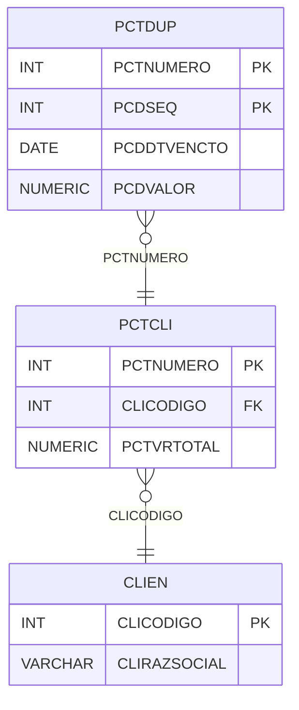

# PCTDUP - Documentação Completa de Relacionamentos

## 📊 Informações Gerais

- **Nome da Tabela**: PCTDUP (Parcela Cliente - Duplicatas)
- **Total de Registros**: 3.434
- **Total de Colunas**: 4
- **Chave Primária**: PCTNUMERO, PCDSEQ (composite)
- **Chaves Estrangeiras**: 1
- **Índices**: 0
- **Tabelas Dependentes**: 0
- **Banco de Dados**: Firebird

## 📝 Descrição

**PCTDUP** é uma tabela de detalhamento que armazena as duplicatas (parcelas de pagamento) relacionadas a uma parcela de cliente. Com **3.434 registros**, esta tabela registra cada parcela de pagamento com sua data de vencimento e valor.

Esta tabela é essencial para:
- **Controle de Pagamentos**: Registrar cada parcela de pagamento
- **Vencimentos**: Controlar datas de vencimento das duplicatas
- **Financeiro**: Gerenciar valores de cada duplicata
- **Relatórios**: Gerar relatórios de vencimentos

**Contexto de Negócio:**
Uma parcela de cliente (PCTCLI) pode ter múltiplas duplicatas, cada uma com data de vencimento e valor específicos. Esta tabela detalha essas duplicatas.

---

## 🔑 Estrutura de Colunas

| Coluna | Tipo | Descrição |
|--------|------|-----------|
| **PCTNUMERO** 🔑 🔗 | INT | Código da parcela cliente (PK, FK → PCTCLI) |
| **PCDSEQ** 🔑 | INT | Sequencial da duplicata (PK) |
| **PCDDTVENCTO** | DATE | Data de vencimento da duplicata |
| **PCDVALOR** | NUMERIC(16,2) | Valor da duplicata |

---

## 🔗 Relacionamentos - Nível 1 (Diretos)

### PCTCLI - Parcela Cliente (FK Obrigatória)
**Volume:** 1.301 registros

**Relacionamento:**
```
PCTDUP.PCTNUMERO → PCTCLI.PCTNUMERO (N:1)
Constraint: PCTCLI_PCTDUP
```

**Descrição:** Cada duplicata está vinculada a uma parcela cliente específica.

**Proporção:** ~2,6 duplicatas por parcela em média (3.434 / 1.301)

---

## 🔗 Relacionamentos - Nível 2 (Indiretos)

### PCTCLI → CLIEN (Cliente)
**Volume:** 9.251 registros

**Relacionamento:**
```
PCTDUP → PCTCLI → CLIEN
```

**Descrição:** Através de PCTCLI, é possível identificar o cliente relacionado.

---

## 🗺️ Diagrama de Relacionamentos



---

## 💡 Exemplos de Uso

### Consulta Básica

```sql
SELECT PCTNUMERO, PCDSEQ, PCDDTVENCTO, PCDVALOR
FROM PCTDUP
WHERE PCTNUMERO = ?
ORDER BY PCDDTVENCTO;
```

### Consulta com Informações da Parcela

```sql
SELECT 
    d.*,
    p.PCTDESCRICAO,
    p.PCTVRTOTAL,
    c.CLIRAZSOCIAL
FROM PCTDUP d
INNER JOIN PCTCLI p
    ON d.PCTNUMERO = p.PCTNUMERO
INNER JOIN CLIEN c
    ON p.CLICODIGO = c.CLICODIGO
WHERE d.PCTNUMERO = ?
ORDER BY d.PCDDTVENCTO;
```

### Consulta de Duplicatas Vencidas

```sql
SELECT 
    d.*,
    p.PCTDESCRICAO,
    c.CLIRAZSOCIAL
FROM PCTDUP d
INNER JOIN PCTCLI p
    ON d.PCTNUMERO = p.PCTNUMERO
INNER JOIN CLIEN c
    ON p.CLICODIGO = c.CLICODIGO
WHERE d.PCDDTVENCTO < CURRENT_DATE
    AND p.PCTSITUACAO = 'ATIVA'
ORDER BY d.PCDDTVENCTO;
```

### Soma de Valores por Parcela

```sql
SELECT 
    PCTNUMERO,
    COUNT(*) AS TOTAL_DUPLICATAS,
    SUM(PCDVALOR) AS VALOR_TOTAL
FROM PCTDUP
GROUP BY PCTNUMERO;
```

### Inserção de Nova Duplicata

```sql
INSERT INTO PCTDUP (PCTNUMERO, PCDSEQ, PCDDTVENCTO, PCDVALOR)
VALUES (?, ?, ?, ?);
```

---

## ⚡ Performance e Otimização

### Índices Recomendados

#### 1. Índice Composto na Chave Primária (Já existe implicitamente)
```sql
-- Índice primário já existe implicitamente
```

#### 2. Índice em PCDDTVENCTO
```sql
CREATE INDEX IDX_PCTDUP_DTVENCTO 
ON PCTDUP (PCDDTVENCTO);
```

**Justificativa:** Facilita buscas por data de vencimento.

---

## 📊 Estatísticas e Insights

### Volume de Dados

- **Total de Registros**: 3.434
- **Tamanho Médio Estimado**: ~30 bytes por registro
- **Tamanho Total Estimado**: ~103 KB

### Distribuição de Dados

- **Parcelas com Duplicatas**: 1.301 parcelas
- **Média de Duplicatas**: ~2,6 duplicatas por parcela

---

## 🔧 Integração com Código Laravel

### Model Eloquent

```php
<?php

namespace App\Models;

use Illuminate\Database\Eloquent\Model;
use Illuminate\Database\Eloquent\Relations\BelongsTo;

final class PctDup extends Model
{
    protected $table = 'PCTDUP';
    public $incrementing = false;
    public $timestamps = false;

    protected $primaryKey = ['PCTNUMERO', 'PCDSEQ'];

    protected $fillable = [
        'PCTNUMERO',
        'PCDSEQ',
        'PCDDTVENCTO',
        'PCDVALOR',
    ];

    protected $casts = [
        'PCTNUMERO' => 'integer',
        'PCDSEQ' => 'integer',
        'PCDDTVENCTO' => 'date',
        'PCDVALOR' => 'decimal:2',
    ];

    /**
     * Relacionamento com Parcela Cliente
     */
    public function parcelaCliente(): BelongsTo
    {
        return $this->belongsTo(PctCli::class, 'PCTNUMERO', 'PCTNUMERO');
    }

    /**
     * Buscar duplicatas por parcela
     */
    public static function porParcela(int $pctNumero)
    {
        return self::where('PCTNUMERO', $pctNumero)
            ->orderBy('PCDDTVENCTO')
            ->get();
    }

    /**
     * Buscar duplicatas vencidas
     */
    public static function vencidas()
    {
        return self::where('PCDDTVENCTO', '<', now())
            ->with(['parcelaCliente'])
            ->get();
    }
}
```

---

## ✅ Boas Práticas

### Design

1. **Chave Composta**: Manter integridade da chave composta
2. **Validação**: Validar valores antes de inserir
3. **Datas**: Validar PCDDTVENCTO antes de inserir

### Performance

1. **Índices**: Usar índice para busca por vencimento
2. **Consultas**: Usar eager loading para relacionamentos

### Segurança

1. **Validação**: Validar valores antes de inserir
2. **Acesso**: Restringir acesso de escrita a usuários autorizados

---

**Documentação gerada em**: 2025-01-27

**Banco de dados**: Firebird

