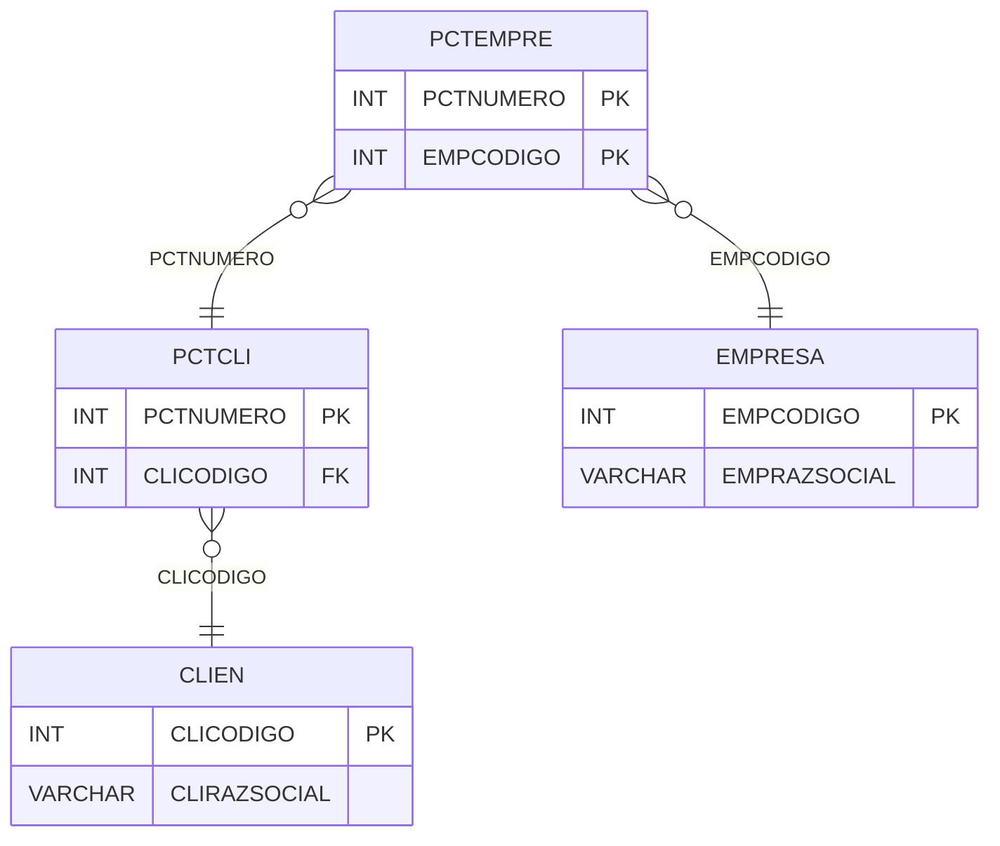

# PCTEMPRE - Documentação Completa de Relacionamentos

## 📊 Informações Gerais

- **Nome da Tabela**: PCTEMPRE (Parcela Cliente x Empresa)
- **Total de Registros**: 1.291
- **Total de Colunas**: 2
- **Chave Primária**: PCTNUMERO, EMPCODIGO (composite)
- **Chaves Estrangeiras**: 0 (relacionamentos lógicos)
- **Índices**: 0
- **Tabelas Dependentes**: 0
- **Banco de Dados**: Firebird

## 📝 Descrição

**PCTEMPRE** é uma tabela de relacionamento que associa parcelas de clientes com empresas. Com **1.291 registros**, esta tabela permite que uma parcela esteja relacionada a múltiplas empresas, ou que uma empresa tenha múltiplas parcelas.

Esta tabela é essencial para:
- **Multi-empresa**: Permitir que parcelas sejam compartilhadas entre empresas
- **Rastreamento**: Rastrear quais empresas estão relacionadas a cada parcela
- **Relatórios**: Gerar relatórios por empresa

**Contexto de Negócio:**
Em sistemas multi-empresa, uma parcela pode estar relacionada a uma ou mais empresas. Esta tabela gerencia essa relação.

---

## 🔑 Estrutura de Colunas

| Coluna | Tipo | Descrição |
|--------|------|-----------|
| **PCTNUMERO** 🔑 | INT | Código da parcela cliente (PK) |
| **EMPCODIGO** 🔑 | INT | Código da empresa (PK) |

---

## 🔗 Relacionamentos - Nível 1 (Diretos)

### Relacionamentos Lógicos

### PCTCLI - Parcela Cliente (Relacionamento Lógico)
**Volume:** 1.301 registros

**Relacionamento Lógico:**
```
PCTEMPRE.PCTNUMERO → PCTCLI.PCTNUMERO (N:1)
```

**Descrição:** Cada registro relaciona uma parcela com uma empresa.

**Proporção:** ~99,2% das parcelas têm relacionamento com empresa (1.291 / 1.301)

---

### EMPRESA - Empresa (Relacionamento Lógico)
**Volume:** 6 registros

**Relacionamento Lógico:**
```
PCTEMPRE.EMPCODIGO → EMPRESA.EMPCODIGO (N:1)
```

**Descrição:** Cada registro relaciona uma empresa com uma parcela.

---

## 🔗 Relacionamentos - Nível 2 (Indiretos)

### PCTCLI → CLIEN (Cliente)
**Volume:** 9.251 registros

**Relacionamento:**
```
PCTEMPRE → PCTCLI → CLIEN
```

**Descrição:** Através de PCTCLI, é possível identificar o cliente relacionado.

---

## 🗺️ Diagrama de Relacionamentos



---

## 💡 Exemplos de Uso

### Consulta Básica

```sql
SELECT PCTNUMERO, EMPCODIGO
FROM PCTEMPRE
WHERE PCTNUMERO = ?;
```

### Consulta com Informações da Empresa

```sql
SELECT 
    pe.*,
    e.EMPRAZSOCIAL,
    e.EMPNOMEFNT
FROM PCTEMPRE pe
INNER JOIN EMPRESA e
    ON pe.EMPCODIGO = e.EMPCODIGO
WHERE pe.PCTNUMERO = ?;
```

### Consulta com Informações da Parcela

```sql
SELECT 
    pe.*,
    p.PCTDESCRICAO,
    p.PCTVRTOTAL,
    c.CLIRAZSOCIAL
FROM PCTEMPRE pe
INNER JOIN PCTCLI p
    ON pe.PCTNUMERO = p.PCTNUMERO
INNER JOIN CLIEN c
    ON p.CLICODIGO = c.CLICODIGO
WHERE pe.EMPCODIGO = ?;
```

### Contagem de Parcelas por Empresa

```sql
SELECT 
    e.EMPRAZSOCIAL,
    COUNT(*) AS TOTAL_PARCELAS
FROM PCTEMPRE pe
INNER JOIN EMPRESA e
    ON pe.EMPCODIGO = e.EMPCODIGO
GROUP BY e.EMPCODIGO, e.EMPRAZSOCIAL
ORDER BY TOTAL_PARCELAS DESC;
```

### Inserção de Relacionamento

```sql
INSERT INTO PCTEMPRE (PCTNUMERO, EMPCODIGO)
VALUES (?, ?);
```

---

## ⚡ Performance e Otimização

### Índices Recomendados

#### 1. Índice Composto na Chave Primária (Já existe implicitamente)
```sql
-- Índice primário já existe implicitamente
```

#### 2. Índice em EMPCODIGO
```sql
CREATE INDEX IDX_PCTEMPRE_EMPCODIGO 
ON PCTEMPRE (EMPCODIGO);
```

**Justificativa:** Facilita buscas por empresa.

---

## 📊 Estatísticas e Insights

### Volume de Dados

- **Total de Registros**: 1.291
- **Tamanho Médio Estimado**: ~20 bytes por registro
- **Tamanho Total Estimado**: ~26 KB

### Distribuição de Dados

- **Parcelas com Empresa**: 1.291 parcelas
- **Taxa de Relacionamento**: ~99,2% das parcelas têm relacionamento com empresa

---

## 🔧 Integração com Código Laravel

### Model Eloquent

```php
<?php

namespace App\Models;

use Illuminate\Database\Eloquent\Model;
use Illuminate\Database\Eloquent\Relations\BelongsTo;

final class PctEmpre extends Model
{
    protected $table = 'PCTEMPRE';
    public $incrementing = false;
    public $timestamps = false;

    protected $primaryKey = ['PCTNUMERO', 'EMPCODIGO'];

    protected $fillable = [
        'PCTNUMERO',
        'EMPCODIGO',
    ];

    protected $casts = [
        'PCTNUMERO' => 'integer',
        'EMPCODIGO' => 'integer',
    ];

    /**
     * Relacionamento com Parcela Cliente
     */
    public function parcelaCliente(): BelongsTo
    {
        return $this->belongsTo(PctCli::class, 'PCTNUMERO', 'PCTNUMERO');
    }

    /**
     * Relacionamento com Empresa
     */
    public function empresa(): BelongsTo
    {
        return $this->belongsTo(Empresa::class, 'EMPCODIGO', 'EMPCODIGO');
    }

    /**
     * Buscar empresas por parcela
     */
    public static function empresasPorParcela(int $pctNumero)
    {
        return self::where('PCTNUMERO', $pctNumero)
            ->with(['empresa'])
            ->get();
    }

    /**
     * Buscar parcelas por empresa
     */
    public static function parcelasPorEmpresa(int $empCodigo)
    {
        return self::where('EMPCODIGO', $empCodigo)
            ->with(['parcelaCliente'])
            ->get();
    }
}
```

---

## ✅ Boas Práticas

### Design

1. **Chave Composta**: Manter integridade da chave composta
2. **Validação**: Validar PCTNUMERO e EMPCODIGO antes de inserir
3. **Unicidade**: Garantir que não haja duplicatas

### Performance

1. **Índices**: Usar índices para buscas por empresa
2. **Consultas**: Usar eager loading para relacionamentos

### Segurança

1. **Validação**: Validar valores antes de inserir
2. **Acesso**: Restringir acesso de escrita a usuários autorizados

---

**Documentação gerada em**: 2025-01-27

**Banco de dados**: Firebird

