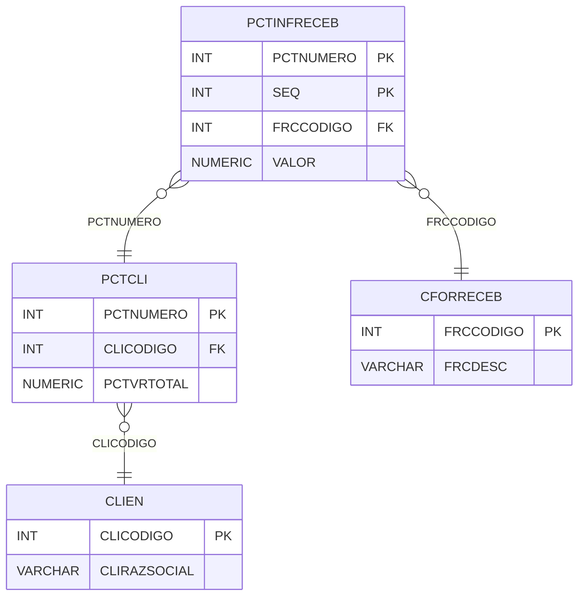

# PCTINFRECEB - Documentação Completa de Relacionamentos

## 📊 Informações Gerais

- **Nome da Tabela**: PCTINFRECEB (Parcela Cliente - Informações de Recebimento)
- **Total de Registros**: 1.301
- **Total de Colunas**: 4
- **Chave Primária**: PCTNUMERO, SEQ (composite)
- **Chaves Estrangeiras**: 2
- **Índices**: 0
- **Tabelas Dependentes**: 0
- **Banco de Dados**: Firebird

## 📝 Descrição

**PCTINFRECEB** é uma tabela de detalhamento que armazena informações sobre formas de recebimento relacionadas a parcelas de clientes. Com **1.301 registros**, esta tabela registra cada forma de recebimento configurada para uma parcela, permitindo múltiplas formas de pagamento.

Esta tabela é essencial para:
- **Formas de Pagamento**: Configurar formas de recebimento por parcela
- **Flexibilidade**: Permitir múltiplas formas de pagamento
- **Financeiro**: Gerenciar valores por forma de recebimento
- **Relatórios**: Gerar relatórios por forma de recebimento

**Contexto de Negócio:**
Uma parcela de cliente pode ter múltiplas formas de recebimento configuradas (dinheiro, cartão, boleto, etc.), cada uma com um valor específico. Esta tabela detalha essas configurações.

---

## 🔑 Estrutura de Colunas

| Coluna | Tipo | Descrição |
|--------|------|-----------|
| **PCTNUMERO** 🔑 🔗 | INT | Código da parcela cliente (PK, FK → PCTCLI) |
| **SEQ** 🔑 | INT | Sequencial da informação (PK) |
| **FRCCODIGO** 🔗 | INT | Código da forma de recebimento (FK → CFORRECEB) |
| **VALOR** | NUMERIC(16,2) | Valor para esta forma de recebimento |

---

## 🔗 Relacionamentos - Nível 1 (Diretos)

### PCTCLI - Parcela Cliente (FK Obrigatória)
**Volume:** 1.301 registros

**Relacionamento:**
```
PCTINFRECEB.PCTNUMERO → PCTCLI.PCTNUMERO (N:1)
Constraint: PCTCLI_PCTINFRECEB
```

**Descrição:** Cada informação de recebimento está vinculada a uma parcela cliente específica.

**Proporção:** ~1 informação de recebimento por parcela em média (1.301 / 1.301)

---

### CFORRECEB - Forma de Recebimento (FK Obrigatória)
**Volume:** 3 registros

**Relacionamento:**
```
PCTINFRECEB.FRCCODIGO → CFORRECEB.FRCCODIGO (N:1)
Constraint: CFORRECEB_PCTINFRECEB
```

**Descrição:** Define a forma de recebimento (dinheiro, cartão, boleto, etc.).

---

## 🔗 Relacionamentos - Nível 2 (Indiretos)

### PCTCLI → CLIEN (Cliente)
**Volume:** 9.251 registros

**Relacionamento:**
```
PCTINFRECEB → PCTCLI → CLIEN
```

**Descrição:** Através de PCTCLI, é possível identificar o cliente relacionado.

---

### CFORRECEB → TPDOCTO (Tipo de Documento)
**Volume:** Variável

**Relacionamento:**
```
PCTINFRECEB → CFORRECEB → TPDOCTO
```

**Descrição:** Através de CFORRECEB, é possível identificar o tipo de documento relacionado.

---

## 🗺️ Diagrama de Relacionamentos



---

## 💡 Exemplos de Uso

### Consulta Básica

```sql
SELECT PCTNUMERO, SEQ, FRCCODIGO, VALOR
FROM PCTINFRECEB
WHERE PCTNUMERO = ?
ORDER BY SEQ;
```

### Consulta com Informações da Forma de Recebimento

```sql
SELECT 
    pi.*,
    fr.FRCDESC,
    fr.FRCDIAS
FROM PCTINFRECEB pi
INNER JOIN CFORRECEB fr
    ON pi.FRCCODIGO = fr.FRCCODIGO
WHERE pi.PCTNUMERO = ?
ORDER BY pi.SEQ;
```

### Consulta com Informações da Parcela

```sql
SELECT 
    pi.*,
    p.PCTDESCRICAO,
    p.PCTVRTOTAL,
    fr.FRCDESC
FROM PCTINFRECEB pi
INNER JOIN PCTCLI p
    ON pi.PCTNUMERO = p.PCTNUMERO
INNER JOIN CFORRECEB fr
    ON pi.FRCCODIGO = fr.FRCCODIGO
WHERE pi.PCTNUMERO = ?;
```

### Soma de Valores por Forma de Recebimento

```sql
SELECT 
    fr.FRCDESC,
    COUNT(*) AS TOTAL_USOS,
    SUM(pi.VALOR) AS VALOR_TOTAL
FROM PCTINFRECEB pi
INNER JOIN CFORRECEB fr
    ON pi.FRCCODIGO = fr.FRCCODIGO
GROUP BY fr.FRCCODIGO, fr.FRCDESC
ORDER BY VALOR_TOTAL DESC;
```

### Inserção de Nova Informação de Recebimento

```sql
INSERT INTO PCTINFRECEB (PCTNUMERO, SEQ, FRCCODIGO, VALOR)
VALUES (?, ?, ?, ?);
```

---

## ⚡ Performance e Otimização

### Índices Recomendados

#### 1. Índice Composto na Chave Primária (Já existe implicitamente)
```sql
-- Índice primário já existe implicitamente
```

#### 2. Índice em FRCCODIGO
```sql
CREATE INDEX IDX_PCTINFRECEB_FRCCODIGO 
ON PCTINFRECEB (FRCCODIGO);
```

**Justificativa:** Facilita buscas por forma de recebimento.

---

## 📊 Estatísticas e Insights

### Volume de Dados

- **Total de Registros**: 1.301
- **Tamanho Médio Estimado**: ~30 bytes por registro
- **Tamanho Total Estimado**: ~39 KB

### Distribuição de Dados

- **Parcelas com Informações**: 1.301 parcelas
- **Média de Informações**: ~1 informação por parcela

---

## 🔧 Integração com Código Laravel

### Model Eloquent

```php
<?php

namespace App\Models;

use Illuminate\Database\Eloquent\Model;
use Illuminate\Database\Eloquent\Relations\BelongsTo;

final class PctInfReceb extends Model
{
    protected $table = 'PCTINFRECEB';
    public $incrementing = false;
    public $timestamps = false;

    protected $primaryKey = ['PCTNUMERO', 'SEQ'];

    protected $fillable = [
        'PCTNUMERO',
        'SEQ',
        'FRCCODIGO',
        'VALOR',
    ];

    protected $casts = [
        'PCTNUMERO' => 'integer',
        'SEQ' => 'integer',
        'FRCCODIGO' => 'integer',
        'VALOR' => 'decimal:2',
    ];

    /**
     * Relacionamento com Parcela Cliente
     */
    public function parcelaCliente(): BelongsTo
    {
        return $this->belongsTo(PctCli::class, 'PCTNUMERO', 'PCTNUMERO');
    }

    /**
     * Relacionamento com Forma de Recebimento
     */
    public function formaRecebimento(): BelongsTo
    {
        return $this->belongsTo(CForReceb::class, 'FRCCODIGO', 'FRCCODIGO');
    }

    /**
     * Buscar informações por parcela
     */
    public static function porParcela(int $pctNumero)
    {
        return self::where('PCTNUMERO', $pctNumero)
            ->with(['formaRecebimento'])
            ->orderBy('SEQ')
            ->get();
    }
}
```

---

## ✅ Boas Práticas

### Design

1. **Chave Composta**: Manter integridade da chave composta
2. **Validação**: Validar valores antes de inserir
3. **Valores**: Validar que soma dos valores não exceda valor total da parcela

### Performance

1. **Índices**: Usar índice para busca por forma de recebimento
2. **Consultas**: Usar eager loading para relacionamentos

### Segurança

1. **Validação**: Validar valores antes de inserir
2. **Acesso**: Restringir acesso de escrita a usuários autorizados

---

**Documentação gerada em**: 2025-01-27

**Banco de dados**: Firebird

