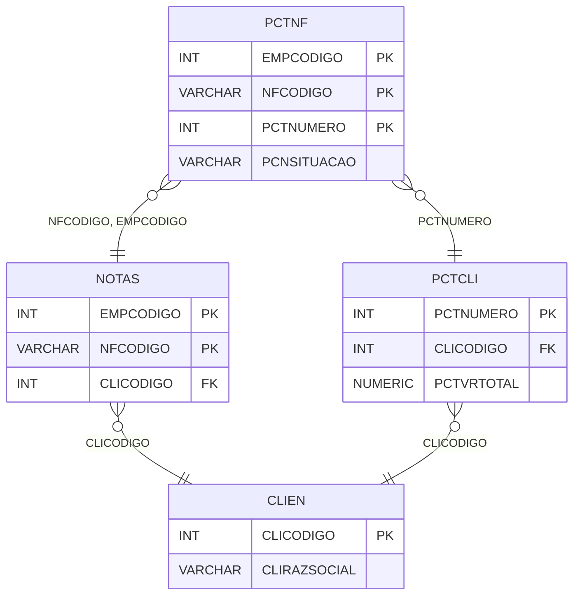

# PCTNF - Documentação Completa de Relacionamentos

## 📊 Informações Gerais

- **Nome da Tabela**: PCTNF (Parcela Cliente x Nota Fiscal)
- **Total de Registros**: 241
- **Total de Colunas**: 4
- **Chave Primária**: EMPCODIGO, NFCODIGO, PCTNUMERO (composite)
- **Chaves Estrangeiras**: 3
- **Índices**: 0
- **Tabelas Dependentes**: 0
- **Banco de Dados**: Firebird

## 📝 Descrição

**PCTNF** é uma tabela de relacionamento que associa parcelas de clientes com notas fiscais. Com **241 registros**, esta tabela permite que uma parcela esteja relacionada a múltiplas notas fiscais, ou que uma nota fiscal esteja relacionada a múltiplas parcelas.

Esta tabela é essencial para:
- **Rastreamento Fiscal**: Rastrear quais notas fiscais estão relacionadas a cada parcela
- **Conciliação**: Facilitar conciliação entre parcelas e notas fiscais
- **Relatórios**: Gerar relatórios fiscais por parcela

**Contexto de Negócio:**
Uma parcela de cliente pode estar relacionada a uma ou mais notas fiscais. Esta tabela gerencia essa relação, permitindo rastrear a origem fiscal de cada parcela.

---

## 🔑 Estrutura de Colunas

| Coluna | Tipo | Descrição |
|--------|------|-----------|
| **EMPCODIGO** 🔑 🔗 | INT | Código da empresa (PK, FK → NOTAS) |
| **NFCODIGO** 🔑 🔗 | VARCHAR(14) | Código da nota fiscal (PK, FK → NOTAS) |
| **PCTNUMERO** 🔑 🔗 | INT | Código da parcela cliente (PK, FK → PCTCLI) |
| **PCNSITUACAO** | VARCHAR(14) | Situação da relação (ATIVA, CANCELADA, etc.) |

---

## 🔗 Relacionamentos - Nível 1 (Diretos)

### NOTAS - Nota Fiscal (FK Obrigatória)
**Volume:** 1.206.013 registros

**Relacionamento:**
```
PCTNF.NFCODIGO, EMPCODIGO → NOTAS.NFCODIGO, EMPCODIGO (N:1)
Constraint: NOTAS_PCTNF
```

**Descrição:** Cada registro relaciona uma nota fiscal com uma parcela.

**Proporção:** ~0,02% das notas fiscais têm relacionamento com parcelas (241 / 1.206.013)

---

### PCTCLI - Parcela Cliente (FK Obrigatória)
**Volume:** 1.301 registros

**Relacionamento:**
```
PCTNF.PCTNUMERO → PCTCLI.PCTNUMERO (N:1)
Constraint: PCTCLI_PCTNF
```

**Descrição:** Cada registro relaciona uma parcela com uma nota fiscal.

**Proporção:** ~18,5% das parcelas têm relacionamento com notas fiscais (241 / 1.301)

---

## 🔗 Relacionamentos - Nível 2 (Indiretos)

### NOTAS → CLIEN (Cliente)
**Volume:** 9.251 registros

**Relacionamento:**
```
PCTNF → NOTAS → CLIEN
```

**Descrição:** Através de NOTAS, é possível identificar o cliente relacionado.

---

### PCTCLI → CLIEN (Cliente)
**Volume:** 9.251 registros

**Relacionamento:**
```
PCTNF → PCTCLI → CLIEN
```

**Descrição:** Através de PCTCLI, é possível identificar o cliente relacionado.

---

## 🗺️ Diagrama de Relacionamentos



---

## 💡 Exemplos de Uso

### Consulta Básica

```sql
SELECT EMPCODIGO, NFCODIGO, PCTNUMERO, PCNSITUACAO
FROM PCTNF
WHERE PCTNUMERO = ?;
```

### Consulta com Informações da Nota Fiscal

```sql
SELECT 
    pn.*,
    n.NFDTEMIS,
    n.NFVRTOTAL,
    n.NFSIT
FROM PCTNF pn
INNER JOIN NOTAS n
    ON pn.NFCODIGO = n.NFCODIGO
    AND pn.EMPCODIGO = n.EMPCODIGO
WHERE pn.PCTNUMERO = ?;
```

### Consulta com Informações da Parcela

```sql
SELECT 
    pn.*,
    p.PCTDESCRICAO,
    p.PCTVRTOTAL,
    n.NFDTEMIS,
    n.NFVRTOTAL
FROM PCTNF pn
INNER JOIN PCTCLI p
    ON pn.PCTNUMERO = p.PCTNUMERO
INNER JOIN NOTAS n
    ON pn.NFCODIGO = n.NFCODIGO
    AND pn.EMPCODIGO = n.EMPCODIGO
WHERE pn.PCTNUMERO = ?;
```

### Consulta de Notas Fiscais por Parcela

```sql
SELECT 
    p.PCTNUMERO,
    p.PCTDESCRICAO,
    COUNT(DISTINCT pn.NFCODIGO) AS TOTAL_NOTAS,
    SUM(n.NFVRTOTAL) AS VALOR_TOTAL_NOTAS
FROM PCTCLI p
LEFT JOIN PCTNF pn
    ON p.PCTNUMERO = pn.PCTNUMERO
LEFT JOIN NOTAS n
    ON pn.NFCODIGO = n.NFCODIGO
    AND pn.EMPCODIGO = n.EMPCODIGO
GROUP BY p.PCTNUMERO, p.PCTDESCRICAO
HAVING COUNT(DISTINCT pn.NFCODIGO) > 0;
```

### Inserção de Relacionamento

```sql
INSERT INTO PCTNF (EMPCODIGO, NFCODIGO, PCTNUMERO, PCNSITUACAO)
VALUES (?, ?, ?, 'ATIVA');
```

---

## ⚡ Performance e Otimização

### Índices Recomendados

#### 1. Índice Composto na Chave Primária (Já existe implicitamente)
```sql
-- Índice primário já existe implicitamente
```

#### 2. Índice em PCTNUMERO
```sql
CREATE INDEX IDX_PCTNF_PCTNUMERO 
ON PCTNF (PCTNUMERO);
```

**Justificativa:** Facilita buscas por parcela.

#### 3. Índice Composto em NFCODIGO e EMPCODIGO
```sql
CREATE INDEX IDX_PCTNF_NF_EMP 
ON PCTNF (NFCODIGO, EMPCODIGO);
```

**Justificativa:** Facilita buscas por nota fiscal.

---

## 📊 Estatísticas e Insights

### Volume de Dados

- **Total de Registros**: 241
- **Tamanho Médio Estimado**: ~40 bytes por registro
- **Tamanho Total Estimado**: ~10 KB

### Distribuição de Dados

- **Parcelas com Notas Fiscais**: 241 relacionamentos
- **Taxa de Relacionamento**: ~18,5% das parcelas têm relacionamento com notas fiscais

---

## 🔧 Integração com Código Laravel

### Model Eloquent

```php
<?php

namespace App\Models;

use Illuminate\Database\Eloquent\Model;
use Illuminate\Database\Eloquent\Relations\BelongsTo;

final class PctNf extends Model
{
    protected $table = 'PCTNF';
    public $incrementing = false;
    public $timestamps = false;

    protected $primaryKey = ['EMPCODIGO', 'NFCODIGO', 'PCTNUMERO'];

    protected $fillable = [
        'EMPCODIGO',
        'NFCODIGO',
        'PCTNUMERO',
        'PCNSITUACAO',
    ];

    protected $casts = [
        'EMPCODIGO' => 'integer',
        'NFCODIGO' => 'string',
        'PCTNUMERO' => 'integer',
        'PCNSITUACAO' => 'string',
    ];

    /**
     * Relacionamento com Nota Fiscal
     */
    public function notaFiscal(): BelongsTo
    {
        return $this->belongsTo(Notas::class, ['NFCODIGO', 'EMPCODIGO'], ['NFCODIGO', 'EMPCODIGO']);
    }

    /**
     * Relacionamento com Parcela Cliente
     */
    public function parcelaCliente(): BelongsTo
    {
        return $this->belongsTo(PctCli::class, 'PCTNUMERO', 'PCTNUMERO');
    }

    /**
     * Buscar notas fiscais por parcela
     */
    public static function notasPorParcela(int $pctNumero)
    {
        return self::where('PCTNUMERO', $pctNumero)
            ->with(['notaFiscal', 'parcelaCliente'])
            ->get();
    }

    /**
     * Buscar parcelas por nota fiscal
     */
    public static function parcelasPorNota(string $nfCodigo, int $empCodigo)
    {
        return self::where('NFCODIGO', $nfCodigo)
            ->where('EMPCODIGO', $empCodigo)
            ->with(['parcelaCliente', 'notaFiscal'])
            ->get();
    }
}
```

---

## ✅ Boas Práticas

### Design

1. **Chave Composta**: Manter integridade da chave composta
2. **Validação**: Validar NFCODIGO, EMPCODIGO e PCTNUMERO antes de inserir
3. **Situação**: Manter PCNSITUACAO sempre atualizada

### Performance

1. **Índices**: Usar índices para buscas frequentes
2. **Consultas**: Usar eager loading para relacionamentos

### Segurança

1. **Validação**: Validar valores antes de inserir
2. **Acesso**: Restringir acesso de escrita a usuários autorizados

---

**Documentação gerada em**: 2025-01-27

**Banco de dados**: Firebird

