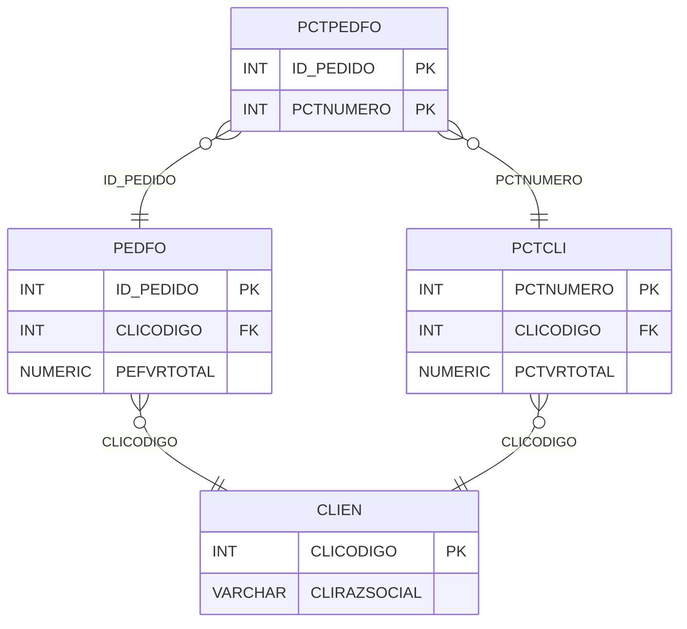

# PCTPEDFO - Documentação Completa de Relacionamentos

## 📊 Informações Gerais

- **Nome da Tabela**: PCTPEDFO (Parcela Cliente x Pedido Fornecedor)
- **Total de Registros**: 41
- **Total de Colunas**: 2
- **Chave Primária**: ID_PEDIDO, PCTNUMERO (composite)
- **Chaves Estrangeiras**: 2
- **Índices**: 0
- **Tabelas Dependentes**: 0
- **Banco de Dados**: Firebird

## 📝 Descrição

**PCTPEDFO** é uma tabela de relacionamento que associa parcelas de clientes com pedidos de fornecedores. Com apenas **41 registros**, esta tabela permite rastrear quais pedidos de fornecedores estão relacionados a cada parcela de cliente.

Esta tabela é essencial para:
- **Rastreamento**: Rastrear pedidos de fornecedores relacionados a parcelas
- **Conciliação**: Facilitar conciliação entre parcelas e pedidos
- **Relatórios**: Gerar relatórios de pedidos por parcela

**Contexto de Negócio:**
Uma parcela de cliente pode estar relacionada a um ou mais pedidos de fornecedores. Esta tabela gerencia essa relação, permitindo rastrear a origem dos produtos/serviços relacionados à parcela.

---

## 🔑 Estrutura de Colunas

| Coluna | Tipo | Descrição |
|--------|------|-----------|
| **ID_PEDIDO** 🔑 🔗 | INT | Código do pedido fornecedor (PK, FK → PEDFO) |
| **PCTNUMERO** 🔑 🔗 | INT | Código da parcela cliente (PK, FK → PCTCLI) |

---

## 🔗 Relacionamentos - Nível 1 (Diretos)

### PEDFO - Pedido Fornecedor (FK Obrigatória)
**Volume:** 129.041 registros

**Relacionamento:**
```
PCTPEDFO.ID_PEDIDO → PEDFO.ID_PEDIDO (N:1)
Constraint: PCTPEDFO_PEDFO
```

**Descrição:** Cada registro relaciona um pedido de fornecedor com uma parcela.

**Proporção:** ~0,03% dos pedidos de fornecedores têm relacionamento com parcelas (41 / 129.041)

---

### PCTCLI - Parcela Cliente (FK Obrigatória)
**Volume:** 1.301 registros

**Relacionamento:**
```
PCTPEDFO.PCTNUMERO → PCTCLI.PCTNUMERO (N:1)
Constraint: PCTPEDFO_PCTCLI
```

**Descrição:** Cada registro relaciona uma parcela com um pedido de fornecedor.

**Proporção:** ~3,2% das parcelas têm relacionamento com pedidos de fornecedores (41 / 1.301)

---

## 🔗 Relacionamentos - Nível 2 (Indiretos)

### PEDFO → CLIEN (Fornecedor/Cliente)
**Volume:** 9.251 registros

**Relacionamento:**
```
PCTPEDFO → PEDFO → CLIEN
```

**Descrição:** Através de PEDFO, é possível identificar o fornecedor relacionado.

---

### PCTCLI → CLIEN (Cliente)
**Volume:** 9.251 registros

**Relacionamento:**
```
PCTPEDFO → PCTCLI → CLIEN
```

**Descrição:** Através de PCTCLI, é possível identificar o cliente relacionado.

---

## 🗺️ Diagrama de Relacionamentos



---

## 💡 Exemplos de Uso

### Consulta Básica

```sql
SELECT ID_PEDIDO, PCTNUMERO
FROM PCTPEDFO
WHERE PCTNUMERO = ?;
```

### Consulta com Informações do Pedido

```sql
SELECT 
    pp.*,
    pf.PEFCODIGO,
    pf.PEFDTEMIS,
    pf.PEFVRTOTAL,
    c.CLIRAZSOCIAL AS FORNECEDOR
FROM PCTPEDFO pp
INNER JOIN PEDFO pf
    ON pp.ID_PEDIDO = pf.ID_PEDIDO
INNER JOIN CLIEN c
    ON pf.CLICODIGO = c.CLICODIGO
WHERE pp.PCTNUMERO = ?;
```

### Consulta com Informações da Parcela

```sql
SELECT 
    pp.*,
    p.PCTDESCRICAO,
    p.PCTVRTOTAL,
    pf.PEFCODIGO,
    pf.PEFVRTOTAL
FROM PCTPEDFO pp
INNER JOIN PCTCLI p
    ON pp.PCTNUMERO = p.PCTNUMERO
INNER JOIN PEDFO pf
    ON pp.ID_PEDIDO = pf.ID_PEDIDO
WHERE pp.PCTNUMERO = ?;
```

### Consulta de Pedidos por Parcela

```sql
SELECT 
    p.PCTNUMERO,
    p.PCTDESCRICAO,
    COUNT(DISTINCT pp.ID_PEDIDO) AS TOTAL_PEDIDOS,
    SUM(pf.PEFVRTOTAL) AS VALOR_TOTAL_PEDIDOS
FROM PCTCLI p
LEFT JOIN PCTPEDFO pp
    ON p.PCTNUMERO = pp.PCTNUMERO
LEFT JOIN PEDFO pf
    ON pp.ID_PEDIDO = pf.ID_PEDIDO
GROUP BY p.PCTNUMERO, p.PCTDESCRICAO
HAVING COUNT(DISTINCT pp.ID_PEDIDO) > 0;
```

### Inserção de Relacionamento

```sql
INSERT INTO PCTPEDFO (ID_PEDIDO, PCTNUMERO)
VALUES (?, ?);
```

---

## ⚡ Performance e Otimização

### Índices Recomendados

#### 1. Índice Composto na Chave Primária (Já existe implicitamente)
```sql
-- Índice primário já existe implicitamente
```

#### 2. Índice em PCTNUMERO
```sql
CREATE INDEX IDX_PCTPEDFO_PCTNUMERO 
ON PCTPEDFO (PCTNUMERO);
```

**Justificativa:** Facilita buscas por parcela.

#### 3. Índice em ID_PEDIDO
```sql
CREATE INDEX IDX_PCTPEDFO_ID_PEDIDO 
ON PCTPEDFO (ID_PEDIDO);
```

**Justificativa:** Facilita buscas por pedido.

---

## 📊 Estatísticas e Insights

### Volume de Dados

- **Total de Registros**: 41
- **Tamanho Médio Estimado**: ~20 bytes por registro
- **Tamanho Total Estimado**: ~1 KB

### Distribuição de Dados

- **Relacionamentos**: 41 relacionamentos entre parcelas e pedidos
- **Taxa de Relacionamento**: ~3,2% das parcelas têm relacionamento com pedidos

---

## 🔧 Integração com Código Laravel

### Model Eloquent

```php
<?php

namespace App\Models;

use Illuminate\Database\Eloquent\Model;
use Illuminate\Database\Eloquent\Relations\BelongsTo;

final class PctPedFo extends Model
{
    protected $table = 'PCTPEDFO';
    public $incrementing = false;
    public $timestamps = false;

    protected $primaryKey = ['ID_PEDIDO', 'PCTNUMERO'];

    protected $fillable = [
        'ID_PEDIDO',
        'PCTNUMERO',
    ];

    protected $casts = [
        'ID_PEDIDO' => 'integer',
        'PCTNUMERO' => 'integer',
    ];

    /**
     * Relacionamento com Pedido Fornecedor
     */
    public function pedidoFornecedor(): BelongsTo
    {
        return $this->belongsTo(PedFo::class, 'ID_PEDIDO', 'ID_PEDIDO');
    }

    /**
     * Relacionamento com Parcela Cliente
     */
    public function parcelaCliente(): BelongsTo
    {
        return $this->belongsTo(PctCli::class, 'PCTNUMERO', 'PCTNUMERO');
    }

    /**
     * Buscar pedidos por parcela
     */
    public static function pedidosPorParcela(int $pctNumero)
    {
        return self::where('PCTNUMERO', $pctNumero)
            ->with(['pedidoFornecedor', 'parcelaCliente'])
            ->get();
    }

    /**
     * Buscar parcelas por pedido
     */
    public static function parcelasPorPedido(int $idPedido)
    {
        return self::where('ID_PEDIDO', $idPedido)
            ->with(['parcelaCliente', 'pedidoFornecedor'])
            ->get();
    }
}
```

---

## ✅ Boas Práticas

### Design

1. **Chave Composta**: Manter integridade da chave composta
2. **Validação**: Validar ID_PEDIDO e PCTNUMERO antes de inserir
3. **Unicidade**: Garantir que não haja duplicatas

### Performance

1. **Índices**: Usar índices para buscas frequentes
2. **Consultas**: Usar eager loading para relacionamentos

### Segurança

1. **Validação**: Validar valores antes de inserir
2. **Acesso**: Restringir acesso de escrita a usuários autorizados

---

**Documentação gerada em**: 2025-01-27

**Banco de dados**: Firebird

