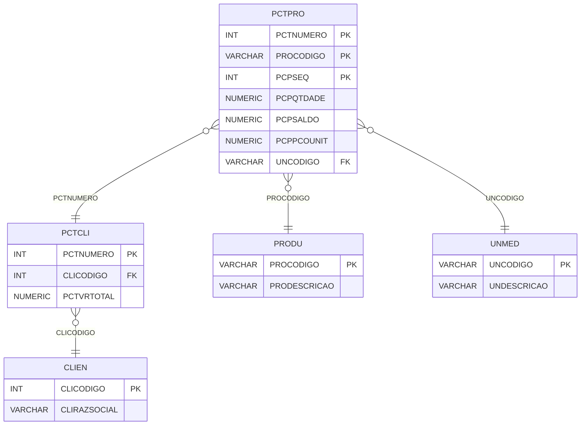

# PCTPRO - Documentação Completa de Relacionamentos

## 📊 Informações Gerais

- **Nome da Tabela**: PCTPRO (Parcela Cliente x Produto)
- **Total de Registros**: 1.560
- **Total de Colunas**: 8
- **Chave Primária**: PCTNUMERO, PROCODIGO, PCPSEQ (composite)
- **Chaves Estrangeiras**: 2
- **Índices**: 0
- **Tabelas Dependentes**: 0
- **Banco de Dados**: Firebird

## 📝 Descrição

**PCTPRO** é uma tabela de detalhamento que armazena produtos relacionados a parcelas de clientes. Com **1.560 registros**, esta tabela registra cada produto incluído em uma parcela, com informações sobre quantidade, preço unitário, saldo e unidade de medida.

Esta tabela é essencial para:
- **Detalhamento**: Detalhar produtos incluídos em cada parcela
- **Controle**: Controlar quantidades e saldos de produtos
- **Financeiro**: Gerenciar preços unitários e totais
- **Renovação**: Controlar mínimo de renovação

**Contexto de Negócio:**
Uma parcela de cliente pode incluir múltiplos produtos, cada um com quantidade, preço e outras informações específicas. Esta tabela detalha esses produtos.

---

## 🔑 Estrutura de Colunas

### Identificação
| Coluna | Tipo | Descrição |
|--------|------|-----------|
| **PCTNUMERO** 🔑 🔗 | INT | Código da parcela cliente (PK, FK → PCTCLI) |
| **PROCODIGO** 🔑 🔗 | VARCHAR(14) | Código do produto (PK, FK → PRODU) |
| **PCPSEQ** 🔑 | INT | Sequencial do produto na parcela (PK) |

### Quantidades e Valores
| Coluna | Tipo | Descrição |
|--------|------|-----------|
| **PCPQTDADE** | NUMERIC(27,2) | Quantidade do produto |
| **PCPSALDO** | NUMERIC(27,2) | Saldo restante do produto |
| **PCPMINRENOVACAO** | NUMERIC(27,2) | Quantidade mínima para renovação |

### Preços e Unidade
| Coluna | Tipo | Descrição |
|--------|------|-----------|
| **PCPPCOUNIT** | NUMERIC(27,2) | Preço unitário do produto |
| **UNCODIGO** 🔗 | VARCHAR(14) | Código da unidade de medida (FK → UNMED) |

---

## 🔗 Relacionamentos - Nível 1 (Diretos)

### PCTCLI - Parcela Cliente (FK Obrigatória)
**Volume:** 1.301 registros

**Relacionamento:**
```
PCTPRO.PCTNUMERO → PCTCLI.PCTNUMERO (N:1)
Constraint: PCTCLI_PCTPRO
```

**Descrição:** Cada produto está vinculado a uma parcela cliente específica.

**Proporção:** ~1,2 produtos por parcela em média (1.560 / 1.301)

---

### PRODU - Produto (FK Obrigatória)
**Volume:** 178.187 registros

**Relacionamento:**
```
PCTPRO.PROCODIGO → PRODU.PROCODIGO (N:1)
Constraint: PRODU_PCTPRO
```

**Descrição:** Identifica o produto relacionado à parcela.

---

### UNMED - Unidade de Medida (FK Obrigatória)
**Volume:** 130 registros

**Relacionamento:**
```
PCTPRO.UNCODIGO → UNMED.UNCODIGO (N:1)
```

**Descrição:** Define a unidade de medida do produto na parcela.

---

## 🔗 Relacionamentos - Nível 2 (Indiretos)

### PCTCLI → CLIEN (Cliente)
**Volume:** 9.251 registros

**Relacionamento:**
```
PCTPRO → PCTCLI → CLIEN
```

**Descrição:** Através de PCTCLI, é possível identificar o cliente relacionado.

---

### PRODU → MARCA (Marca do Produto)
**Volume:** 31 registros

**Relacionamento:**
```
PCTPRO → PRODU → MARCA
```

**Descrição:** Através de PRODU, é possível identificar a marca do produto.

---

## 🗺️ Diagrama de Relacionamentos



---

## 💡 Exemplos de Uso

### Consulta Básica

```sql
SELECT PCTNUMERO, PROCODIGO, PCPSEQ, PCPQTDADE, PCPPCOUNIT, PCPSALDO
FROM PCTPRO
WHERE PCTNUMERO = ?
ORDER BY PCPSEQ;
```

### Consulta com Informações do Produto

```sql
SELECT 
    pp.*,
    pr.PRODESCRICAO,
    pr.PROUN,
    u.UNDESCRICAO
FROM PCTPRO pp
INNER JOIN PRODU pr
    ON pp.PROCODIGO = pr.PROCODIGO
INNER JOIN UNMED u
    ON pp.UNCODIGO = u.UNCODIGO
WHERE pp.PCTNUMERO = ?
ORDER BY pp.PCPSEQ;
```

### Consulta com Informações da Parcela

```sql
SELECT 
    pp.*,
    p.PCTDESCRICAO,
    p.PCTVRTOTAL,
    pr.PRODESCRICAO,
    c.CLIRAZSOCIAL
FROM PCTPRO pp
INNER JOIN PCTCLI p
    ON pp.PCTNUMERO = p.PCTNUMERO
INNER JOIN PRODU pr
    ON pp.PROCODIGO = pr.PROCODIGO
INNER JOIN CLIEN c
    ON p.CLICODIGO = c.CLICODIGO
WHERE pp.PCTNUMERO = ?;
```

### Soma de Valores por Parcela

```sql
SELECT 
    PCTNUMERO,
    COUNT(*) AS TOTAL_PRODUTOS,
    SUM(PCPQTDADE * PCPPCOUNIT) AS VALOR_TOTAL
FROM PCTPRO
GROUP BY PCTNUMERO;
```

### Consulta de Produtos com Saldo

```sql
SELECT 
    pp.*,
    pr.PRODESCRICAO,
    p.PCTDESCRICAO
FROM PCTPRO pp
INNER JOIN PRODU pr
    ON pp.PROCODIGO = pr.PROCODIGO
INNER JOIN PCTCLI p
    ON pp.PCTNUMERO = p.PCTNUMERO
WHERE pp.PCPSALDO > 0
ORDER BY pp.PCPSALDO DESC;
```

### Inserção de Novo Produto

```sql
INSERT INTO PCTPRO (
    PCTNUMERO,
    PROCODIGO,
    PCPSEQ,
    PCPQTDADE,
    PCPPCOUNIT,
    UNCODIGO,
    PCPSALDO,
    PCPMINRENOVACAO
)
VALUES (?, ?, ?, ?, ?, ?, ?, ?);
```

### Atualização de Saldo

```sql
UPDATE PCTPRO
SET PCPSALDO = PCPSALDO - ?
WHERE PCTNUMERO = ?
    AND PROCODIGO = ?
    AND PCPSEQ = ?;
```

---

## ⚡ Performance e Otimização

### Índices Recomendados

#### 1. Índice Composto na Chave Primária (Já existe implicitamente)
```sql
-- Índice primário já existe implicitamente
```

#### 2. Índice em PROCODIGO
```sql
CREATE INDEX IDX_PCTPRO_PROCODIGO 
ON PCTPRO (PROCODIGO);
```

**Justificativa:** Facilita buscas por produto.

---

## 📊 Estatísticas e Insights

### Volume de Dados

- **Total de Registros**: 1.560
- **Tamanho Médio Estimado**: ~80 bytes por registro
- **Tamanho Total Estimado**: ~125 KB

### Distribuição de Dados

- **Parcelas com Produtos**: 1.301 parcelas
- **Média de Produtos**: ~1,2 produtos por parcela

---

## 🔧 Integração com Código Laravel

### Model Eloquent

```php
<?php

namespace App\Models;

use Illuminate\Database\Eloquent\Model;
use Illuminate\Database\Eloquent\Relations\BelongsTo;

final class PctPro extends Model
{
    protected $table = 'PCTPRO';
    public $incrementing = false;
    public $timestamps = false;

    protected $primaryKey = ['PCTNUMERO', 'PROCODIGO', 'PCPSEQ'];

    protected $fillable = [
        'PCTNUMERO',
        'PROCODIGO',
        'PCPSEQ',
        'PCPQTDADE',
        'PCPSALDO',
        'PCPMINRENOVACAO',
        'PCPPCOUNIT',
        'UNCODIGO',
    ];

    protected $casts = [
        'PCTNUMERO' => 'integer',
        'PROCODIGO' => 'string',
        'PCPSEQ' => 'integer',
        'PCPQTDADE' => 'decimal:2',
        'PCPSALDO' => 'decimal:2',
        'PCPMINRENOVACAO' => 'decimal:2',
        'PCPPCOUNIT' => 'decimal:2',
        'UNCODIGO' => 'string',
    ];

    /**
     * Relacionamento com Parcela Cliente
     */
    public function parcelaCliente(): BelongsTo
    {
        return $this->belongsTo(PctCli::class, 'PCTNUMERO', 'PCTNUMERO');
    }

    /**
     * Relacionamento com Produto
     */
    public function produto(): BelongsTo
    {
        return $this->belongsTo(Produ::class, 'PROCODIGO', 'PROCODIGO');
    }

    /**
     * Relacionamento com Unidade de Medida
     */
    public function unidadeMedida(): BelongsTo
    {
        return $this->belongsTo(UnMed::class, 'UNCODIGO', 'UNCODIGO');
    }

    /**
     * Buscar produtos por parcela
     */
    public static function produtosPorParcela(int $pctNumero)
    {
        return self::where('PCTNUMERO', $pctNumero)
            ->with(['produto', 'unidadeMedida'])
            ->orderBy('PCPSEQ')
            ->get();
    }

    /**
     * Calcular valor total do produto
     */
    public function getValorTotalAttribute(): float
    {
        return (float) $this->PCPQTDADE * (float) $this->PCPPCOUNIT;
    }

    /**
     * Atualizar saldo
     */
    public function atualizarSaldo(float $quantidade): bool
    {
        if ($this->PCPSALDO < $quantidade) {
            return false;
        }

        $this->PCPSALDO -= $quantidade;
        return $this->save();
    }
}
```

---

## ✅ Boas Práticas

### Design

1. **Chave Composta**: Manter integridade da chave composta
2. **Validação**: Validar valores antes de inserir
3. **Saldo**: Manter PCPSALDO sempre atualizado

### Performance

1. **Índices**: Usar índice para busca por produto
2. **Consultas**: Usar eager loading para relacionamentos

### Segurança

1. **Validação**: Validar valores antes de inserir
2. **Acesso**: Restringir acesso de escrita a usuários autorizados

---

**Documentação gerada em**: 2025-01-27

**Banco de dados**: Firebird

