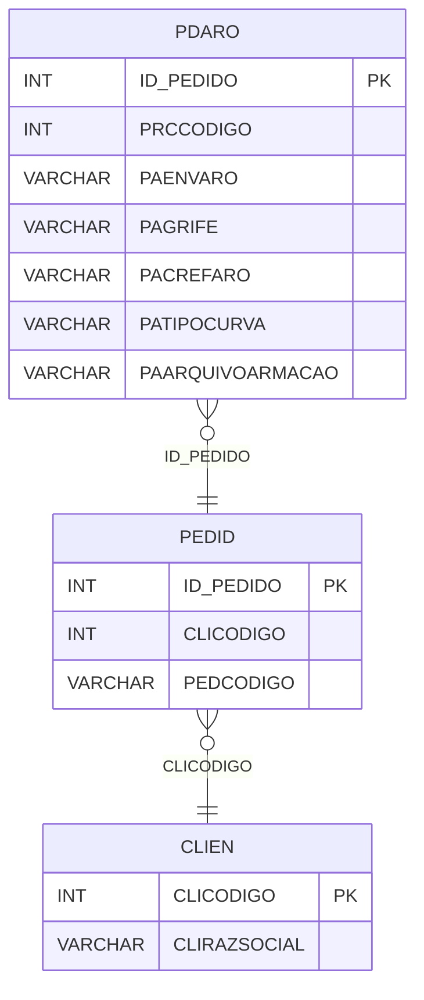

# PDARO - Documentação Completa de Relacionamentos

## 📊 Informações Gerais

- **Nome da Tabela**: PDARO (Pedido - Armação)
- **Total de Registros**: 2.925.359
- **Total de Colunas**: 19
- **Chave Primária**: ID_PEDIDO
- **Chaves Estrangeiras**: 1
- **Índices**: 0
- **Tabelas Dependentes**: 0
- **Banco de Dados**: Firebird

## 📝 Descrição

**PDARO** é uma tabela de detalhamento que armazena informações específicas sobre armações em pedidos. Com **2.925.359 registros**, esta tabela registra dados técnicos de armações como medidas, arquivos, códigos de barras e configurações específicas para cada pedido.

Esta tabela é essencial para:
- **Detalhamento de Armações**: Armazenar informações técnicas de armações por pedido
- **Arquivos**: Gerenciar arquivos relacionados às armações
- **Medidas**: Controlar medidas específicas (nasal, temporal, superior, inferior)
- **Integração**: Facilitar integração com sistemas externos

**Contexto de Negócio:**
Cada pedido pode ter informações específicas sobre a armação solicitada, incluindo medidas, arquivos de produção e configurações técnicas.

---

## 🔑 Estrutura de Colunas

### Identificação
| Coluna | Tipo | Descrição |
|--------|------|-----------|
| **ID_PEDIDO** 🔑 🔗 | INT | Código do pedido (PK, FK → PEDID) |
| **PRCCODIGO** | INT | Código do processo |

### Configurações e Flags
| Coluna | Tipo | Descrição |
|--------|------|-----------|
| **PAENVARO** | VARCHAR(14) | Flag indicando se deve enviar armação |
| **PAGRIFE** | VARCHAR(37) | Referência da armação |
| **PACREFARO** | VARCHAR(37) | Referência adicional da armação |
| **PATIPOCURVA** | VARCHAR(14) | Tipo de curva |
| **PANASAL** | INT | Medida nasal |
| **PATEMPORAL** | INT | Medida temporal |
| **PASUPERIOR** | INT | Medida superior |
| **PAINFERIOR** | INT | Medida inferior |
| **PATEMALTMODELO** | VARCHAR(14) | Flag de alteração de modelo |
| **PACORTEARM** | VARCHAR(14) | Flag de corte de armação |
| **PAENVIARARQUIVOARMACAO** | VARCHAR(14) | Flag para enviar arquivo |
| **PACOLETAARO** | VARCHAR(14) | Flag de coleta de armação |
| **PACLIPON** | VARCHAR(14) | Flag de cliente pontual |

### Arquivos e Códigos
| Coluna | Tipo | Descrição |
|--------|------|-----------|
| **PADTGERACAOARQUIVO** | TIMESTAMP | Data de geração do arquivo |
| **PAARQUIVOARMACAO** | VARCHAR(261) | Caminho do arquivo da armação |
| **PACODBARRASARM** | VARCHAR(37) | Código de barras da armação |
| **PACADPRODU** | VARCHAR(37) | Código adicional de produção |

---

## 🔗 Relacionamentos - Nível 1 (Diretos)

### PEDID - Pedido (FK Obrigatória)
**Volume:** 3.099.176 registros

**Relacionamento:**
```
PDARO.ID_PEDIDO → PEDID.ID_PEDIDO (1:1)
Constraint: PDARO_PEDID
```

**Descrição:** Cada registro está vinculado a um pedido específico. Relacionamento 1:1, onde cada pedido pode ter no máximo um registro de armação.

**Proporção:** ~94,4% dos pedidos têm informações de armação (2.925.359 / 3.099.176)

---

## 🔗 Relacionamentos - Nível 2 (Indiretos)

### PEDID → CLIEN (Cliente)
**Volume:** 9.251 registros

**Relacionamento:**
```
PDARO → PEDID → CLIEN
```

**Descrição:** Através de PEDID, é possível identificar o cliente relacionado.

---

### PEDID → PRODU (Produtos do Pedido)
**Volume:** 178.187 registros

**Relacionamento:**
```
PDARO → PEDID → PDPRD → PRODU
```

**Descrição:** Através de PEDID e PDPRD, é possível identificar produtos relacionados.

---

## 🗺️ Diagrama de Relacionamentos



---

## 💡 Exemplos de Uso

### Consulta Básica

```sql
SELECT ID_PEDIDO, PAENVARO, PAGRIFE, PACREFARO, PATIPOCURVA, PAARQUIVOARMACAO
FROM PDARO
WHERE ID_PEDIDO = ?;
```

### Consulta com Informações do Pedido

```sql
SELECT 
    pa.*,
    p.PEDCODIGO,
    p.PEDDTEMIS,
    c.CLIRAZSOCIAL
FROM PDARO pa
INNER JOIN PEDID p
    ON pa.ID_PEDIDO = p.ID_PEDIDO
INNER JOIN CLIEN c
    ON p.CLICODIGO = c.CLICODIGO
WHERE pa.ID_PEDIDO = ?;
```

### Consulta de Pedidos com Arquivo de Armação

```sql
SELECT 
    pa.*,
    p.PEDCODIGO,
    p.PEDDTEMIS
FROM PDARO pa
INNER JOIN PEDID p
    ON pa.ID_PEDIDO = p.ID_PEDIDO
WHERE pa.PAARQUIVOARMACAO IS NOT NULL
    AND pa.PAARQUIVOARMACAO <> ''
ORDER BY pa.PADTGERACAOARQUIVO DESC;
```

### Estatísticas de Envio de Armação

```sql
SELECT 
    COUNT(*) AS TOTAL_PEDIDOS,
    SUM(CASE WHEN PAENVARO = 'SIM' THEN 1 ELSE 0 END) AS TOTAL_ENVIAR,
    SUM(CASE WHEN PAARQUIVOARMACAO IS NOT NULL THEN 1 ELSE 0 END) AS TOTAL_COM_ARQUIVO
FROM PDARO;
```

---

## ⚡ Performance e Otimização

### Índices Recomendados

#### 1. Índice na Chave Primária (Já existe implicitamente)
```sql
-- Índice primário já existe implicitamente
```

#### 2. Índice em PAENVARO
```sql
CREATE INDEX IDX_PDARO_PAENVARO 
ON PDARO (PAENVARO);
```

**Justificativa:** Facilita buscas por flag de envio.

#### 3. Índice em PADTGERACAOARQUIVO
```sql
CREATE INDEX IDX_PDARO_DTGERACAO 
ON PDARO (PADTGERACAOARQUIVO);
```

**Justificativa:** Facilita buscas por data de geração de arquivo.

---

## 📊 Estatísticas e Insights

### Volume de Dados

- **Total de Registros**: 2.925.359
- **Tamanho Médio Estimado**: ~150 bytes por registro
- **Tamanho Total Estimado**: ~439 MB

### Distribuição de Dados

- **Pedidos com Armação**: 2.925.359 pedidos
- **Taxa de Utilização**: ~94,4% dos pedidos têm informações de armação

---

## 🔧 Integração com Código Laravel

### Model Eloquent

```php
<?php

namespace App\Models;

use Illuminate\Database\Eloquent\Model;
use Illuminate\Database\Eloquent\Relations\BelongsTo;

final class PdAro extends Model
{
    protected $table = 'PDARO';
    protected $primaryKey = 'ID_PEDIDO';
    public $incrementing = false;
    public $timestamps = false;

    protected $fillable = [
        'ID_PEDIDO',
        'PRCCODIGO',
        'PAENVARO',
        'PAGRIFE',
        'PACREFARO',
        'PATIPOCURVA',
        'PADTGERACAOARQUIVO',
        'PAARQUIVOARMACAO',
        'PANASAL',
        'PATEMPORAL',
        'PASUPERIOR',
        'PAINFERIOR',
        'PATEMALTMODELO',
        'PACODBARRASARM',
        'PACORTEARM',
        'PAENVIARARQUIVOARMACAO',
        'PACADPRODU',
        'PACOLETAARO',
        'PACLIPON',
    ];

    protected $casts = [
        'ID_PEDIDO' => 'integer',
        'PRCCODIGO' => 'integer',
        'PADTGERACAOARQUIVO' => 'datetime',
        'PANASAL' => 'integer',
        'PATEMPORAL' => 'integer',
        'PASUPERIOR' => 'integer',
        'PAINFERIOR' => 'integer',
    ];

    /**
     * Relacionamento com Pedido
     */
    public function pedido(): BelongsTo
    {
        return $this->belongsTo(Pedid::class, 'ID_PEDIDO', 'ID_PEDIDO');
    }

    /**
     * Buscar armação por pedido
     */
    public static function porPedido(int $idPedido): ?self
    {
        return self::with(['pedido'])
            ->find($idPedido);
    }

    /**
     * Verificar se tem arquivo
     */
    public function temArquivo(): bool
    {
        return !empty($this->PAARQUIVOARMACAO);
    }
}
```

---

## ✅ Boas Práticas

### Design

1. **Chave Primária**: ID_PEDIDO deve corresponder a um PEDID válido
2. **Validação**: Validar medidas antes de inserir
3. **Arquivos**: Validar caminhos de arquivo antes de inserir

### Performance

1. **Índices**: Usar índices para buscas frequentes
2. **Consultas**: Usar eager loading para relacionamentos
3. **Volume**: Considerar particionamento devido ao grande volume

### Segurança

1. **Validação**: Validar todos os valores antes de inserir
2. **Acesso**: Restringir acesso de escrita a usuários autorizados
3. **Arquivos**: Validar segurança de caminhos de arquivo

---

**Documentação gerada em**: 2025-01-27

**Banco de dados**: Firebird

