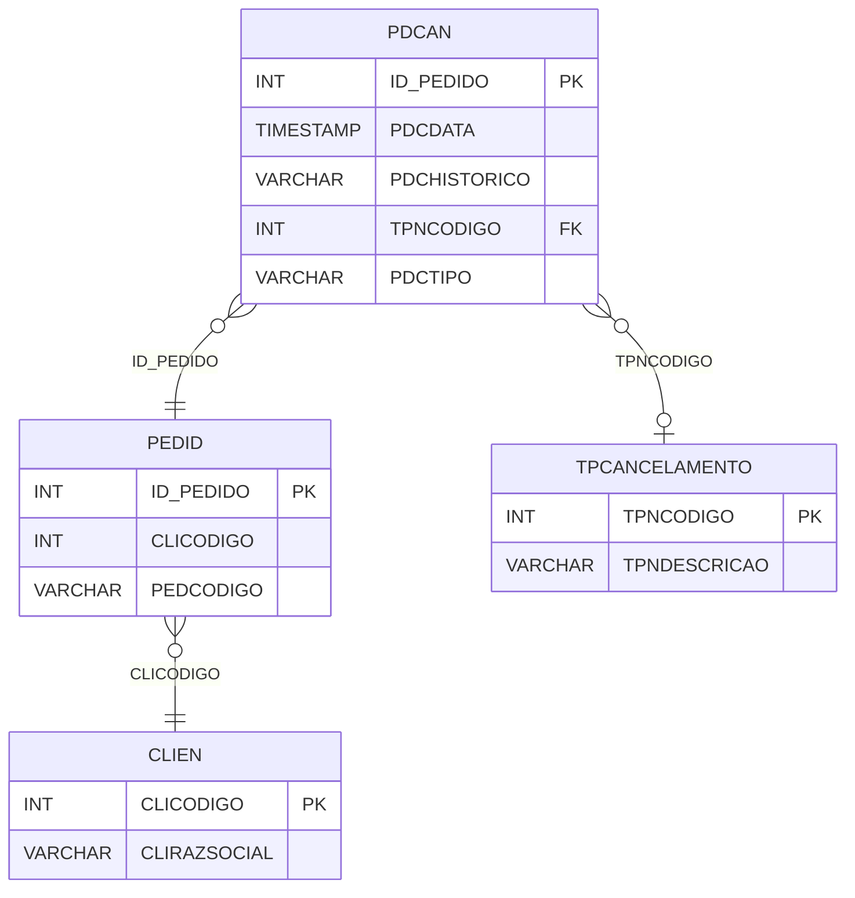

# PDCAN - Documentação Completa de Relacionamentos

## 📊 Informações Gerais

- **Nome da Tabela**: PDCAN (Pedido - Cancelamento)
- **Total de Registros**: 46.045
- **Total de Colunas**: 5
- **Chave Primária**: ID_PEDIDO
- **Chaves Estrangeiras**: 2
- **Índices**: 1
- **Tabelas Dependentes**: 0
- **Banco de Dados**: Firebird

## 📝 Descrição

**PDCAN** é uma tabela de auditoria que registra cancelamentos de pedidos. Com **46.045 registros**, esta tabela armazena informações sobre quando e por que um pedido foi cancelado, mantendo histórico para rastreamento e auditoria.

Esta tabela é essencial para:
- **Auditoria**: Manter histórico de cancelamentos de pedidos
- **Rastreamento**: Rastrear motivos de cancelamento
- **Compliance**: Atender requisitos de auditoria e compliance
- **Análise**: Analisar padrões de cancelamento

**Contexto de Negócio:**
Quando um pedido é cancelado, esta tabela registra a data do cancelamento, o motivo (tipo de cancelamento) e um histórico descritivo do cancelamento.

---

## 🔑 Estrutura de Colunas

| Coluna | Tipo | Descrição |
|--------|------|-----------|
| **ID_PEDIDO** 🔑 🔗 | INT | Código do pedido cancelado (PK, FK → PEDID) |
| **PDCDATA** | TIMESTAMP | Data/hora do cancelamento |
| **PDCHISTORICO** | VARCHAR(37) | Histórico/descrição do cancelamento |
| **TPNCODIGO** 🔗 | INT | Código do tipo de cancelamento (FK → TPCANCELAMENTO) |
| **PDCTIPO** | VARCHAR(14) | Tipo adicional do cancelamento |

---

## 🔗 Relacionamentos - Nível 1 (Diretos)

### PEDID - Pedido (FK Obrigatória)
**Volume:** 3.099.176 registros

**Relacionamento:**
```
PDCAN.ID_PEDIDO → PEDID.ID_PEDIDO (1:1)
Constraint: PEDID_PDCAN
```

**Descrição:** Cada registro de cancelamento está vinculado a um pedido específico. Relacionamento 1:1, onde cada pedido pode ter no máximo um registro de cancelamento.

**Proporção:** ~1,5% dos pedidos foram cancelados (46.045 / 3.099.176)

---

### TPCANCELAMENTO - Tipo de Cancelamento (FK Opcional)
**Volume:** 10 registros

**Relacionamento:**
```
PDCAN.TPNCODIGO → TPCANCELAMENTO.TPNCODIGO (N:1)
Constraint: TPCANCELAMENTO_PDCAN
```

**Descrição:** Define o motivo/tipo do cancelamento (erro de digitação, solicitação do cliente, etc.).

---

## 🔗 Relacionamentos - Nível 2 (Indiretos)

### PEDID → CLIEN (Cliente)
**Volume:** 9.251 registros

**Relacionamento:**
```
PDCAN → PEDID → CLIEN
```

**Descrição:** Através de PEDID, é possível identificar o cliente relacionado ao pedido cancelado.

---

## 🗺️ Diagrama de Relacionamentos



---

## 💡 Exemplos de Uso

### Consulta Básica

```sql
SELECT ID_PEDIDO, PDCDATA, PDCHISTORICO, TPNCODIGO, PDCTIPO
FROM PDCAN
WHERE ID_PEDIDO = ?;
```

### Consulta com Informações do Pedido e Cliente

```sql
SELECT 
    pc.*,
    p.PEDCODIGO,
    p.PEDDTEMIS,
    p.PEDVRTOTAL,
    c.CLIRAZSOCIAL,
    c.CLINOMEFANT
FROM PDCAN pc
INNER JOIN PEDID p
    ON pc.ID_PEDIDO = p.ID_PEDIDO
INNER JOIN CLIEN c
    ON p.CLICODIGO = c.CLICODIGO
WHERE pc.ID_PEDIDO = ?;
```

### Consulta com Tipo de Cancelamento

```sql
SELECT 
    pc.*,
    tp.TPNDESCRICAO
FROM PDCAN pc
LEFT JOIN TPCANCELAMENTO tp
    ON pc.TPNCODIGO = tp.TPNCODIGO
ORDER BY pc.PDCDATA DESC;
```

### Estatísticas de Cancelamento por Tipo

```sql
SELECT 
    tp.TPNDESCRICAO,
    COUNT(*) AS TOTAL_CANCELAMENTOS,
    SUM(p.PEDVRTOTAL) AS VALOR_TOTAL_CANCELADO
FROM PDCAN pc
INNER JOIN TPCANCELAMENTO tp
    ON pc.TPNCODIGO = tp.TPNCODIGO
INNER JOIN PEDID p
    ON pc.ID_PEDIDO = p.ID_PEDIDO
GROUP BY tp.TPNCODIGO, tp.TPNDESCRICAO
ORDER BY TOTAL_CANCELAMENTOS DESC;
```

### Inserção de Cancelamento

```sql
INSERT INTO PDCAN (ID_PEDIDO, PDCDATA, PDCHISTORICO, TPNCODIGO, PDCTIPO)
VALUES (?, CURRENT_TIMESTAMP, ?, ?, ?);
```

---

## ⚡ Performance e Otimização

### Índices Existentes

#### 1. Índice em PDCDATA
**Nome:** INDPDCDATA
**Colunas:** PDCDATA

**Justificativa:** Facilita buscas por data de cancelamento.

---

### Índices Recomendados

#### 1. Índice na Chave Primária (Já existe implicitamente)
```sql
-- Índice primário já existe implicitamente
```

#### 2. Índice em TPNCODIGO
```sql
CREATE INDEX IDX_PDCAN_TPNCODIGO 
ON PDCAN (TPNCODIGO);
```

**Justificativa:** Facilita buscas por tipo de cancelamento.

---

## 📊 Estatísticas e Insights

### Volume de Dados

- **Total de Registros**: 46.045
- **Tamanho Médio Estimado**: ~50 bytes por registro
- **Tamanho Total Estimado**: ~2.3 MB

### Distribuição de Dados

- **Pedidos Cancelados**: 46.045 pedidos
- **Taxa de Cancelamento**: ~1,5% dos pedidos foram cancelados

---

## 🔧 Integração com Código Laravel

### Model Eloquent

```php
<?php

namespace App\Models;

use Illuminate\Database\Eloquent\Model;
use Illuminate\Database\Eloquent\Relations\BelongsTo;

final class PdCan extends Model
{
    protected $table = 'PDCAN';
    protected $primaryKey = 'ID_PEDIDO';
    public $incrementing = false;
    public $timestamps = false;

    protected $fillable = [
        'ID_PEDIDO',
        'PDCDATA',
        'PDCHISTORICO',
        'TPNCODIGO',
        'PDCTIPO',
    ];

    protected $casts = [
        'ID_PEDIDO' => 'integer',
        'PDCDATA' => 'datetime',
        'PDCHISTORICO' => 'string',
        'TPNCODIGO' => 'integer',
        'PDCTIPO' => 'string',
    ];

    /**
     * Relacionamento com Pedido
     */
    public function pedido(): BelongsTo
    {
        return $this->belongsTo(Pedid::class, 'ID_PEDIDO', 'ID_PEDIDO');
    }

    /**
     * Relacionamento com Tipo de Cancelamento
     */
    public function tipoCancelamento(): BelongsTo
    {
        return $this->belongsTo(TpCancelamento::class, 'TPNCODIGO', 'TPNCODIGO');
    }

    /**
     * Cancelar pedido
     */
    public static function cancelar(int $idPedido, int $tpnCodigo, string $historico, ?string $tipo = null): self
    {
        return self::create([
            'ID_PEDIDO' => $idPedido,
            'PDCDATA' => now(),
            'PDCHISTORICO' => $historico,
            'TPNCODIGO' => $tpnCodigo,
            'PDCTIPO' => $tipo,
        ]);
    }
}
```

---

## ✅ Boas Práticas

### Design

1. **Chave Primária**: ID_PEDIDO deve corresponder a um PEDID válido
2. **Validação**: Validar TPNCODIGO antes de inserir
3. **Histórico**: Sempre preencher PDCHISTORICO com descrição clara

### Performance

1. **Índices**: Usar índice para busca por data (já existe)
2. **Consultas**: Usar eager loading para relacionamentos

### Segurança

1. **Validação**: Validar todos os valores antes de inserir
2. **Acesso**: Restringir acesso de escrita a usuários autorizados
3. **Auditoria**: Manter histórico completo de cancelamentos

---

**Documentação gerada em**: 2025-01-27

**Banco de dados**: Firebird

