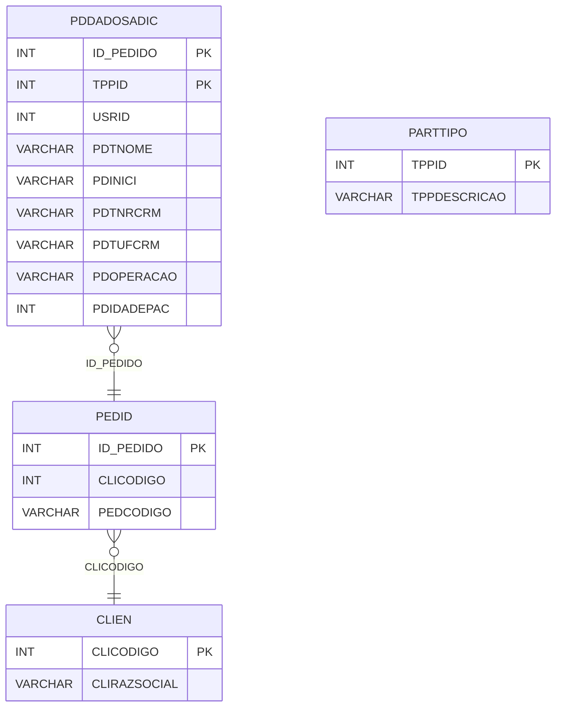

# PDDADOSADIC - Documentação Completa de Relacionamentos

## 📊 Informações Gerais

- **Nome da Tabela**: PDDADOSADIC (Pedido - Dados Adicionais)
- **Total de Registros**: 2.774.503
- **Total de Colunas**: 9
- **Chave Primária**: ID_PEDIDO, TPPID (composite)
- **Chaves Estrangeiras**: 1
- **Índices**: 0
- **Tabelas Dependentes**: 0
- **Banco de Dados**: Firebird

## 📝 Descrição

**PDDADOSADIC** é uma tabela de detalhamento que armazena dados adicionais relacionados a pedidos, especialmente informações sobre médicos/pacientes. Com **2.774.503 registros**, esta tabela registra informações como nome do paciente, CRM do médico, UF do CRM e outras informações complementares.

Esta tabela é essencial para:
- **Dados Médicos**: Armazenar informações sobre médicos e pacientes
- **Rastreamento**: Rastrear informações adicionais por tipo de participante
- **Relatórios**: Gerar relatórios com dados complementares
- **Auditoria**: Manter histórico de alterações

**Contexto de Negócio:**
Pedidos podem ter informações adicionais relacionadas a médicos, pacientes e outros participantes. Esta tabela permite armazenar múltiplos registros de dados adicionais por pedido, organizados por tipo de participante (TPPID).

---

## 🔑 Estrutura de Colunas

| Coluna | Tipo | Descrição |
|--------|------|-----------|
| **ID_PEDIDO** 🔑 🔗 | INT | Código do pedido (PK, FK → PEDID) |
| **TPPID** 🔑 | INT | Código do tipo de participante (PK) |
| **USRID** | INT | Código do usuário que inseriu/alterou |
| **PDTNOME** | VARCHAR(37) | Nome do paciente/participante |
| **PDINICI** | VARCHAR(37) | Iniciais do paciente/participante |
| **PDTNRCRM** | VARCHAR(37) | Número do CRM do médico |
| **PDTUFCRM** | VARCHAR(37) | UF do CRM do médico |
| **PDOPERACAO** | VARCHAR(37) | Tipo de operação (INSERÇÃO, ALTERAÇÃO, etc.) |
| **PDIDADEPAC** | INT | Idade do paciente |

---

## 🔗 Relacionamentos - Nível 1 (Diretos)

### PEDID - Pedido (FK Obrigatória)
**Volume:** 3.099.176 registros

**Relacionamento:**
```
PDDADOSADIC.ID_PEDIDO → PEDID.ID_PEDIDO (N:1)
Constraint: PEDID_PDDADOSADIC
```

**Descrição:** Cada registro de dados adicionais está vinculado a um pedido específico. Um pedido pode ter múltiplos registros de dados adicionais.

**Proporção:** ~89,5% dos pedidos têm dados adicionais (2.774.503 / 3.099.176)

---

## 🔗 Relacionamentos - Nível 2 (Indiretos)

### PEDID → CLIEN (Cliente)
**Volume:** 9.251 registros

**Relacionamento:**
```
PDDADOSADIC → PEDID → CLIEN
```

**Descrição:** Através de PEDID, é possível identificar o cliente relacionado.

---

### PEDID → PARTTIPO (Tipo de Participante - Relacionamento Lógico)
**Volume:** 6 registros

**Relacionamento Lógico:**
```
PDDADOSADIC.TPPID → PARTTIPO.TPPID
```

**Descrição:** TPPID referencia tipos de participantes (Médico, Vendedor, etc.).

---

## 🗺️ Diagrama de Relacionamentos



---

## 💡 Exemplos de Uso

### Consulta Básica

```sql
SELECT ID_PEDIDO, TPPID, PDTNOME, PDTNRCRM, PDTUFCRM, PDIDADEPAC
FROM PDDADOSADIC
WHERE ID_PEDIDO = ?;
```

### Consulta com Informações do Pedido

```sql
SELECT 
    pd.*,
    p.PEDCODIGO,
    p.PEDDTEMIS,
    c.CLIRAZSOCIAL
FROM PDDADOSADIC pd
INNER JOIN PEDID p
    ON pd.ID_PEDIDO = p.ID_PEDIDO
INNER JOIN CLIEN c
    ON p.CLICODIGO = c.CLICODIGO
WHERE pd.ID_PEDIDO = ?;
```

### Consulta de Dados Médicos

```sql
SELECT 
    pd.*,
    p.PEDCODIGO,
    pt.TPPDESCRICAO
FROM PDDADOSADIC pd
INNER JOIN PEDID p
    ON pd.ID_PEDIDO = p.ID_PEDIDO
LEFT JOIN PARTTIPO pt
    ON pd.TPPID = pt.TPPID
WHERE pd.PDTNRCRM IS NOT NULL
    AND pd.PDTNRCRM <> ''
ORDER BY pd.PDTNRCRM;
```

### Consulta por Tipo de Participante

```sql
SELECT 
    pt.TPPDESCRICAO,
    COUNT(*) AS TOTAL_REGISTROS
FROM PDDADOSADIC pd
LEFT JOIN PARTTIPO pt
    ON pd.TPPID = pt.TPPID
GROUP BY pt.TPPID, pt.TPPDESCRICAO
ORDER BY TOTAL_REGISTROS DESC;
```

### Inserção de Dados Adicionais

```sql
INSERT INTO PDDADOSADIC (
    ID_PEDIDO,
    TPPID,
    USRID,
    PDTNOME,
    PDINICI,
    PDTNRCRM,
    PDTUFCRM,
    PDOPERACAO,
    PDIDADEPAC
)
VALUES (?, ?, ?, ?, ?, ?, ?, ?, ?);
```

---

## ⚡ Performance e Otimização

### Índices Recomendados

#### 1. Índice Composto na Chave Primária (Já existe implicitamente)
```sql
-- Índice primário já existe implicitamente
```

#### 2. Índice em TPPID
```sql
CREATE INDEX IDX_PDDADOSADIC_TPPID 
ON PDDADOSADIC (TPPID);
```

**Justificativa:** Facilita buscas por tipo de participante.

#### 3. Índice em PDTNRCRM
```sql
CREATE INDEX IDX_PDDADOSADIC_CRM 
ON PDDADOSADIC (PDTNRCRM);
```

**Justificativa:** Facilita buscas por CRM.

---

## 📊 Estatísticas e Insights

### Volume de Dados

- **Total de Registros**: 2.774.503
- **Tamanho Médio Estimado**: ~60 bytes por registro
- **Tamanho Total Estimado**: ~166 MB

### Distribuição de Dados

- **Pedidos com Dados Adicionais**: 2.774.503 registros
- **Taxa de Utilização**: ~89,5% dos pedidos têm dados adicionais

---

## 🔧 Integração com Código Laravel

### Model Eloquent

```php
<?php

namespace App\Models;

use Illuminate\Database\Eloquent\Model;
use Illuminate\Database\Eloquent\Relations\BelongsTo;

final class PdDadosAdic extends Model
{
    protected $table = 'PDDADOSADIC';
    public $incrementing = false;
    public $timestamps = false;

    protected $primaryKey = ['ID_PEDIDO', 'TPPID'];

    protected $fillable = [
        'ID_PEDIDO',
        'TPPID',
        'USRID',
        'PDTNOME',
        'PDINICI',
        'PDTNRCRM',
        'PDTUFCRM',
        'PDOPERACAO',
        'PDIDADEPAC',
    ];

    protected $casts = [
        'ID_PEDIDO' => 'integer',
        'TPPID' => 'integer',
        'USRID' => 'integer',
        'PDTNOME' => 'string',
        'PDINICI' => 'string',
        'PDTNRCRM' => 'string',
        'PDTUFCRM' => 'string',
        'PDOPERACAO' => 'string',
        'PDIDADEPAC' => 'integer',
    ];

    /**
     * Relacionamento com Pedido
     */
    public function pedido(): BelongsTo
    {
        return $this->belongsTo(Pedid::class, 'ID_PEDIDO', 'ID_PEDIDO');
    }

    /**
     * Buscar dados adicionais por pedido
     */
    public static function porPedido(int $idPedido)
    {
        return self::where('ID_PEDIDO', $idPedido)
            ->with(['pedido'])
            ->get();
    }

    /**
     * Buscar por CRM
     */
    public static function porCrm(string $crm)
    {
        return self::where('PDTNRCRM', $crm)
            ->with(['pedido'])
            ->get();
    }
}
```

---

## ✅ Boas Práticas

### Design

1. **Chave Composta**: Manter integridade da chave composta
2. **Validação**: Validar TPPID antes de inserir
3. **CRM**: Validar formato do CRM quando preenchido

### Performance

1. **Índices**: Usar índices para buscas frequentes
2. **Consultas**: Usar eager loading para relacionamentos
3. **Volume**: Considerar particionamento devido ao grande volume

### Segurança

1. **Validação**: Validar valores antes de inserir
2. **Acesso**: Restringir acesso de escrita a usuários autorizados
3. **Dados Sensíveis**: Proteger dados médicos sensíveis

---

**Documentação gerada em**: 2025-01-27

**Banco de dados**: Firebird

