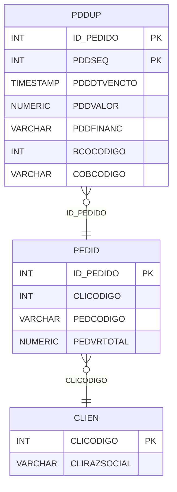

# PDDUP - Documentação Completa de Relacionamentos

## 📊 Informações Gerais

- **Nome da Tabela**: PDDUP (Pedido - Duplicatas)
- **Total de Registros**: 7.266.733
- **Total de Colunas**: 23
- **Chave Primária**: ID_PEDIDO, PDDSEQ (composite)
- **Chaves Estrangeiras**: 1
- **Índices**: 0
- **Tabelas Dependentes**: 0
- **Banco de Dados**: Firebird

## 📝 Descrição

**PDDUP** é uma tabela de detalhamento que armazena as duplicatas (parcelas de pagamento) relacionadas a pedidos. Com **7.266.733 registros**, esta tabela registra cada parcela de pagamento com sua data de vencimento, valor, informações bancárias e formas de pagamento.

Esta tabela é essencial para:
- **Controle de Pagamentos**: Registrar cada parcela de pagamento do pedido
- **Vencimentos**: Controlar datas de vencimento das duplicatas
- **Financeiro**: Gerenciar valores de cada duplicata
- **Bancário**: Controlar informações bancárias e de cobrança

**Contexto de Negócio:**
Um pedido pode ter múltiplas duplicatas, cada uma com data de vencimento, valor e informações bancárias específicas. Esta tabela detalha essas duplicatas.

---

## 🔑 Estrutura de Colunas

### Identificação e Sequência
| Coluna | Tipo | Descrição |
|--------|------|-----------|
| **ID_PEDIDO** 🔑 🔗 | INT | Código do pedido (PK, FK → PEDID) |
| **PDDSEQ** 🔑 | INT | Sequencial da duplicata (PK) |

### Valores e Datas
| Coluna | Tipo | Descrição |
|--------|------|-----------|
| **PDDDTVENCTO** | TIMESTAMP | Data de vencimento da duplicata |
| **PDDVALOR** | NUMERIC(27,2) | Valor da duplicata |
| **PDDFINANC** | VARCHAR(14) | Flag indicando se está financeiro |
| **PDDRECANTECIP** | VARCHAR(14) | Flag de recebimento antecipado |

### Informações Bancárias
| Coluna | Tipo | Descrição |
|--------|------|-----------|
| **BCOCODIGO** | INT | Código do banco |
| **COBCODIGO** | VARCHAR(14) | Código de cobrança |
| **BCOCODIGOCH** | INT | Código do banco do cheque |
| **PDDNRCONTA** | VARCHAR(37) | Número da conta |
| **PDDAGENCIA** | VARCHAR(37) | Agência |
| **CTANRCONTA** | VARCHAR(37) | Número da conta (alternativo) |
| **EMPCCORR** | INT | Código da empresa corrente |

### Cheques
| Coluna | Tipo | Descrição |
|--------|------|-----------|
| **PDDTIPODOCTO** | VARCHAR(14) | Tipo de documento |
| **PDDNRCHEQUE** | VARCHAR(37) | Número do cheque |
| **PDDDIGNRCH** | VARCHAR(14) | Dígito do número do cheque |
| **PDDEMITENTECH** | VARCHAR(37) | Emitente do cheque |

### Outros
| Coluna | Tipo | Descrição |
|--------|------|-----------|
| **FRCCODIGO** | INT | Código da forma de recebimento |
| **PDDNRAUTO** | VARCHAR(37) | Número de autorização |
| **PDDDIA** | INT | Dia de vencimento |
| **PDDVRCARTAO** | NUMERIC(16,2) | Valor do cartão |
| **PDDVRJUROS** | NUMERIC(16,2) | Valor de juros |
| **CCONRLANCTO** | INT | Número de lançamento contábil |

---

## 🔗 Relacionamentos - Nível 1 (Diretos)

### PEDID - Pedido (FK Obrigatória)
**Volume:** 3.099.176 registros

**Relacionamento:**
```
PDDUP.ID_PEDIDO → PEDID.ID_PEDIDO (N:1)
Constraint: PEDID_PDDUP
```

**Descrição:** Cada duplicata está vinculada a um pedido específico.

**Proporção:** ~2,3 duplicatas por pedido em média (7.266.733 / 3.099.176)

---

## 🔗 Relacionamentos - Nível 2 (Indiretos)

### PEDID → CLIEN (Cliente)
**Volume:** 9.251 registros

**Relacionamento:**
```
PDDUP → PEDID → CLIEN
```

**Descrição:** Através de PEDID, é possível identificar o cliente relacionado.

---

### PEDID → BCOCOB (Banco/Cobrança - Relacionamento Lógico)
**Volume:** 11 registros

**Relacionamento Lógico:**
```
PDDUP.BCOCODIGO, COBCODIGO → BCOCOB.BCOCODIGO, COBCODIGO
```

**Descrição:** Relaciona com informações bancárias de cobrança.

---

## 🗺️ Diagrama de Relacionamentos



---

## 💡 Exemplos de Uso

### Consulta Básica

```sql
SELECT ID_PEDIDO, PDDSEQ, PDDDTVENCTO, PDDVALOR, PDDFINANC
FROM PDDUP
WHERE ID_PEDIDO = ?
ORDER BY PDDDTVENCTO;
```

### Consulta com Informações do Pedido

```sql
SELECT 
    d.*,
    p.PEDCODIGO,
    p.PEDDTEMIS,
    p.PEDVRTOTAL,
    c.CLIRAZSOCIAL
FROM PDDUP d
INNER JOIN PEDID p
    ON d.ID_PEDIDO = p.ID_PEDIDO
INNER JOIN CLIEN c
    ON p.CLICODIGO = c.CLICODIGO
WHERE d.ID_PEDIDO = ?
ORDER BY d.PDDDTVENCTO;
```

### Consulta de Duplicatas Vencidas

```sql
SELECT 
    d.*,
    p.PEDCODIGO,
    c.CLIRAZSOCIAL
FROM PDDUP d
INNER JOIN PEDID p
    ON d.ID_PEDIDO = p.ID_PEDIDO
INNER JOIN CLIEN c
    ON p.CLICODIGO = c.CLICODIGO
WHERE d.PDDDTVENCTO < CURRENT_DATE
    AND p.PEDSITPED = 'ATIVO'
    AND d.PDDFINANC = 'SIM'
ORDER BY d.PDDDTVENCTO;
```

### Soma de Valores por Pedido

```sql
SELECT 
    ID_PEDIDO,
    COUNT(*) AS TOTAL_DUPLICATAS,
    SUM(PDDVALOR) AS VALOR_TOTAL
FROM PDDUP
GROUP BY ID_PEDIDO;
```

### Consulta de Duplicatas por Banco

```sql
SELECT 
    BCOCODIGO,
    COUNT(*) AS TOTAL_DUPLICATAS,
    SUM(PDDVALOR) AS VALOR_TOTAL
FROM PDDUP
WHERE BCOCODIGO IS NOT NULL
GROUP BY BCOCODIGO
ORDER BY VALOR_TOTAL DESC;
```

### Inserção de Nova Duplicata

```sql
INSERT INTO PDDUP (
    ID_PEDIDO,
    PDDSEQ,
    PDDDTVENCTO,
    PDDVALOR,
    PDDFINANC,
    BCOCODIGO,
    COBCODIGO
)
VALUES (?, ?, ?, ?, ?, ?, ?);
```

---

## ⚡ Performance e Otimização

### Índices Recomendados

#### 1. Índice Composto na Chave Primária (Já existe implicitamente)
```sql
-- Índice primário já existe implicitamente
```

#### 2. Índice em PDDDTVENCTO
```sql
CREATE INDEX IDX_PDDUP_DTVENCTO 
ON PDDUP (PDDDTVENCTO);
```

**Justificativa:** Facilita buscas por data de vencimento (crítico para relatórios de vencidos).

#### 3. Índice em BCOCODIGO
```sql
CREATE INDEX IDX_PDDUP_BCOCODIGO 
ON PDDUP (BCOCODIGO);
```

**Justificativa:** Facilita buscas por banco.

---

## 📊 Estatísticas e Insights

### Volume de Dados

- **Total de Registros**: 7.266.733
- **Tamanho Médio Estimado**: ~120 bytes por registro
- **Tamanho Total Estimado**: ~872 MB

### Distribuição de Dados

- **Pedidos com Duplicatas**: 3.099.176 pedidos
- **Média de Duplicatas**: ~2,3 duplicatas por pedido

---

## 🔧 Integração com Código Laravel

### Model Eloquent

```php
<?php

namespace App\Models;

use Illuminate\Database\Eloquent\Model;
use Illuminate\Database\Eloquent\Relations\BelongsTo;

final class PdDup extends Model
{
    protected $table = 'PDDUP';
    public $incrementing = false;
    public $timestamps = false;

    protected $primaryKey = ['ID_PEDIDO', 'PDDSEQ'];

    protected $fillable = [
        'ID_PEDIDO',
        'PDDSEQ',
        'PDDDTVENCTO',
        'PDDVALOR',
        'PDDFINANC',
        'BCOCODIGO',
        'COBCODIGO',
        'BCOCODIGOCH',
        'PDDNRCONTA',
        'PDDAGENCIA',
        'CTANRCONTA',
        'EMPCCORR',
        'PDDTIPODOCTO',
        'PDDNRCHEQUE',
        'PDDDIGNRCH',
        'PDDEMITENTECH',
        'FRCCODIGO',
        'PDDNRAUTO',
        'PDDDIA',
        'PDDVRCARTAO',
        'PDDVRJUROS',
        'CCONRLANCTO',
        'PDDRECANTECIP',
    ];

    protected $casts = [
        'ID_PEDIDO' => 'integer',
        'PDDSEQ' => 'integer',
        'PDDDTVENCTO' => 'datetime',
        'PDDVALOR' => 'decimal:2',
        'PDDFINANC' => 'string',
        'BCOCODIGO' => 'integer',
        'BCOCODIGOCH' => 'integer',
        'PDDDIA' => 'integer',
        'PDDVRCARTAO' => 'decimal:2',
        'PDDVRJUROS' => 'decimal:2',
        'CCONRLANCTO' => 'integer',
        'EMPCCORR' => 'integer',
        'FRCCODIGO' => 'integer',
    ];

    /**
     * Relacionamento com Pedido
     */
    public function pedido(): BelongsTo
    {
        return $this->belongsTo(Pedid::class, 'ID_PEDIDO', 'ID_PEDIDO');
    }

    /**
     * Buscar duplicatas por pedido
     */
    public static function porPedido(int $idPedido)
    {
        return self::where('ID_PEDIDO', $idPedido)
            ->orderBy('PDDDTVENCTO')
            ->get();
    }

    /**
     * Buscar duplicatas vencidas
     */
    public static function vencidas()
    {
        return self::where('PDDDTVENCTO', '<', now())
            ->where('PDDFINANC', 'SIM')
            ->with(['pedido'])
            ->get();
    }

    /**
     * Verificar se está vencida
     */
    public function isVencida(): bool
    {
        return $this->PDDDTVENCTO < now();
    }
}
```

---

## ✅ Boas Práticas

### Design

1. **Chave Composta**: Manter integridade da chave composta
2. **Validação**: Validar valores antes de inserir
3. **Datas**: Validar PDDDTVENCTO antes de inserir

### Performance

1. **Índices**: Usar índices para busca por vencimento (crítico)
2. **Consultas**: Usar eager loading para relacionamentos
3. **Volume**: Considerar particionamento devido ao grande volume

### Segurança

1. **Validação**: Validar valores antes de inserir
2. **Acesso**: Restringir acesso de escrita a usuários autorizados
3. **Financeiro**: Validar valores financeiros cuidadosamente

---

**Documentação gerada em**: 2025-01-27

**Banco de dados**: Firebird

