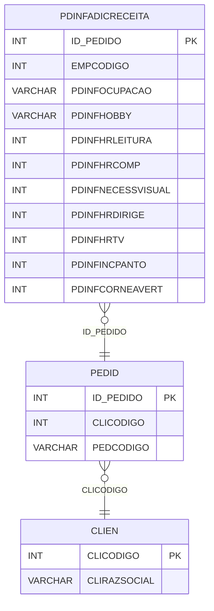

# PDINFADICRECEITA - Documentação Completa de Relacionamentos

## 📊 Informações Gerais

- **Nome da Tabela**: PDINFADICRECEITA (Pedido - Informações Adicionais de Receita)
- **Total de Registros**: 864.827
- **Total de Colunas**: 11
- **Chave Primária**: ID_PEDIDO
- **Chaves Estrangeiras**: 1
- **Índices**: 0
- **Tabelas Dependentes**: 0
- **Banco de Dados**: Firebird

## 📝 Descrição

**PDINFADICRECEITA** é uma tabela de detalhamento que armazena informações adicionais relacionadas à receita óptica do pedido. Com **864.827 registros**, esta tabela registra informações sobre ocupação, hobbies, horas de leitura, uso de computador, necessidade visual, horas dirigindo, horas assistindo TV e outras informações relevantes para a prescrição.

Esta tabela é essencial para:
- **Anamnese Óptica**: Armazenar informações complementares da receita
- **Prescrição**: Ajudar na elaboração de prescrições personalizadas
- **Análise**: Analisar padrões de uso e necessidade visual
- **Relatórios**: Gerar relatórios com informações de receita

**Contexto de Negócio:**
Pedidos de óculos podem ter informações adicionais sobre o uso e necessidades visuais do paciente, que ajudam na elaboração da prescrição e escolha das lentes adequadas.

---

## 🔑 Estrutura de Colunas

| Coluna | Tipo | Descrição |
|--------|------|-----------|
| **ID_PEDIDO** 🔑 🔗 | INT | Código do pedido (PK, FK → PEDID) |
| **EMPCODIGO** | INT | Código da empresa |
| **PDINFOCUPACAO** | VARCHAR(37) | Ocupação do paciente |
| **PDINFHOBBY** | VARCHAR(37) | Hobby do paciente |
| **PDINFHRLEITURA** | INT | Horas de leitura por dia |
| **PDINFHRCOMP** | INT | Horas de uso de computador por dia |
| **PDINFNECESSVISUAL** | INT | Necessidade visual (escala) |
| **PDINFHRDIRIGE** | INT | Horas dirigindo por dia |
| **PDINFHRTV** | INT | Horas assistindo TV por dia |
| **PDINFINCPANTO** | INT | Incidência de panteamento |
| **PDINFCORNEAVERT** | INT | Córnea vertical |

---

## 🔗 Relacionamentos - Nível 1 (Diretos)

### PEDID - Pedido (FK Obrigatória)
**Volume:** 3.099.176 registros

**Relacionamento:**
```
PDINFADICRECEITA.ID_PEDIDO → PEDID.ID_PEDIDO (1:1)
Constraint: XPKPDINFADICRECEITA
```

**Descrição:** Cada registro está vinculado a um pedido específico. Relacionamento 1:1, onde cada pedido pode ter no máximo um registro de informações adicionais de receita.

**Proporção:** ~27,9% dos pedidos têm informações adicionais de receita (864.827 / 3.099.176)

---

## 🔗 Relacionamentos - Nível 2 (Indiretos)

### PEDID → CLIEN (Cliente)
**Volume:** 9.251 registros

**Relacionamento:**
```
PDINFADICRECEITA → PEDID → CLIEN
```

**Descrição:** Através de PEDID, é possível identificar o cliente relacionado.

---

### PEDID → PDLENTE (Lentes do Pedido)
**Volume:** 2.492.957 registros

**Relacionamento:**
```
PDINFADICRECEITA → PEDID → PDLENTE
```

**Descrição:** Através de PEDID, é possível identificar as lentes relacionadas.

---

## 🗺️ Diagrama de Relacionamentos



---

## 💡 Exemplos de Uso

### Consulta Básica

```sql
SELECT ID_PEDIDO, PDINFOCUPACAO, PDINFHOBBY, PDINFHRLEITURA, PDINFHRCOMP, PDINFNECESSVISUAL
FROM PDINFADICRECEITA
WHERE ID_PEDIDO = ?;
```

### Consulta com Informações do Pedido

```sql
SELECT 
    pi.*,
    p.PEDCODIGO,
    p.PEDDTEMIS,
    c.CLIRAZSOCIAL
FROM PDINFADICRECEITA pi
INNER JOIN PEDID p
    ON pi.ID_PEDIDO = p.ID_PEDIDO
INNER JOIN CLIEN c
    ON p.CLICODIGO = c.CLICODIGO
WHERE pi.ID_PEDIDO = ?;
```

### Análise de Padrões de Uso

```sql
SELECT 
    AVG(PDINFHRLEITURA) AS MEDIA_HR_LEITURA,
    AVG(PDINFHRCOMP) AS MEDIA_HR_COMP,
    AVG(PDINFHRDIRIGE) AS MEDIA_HR_DIRIGE,
    AVG(PDINFHRTV) AS MEDIA_HR_TV
FROM PDINFADICRECEITA
WHERE PDINFHRLEITURA IS NOT NULL
    OR PDINFHRCOMP IS NOT NULL;
```

### Consulta por Ocupação

```sql
SELECT 
    PDINFOCUPACAO,
    COUNT(*) AS TOTAL_PEDIDOS,
    AVG(PDINFNECESSVISUAL) AS MEDIA_NECESSIDADE_VISUAL
FROM PDINFADICRECEITA
WHERE PDINFOCUPACAO IS NOT NULL
    AND PDINFOCUPACAO <> ''
GROUP BY PDINFOCUPACAO
ORDER BY TOTAL_PEDIDOS DESC;
```

### Inserção de Informações Adicionais

```sql
INSERT INTO PDINFADICRECEITA (
    ID_PEDIDO,
    EMPCODIGO,
    PDINFOCUPACAO,
    PDINFHOBBY,
    PDINFHRLEITURA,
    PDINFHRCOMP,
    PDINFNECESSVISUAL,
    PDINFHRDIRIGE,
    PDINFHRTV,
    PDINFINCPANTO,
    PDINFCORNEAVERT
)
VALUES (?, ?, ?, ?, ?, ?, ?, ?, ?, ?, ?);
```

---

## ⚡ Performance e Otimização

### Índices Recomendados

#### 1. Índice na Chave Primária (Já existe implicitamente)
```sql
-- Índice primário já existe implicitamente
```

#### 2. Índice em EMPCODIGO
```sql
CREATE INDEX IDX_PDINFADICRECEITA_EMPCODIGO 
ON PDINFADICRECEITA (EMPCODIGO);
```

**Justificativa:** Facilita buscas por empresa.

---

## 📊 Estatísticas e Insights

### Volume de Dados

- **Total de Registros**: 864.827
- **Tamanho Médio Estimado**: ~80 bytes por registro
- **Tamanho Total Estimado**: ~69 MB

### Distribuição de Dados

- **Pedidos com Informações Adicionais**: 864.827 pedidos
- **Taxa de Utilização**: ~27,9% dos pedidos têm informações adicionais de receita

---

## 🔧 Integração com Código Laravel

### Model Eloquent

```php
<?php

namespace App\Models;

use Illuminate\Database\Eloquent\Model;
use Illuminate\Database\Eloquent\Relations\BelongsTo;

final class PdInfAdicReceita extends Model
{
    protected $table = 'PDINFADICRECEITA';
    protected $primaryKey = 'ID_PEDIDO';
    public $incrementing = false;
    public $timestamps = false;

    protected $fillable = [
        'ID_PEDIDO',
        'EMPCODIGO',
        'PDINFOCUPACAO',
        'PDINFHOBBY',
        'PDINFHRLEITURA',
        'PDINFHRCOMP',
        'PDINFNECESSVISUAL',
        'PDINFHRDIRIGE',
        'PDINFHRTV',
        'PDINFINCPANTO',
        'PDINFCORNEAVERT',
    ];

    protected $casts = [
        'ID_PEDIDO' => 'integer',
        'EMPCODIGO' => 'integer',
        'PDINFHRLEITURA' => 'integer',
        'PDINFHRCOMP' => 'integer',
        'PDINFNECESSVISUAL' => 'integer',
        'PDINFHRDIRIGE' => 'integer',
        'PDINFHRTV' => 'integer',
        'PDINFINCPANTO' => 'integer',
        'PDINFCORNEAVERT' => 'integer',
    ];

    /**
     * Relacionamento com Pedido
     */
    public function pedido(): BelongsTo
    {
        return $this->belongsTo(Pedid::class, 'ID_PEDIDO', 'ID_PEDIDO');
    }

    /**
     * Buscar informações por pedido
     */
    public static function porPedido(int $idPedido): ?self
    {
        return self::with(['pedido'])
            ->find($idPedido);
    }

    /**
     * Calcular total de horas de uso visual
     */
    public function getTotalHorasUsoVisualAttribute(): int
    {
        return ($this->PDINFHRLEITURA ?? 0) +
               ($this->PDINFHRCOMP ?? 0) +
               ($this->PDINFHRDIRIGE ?? 0) +
               ($this->PDINFHRTV ?? 0);
    }
}
```

---

## ✅ Boas Práticas

### Design

1. **Chave Primária**: ID_PEDIDO deve corresponder a um PEDID válido
2. **Validação**: Validar valores numéricos antes de inserir
3. **Horas**: Validar que horas não excedam 24 por dia

### Performance

1. **Índices**: Usar índice para busca por empresa
2. **Consultas**: Usar eager loading para relacionamentos

### Segurança

1. **Validação**: Validar valores antes de inserir
2. **Acesso**: Restringir acesso de escrita a usuários autorizados
3. **Dados Sensíveis**: Proteger informações de saúde do paciente

---

**Documentação gerada em**: 2025-01-27

**Banco de dados**: Firebird

