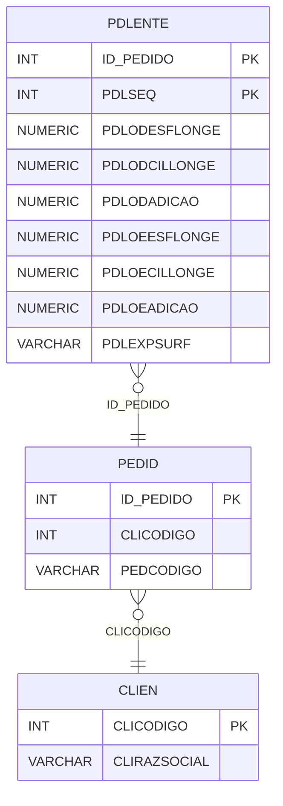

# PDLENTE - Documentação Completa de Relacionamentos

## 📊 Informações Gerais

- **Nome da Tabela**: PDLENTE (Pedido - Lente)
- **Total de Registros**: 2.492.957
- **Total de Colunas**: 57
- **Chave Primária**: ID_PEDIDO, PDLSEQ (composite)
- **Chaves Estrangeiras**: 1
- **Índices**: 1
- **Tabelas Dependentes**: 0
- **Banco de Dados**: Firebird

## 📝 Descrição

**PDLENTE** é uma tabela de detalhamento que armazena informações detalhadas sobre lentes em pedidos. Com **2.492.957 registros**, esta tabela registra todas as especificações ópticas das lentes, incluindo graus, medidas, tipos de lente, armações e outras informações técnicas.

Esta tabela é essencial para:
- **Especificações Ópticas**: Armazenar todas as especificações das lentes
- **Prescrição**: Registrar prescrições completas (OD e OE)
- **Produção**: Fornecer dados para produção de lentes
- **Rastreamento**: Rastrear lentes por pedido

**Contexto de Negócio:**
Cada pedido pode ter múltiplas lentes, cada uma com especificações completas de prescrição óptica (graus, eixos, adições, prismas, etc.) para olho direito (OD) e olho esquerdo (OE).

---

## 🔑 Estrutura de Colunas

### Identificação
| Coluna | Tipo | Descrição |
|--------|------|-----------|
| **ID_PEDIDO** 🔑 🔗 | INT | Código do pedido (PK, FK → PEDID) |
| **PDLSEQ** 🔑 | INT | Sequencial da lente no pedido (PK) |

### Olho Direito (OD) - Esfera e Cilindro
| Coluna | Tipo | Descrição |
|--------|------|-----------|
| **PDLODESFLONGE** | NUMERIC(27,2) | Esfera para longe OD |
| **PDLODCILLONGE** | NUMERIC(27,2) | Cilindro para longe OD |
| **PDLODADICAO** | NUMERIC(27,2) | Adição OD |
| **PDLODESFPERTO** | NUMERIC(27,2) | Esfera para perto OD |
| **PDLODCILPERTO** | NUMERIC(27,2) | Cilindro para perto OD |
| **PDLODEIXO** | NUMERIC(27,2) | Eixo OD |
| **PDLODDNP** | NUMERIC(27,2) | DNP (Distância Naso-Pupilar) OD |
| **PDLODALTURA** | NUMERIC(27,2) | Altura OD |
| **PDLODDESC** | VARCHAR(27) | Descrição OD |

### Olho Esquerdo (OE) - Esfera e Cilindro
| Coluna | Tipo | Descrição |
|--------|------|-----------|
| **PDLOEESFLONGE** | NUMERIC(27,2) | Esfera para longe OE |
| **PDLOECILLONGE** | NUMERIC(27,2) | Cilindro para longe OE |
| **PDLOEADICAO** | NUMERIC(27,2) | Adição OE |
| **PDLOEESFPERTO** | NUMERIC(27,2) | Esfera para perto OE |
| **PDLOECILPERTO** | NUMERIC(27,2) | Cilindro para perto OE |
| **PDLOEEIXO** | NUMERIC(27,2) | Eixo OE |
| **PDLOEDNP** | NUMERIC(27,2) | DNP OE |
| **PDLOEALTURA** | NUMERIC(27,2) | Altura OE |
| **PDLOEDESC** | VARCHAR(27) | Descrição OE |

### Medidas e Configurações
| Coluna | Tipo | Descrição |
|--------|------|-----------|
| **PDLDP** | NUMERIC(27,2) | Distância pupilar |
| **PDLDPA** | NUMERIC(27,2) | Distância pupilar adicional |
| **PDLARO** | NUMERIC(27,2) | Medida da armação |
| **PDLARMACAO** | VARCHAR(14) | Código da armação |
| **PDLMODELO** | INT | Código do modelo |
| **PDLTPLENTE** | VARCHAR(37) | Tipo de lente |
| **PDLDTETQ** | TIMESTAMP | Data de etiqueta |
| **PDLAVA** | NUMERIC(27,2) | Medida AVA |
| **ARMCODIGO** | INT | Código da armação |
| **PDLDIAMETRO** | NUMERIC(27,2) | Diâmetro |
| **PDLEXPSURF** | VARCHAR(14) | Flag de exposição surf |
| **TPLCODIGO_OD** | INT | Código do tipo de lente OD |
| **TPLCODIGO_OE** | INT | Código do tipo de lente OE |
| **PDLOD_SURF** | VARCHAR(14) | Flag surf OD |
| **PDLOE_SURF** | VARCHAR(14) | Flag surf OE |

### Prismas
| Coluna | Tipo | Descrição |
|--------|------|-----------|
| **PDLPRISMA1_OD** | NUMERIC(16,2) | Prisma 1 OD |
| **PDLPRISMA1_OE** | NUMERIC(16,2) | Prisma 1 OE |
| **PDLPRISMAEIXO1_OD** | INT | Eixo do prisma 1 OD |
| **PDLPRISMAEIXO1_OE** | INT | Eixo do prisma 1 OE |
| **PDLPRISMA2_OD** | NUMERIC(16,2) | Prisma 2 OD |
| **PDLPRISMA2_OE** | NUMERIC(16,2) | Prisma 2 OE |
| **PDLPRISMAEIXO2_OD** | INT | Eixo do prisma 2 OD |
| **PDLPRISMAEIXO2_OE** | INT | Eixo do prisma 2 OE |

### Armação
| Coluna | Tipo | Descrição |
|--------|------|-----------|
| **PDLLARGARO** | NUMERIC(16,2) | Largura da armação |
| **PDLPONTEARO** | NUMERIC(16,2) | Ponte da armação |
| **PDLMEIXOARO** | INT | Meio eixo da armação |

### Outros
| Coluna | Tipo | Descrição |
|--------|------|-----------|
| **TPLCODIGO_ANT_OD** | INT | Tipo de lente anterior OD |
| **TPLCODIGO_ANT_OE** | INT | Tipo de lente anterior OE |
| **PDLESPCENTRO_OD** | NUMERIC(16,2) | Espessura centro OD |
| **PDLESPCENTRO_OE** | NUMERIC(16,2) | Espessura centro OE |
| **PDLESPBORDA_OD** | NUMERIC(16,2) | Espessura borda OD |
| **PDLESPBORDA_OE** | NUMERIC(16,2) | Espessura borda OE |
| **PDLODDIAMLT** | NUMERIC(27,2) | Diâmetro lateral OD |
| **PDLOEDIAMLT** | NUMERIC(27,2) | Diâmetro lateral OE |
| **PDLODCURBASE** | NUMERIC(27,2) | Curva base OD |
| **PDLOECURBASE** | NUMERIC(27,2) | Curva base OE |
| **CLICODIGO** | INT | Código do cliente |

---

## 🔗 Relacionamentos - Nível 1 (Diretos)

### PEDID - Pedido (FK Obrigatória)
**Volume:** 3.099.176 registros

**Relacionamento:**
```
PDLENTE.ID_PEDIDO → PEDID.ID_PEDIDO (N:1)
Constraint: PEDID_PDLENTE
```

**Descrição:** Cada lente está vinculada a um pedido específico. Um pedido pode ter múltiplas lentes.

**Proporção:** ~80,4% dos pedidos têm lentes (2.492.957 / 3.099.176)

---

## 🔗 Relacionamentos - Nível 2 (Indiretos)

### PEDID → CLIEN (Cliente)
**Volume:** 9.251 registros

**Relacionamento:**
```
PDLENTE → PEDID → CLIEN
```

**Descrição:** Através de PEDID, é possível identificar o cliente relacionado.

---

## 🗺️ Diagrama de Relacionamentos



---

## 💡 Exemplos de Uso

### Consulta Básica

```sql
SELECT ID_PEDIDO, PDLSEQ, PDLODESFLONGE, PDLODCILLONGE, PDLODADICAO, 
       PDLOEESFLONGE, PDLOECILLONGE, PDLOEADICAO
FROM PDLENTE
WHERE ID_PEDIDO = ?
ORDER BY PDLSEQ;
```

### Consulta com Informações do Pedido

```sql
SELECT 
    pl.*,
    p.PEDCODIGO,
    p.PEDDTEMIS,
    c.CLIRAZSOCIAL
FROM PDLENTE pl
INNER JOIN PEDID p
    ON pl.ID_PEDIDO = p.ID_PEDIDO
INNER JOIN CLIEN c
    ON p.CLICODIGO = c.CLICODIGO
WHERE pl.ID_PEDIDO = ?
ORDER BY pl.PDLSEQ;
```

### Consulta de Lentes por Tipo

```sql
SELECT 
    PDLEXPSURF,
    COUNT(*) AS TOTAL_LENTES
FROM PDLENTE
GROUP BY PDLEXPSURF
ORDER BY TOTAL_LENTES DESC;
```

### Consulta de Lentes com Prismas

```sql
SELECT 
    pl.*,
    p.PEDCODIGO
FROM PDLENTE pl
INNER JOIN PEDID p
    ON pl.ID_PEDIDO = p.ID_PEDIDO
WHERE (pl.PDLPRISMA1_OD IS NOT NULL AND pl.PDLPRISMA1_OD > 0)
    OR (pl.PDLPRISMA1_OE IS NOT NULL AND pl.PDLPRISMA1_OE > 0)
ORDER BY pl.ID_PEDIDO, pl.PDLSEQ;
```

---

## ⚡ Performance e Otimização

### Índices Existentes

#### 1. Índice em PDLEXPSURF
**Nome:** IDNPDLEXPSURF
**Colunas:** PDLEXPSURF

**Justificativa:** Facilita buscas por flag de exposição surf.

---

### Índices Recomendados

#### 1. Índice Composto na Chave Primária (Já existe implicitamente)
```sql
-- Índice primário já existe implicitamente
```

#### 2. Índice em CLICODIGO
```sql
CREATE INDEX IDX_PDLENTE_CLICODIGO 
ON PDLENTE (CLICODIGO);
```

**Justificativa:** Facilita buscas por cliente.

---

## 📊 Estatísticas e Insights

### Volume de Dados

- **Total de Registros**: 2.492.957
- **Tamanho Médio Estimado**: ~300 bytes por registro
- **Tamanho Total Estimado**: ~748 MB

### Distribuição de Dados

- **Pedidos com Lentes**: 2.492.957 registros
- **Média de Lentes**: ~0,8 lentes por pedido

---

## 🔧 Integração com Código Laravel

### Model Eloquent

```php
<?php

namespace App\Models;

use Illuminate\Database\Eloquent\Model;
use Illuminate\Database\Eloquent\Relations\BelongsTo;

final class PdLente extends Model
{
    protected $table = 'PDLENTE';
    public $incrementing = false;
    public $timestamps = false;

    protected $primaryKey = ['ID_PEDIDO', 'PDLSEQ'];

    protected $fillable = [
        'ID_PEDIDO',
        'PDLSEQ',
        // OD - Olho Direito
        'PDLODESFLONGE',
        'PDLODCILLONGE',
        'PDLODADICAO',
        'PDLODESFPERTO',
        'PDLODCILPERTO',
        'PDLODEIXO',
        'PDLODDNP',
        'PDLODALTURA',
        'PDLODDESC',
        // OE - Olho Esquerdo
        'PDLOEESFLONGE',
        'PDLOECILLONGE',
        'PDLOEADICAO',
        'PDLOEESFPERTO',
        'PDLOECILPERTO',
        'PDLOEEIXO',
        'PDLOEDNP',
        'PDLOEALTURA',
        'PDLOEDESC',
        // Outros campos...
    ];

    protected $casts = [
        'ID_PEDIDO' => 'integer',
        'PDLSEQ' => 'integer',
        // Casts numéricos para todos os campos de medida...
    ];

    /**
     * Relacionamento com Pedido
     */
    public function pedido(): BelongsTo
    {
        return $this->belongsTo(Pedid::class, 'ID_PEDIDO', 'ID_PEDIDO');
    }

    /**
     * Buscar lentes por pedido
     */
    public static function porPedido(int $idPedido)
    {
        return self::where('ID_PEDIDO', $idPedido)
            ->orderBy('PDLSEQ')
            ->get();
    }
}
```

---

## ✅ Boas Práticas

### Design

1. **Chave Composta**: Manter integridade da chave composta
2. **Validação**: Validar valores ópticos antes de inserir
3. **Prescrição**: Validar consistência entre OD e OE

### Performance

1. **Índices**: Usar índice para busca por exposição surf (já existe)
2. **Consultas**: Usar eager loading para relacionamentos
3. **Volume**: Considerar particionamento devido ao grande volume

### Segurança

1. **Validação**: Validar valores antes de inserir
2. **Acesso**: Restringir acesso de escrita a usuários autorizados
3. **Prescrição**: Validar valores de prescrição médica

---

**Documentação gerada em**: 2025-01-27

**Banco de dados**: Firebird

