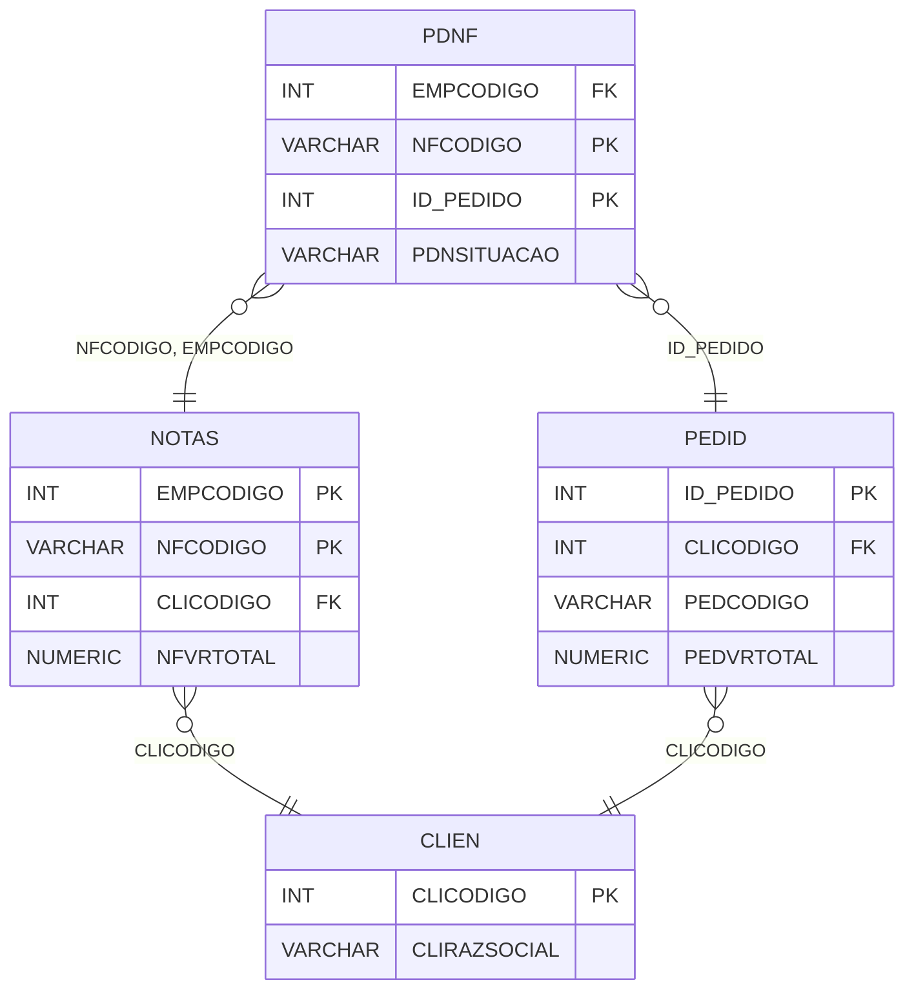

# PDNF - Documentação Completa de Relacionamentos

## 📊 Informações Gerais

- **Nome da Tabela**: PDNF (Pedido x Nota Fiscal)
- **Total de Registros**: 2.965.164
- **Total de Colunas**: 4
- **Chave Primária**: NFCODIGO, ID_PEDIDO (composite)
- **Chaves Estrangeiras**: 3
- **Índices**: 0
- **Tabelas Dependentes**: 0
- **Banco de Dados**: Firebird

## 📝 Descrição

**PDNF** é uma tabela de relacionamento que associa pedidos com notas fiscais. Com **2.965.164 registros**, esta tabela permite que um pedido esteja relacionado a múltiplas notas fiscais, ou que uma nota fiscal esteja relacionada a múltiplos pedidos.

Esta tabela é essencial para:
- **Rastreamento Fiscal**: Rastrear quais notas fiscais estão relacionadas a cada pedido
- **Conciliação**: Facilitar conciliação entre pedidos e notas fiscais
- **Relatórios**: Gerar relatórios fiscais por pedido
- **Auditoria**: Manter histórico de relacionamentos fiscais

**Contexto de Negócio:**
Um pedido pode estar relacionado a uma ou mais notas fiscais. Esta tabela gerencia essa relação, permitindo rastrear a origem fiscal de cada pedido e facilitar a conciliação contábil.

---

## 🔑 Estrutura de Colunas

| Coluna | Tipo | Descrição |
|--------|------|-----------|
| **EMPCODIGO** 🔗 | INT | Código da empresa (FK → NOTAS) |
| **NFCODIGO** 🔑 🔗 | VARCHAR(14) | Código da nota fiscal (PK, FK → NOTAS) |
| **ID_PEDIDO** 🔑 🔗 | INT | Código do pedido (PK, FK → PEDID) |
| **PDNSITUACAO** | VARCHAR(14) | Situação da relação (ATIVA, CANCELADA, etc.) |

---

## 🔗 Relacionamentos - Nível 1 (Diretos)

### NOTAS - Nota Fiscal (FK Obrigatória)
**Volume:** 1.206.013 registros

**Relacionamento:**
```
PDNF.NFCODIGO, EMPCODIGO → NOTAS.NFCODIGO, EMPCODIGO (N:1)
Constraint: NOTAS_PDNF
```

**Descrição:** Cada registro relaciona uma nota fiscal com um pedido.

**Proporção:** ~2,5 notas fiscais por pedido em média (2.965.164 / 1.206.013)

---

### PEDID - Pedido (FK Obrigatória)
**Volume:** 3.099.176 registros

**Relacionamento:**
```
PDNF.ID_PEDIDO → PEDID.ID_PEDIDO (N:1)
Constraint: PEDID_PDNF
```

**Descrição:** Cada registro relaciona um pedido com uma nota fiscal.

**Proporção:** ~95,7% dos pedidos têm relacionamento com notas fiscais (2.965.164 / 3.099.176)

---

## 🔗 Relacionamentos - Nível 2 (Indiretos)

### NOTAS → CLIEN (Cliente)
**Volume:** 9.251 registros

**Relacionamento:**
```
PDNF → NOTAS → CLIEN
```

**Descrição:** Através de NOTAS, é possível identificar o cliente relacionado.

---

### PEDID → CLIEN (Cliente)
**Volume:** 9.251 registros

**Relacionamento:**
```
PDNF → PEDID → CLIEN
```

**Descrição:** Através de PEDID, é possível identificar o cliente relacionado.

---

## 🗺️ Diagrama de Relacionamentos



---

## 💡 Exemplos de Uso

### Consulta Básica

```sql
SELECT EMPCODIGO, NFCODIGO, ID_PEDIDO, PDNSITUACAO
FROM PDNF
WHERE ID_PEDIDO = ?;
```

### Consulta com Informações da Nota Fiscal

```sql
SELECT 
    pn.*,
    n.NFDTEMIS,
    n.NFVRTOTAL,
    n.NFSIT
FROM PDNF pn
INNER JOIN NOTAS n
    ON pn.NFCODIGO = n.NFCODIGO
    AND pn.EMPCODIGO = n.EMPCODIGO
WHERE pn.ID_PEDIDO = ?;
```

### Consulta com Informações do Pedido

```sql
SELECT 
    pn.*,
    p.PEDCODIGO,
    p.PEDDTEMIS,
    p.PEDVRTOTAL,
    n.NFCODIGO,
    n.NFVRTOTAL AS NF_VALOR
FROM PDNF pn
INNER JOIN PEDID p
    ON pn.ID_PEDIDO = p.ID_PEDIDO
INNER JOIN NOTAS n
    ON pn.NFCODIGO = n.NFCODIGO
    AND pn.EMPCODIGO = n.EMPCODIGO
WHERE pn.ID_PEDIDO = ?;
```

### Consulta de Notas Fiscais por Pedido

```sql
SELECT 
    p.PEDCODIGO,
    p.PEDDTEMIS,
    COUNT(DISTINCT pn.NFCODIGO) AS TOTAL_NOTAS,
    SUM(n.NFVRTOTAL) AS VALOR_TOTAL_NOTAS
FROM PEDID p
LEFT JOIN PDNF pn
    ON p.ID_PEDIDO = pn.ID_PEDIDO
LEFT JOIN NOTAS n
    ON pn.NFCODIGO = n.NFCODIGO
    AND pn.EMPCODIGO = n.EMPCODIGO
GROUP BY p.ID_PEDIDO, p.PEDCODIGO, p.PEDDTEMIS
HAVING COUNT(DISTINCT pn.NFCODIGO) > 0
ORDER BY TOTAL_NOTAS DESC;
```

### Inserção de Relacionamento

```sql
INSERT INTO PDNF (EMPCODIGO, NFCODIGO, ID_PEDIDO, PDNSITUACAO)
VALUES (?, ?, ?, 'ATIVA');
```

---

## ⚡ Performance e Otimização

### Índices Recomendados

#### 1. Índice Composto na Chave Primária (Já existe implicitamente)
```sql
-- Índice primário já existe implicitamente
```

#### 2. Índice em ID_PEDIDO
```sql
CREATE INDEX IDX_PDNF_ID_PEDIDO 
ON PDNF (ID_PEDIDO);
```

**Justificativa:** Facilita buscas por pedido (muito frequente).

#### 3. Índice Composto em NFCODIGO e EMPCODIGO
```sql
CREATE INDEX IDX_PDNF_NF_EMP 
ON PDNF (NFCODIGO, EMPCODIGO);
```

**Justificativa:** Facilita buscas por nota fiscal.

---

## 📊 Estatísticas e Insights

### Volume de Dados

- **Total de Registros**: 2.965.164
- **Tamanho Médio Estimado**: ~40 bytes por registro
- **Tamanho Total Estimado**: ~119 MB

### Distribuição de Dados

- **Relacionamentos**: 2.965.164 relacionamentos entre pedidos e notas fiscais
- **Taxa de Relacionamento**: ~95,7% dos pedidos têm relacionamento com notas fiscais

---

## 🔧 Integração com Código Laravel

### Model Eloquent

```php
<?php

namespace App\Models;

use Illuminate\Database\Eloquent\Model;
use Illuminate\Database\Eloquent\Relations\BelongsTo;

final class PdNf extends Model
{
    protected $table = 'PDNF';
    public $incrementing = false;
    public $timestamps = false;

    protected $primaryKey = ['NFCODIGO', 'ID_PEDIDO'];

    protected $fillable = [
        'EMPCODIGO',
        'NFCODIGO',
        'ID_PEDIDO',
        'PDNSITUACAO',
    ];

    protected $casts = [
        'EMPCODIGO' => 'integer',
        'NFCODIGO' => 'string',
        'ID_PEDIDO' => 'integer',
        'PDNSITUACAO' => 'string',
    ];

    /**
     * Relacionamento com Nota Fiscal
     */
    public function notaFiscal(): BelongsTo
    {
        return $this->belongsTo(Notas::class, ['NFCODIGO', 'EMPCODIGO'], ['NFCODIGO', 'EMPCODIGO']);
    }

    /**
     * Relacionamento com Pedido
     */
    public function pedido(): BelongsTo
    {
        return $this->belongsTo(Pedid::class, 'ID_PEDIDO', 'ID_PEDIDO');
    }

    /**
     * Buscar notas fiscais por pedido
     */
    public static function notasPorPedido(int $idPedido)
    {
        return self::where('ID_PEDIDO', $idPedido)
            ->with(['notaFiscal', 'pedido'])
            ->get();
    }

    /**
     * Buscar pedidos por nota fiscal
     */
    public static function pedidosPorNota(string $nfCodigo, int $empCodigo)
    {
        return self::where('NFCODIGO', $nfCodigo)
            ->where('EMPCODIGO', $empCodigo)
            ->with(['pedido', 'notaFiscal'])
            ->get();
    }
}
```

---

## ✅ Boas Práticas

### Design

1. **Chave Composta**: Manter integridade da chave composta
2. **Validação**: Validar NFCODIGO, EMPCODIGO e ID_PEDIDO antes de inserir
3. **Situação**: Manter PDNSITUACAO sempre atualizada

### Performance

1. **Índices**: Usar índices para buscas frequentes (crítico devido ao volume)
2. **Consultas**: Usar eager loading para relacionamentos
3. **Volume**: Considerar particionamento devido ao grande volume

### Segurança

1. **Validação**: Validar valores antes de inserir
2. **Acesso**: Restringir acesso de escrita a usuários autorizados
3. **Fiscal**: Validar integridade fiscal cuidadosamente

---

**Documentação gerada em**: 2025-01-27

**Banco de dados**: Firebird

