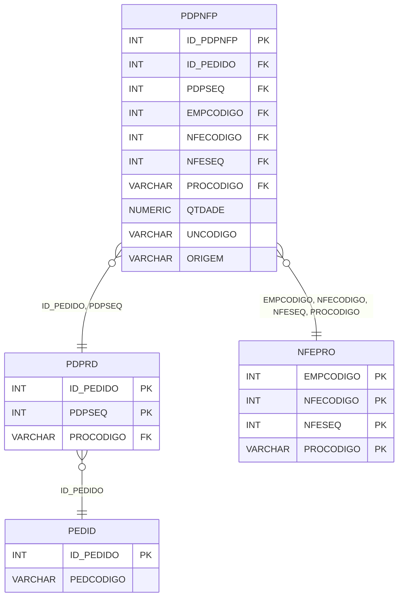

# PDPNFP - Documentação Completa de Relacionamentos

## 📊 Informações Gerais

- **Nome da Tabela**: PDPNFP (Pedido Produto x Nota Fiscal Produto)
- **Total de Registros**: 59.723
- **Total de Colunas**: 10
- **Chave Primária**: ID_PDPNFP
- **Chaves Estrangeiras**: 6
- **Índices**: 0
- **Tabelas Dependentes**: 0
- **Banco de Dados**: Firebird

## 📝 Descrição

**PDPNFP** é uma tabela de relacionamento que associa produtos de pedidos com produtos de notas fiscais eletrônicas (NF-e). Com **59.723 registros**, esta tabela permite rastrear quais produtos de pedidos foram faturados em quais notas fiscais eletrônicas.

Esta tabela é essencial para:
- **Rastreamento Fiscal**: Rastrear produtos faturados em NF-e
- **Conciliação**: Facilitar conciliação entre produtos de pedidos e NF-e
- **Relatórios**: Gerar relatórios de produtos faturados
- **Auditoria**: Manter histórico de relacionamentos fiscais por produto

**Contexto de Negócio:**
Produtos de pedidos podem ser faturados em notas fiscais eletrônicas. Esta tabela gerencia essa relação no nível de produto, permitindo rastrear exatamente quais produtos foram faturados em quais NF-e.

---

## 🔑 Estrutura de Colunas

| Coluna | Tipo | Descrição |
|--------|------|-----------|
| **ID_PDPNFP** 🔑 | INT | Identificador único do relacionamento (PK) |
| **ID_PEDIDO** 🔗 | INT | Código do pedido (FK → PDPRD) |
| **PDPSEQ** 🔗 | INT | Sequencial do produto no pedido (FK → PDPRD) |
| **EMPCODIGO** 🔗 | INT | Código da empresa (FK → NFEPRO) |
| **NFECODIGO** 🔗 | INT | Código da NF-e (FK → NFEPRO) |
| **NFESEQ** 🔗 | INT | Sequencial do produto na NF-e (FK → NFEPRO) |
| **PROCODIGO** 🔗 | VARCHAR(14) | Código do produto (FK → NFEPRO) |
| **QTDADE** | NUMERIC(16,2) | Quantidade relacionada |
| **UNCODIGO** | VARCHAR(14) | Código da unidade de medida |
| **ORIGEM** | VARCHAR(14) | Origem do relacionamento |

---

## 🔗 Relacionamentos - Nível 1 (Diretos)

### PDPRD - Produto do Pedido (FK Obrigatória)
**Volume:** 6.710.760 registros

**Relacionamento:**
```
PDPNFP.ID_PEDIDO, PDPSEQ → PDPRD.ID_PEDIDO, PDPSEQ (N:1)
Constraint: PDPRD_PDPNFP
```

**Descrição:** Cada registro relaciona um produto de pedido com um produto de NF-e.

---

### NFEPRO - Produto da NF-e (FK Obrigatória)
**Volume:** Variável

**Relacionamento:**
```
PDPNFP.EMPCODIGO, NFECODIGO, NFESEQ, PROCODIGO → NFEPRO.EMPCODIGO, NFECODIGO, NFESEQ, PROCODIGO (N:1)
Constraint: NFEPRO_PDPNFP
```

**Descrição:** Cada registro relaciona um produto de NF-e com um produto de pedido.

---

## 🔗 Relacionamentos - Nível 2 (Indiretos)

### PDPRD → PEDID (Pedido)
**Volume:** 3.099.176 registros

**Relacionamento:**
```
PDPNFP → PDPRD → PEDID
```

**Descrição:** Através de PDPRD, é possível identificar o pedido relacionado.

---

### NFEPRO → NOTAE (Nota Fiscal Eletrônica)
**Volume:** Variável

**Relacionamento:**
```
PDPNFP → NFEPRO → NOTAE
```

**Descrição:** Através de NFEPRO, é possível identificar a NF-e relacionada.

---

## 🗺️ Diagrama de Relacionamentos



---

## 💡 Exemplos de Uso

### Consulta Básica

```sql
SELECT ID_PDPNFP, ID_PEDIDO, PDPSEQ, EMPCODIGO, NFECODIGO, NFESEQ, PROCODIGO, QTDADE
FROM PDPNFP
WHERE ID_PEDIDO = ?;
```

### Consulta com Informações do Produto do Pedido

```sql
SELECT 
    pnfp.*,
    pdp.PDPDESCRICAO,
    pdp.PDPQTDADE,
    p.PEDCODIGO
FROM PDPNFP pnfp
INNER JOIN PDPRD pdp
    ON pnfp.ID_PEDIDO = pdp.ID_PEDIDO
    AND pnfp.PDPSEQ = pdp.PDPSEQ
INNER JOIN PEDID p
    ON pnfp.ID_PEDIDO = p.ID_PEDIDO
WHERE pnfp.ID_PEDIDO = ?;
```

### Consulta com Informações do Produto da NF-e

```sql
SELECT 
    pnfp.*,
    nfep.NFEPDESCRICAO,
    nfep.NFEPQTDADE,
    nfe.NFENUMERO
FROM PDPNFP pnfp
INNER JOIN NFEPRO nfep
    ON pnfp.EMPCODIGO = nfep.EMPCODIGO
    AND pnfp.NFECODIGO = nfep.NFECODIGO
    AND pnfp.NFESEQ = nfep.NFESEQ
    AND pnfp.PROCODIGO = nfep.PROCODIGO
INNER JOIN NOTAE nfe
    ON nfep.EMPCODIGO = nfe.EMPCODIGO
    AND nfep.NFECODIGO = nfe.NFECODIGO
WHERE pnfp.ID_PEDIDO = ?;
```

### Consulta de Produtos Faturados por Pedido

```sql
SELECT 
    p.PEDCODIGO,
    COUNT(DISTINCT pnfp.NFECODIGO) AS TOTAL_NFES,
    SUM(pnfp.QTDADE) AS QTDADE_TOTAL_FATURADA
FROM PEDID p
INNER JOIN PDPNFP pnfp
    ON p.ID_PEDIDO = pnfp.ID_PEDIDO
GROUP BY p.ID_PEDIDO, p.PEDCODIGO;
```

### Inserção de Relacionamento

```sql
INSERT INTO PDPNFP (
    ID_PEDIDO,
    PDPSEQ,
    EMPCODIGO,
    NFECODIGO,
    NFESEQ,
    PROCODIGO,
    QTDADE,
    UNCODIGO,
    ORIGEM
)
VALUES (?, ?, ?, ?, ?, ?, ?, ?, ?);
```

---

## ⚡ Performance e Otimização

### Índices Recomendados

#### 1. Índice na Chave Primária (Já existe implicitamente)
```sql
-- Índice primário já existe implicitamente
```

#### 2. Índice Composto em ID_PEDIDO e PDPSEQ
```sql
CREATE INDEX IDX_PDPNFP_PEDID_SEQ 
ON PDPNFP (ID_PEDIDO, PDPSEQ);
```

**Justificativa:** Facilita buscas por produto de pedido.

#### 3. Índice Composto em NF-e
```sql
CREATE INDEX IDX_PDPNFP_NFE 
ON PDPNFP (EMPCODIGO, NFECODIGO, NFESEQ);
```

**Justificativa:** Facilita buscas por produto de NF-e.

---

## 📊 Estatísticas e Insights

### Volume de Dados

- **Total de Registros**: 59.723
- **Tamanho Médio Estimado**: ~60 bytes por registro
- **Tamanho Total Estimado**: ~3.6 MB

### Distribuição de Dados

- **Relacionamentos**: 59.723 relacionamentos entre produtos de pedidos e NF-e
- **Taxa de Relacionamento**: ~0,9% dos produtos de pedidos têm relacionamento com NF-e

---

## 🔧 Integração com Código Laravel

### Model Eloquent

```php
<?php

namespace App\Models;

use Illuminate\Database\Eloquent\Model;
use Illuminate\Database\Eloquent\Relations\BelongsTo;

final class PdPnFp extends Model
{
    protected $table = 'PDPNFP';
    protected $primaryKey = 'ID_PDPNFP';
    public $incrementing = true;
    public $timestamps = false;

    protected $fillable = [
        'ID_PEDIDO',
        'PDPSEQ',
        'EMPCODIGO',
        'NFECODIGO',
        'NFESEQ',
        'PROCODIGO',
        'QTDADE',
        'UNCODIGO',
        'ORIGEM',
    ];

    protected $casts = [
        'ID_PDPNFP' => 'integer',
        'ID_PEDIDO' => 'integer',
        'PDPSEQ' => 'integer',
        'EMPCODIGO' => 'integer',
        'NFECODIGO' => 'integer',
        'NFESEQ' => 'integer',
        'PROCODIGO' => 'string',
        'QTDADE' => 'decimal:2',
        'UNCODIGO' => 'string',
        'ORIGEM' => 'string',
    ];

    /**
     * Relacionamento com Produto do Pedido
     */
    public function produtoPedido(): BelongsTo
    {
        return $this->belongsTo(PdPrd::class, ['ID_PEDIDO', 'PDPSEQ'], ['ID_PEDIDO', 'PDPSEQ']);
    }

    /**
     * Relacionamento com Produto da NF-e
     */
    public function produtoNfe(): BelongsTo
    {
        return $this->belongsTo(NfePro::class, ['EMPCODIGO', 'NFECODIGO', 'NFESEQ', 'PROCODIGO'], ['EMPCODIGO', 'NFECODIGO', 'NFESEQ', 'PROCODIGO']);
    }

    /**
     * Buscar relacionamentos por pedido
     */
    public static function porPedido(int $idPedido)
    {
        return self::where('ID_PEDIDO', $idPedido)
            ->with(['produtoPedido', 'produtoNfe'])
            ->get();
    }
}
```

---

## ✅ Boas Práticas

### Design

1. **Chave Primária**: ID_PDPNFP deve ser único
2. **Validação**: Validar todas as chaves estrangeiras antes de inserir
3. **Quantidade**: Validar que QTDADE seja positiva

### Performance

1. **Índices**: Usar índices compostos para buscas frequentes
2. **Consultas**: Usar eager loading para relacionamentos

### Segurança

1. **Validação**: Validar valores antes de inserir
2. **Acesso**: Restringir acesso de escrita a usuários autorizados
3. **Fiscal**: Validar integridade fiscal cuidadosamente

---

**Documentação gerada em**: 2025-01-27

**Banco de dados**: Firebird

