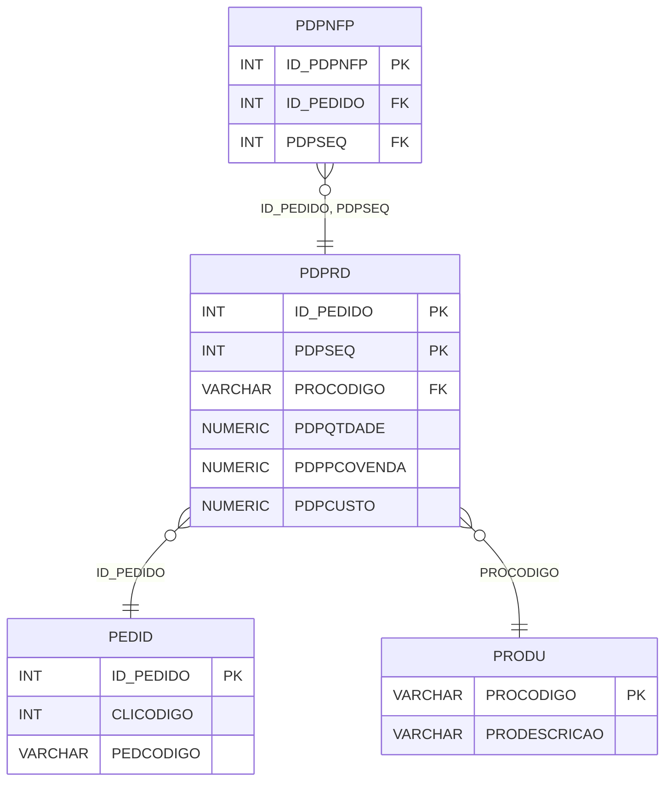

# PDPRD - Documentação Completa de Relacionamentos

## 📊 Informações Gerais

- **Nome da Tabela**: PDPRD (Pedido - Produto)
- **Total de Registros**: 6.710.760
- **Total de Colunas**: 117
- **Chave Primária**: ID_PEDIDO, PDPSEQ (composite)
- **Chaves Estrangeiras**: 2
- **Índices**: 0
- **Tabelas Dependentes**: 2
- **Banco de Dados**: Firebird

## 📝 Descrição

**PDPRD** é uma tabela de detalhamento que armazena produtos relacionados a pedidos. Com **6.710.760 registros**, esta tabela registra cada produto incluído em um pedido, com informações completas sobre quantidade, preços, impostos, custos e outras informações fiscais e comerciais.

Esta tabela é essencial para:
- **Detalhamento de Produtos**: Detalhar produtos incluídos em cada pedido
- **Financeiro**: Gerenciar preços, descontos e valores
- **Fiscal**: Controlar impostos (ICMS, IPI, PIS, COFINS)
- **Produção**: Fornecer dados para produção e estoque

**Contexto de Negócio:**
Um pedido pode incluir múltiplos produtos, cada um com quantidade, preço, impostos e outras informações específicas. Esta tabela detalha esses produtos com informações completas para faturamento, produção e controle fiscal.

---

## 🔑 Estrutura de Colunas

### Identificação
| Coluna | Tipo | Descrição |
|--------|------|-----------|
| **ID_PEDIDO** 🔑 🔗 | INT | Código do pedido (PK, FK → PEDID) |
| **PDPSEQ** 🔑 | INT | Sequencial do produto no pedido (PK) |
| **PROCODIGO** 🔗 | VARCHAR(14) | Código do produto (FK → PRODU) |
| **PDPDESCRICAO** | VARCHAR(37) | Descrição do produto |
| **UNCODIGO** | VARCHAR(14) | Código da unidade de medida |

### Quantidades e Valores
| Coluna | Tipo | Descrição |
|--------|------|-----------|
| **PDPQTDADE** | NUMERIC(27,2) | Quantidade do produto |
| **PDPPCOVENDA** | NUMERIC(27,2) | Preço de venda |
| **PDPPCOUNIT** | NUMERIC(27,2) | Preço unitário |
| **PDPUNITLIQUIDO** | NUMERIC(27,2) | Preço unitário líquido |
| **PDPCUSTO** | NUMERIC(27,2) | Custo do produto |
| **PDPCUSTOTOTAL** | NUMERIC(27,2) | Custo total |
| **PDPCUSTOREAL** | NUMERIC(27,2) | Custo real |
| **PDPVRCONTABIL** | NUMERIC(16,2) | Valor contábil |

### Impostos - ICMS
| Coluna | Tipo | Descrição |
|--------|------|-----------|
| **PDPPCICMS** | NUMERIC(16,2) | Percentual ICMS |
| **PDPBASEICMS** | NUMERIC(16,2) | Base de cálculo ICMS |
| **PDPVRICMS** | NUMERIC(16,2) | Valor ICMS |
| **PDPPCICMSTAB** | NUMERIC(16,2) | Percentual ICMS tabela |
| **PDPPCBASEICMS** | NUMERIC(16,2) | Percentual base ICMS |
| **PDPPCICMSDIF** | NUMERIC(16,2) | Percentual ICMS diferencial |
| **PDPVRICMSDIF** | NUMERIC(16,2) | Valor ICMS diferencial |
| **PDPPCICMSINTER** | NUMERIC(16,2) | Percentual ICMS interestadual |
| **PDPPCICMSUFDEST** | NUMERIC(16,2) | Percentual ICMS UF destino |
| **PDPPCICMSINTERPART** | NUMERIC(16,2) | Percentual ICMS interestadual participação |
| **PDPVRICMSUFDEST** | NUMERIC(16,2) | Valor ICMS UF destino |
| **PDPVRICMSUFREMET** | NUMERIC(16,2) | Valor ICMS UF remetente |
| **PDPVRICMSTRIANG** | NUMERIC(16,2) | Valor ICMS triangulação |
| **PDPBASEICMSSUB** | NUMERIC(16,2) | Base ICMS substituição |
| **PDPVRICMSSUB** | NUMERIC(16,2) | Valor ICMS substituição |
| **PDPPCICMSSUB** | NUMERIC(16,2) | Percentual ICMS substituição |
| **PDPBSICMSSUFRA** | NUMERIC(16,2) | Base ICMS sufrágio |
| **PDPVRICMSSUFRA** | NUMERIC(16,2) | Valor ICMS sufrágio |

### Impostos - IPI
| Coluna | Tipo | Descrição |
|--------|------|-----------|
| **PDPPCIPI** | NUMERIC(16,2) | Percentual IPI |
| **PDPBASEIPI** | NUMERIC(16,2) | Base de cálculo IPI |
| **PDPVRIPI** | NUMERIC(16,2) | Valor IPI |
| **PDPVRIPIDEVOLVIDO** | NUMERIC(16,2) | Valor IPI devolvido |
| **PDPPCIPIDEVOLVIDO** | NUMERIC(16,2) | Percentual IPI devolvido |
| **PDPBASEIPIDEVOLVIDO** | NUMERIC(16,2) | Base IPI devolvido |

### Impostos - PIS
| Coluna | Tipo | Descrição |
|--------|------|-----------|
| **PDPPCPIS** | NUMERIC(16,2) | Percentual PIS |
| **PDPBASEPIS** | NUMERIC(16,2) | Base de cálculo PIS |
| **PDPVRPIS** | NUMERIC(16,2) | Valor PIS |
| **PDPPCBSPIS** | NUMERIC(16,2) | Percentual base PIS |
| **PDPBSPISSUFRA** | NUMERIC(16,2) | Base PIS sufrágio |
| **PDPVRPISSUFRA** | NUMERIC(16,2) | Valor PIS sufrágio |

### Impostos - COFINS
| Coluna | Tipo | Descrição |
|--------|------|-----------|
| **PDPPCCOFINS** | NUMERIC(16,2) | Percentual COFINS |
| **PDPBASECOFINS** | NUMERIC(16,2) | Base de cálculo COFINS |
| **PDPVRCOFINS** | NUMERIC(16,2) | Valor COFINS |
| **PDPPCBSCOFINS** | NUMERIC(16,2) | Percentual base COFINS |
| **PDPBSCOFINSSUFRA** | NUMERIC(16,2) | Base COFINS sufrágio |
| **PDPVRCOFINSSUFRA** | NUMERIC(16,2) | Valor COFINS sufrágio |

### Impostos - FCP e Outros
| Coluna | Tipo | Descrição |
|--------|------|-----------|
| **PDPPCFCPUFDEST** | NUMERIC(16,2) | Percentual FCP UF destino |
| **PDPVRFCPUFDEST** | NUMERIC(16,2) | Valor FCP UF destino |
| **PDPBCFCP** | NUMERIC(16,2) | Base FCP |
| **PDPPCFCP** | NUMERIC(16,2) | Percentual FCP |
| **PDPVRFCP** | NUMERIC(16,2) | Valor FCP |
| **PDPBCFCPSUB** | NUMERIC(16,2) | Base FCP substituição |
| **PDPPCFCPSUB** | NUMERIC(16,2) | Percentual FCP substituição |
| **PDPVRFCPSUB** | NUMERIC(16,2) | Valor FCP substituição |

### Impostos - IBS, CBS, IS
| Coluna | Tipo | Descrição |
|--------|------|-----------|
| **PDPBASEIBS** | NUMERIC(16,2) | Base IBS |
| **PDPPCIBS** | NUMERIC(16,2) | Percentual IBS |
| **PDPVRIBS** | NUMERIC(16,2) | Valor IBS |
| **PDPBASECBS** | NUMERIC(16,2) | Base CBS |
| **PDPPCCBS** | NUMERIC(16,2) | Percentual CBS |
| **PDPVRCBS** | NUMERIC(16,2) | Valor CBS |
| **PDPBASEIS** | NUMERIC(16,2) | Base IS |
| **PDPPCIS** | NUMERIC(16,2) | Percentual IS |
| **PDPVRIS** | NUMERIC(16,2) | Valor IS |

### Descontos e Outros Valores
| Coluna | Tipo | Descrição |
|--------|------|-----------|
| **PDPVRDESCTO** | NUMERIC(16,2) | Valor desconto |
| **PDPPCDESCTO** | NUMERIC(16,2) | Percentual desconto |
| **PDPVRDESCTOCOMB** | NUMERIC(16,2) | Valor desconto combinação |
| **PDPVRDESCTOITEM** | NUMERIC(16,2) | Valor desconto item |
| **PDPVRDESCTOGERAL** | NUMERIC(16,2) | Valor desconto geral |
| **PDPVRFRETE** | NUMERIC(16,2) | Valor frete |
| **PDPVRSEGURO** | NUMERIC(16,2) | Valor seguro |
| **PDPVRDESPESA** | NUMERIC(16,2) | Valor despesa |
| **PDPVRISENFINAN** | NUMERIC(16,2) | Valor isenção financeira |

### Situações Tributárias
| Coluna | Tipo | Descrição |
|--------|------|-----------|
| **PDPSITTRIB** | VARCHAR(14) | Situação tributária ICMS |
| **PDPSITTRIBIPI** | VARCHAR(14) | Situação tributária IPI |
| **PDPSITTRIBPIS** | VARCHAR(14) | Situação tributária PIS |
| **PDPSITTRIBCOFINS** | VARCHAR(14) | Situação tributária COFINS |
| **PDPSITTRIBIBS** | VARCHAR(37) | Situação tributária IBS |
| **PDPSITTRIBCBS** | VARCHAR(37) | Situação tributária CBS |
| **PDPSITTRIBIS** | VARCHAR(37) | Situação tributária IS |

### Outros Campos
| Coluna | Tipo | Descrição |
|--------|------|-----------|
| **EMPCODIGO** | INT | Código da empresa |
| **PDPTPPRECO** | VARCHAR(14) | Tipo de preço |
| **PRLLOTE** | VARCHAR(14) | Lote do produto |
| **PRLLOTEFOR** | VARCHAR(14) | Lote do fornecedor |
| **FISCODIGO** | VARCHAR(14) | Código fiscal |
| **PCTNUMERO** | INT | Código da parcela cliente |
| **PCTNUMEROCOMB** | INT | Código da parcela combinação |
| **PDPDTSEPARACAO** | TIMESTAMP | Data de separação |
| **PDPQTDFALTA** | NUMERIC(16,2) | Quantidade em falta |
| **PDPORDEMCOMPRA** | VARCHAR(37) | Ordem de compra |
| **PDPVRALTERADO** | VARCHAR(14) | Flag valor alterado |
| **PDPPROTPPDC** | INT | Tipo de produção |
| **PDPLCETQ** | VARCHAR(14) | Flag etiqueta |
| **PDPLCCOMIS** | VARCHAR(14) | Flag comissão |
| **PDPLCFINAN** | VARCHAR(14) | Flag financeiro |
| **PDPNFECODIGO** | INT | Código da NF-e |
| **PDPEXPORTOU** | VARCHAR(14) | Flag exportou |
| **PDPNRDRAW** | VARCHAR(37) | Número DRAW |
| **PDPID_PROMO** | INT | Código da promoção |
| **PDPBCUFDEST** | NUMERIC(16,2) | Base UF destino |
| **PDPCODCLASSTRIBIBS** | NUMERIC(16,2) | Código classificação tributária IBS |
| **PDPCODCLASSTRIBCBS** | NUMERIC(16,2) | Código classificação tributária CBS |
| **PDPCODCLASSTRIBIS** | NUMERIC(16,2) | Código classificação tributária IS |

---

## 🔗 Relacionamentos - Nível 1 (Diretos)

### PEDID - Pedido (FK Obrigatória)
**Volume:** 3.099.176 registros

**Relacionamento:**
```
PDPRD.ID_PEDIDO → PEDID.ID_PEDIDO (N:1)
Constraint: PEDID_PDPRD
```

**Descrição:** Cada produto está vinculado a um pedido específico.

**Proporção:** ~2,2 produtos por pedido em média (6.710.760 / 3.099.176)

---

### PRODU - Produto (FK Obrigatória)
**Volume:** 178.187 registros

**Relacionamento:**
```
PDPRD.PROCODIGO → PRODU.PROCODIGO (N:1)
Constraint: PRODU_PDPRD
```

**Descrição:** Identifica o produto relacionado ao pedido.

---

## 📊 Tabelas que Referenciam Esta

Esta tabela é referenciada por 2 tabelas:

### PDPNFP - Produto Pedido x NF-e Produto
**Volume:** 59.723 registros

**Relacionamento:**
```
PDPNFP.ID_PEDIDO, PDPSEQ → PDPRD.ID_PEDIDO, PDPSEQ (N:1)
Constraint: PDPRD_PDPNFP
```

**Descrição:** Relaciona produtos de pedidos com produtos de NF-e.

---

## 🗺️ Diagrama de Relacionamentos



---

## 💡 Exemplos de Uso

### Consulta Básica

```sql
SELECT ID_PEDIDO, PDPSEQ, PROCODIGO, PDPDESCRICAO, PDPQTDADE, PDPPCOVENDA, PDPCUSTO
FROM PDPRD
WHERE ID_PEDIDO = ?
ORDER BY PDPSEQ;
```

### Consulta com Informações do Produto

```sql
SELECT 
    pdp.*,
    pr.PRODESCRICAO,
    pr.PROUN,
    u.UNDESCRICAO
FROM PDPRD pdp
INNER JOIN PRODU pr
    ON pdp.PROCODIGO = pr.PROCODIGO
LEFT JOIN UNMED u
    ON pdp.UNCODIGO = u.UNCODIGO
WHERE pdp.ID_PEDIDO = ?
ORDER BY pdp.PDPSEQ;
```

### Consulta com Informações do Pedido

```sql
SELECT 
    pdp.*,
    p.PEDCODIGO,
    p.PEDDTEMIS,
    p.PEDVRTOTAL,
    pr.PRODESCRICAO
FROM PDPRD pdp
INNER JOIN PEDID p
    ON pdp.ID_PEDIDO = p.ID_PEDIDO
INNER JOIN PRODU pr
    ON pdp.PROCODIGO = pr.PROCODIGO
WHERE pdp.ID_PEDIDO = ?;
```

### Soma de Valores por Pedido

```sql
SELECT 
    ID_PEDIDO,
    COUNT(*) AS TOTAL_PRODUTOS,
    SUM(PDPQTDADE * PDPPCOVENDA) AS VALOR_TOTAL
FROM PDPRD
GROUP BY ID_PEDIDO;
```

### Consulta de Produtos com Impostos

```sql
SELECT 
    pdp.*,
    pr.PRODESCRICAO
FROM PDPRD pdp
INNER JOIN PRODU pr
    ON pdp.PROCODIGO = pr.PROCODIGO
WHERE pdp.PDPVRICMS > 0
    OR pdp.PDPVRIPI > 0
    OR pdp.PDPVRPIS > 0
ORDER BY pdp.ID_PEDIDO, pdp.PDPSEQ;
```

---

## ⚡ Performance e Otimização

### Índices Recomendados

#### 1. Índice Composto na Chave Primária (Já existe implicitamente)
```sql
-- Índice primário já existe implicitamente
```

#### 2. Índice em PROCODIGO
```sql
CREATE INDEX IDX_PDPRD_PROCODIGO 
ON PDPRD (PROCODIGO);
```

**Justificativa:** Facilita buscas por produto (muito frequente).

#### 3. Índice em EMPCODIGO
```sql
CREATE INDEX IDX_PDPRD_EMPCODIGO 
ON PDPRD (EMPCODIGO);
```

**Justificativa:** Facilita buscas por empresa.

---

## 📊 Estatísticas e Insights

### Volume de Dados

- **Total de Registros**: 6.710.760
- **Tamanho Médio Estimado**: ~500 bytes por registro
- **Tamanho Total Estimado**: ~3.4 GB

### Distribuição de Dados

- **Pedidos com Produtos**: 3.099.176 pedidos
- **Média de Produtos**: ~2,2 produtos por pedido

---

## 🔧 Integração com Código Laravel

### Model Eloquent

```php
<?php

namespace App\Models;

use Illuminate\Database\Eloquent\Model;
use Illuminate\Database\Eloquent\Relations\BelongsTo;
use Illuminate\Database\Eloquent\Relations\HasMany;

final class PdPrd extends Model
{
    protected $table = 'PDPRD';
    public $incrementing = false;
    public $timestamps = false;

    protected $primaryKey = ['ID_PEDIDO', 'PDPSEQ'];

    protected $fillable = [
        'ID_PEDIDO',
        'PDPSEQ',
        'PROCODIGO',
        'PDPDESCRICAO',
        'PDPQTDADE',
        'PDPPCOVENDA',
        // ... todos os outros campos
    ];

    protected $casts = [
        'ID_PEDIDO' => 'integer',
        'PDPSEQ' => 'integer',
        'PROCODIGO' => 'string',
        'PDPQTDADE' => 'decimal:2',
        'PDPPCOVENDA' => 'decimal:2',
        // ... casts para todos os campos numéricos
    ];

    /**
     * Relacionamento com Pedido
     */
    public function pedido(): BelongsTo
    {
        return $this->belongsTo(Pedid::class, 'ID_PEDIDO', 'ID_PEDIDO');
    }

    /**
     * Relacionamento com Produto
     */
    public function produto(): BelongsTo
    {
        return $this->belongsTo(Produ::class, 'PROCODIGO', 'PROCODIGO');
    }

    /**
     * Relacionamento com Produtos NF-e
     */
    public function produtosNfe(): HasMany
    {
        return $this->hasMany(PdPnFp::class, ['ID_PEDIDO', 'PDPSEQ'], ['ID_PEDIDO', 'PDPSEQ']);
    }

    /**
     * Buscar produtos por pedido
     */
    public static function produtosPorPedido(int $idPedido)
    {
        return self::where('ID_PEDIDO', $idPedido)
            ->with(['produto'])
            ->orderBy('PDPSEQ')
            ->get();
    }

    /**
     * Calcular valor total do produto
     */
    public function getValorTotalAttribute(): float
    {
        return (float) $this->PDPQTDADE * (float) $this->PDPPCOVENDA;
    }
}
```

---

## ✅ Boas Práticas

### Design

1. **Chave Composta**: Manter integridade da chave composta
2. **Validação**: Validar valores antes de inserir
3. **Impostos**: Validar cálculos de impostos

### Performance

1. **Índices**: Usar índices para buscas frequentes (crítico devido ao volume)
2. **Consultas**: Usar eager loading para relacionamentos
3. **Volume**: Considerar particionamento devido ao grande volume

### Segurança

1. **Validação**: Validar valores antes de inserir
2. **Acesso**: Restringir acesso de escrita a usuários autorizados
3. **Fiscal**: Validar cálculos fiscais cuidadosamente

---

**Documentação gerada em**: 2025-01-27

**Banco de dados**: Firebird

