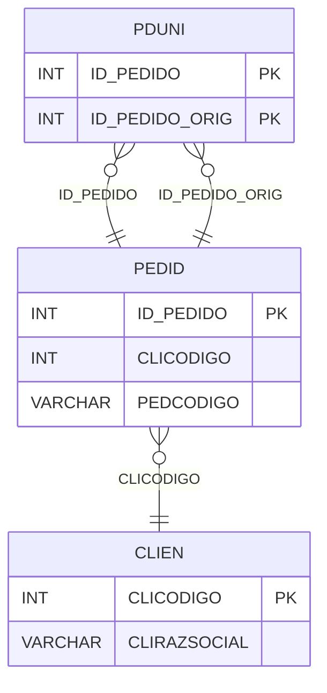

# PDUNI - Documentação Completa de Relacionamentos

## 📊 Informações Gerais

- **Nome da Tabela**: PDUNI (Pedido - Unificação)
- **Total de Registros**: 25
- **Total de Colunas**: 2
- **Chave Primária**: ID_PEDIDO, ID_PEDIDO_ORIG (composite)
- **Chaves Estrangeiras**: 2
- **Índices**: 0
- **Tabelas Dependentes**: 0
- **Banco de Dados**: Firebird

## 📝 Descrição

**PDUNI** é uma tabela de relacionamento que gerencia a unificação de pedidos. Com apenas **25 registros**, esta tabela relaciona pedidos unificados com seus pedidos originais, permitindo rastrear quando pedidos foram unificados em um único pedido.

Esta tabela é essencial para:
- **Rastreamento**: Rastrear pedidos unificados e seus originais
- **Histórico**: Manter histórico de unificações
- **Relatórios**: Gerar relatórios de pedidos unificados
- **Auditoria**: Facilitar auditoria de unificações

**Contexto de Negócio:**
Quando múltiplos pedidos são unificados em um único pedido, esta tabela registra essa relação, permitindo rastrear os pedidos originais a partir do pedido unificado.

---

## 🔑 Estrutura de Colunas

| Coluna | Tipo | Descrição |
|--------|------|-----------|
| **ID_PEDIDO** 🔑 🔗 | INT | Código do pedido unificado (PK, FK → PEDID) |
| **ID_PEDIDO_ORIG** 🔑 🔗 | INT | Código do pedido original (PK, FK → PEDID) |

---

## 🔗 Relacionamentos - Nível 1 (Diretos)

### PEDID - Pedido Unificado (FK Obrigatória)
**Volume:** 3.099.176 registros

**Relacionamento:**
```
PDUNI.ID_PEDIDO → PEDID.ID_PEDIDO (N:1)
Constraint: PEDID_PDUNI
```

**Descrição:** Cada registro relaciona um pedido unificado com um pedido original.

---

### PEDID - Pedido Original (FK Obrigatória)
**Volume:** 3.099.176 registros

**Relacionamento:**
```
PDUNI.ID_PEDIDO_ORIG → PEDID.ID_PEDIDO (N:1)
Constraint: PEDID_PDUNIORIG
```

**Descrição:** Cada registro relaciona um pedido original com um pedido unificado.

---

## 🔗 Relacionamentos - Nível 2 (Indiretos)

### PEDID → CLIEN (Cliente)
**Volume:** 9.251 registros

**Relacionamento:**
```
PDUNI → PEDID → CLIEN
```

**Descrição:** Através de PEDID, é possível identificar os clientes relacionados aos pedidos unificados e originais.

---

## 🗺️ Diagrama de Relacionamentos



---

## 💡 Exemplos de Uso

### Consulta Básica

```sql
SELECT ID_PEDIDO, ID_PEDIDO_ORIG
FROM PDUNI
WHERE ID_PEDIDO = ?;
```

### Consulta com Informações dos Pedidos

```sql
SELECT 
    pu.*,
    pu_unificado.PEDCODIGO AS PEDCODIGO_UNIFICADO,
    pu_unificado.PEDDTEMIS AS DTEMIS_UNIFICADO,
    pu_original.PEDCODIGO AS PEDCODIGO_ORIGINAL,
    pu_original.PEDDTEMIS AS DTEMIS_ORIGINAL
FROM PDUNI pu
INNER JOIN PEDID pu_unificado
    ON pu.ID_PEDIDO = pu_unificado.ID_PEDIDO
INNER JOIN PEDID pu_original
    ON pu.ID_PEDIDO_ORIG = pu_original.ID_PEDIDO
WHERE pu.ID_PEDIDO = ?;
```

### Consulta de Pedidos Originais por Unificado

```sql
SELECT 
    pu_unificado.PEDCODIGO AS PEDIDO_UNIFICADO,
    pu_original.PEDCODIGO AS PEDIDO_ORIGINAL,
    pu_original.PEDDTEMIS,
    pu_original.PEDVRTOTAL
FROM PDUNI pu
INNER JOIN PEDID pu_unificado
    ON pu.ID_PEDIDO = pu_unificado.ID_PEDIDO
INNER JOIN PEDID pu_original
    ON pu.ID_PEDIDO_ORIG = pu_original.ID_PEDIDO
WHERE pu.ID_PEDIDO = ?
ORDER BY pu_original.PEDDTEMIS;
```

### Consulta de Pedidos Unificados por Original

```sql
SELECT 
    pu_original.PEDCODIGO AS PEDIDO_ORIGINAL,
    pu_unificado.PEDCODIGO AS PEDIDO_UNIFICADO,
    pu_unificado.PEDDTEMIS,
    pu_unificado.PEDVRTOTAL
FROM PDUNI pu
INNER JOIN PEDID pu_original
    ON pu.ID_PEDIDO_ORIG = pu_original.ID_PEDIDO
INNER JOIN PEDID pu_unificado
    ON pu.ID_PEDIDO = pu_unificado.ID_PEDIDO
WHERE pu.ID_PEDIDO_ORIG = ?;
```

### Contagem de Pedidos Originais por Unificado

```sql
SELECT 
    pu.ID_PEDIDO,
    pu_unificado.PEDCODIGO,
    COUNT(*) AS TOTAL_ORIGINAIS
FROM PDUNI pu
INNER JOIN PEDID pu_unificado
    ON pu.ID_PEDIDO = pu_unificado.ID_PEDIDO
GROUP BY pu.ID_PEDIDO, pu_unificado.PEDCODIGO
ORDER BY TOTAL_ORIGINAIS DESC;
```

### Inserção de Unificação

```sql
INSERT INTO PDUNI (ID_PEDIDO, ID_PEDIDO_ORIG)
VALUES (?, ?);
```

---

## ⚡ Performance e Otimização

### Índices Recomendados

#### 1. Índice Composto na Chave Primária (Já existe implicitamente)
```sql
-- Índice primário já existe implicitamente
```

#### 2. Índice em ID_PEDIDO_ORIG
```sql
CREATE INDEX IDX_PDUNI_ID_PEDIDO_ORIG 
ON PDUNI (ID_PEDIDO_ORIG);
```

**Justificativa:** Facilita buscas por pedido original.

---

## 📊 Estatísticas e Insights

### Volume de Dados

- **Total de Registros**: 25
- **Tamanho Médio Estimado**: ~20 bytes por registro
- **Tamanho Total Estimado**: ~500 bytes

### Distribuição de Dados

- **Unificações**: 25 relacionamentos de unificação
- **Taxa de Utilização**: Muito baixa (~0,0008% dos pedidos foram unificados)

---

## 🔧 Integração com Código Laravel

### Model Eloquent

```php
<?php

namespace App\Models;

use Illuminate\Database\Eloquent\Model;
use Illuminate\Database\Eloquent\Relations\BelongsTo;

final class PdUni extends Model
{
    protected $table = 'PDUNI';
    public $incrementing = false;
    public $timestamps = false;

    protected $primaryKey = ['ID_PEDIDO', 'ID_PEDIDO_ORIG'];

    protected $fillable = [
        'ID_PEDIDO',
        'ID_PEDIDO_ORIG',
    ];

    protected $casts = [
        'ID_PEDIDO' => 'integer',
        'ID_PEDIDO_ORIG' => 'integer',
    ];

    /**
     * Relacionamento com Pedido Unificado
     */
    public function pedidoUnificado(): BelongsTo
    {
        return $this->belongsTo(Pedid::class, 'ID_PEDIDO', 'ID_PEDIDO');
    }

    /**
     * Relacionamento com Pedido Original
     */
    public function pedidoOriginal(): BelongsTo
    {
        return $this->belongsTo(Pedid::class, 'ID_PEDIDO_ORIG', 'ID_PEDIDO');
    }

    /**
     * Buscar pedidos originais por unificado
     */
    public static function originaisPorUnificado(int $idPedido)
    {
        return self::where('ID_PEDIDO', $idPedido)
            ->with(['pedidoOriginal', 'pedidoUnificado'])
            ->get();
    }

    /**
     * Buscar pedidos unificados por original
     */
    public static function unificadosPorOriginal(int $idPedidoOrig)
    {
        return self::where('ID_PEDIDO_ORIG', $idPedidoOrig)
            ->with(['pedidoUnificado', 'pedidoOriginal'])
            ->get();
    }
}
```

---

## ✅ Boas Práticas

### Design

1. **Chave Composta**: Manter integridade da chave composta
2. **Validação**: Validar que ID_PEDIDO e ID_PEDIDO_ORIG sejam diferentes
3. **Ciclos**: Evitar criar ciclos de unificação

### Performance

1. **Índices**: Usar índice para busca por pedido original
2. **Consultas**: Usar eager loading para relacionamentos

### Segurança

1. **Validação**: Validar valores antes de inserir
2. **Acesso**: Restringir acesso de escrita a usuários autorizados
3. **Integridade**: Validar que pedidos existam antes de unificar

---

**Documentação gerada em**: 2025-01-27

**Banco de dados**: Firebird

