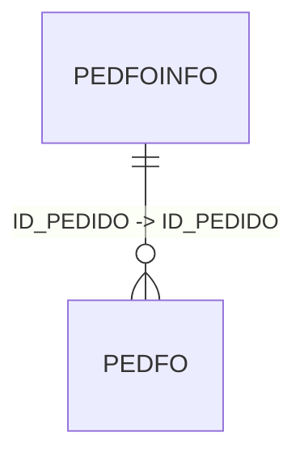

# Documentação da Tabela PEDFOINFO

> Documentação completa gerada automaticamente do banco de dados Firebird
> Data: 10/11/2025 08:23:10

## 📋 Índice

1. [Visão Geral](#visão-geral)
2. [Estrutura da Tabela](#estrutura-da-tabela)
3. [Índices](#índices)
4. [Relacionamentos Nível 1](#relacionamentos-nível-1)
5. [Relacionamentos Nível 2](#relacionamentos-nível-2)
6. [Relacionamentos Nível 3](#relacionamentos-nível-3)
7. [Relacionamentos Inversos](#relacionamentos-inversos)
8. [Diagrama de Relacionamentos](#diagrama-de-relacionamentos)
9. [Queries de Exemplo](#queries-de-exemplo)
10. [Análise Técnica Detalhada](#análise-técnica-detalhada)

---

## 📊 Visão Geral

**Tabela:** `PEDFOINFO`

**Total de Registros:** 53,700

**Total de Campos:** 4

**Relacionamentos Diretos (Nível 1):** 1

**Relacionamentos Indiretos (Nível 2):** 1

**Relacionamentos Nível 3:** 0

**Tabelas que Referenciam:** 0

---

## 🏗️ Estrutura da Tabela

| Campo | Tipo | Tamanho | Obrigatório | Descrição |
|-------|------|---------|-------------|-----------|
| `ID_PEDIDO` | INTEGER   | 4 | ✅ Sim | - |
| `CHAVE` | VARCHAR   | 200 | ✅ Sim | - |
| `VALOR` | VARCHAR   | 200 | ✅ Sim | - |
| `ARQUIVO` | BLOB      | 8 | ❌ Não | - |

---

## 🔑 Índices

- **PEDFO_PEDFOINFO** 🔍 INDEX
  - Campos: `ID_PEDIDO`

- **XPKPEDFOINFO** 🔒 UNIQUE
  - Campos: `ID_PEDIDO`, `CHAVE`

---

## 🔗 Relacionamentos Nível 1

> Tabelas que `PEDFOINFO` referencia diretamente

### 📌 PEDFOINFO → PEDFO

| Campo Origem | Campo Destino | Descrição |
|--------------|---------------|------------|
| `ID_PEDIDO` | `ID_PEDIDO` | Relacionamento direto |

---

## 🔗 Relacionamentos Nível 2

> Tabelas relacionadas através das tabelas de nível 1

### 📌 PEDFOINFO → PEDFO → CLIEN

| Tabela Intermediária | Campo Origem | Campo Destino |
|---------------------|--------------|---------------|
| `PEDFO` | `CLICODIGO` | `CLICODIGO` |

---

## 🔗 Relacionamentos Nível 3

> Tabelas relacionadas através das tabelas de nível 2

Nenhum relacionamento de nível 3 encontrado.

---

## ⬅️ Relacionamentos Inversos

> Tabelas que referenciam `PEDFOINFO`

Nenhuma tabela referencia esta.

---

## 📊 Diagrama de Relacionamentos



---

## 💻 Queries de Exemplo

### Consulta Básica

```sql
SELECT *
FROM PEDFOINFO
WHERE 1=1
ORDER BY 1
FETCH FIRST 100 ROWS ONLY
```

### Consulta com JOIN (Nível 1)

```sql
SELECT
    T.*,
    T1.*
FROM PEDFOINFO T
LEFT JOIN PEDFO T1
    ON T.ID_PEDIDO = T1.ID_PEDIDO
WHERE 1=1
FETCH FIRST 100 ROWS ONLY
```

### Estatísticas

```sql
-- Total de registros
SELECT COUNT(*) AS TOTAL
FROM PEDFOINFO
```

---

## 📊 Análise Técnica Detalhada

### Resumo da Estrutura

- **Campos totais**: 4
- **Campos obrigatórios**: 3
- **Campos opcionais**: 1
- **Índices definidos**: 2
- **Volume de dados**: 53,700 registros

### Tipos de Dados

- **BLOB     **: 1 campo(s)
- **INTEGER  **: 1 campo(s)
- **VARCHAR  **: 2 campo(s)

### Complexidade de Relacionamentos

✅ **Baixa complexidade**: Poucos relacionamentos, estrutura simples.

---

## 📚 Informações Adicionais

### Metadados da Documentação

- **Banco de dados**: Firebird (replica.fb)
- **Servidor**: 10.1.10.55:3050
- **Data da análise**: 10/11/2025 08:23:10
- **Método**: Consulta direta às tabelas de sistema do Firebird
- **Tabelas consultadas**: RDB$RELATIONS, RDB$RELATION_FIELDS, RDB$INDICES, RDB$REF_CONSTRAINTS

---

*Documentação gerada automaticamente a partir do banco de dados Firebird*

*Para dúvidas ou sugestões sobre esta tabela, consulte a equipe de desenvolvimento ou DBA responsável.*
