# Documentação da Tabela PEDFO

> Documentação completa gerada automaticamente do banco de dados Firebird
> Data: 10/11/2025 08:22:56

## 📋 Índice

1. [Visão Geral](#visão-geral)
2. [Estrutura da Tabela](#estrutura-da-tabela)
3. [Índices](#índices)
4. [Relacionamentos Nível 1](#relacionamentos-nível-1)
5. [Relacionamentos Nível 2](#relacionamentos-nível-2)
6. [Relacionamentos Nível 3](#relacionamentos-nível-3)
7. [Relacionamentos Inversos](#relacionamentos-inversos)
8. [Diagrama de Relacionamentos](#diagrama-de-relacionamentos)
9. [Queries de Exemplo](#queries-de-exemplo)
10. [Análise Técnica Detalhada](#análise-técnica-detalhada)

---

## 📊 Visão Geral

**Tabela:** `PEDFO`

**Total de Registros:** 129,753

**Total de Campos:** 190

**Relacionamentos Diretos (Nível 1):** 1

**Relacionamentos Indiretos (Nível 2):** 0

**Relacionamentos Nível 3:** 0

**Tabelas que Referenciam:** 24

---

## 🏗️ Estrutura da Tabela

| Campo | Tipo | Tamanho | Obrigatório | Descrição |
|-------|------|---------|-------------|-----------|
| `EMPCODIGO` | SMALLINT  | 2 | ✅ Sim | - |
| `PEFDTEMIS` | TIMESTAMP | 8 | ✅ Sim | - |
| `PEFCODIGO` | CHAR      | 10 | ✅ Sim | - |
| `BCOCODIGO` | SMALLINT  | 2 | ✅ Sim | - |
| `ENDCODIGO` | SMALLINT  | 2 | ✅ Sim | - |
| `ENDCOB` | SMALLINT  | 2 | ✅ Sim | - |
| `CTCNUMERO` | INTEGER   | 4 | ❌ Não | - |
| `PEFSIT` | CHAR      | 1 | ✅ Sim | - |
| `PEFPZENTRE` | TIMESTAMP | 8 | ✅ Sim | - |
| `PEFTPFRETE` | CHAR      | 1 | ✅ Sim | - |
| `OBSCODIGO` | INTEGER   | 4 | ❌ Não | - |
| `TRACODIGO` | INTEGER   | 4 | ❌ Não | - |
| `PEFQTDEESP` | BIGINT    | 8 | ❌ Não | - |
| `PEFESPECIE` | VARCHAR   | 10 | ❌ Não | - |
| `PEFPESOBRUTO` | DOUBLE    | 8 | ❌ Não | - |
| `PEFPESOLIQUIDO` | DOUBLE    | 8 | ❌ Não | - |
| `PEFVRMERC` | DOUBLE    | 8 | ❌ Não | - |
| `PEFPCDESCTO` | DOUBLE    | 8 | ❌ Não | - |
| `PEFVRDESCTO` | DOUBLE    | 8 | ❌ Não | - |
| `PEFVRFRETE` | DOUBLE    | 8 | ❌ Não | - |
| `PEFVRTOTAL` | DOUBLE    | 8 | ✅ Sim | - |
| `PEFDTBAIXA` | TIMESTAMP | 8 | ❌ Não | - |
| `PEFLCESTOQ` | CHAR      | 1 | ✅ Sim | - |
| `PEFLCFINANC` | CHAR      | 1 | ✅ Sim | - |
| `PEFVRSERVI` | DOUBLE    | 8 | ❌ Não | - |
| `PEFVRISS` | DOUBLE    | 8 | ❌ Não | - |
| `PEFBASEIPI` | DOUBLE    | 8 | ❌ Não | - |
| `PEFVRIPI` | DOUBLE    | 8 | ❌ Não | - |
| `PEFOBSER` | BLOB      | 8 | ❌ Não | - |
| `CLICODIGO` | INTEGER   | 4 | ✅ Sim | - |
| `CLICODIGO2` | INTEGER   | 4 | ❌ Não | - |
| `PEFDEVOLUCAO` | CHAR      | 1 | ✅ Sim | - |
| `PEFOUTDESPESAS` | DOUBLE    | 8 | ❌ Não | - |
| `PEFSALDO` | CHAR      | 1 | ✅ Sim | - |
| `CTOCODIGO` | SMALLINT  | 2 | ❌ Não | - |
| `PEFPCACRESFIN` | DOUBLE    | 8 | ❌ Não | - |
| `PEFVRACRESFIN` | DOUBLE    | 8 | ❌ Não | - |
| `FUNCODIGO` | INTEGER   | 4 | ✅ Sim | - |
| `PEFBASEICMS` | DOUBLE    | 8 | ❌ Não | - |
| `PEFVRICMS` | DOUBLE    | 8 | ❌ Não | - |
| `PEFBASEICMSSUB` | DOUBLE    | 8 | ❌ Não | - |
| `PEFVRICMSSUB` | DOUBLE    | 8 | ❌ Não | - |
| `PEFISEICMS` | DOUBLE    | 8 | ❌ Não | - |
| `FISCODIGO` | CHAR      | 7 | ❌ Não | - |
| `PEFDTENT` | TIMESTAMP | 8 | ❌ Não | - |
| `PGTCODIGO` | SMALLINT  | 2 | ❌ Não | - |
| `PEFORDEMCOMPRA` | VARCHAR   | 10 | ❌ Não | - |
| `ID_PEDIDO` | INTEGER   | 4 | ✅ Sim | - |
| `ID_PEDDEV` | INTEGER   | 4 | ❌ Não | - |
| `PEFVRDESPESA` | BIGINT    | 8 | ❌ Não | - |
| `PEFBASEISS` | BIGINT    | 8 | ❌ Não | - |
| `PEFVRIR` | BIGINT    | 8 | ❌ Não | - |
| `PEFVRINSS` | BIGINT    | 8 | ❌ Não | - |
| `PEFVRPIS` | BIGINT    | 8 | ❌ Não | - |
| `PEFVRCOFINS` | BIGINT    | 8 | ❌ Não | - |
| `PEFVRIIMPORT` | BIGINT    | 8 | ❌ Não | - |
| `PEFVRSEGURO` | BIGINT    | 8 | ❌ Não | - |
| `PEFCALCVR` | CHAR      | 1 | ❌ Não | - |
| `PEFPCISS` | BIGINT    | 8 | ❌ Não | - |
| `PEFOUTICMS` | BIGINT    | 8 | ❌ Não | - |
| `PEFISEIPI` | BIGINT    | 8 | ❌ Não | - |
| `PEFOUTIPI` | BIGINT    | 8 | ❌ Não | - |
| `PEFBASEPIS` | BIGINT    | 8 | ❌ Não | - |
| `PEFBASECOFINS` | BIGINT    | 8 | ❌ Não | - |
| `PEFDTAPROVADO` | TIMESTAMP | 8 | ❌ Não | - |
| `PEFHRAPROVADO` | TIMESTAMP | 8 | ❌ Não | - |
| `PEFTPPAGTO` | CHAR      | 2 | ✅ Sim | - |
| `PEFPCDESCTOSER` | BIGINT    | 8 | ❌ Não | - |
| `PEFVRDESCTOSER` | BIGINT    | 8 | ❌ Não | - |
| `PEFORIGEM` | CHAR      | 1 | ✅ Sim | - |
| `PEFDTORDCOMPRA` | TIMESTAMP | 8 | ❌ Não | - |
| `PEFBASECSLL` | BIGINT    | 8 | ❌ Não | - |
| `PEFVRCSLL` | BIGINT    | 8 | ❌ Não | - |
| `PEFDTCONF` | DATE      | 4 | ❌ Não | - |
| `PEFOUTACRES` | BIGINT    | 8 | ❌ Não | - |
| `PEFISEISS` | BIGINT    | 8 | ❌ Não | - |
| `PEFBASEIR` | BIGINT    | 8 | ❌ Não | - |
| `PEFBASEINSS` | BIGINT    | 8 | ❌ Não | - |
| `NFECODIGO` | INTEGER   | 4 | ❌ Não | - |
| `EMPCODIGONFE` | SMALLINT  | 2 | ❌ Não | - |
| `PEFCONFENT` | CHAR      | 1 | ❌ Não | - |
| `CUSCODIGO` | CHAR      | 10 | ❌ Não | - |
| `PEFVRPISII` | BIGINT    | 8 | ❌ Não | - |
| `PEFVRCOFINSII` | BIGINT    | 8 | ❌ Não | - |
| `PEFVRCSLLII` | BIGINT    | 8 | ❌ Não | - |
| `PEFBASEICMS2` | BIGINT    | 8 | ❌ Não | - |
| `PEFVRICMS2` | BIGINT    | 8 | ❌ Não | - |
| `PEFISEICMS2` | BIGINT    | 8 | ❌ Não | - |
| `PEFOUTICMS2` | BIGINT    | 8 | ❌ Não | - |
| `PEFBASEICMSSUB2` | BIGINT    | 8 | ❌ Não | - |
| `PEFVRICMSSUB2` | BIGINT    | 8 | ❌ Não | - |
| `PEFBASEIPI2` | BIGINT    | 8 | ❌ Não | - |
| `PEFVRIPI2` | BIGINT    | 8 | ❌ Não | - |
| `PEFISEIPI2` | BIGINT    | 8 | ❌ Não | - |
| `PEFOUTIPI2` | BIGINT    | 8 | ❌ Não | - |
| `PEFBASEIR2` | BIGINT    | 8 | ❌ Não | - |
| `PEFVRIR2` | BIGINT    | 8 | ❌ Não | - |
| `PEFBASEISS2` | BIGINT    | 8 | ❌ Não | - |
| `PEFPCISS2` | BIGINT    | 8 | ❌ Não | - |
| `PEFVRISS2` | BIGINT    | 8 | ❌ Não | - |
| `PEFISEISS2` | BIGINT    | 8 | ❌ Não | - |
| `PEFBASEINSS2` | BIGINT    | 8 | ❌ Não | - |
| `PEFVRINSS2` | BIGINT    | 8 | ❌ Não | - |
| `PEFBASEPIS2` | BIGINT    | 8 | ❌ Não | - |
| `PEFVRPIS2` | BIGINT    | 8 | ❌ Não | - |
| `PEFBASECOFINS2` | BIGINT    | 8 | ❌ Não | - |
| `PEFVRCOFINS2` | BIGINT    | 8 | ❌ Não | - |
| `PEFBASECSLL2` | BIGINT    | 8 | ❌ Não | - |
| `PEFVRCSLL2` | BIGINT    | 8 | ❌ Não | - |
| `PEFVRIIMPORT2` | BIGINT    | 8 | ❌ Não | - |
| `PEFALTERADO` | CHAR      | 1 | ✅ Sim | - |
| `PEFVRICMSDIF` | BIGINT    | 8 | ❌ Não | - |
| `PEFVRICMSDIF2` | BIGINT    | 8 | ❌ Não | - |
| `PEFNFSFOR` | CHAR      | 13 | ❌ Não | - |
| `PEFCHNFELETRONICA` | VARCHAR   | 44 | ❌ Não | - |
| `PEFBASEPISII` | BIGINT    | 8 | ❌ Não | - |
| `PEFBASECOFINSII` | BIGINT    | 8 | ❌ Não | - |
| `PEFBASECSLLII` | BIGINT    | 8 | ❌ Não | - |
| `PEFVRFINAN` | BIGINT    | 8 | ❌ Não | - |
| `PEFNRDI` | VARCHAR   | 12 | ❌ Não | - |
| `PEFDTDI` | TIMESTAMP | 8 | ❌ Não | - |
| `PEFLOCDESEMB` | VARCHAR   | 60 | ❌ Não | - |
| `PEFUFDESEMB` | VARCHAR   | 2 | ❌ Não | - |
| `PEFDTDESEMB` | TIMESTAMP | 8 | ❌ Não | - |
| `PEFCODEXPDI` | VARCHAR   | 60 | ❌ Não | - |
| `PEFBASEIIMPORT` | BIGINT    | 8 | ❌ Não | - |
| `PEFBASEIIMPORT2` | BIGINT    | 8 | ❌ Não | - |
| `PEFOUTPIS` | BIGINT    | 8 | ❌ Não | - |
| `PEFOUTCOFINS` | BIGINT    | 8 | ❌ Não | - |
| `PEFISEPIS` | BIGINT    | 8 | ❌ Não | - |
| `PEFISECOFINS` | BIGINT    | 8 | ❌ Não | - |
| `PEFOUTPIS2` | BIGINT    | 8 | ❌ Não | - |
| `PEFOUTCOFINS2` | BIGINT    | 8 | ❌ Não | - |
| `PEFISEPIS2` | BIGINT    | 8 | ❌ Não | - |
| `PEFISECOFINS2` | BIGINT    | 8 | ❌ Não | - |
| `PEFCHECKSUM` | VARCHAR   | 256 | ❌ Não | - |
| `PEFDTIMPORTANFE` | TIMESTAMP | 8 | ❌ Não | - |
| `PEFHRIMPORTANFE` | TIMESTAMP | 8 | ❌ Não | - |
| `PEFVRDESPESAII` | BIGINT    | 8 | ❌ Não | - |
| `PEFVRPISII2` | BIGINT    | 8 | ❌ Não | - |
| `PEFVRCOFINSII2` | BIGINT    | 8 | ❌ Não | - |
| `PEFBASEPISII2` | BIGINT    | 8 | ❌ Não | - |
| `PEFBASECOFINSII2` | BIGINT    | 8 | ❌ Não | - |
| `PEFBASECSLLII2` | BIGINT    | 8 | ❌ Não | - |
| `PEFOUTCOFINSII` | BIGINT    | 8 | ❌ Não | - |
| `PEFOUTCOFINSII2` | BIGINT    | 8 | ❌ Não | - |
| `PEFOUTPISII` | BIGINT    | 8 | ❌ Não | - |
| `PEFOUTPISII2` | BIGINT    | 8 | ❌ Não | - |
| `PEFISECOFINSII` | BIGINT    | 8 | ❌ Não | - |
| `PEFISECOFINSII2` | BIGINT    | 8 | ❌ Não | - |
| `PEFISEPISII` | BIGINT    | 8 | ❌ Não | - |
| `PEFISEPISII2` | BIGINT    | 8 | ❌ Não | - |
| `PEFCODOCDEV` | SMALLINT  | 2 | ❌ Não | - |
| `PEFVRDESPNAOTRIB` | BIGINT    | 8 | ❌ Não | - |
| `PEFBASEISSRET` | BIGINT    | 8 | ❌ Não | - |
| `PEFPCISSRET` | BIGINT    | 8 | ❌ Não | - |
| `PEFVRISSRET` | BIGINT    | 8 | ❌ Não | - |
| `PEFBASEISSRET2` | BIGINT    | 8 | ❌ Não | - |
| `PEFPCISSRET2` | BIGINT    | 8 | ❌ Não | - |
| `PEFVRISSRET2` | BIGINT    | 8 | ❌ Não | - |
| `PEFCALCMANUAL` | CHAR      | 1 | ❌ Não | - |
| `PEFVIATRANSP` | INTEGER   | 4 | ❌ Não | - |
| `PEFAFRMM` | BIGINT    | 8 | ❌ Não | - |
| `PEFCONFERIDO` | CHAR      | 1 | ❌ Não | - |
| `PEFVRFCP` | BIGINT    | 8 | ❌ Não | - |
| `PEFVRFCPSUB` | BIGINT    | 8 | ❌ Não | - |
| `PEFVRFCP2` | BIGINT    | 8 | ❌ Não | - |
| `PEFVRFCPSUB2` | BIGINT    | 8 | ❌ Não | - |
| `PEFINDFINAL` | INTEGER   | 4 | ❌ Não | - |
| `PEFCLICODADU` | INTEGER   | 4 | ❌ Não | - |
| `PEFCUSCODIGOADU` | CHAR      | 10 | ❌ Não | - |
| `PEFIMPOSTOCALCADU` | CHAR      | 1 | ❌ Não | - |
| `PEFDESPCONFRETEADU` | CHAR      | 1 | ❌ Não | - |
| `PEFDESPIMPADU` | CHAR      | 1 | ❌ Não | - |
| `PEFVRFRETEADUA` | CHAR      | 1 | ❌ Não | - |
| `PEFVRSEGUROADU` | CHAR      | 1 | ❌ Não | - |
| `PEFVRDESPESAADU` | CHAR      | 1 | ❌ Não | - |
| `PEFVRDESPNAOTRIBADU` | CHAR      | 1 | ❌ Não | - |
| `PEFBASEIMPPISCOFINS` | BIGINT    | 8 | ❌ Não | - |
| `PEFHRENTREGA` | TIME      | 4 | ❌ Não | - |
| `PEFTRANSVOL` | VARCHAR   | 60 | ❌ Não | - |
| `PEFTRANSMARCA` | VARCHAR   | 60 | ❌ Não | - |
| `PEFNRDRAW` | VARCHAR   | 20 | ❌ Não | - |
| `PEFBASEIBS` | BIGINT    | 8 | ❌ Não | - |
| `PEFVRIBS` | BIGINT    | 8 | ❌ Não | - |
| `PEFBASECBS` | BIGINT    | 8 | ❌ Não | - |
| `PEFVRCBS` | BIGINT    | 8 | ❌ Não | - |
| `PEFBASEIS` | BIGINT    | 8 | ❌ Não | - |
| `PEFVRIS` | BIGINT    | 8 | ❌ Não | - |
| `PEFTPVENDA` | SMALLINT  | 2 | ❌ Não | - |

---

## 🔑 Índices

- **CLIEN_PEDFO** 🔍 INDEX
  - Campos: `CLICODIGO`

- **INDPEDFOPEFDTEMIS** 🔍 INDEX
  - Campos: `PEFDTEMIS`

- **INDPEFCODIGO** 🔍 INDEX
  - Campos: `PEFCODIGO`, `EMPCODIGO`

- **INDPEFDTBAIXA** 🔍 INDEX
  - Campos: `PEFDTBAIXA`

- **INDPEFDTENT** 🔍 INDEX
  - Campos: `PEFDTENT`

- **XPKPEDFO** 🔒 UNIQUE
  - Campos: `ID_PEDIDO`

---

## 🔗 Relacionamentos Nível 1

> Tabelas que `PEDFO` referencia diretamente

### 📌 PEDFO → CLIEN

| Campo Origem | Campo Destino | Descrição |
|--------------|---------------|------------|
| `CLICODIGO` | `CLICODIGO` | Relacionamento direto |

---

## 🔗 Relacionamentos Nível 2

> Tabelas relacionadas através das tabelas de nível 1

Nenhum relacionamento de nível 2 encontrado.

---

## 🔗 Relacionamentos Nível 3

> Tabelas relacionadas através das tabelas de nível 2

Nenhum relacionamento de nível 3 encontrado.

---

## ⬅️ Relacionamentos Inversos

> Tabelas que referenciam `PEDFO`

- `RATEIOCONHECIMENTOFRETE` → `PEDFO`
- `CRITICASPEDFO` → `PEDFO`
- `PFOPED` → `PEDFO`
- `PFOPEDPERDA` → `PEDFO`
- `PCTPEDFO` → `PEDFO`
- `CONFPARCIALTRANSF` → `PEDFO`
- `PFCAN` → `PEDFO`
- `PFNFE` → `PEDFO`
- `PFSER` → `PEDFO`
- `PEDFORESTRICOES` → `PEDFO`
- `PFDUP` → `PEDFO`
- `PFOXPFO` → `PEDFO`
- `PEFPAGP` → `PEDFO`
- `PFUNI` → `PEDFO`
- `PEDFOXPEDID` → `PEDFO`
- `PEDFONFECONF` → `PEDFO`
- `PEDFOHISTOEXP` → `PEDFO`
- `PFPRO` → `PEDFO`
- `PFCTCUSTO` → `PEDFO`
- `CONFPARCIAL` → `PEDFO`
- `PFXBLC` → `PEDFO`
- `PEDPFO` → `PEDFO`
- `PEDFOINFO` → `PEDFO`
- `CONFPEDFO` → `PEDFO`

---

## 📊 Diagrama de Relacionamentos

```mermaid
erDiagram
    PEDFO ||--o{ CLIEN : "CLICODIGO -> CLICODIGO"
    RATEIOCONHECIMENTOFRETE ||--o{ PEDFO : "referencia"
    CRITICASPEDFO ||--o{ PEDFO : "referencia"
    PFOPED ||--o{ PEDFO : "referencia"
    PFOPEDPERDA ||--o{ PEDFO : "referencia"
    PCTPEDFO ||--o{ PEDFO : "referencia"
    CONFPARCIALTRANSF ||--o{ PEDFO : "referencia"
    PFCAN ||--o{ PEDFO : "referencia"
    PFNFE ||--o{ PEDFO : "referencia"
    PFSER ||--o{ PEDFO : "referencia"
    PEDFORESTRICOES ||--o{ PEDFO : "referencia"
    PFDUP ||--o{ PEDFO : "referencia"
    PFOXPFO ||--o{ PEDFO : "referencia"
    PEFPAGP ||--o{ PEDFO : "referencia"
    PFUNI ||--o{ PEDFO : "referencia"
    PEDFOXPEDID ||--o{ PEDFO : "referencia"
    PEDFONFECONF ||--o{ PEDFO : "referencia"
    PEDFOHISTOEXP ||--o{ PEDFO : "referencia"
    PFPRO ||--o{ PEDFO : "referencia"
    PFCTCUSTO ||--o{ PEDFO : "referencia"
    CONFPARCIAL ||--o{ PEDFO : "referencia"
    PFXBLC ||--o{ PEDFO : "referencia"
    PEDPFO ||--o{ PEDFO : "referencia"
    PEDFOINFO ||--o{ PEDFO : "referencia"
    CONFPEDFO ||--o{ PEDFO : "referencia"
```



---

## 💻 Queries de Exemplo

### Consulta Básica

```sql
SELECT *
FROM PEDFO
WHERE 1=1
ORDER BY 1
FETCH FIRST 100 ROWS ONLY
```

### Consulta com JOIN (Nível 1)

```sql
SELECT
    T.*,
    T1.*
FROM PEDFO T
LEFT JOIN CLIEN T1
    ON T.CLICODIGO = T1.CLICODIGO
WHERE 1=1
FETCH FIRST 100 ROWS ONLY
```

### Estatísticas

```sql
-- Total de registros
SELECT COUNT(*) AS TOTAL
FROM PEDFO
```

---

## 📊 Análise Técnica Detalhada

### Resumo da Estrutura

- **Campos totais**: 190
- **Campos obrigatórios**: 20
- **Campos opcionais**: 170
- **Índices definidos**: 6
- **Volume de dados**: 129,753 registros

### Tipos de Dados

- **BIGINT   **: 100 campo(s)
- **BLOB     **: 1 campo(s)
- **CHAR     **: 25 campo(s)
- **DATE     **: 1 campo(s)
- **DOUBLE   **: 19 campo(s)
- **INTEGER  **: 12 campo(s)
- **SMALLINT **: 9 campo(s)
- **TIME     **: 1 campo(s)
- **TIMESTAMP**: 11 campo(s)
- **VARCHAR  **: 11 campo(s)

### Complexidade de Relacionamentos

🔴 **Alta complexidade**: Muitos relacionamentos, atenção especial em queries e performance.

---

## 📚 Informações Adicionais

### Metadados da Documentação

- **Banco de dados**: Firebird (replica.fb)
- **Servidor**: 10.1.10.55:3050
- **Data da análise**: 10/11/2025 08:22:56
- **Método**: Consulta direta às tabelas de sistema do Firebird
- **Tabelas consultadas**: RDB$RELATIONS, RDB$RELATION_FIELDS, RDB$INDICES, RDB$REF_CONSTRAINTS

---

*Documentação gerada automaticamente a partir do banco de dados Firebird*

*Para dúvidas ou sugestões sobre esta tabela, consulte a equipe de desenvolvimento ou DBA responsável.*
