# PEDID - Pedidos - Relacionamentos Completos

## Informacoes Gerais

| Propriedade | Valor |
|-------------|-------|
| **Nome da Tabela** | PEDID |
| **Total de Registros** | 3.135.511 |
| **Total de Colunas** | 174 |
| **Tipo de Chave Primaria** | Simples (ID_PEDIDO) |
| **Chaves Estrangeiras (FK OUT)** | 0 (tabela mestre) |
| **Chaves Estrangeiras (FK IN)** | 62 tabelas dependentes |
| **Indices** | 14 |
| **Banco de Dados** | Firebird (READ ONLY) |
| **Valor Total Faturado** | R$ 586.409.288,57 |
| **Periodo de Dados** | 2016 - 2025 |

---

## Descricao

### Proposito
A tabela **PEDID** e a **TABELA MESTRE** do sistema de gestao de pedidos e producao de lentes opticas. Armazena todas as informacoes de pedidos desde a entrada ate o faturamento, incluindo dados do cliente, valores financeiros, impostos, prazos, informacoes de producao e rastreamento.

### Quando e Usada
- Registro de novos pedidos de lentes
- Acompanhamento de producao (via ACOPED)
- Controle de prazos de entrega
- Faturamento e notas fiscais
- Calculo de comissoes de vendedores
- Gestao de JitBox para producao
- Rastreamento de quebras e requisicoes
- Relatorios gerenciais e KPIs

### Importancia no Sistema
- **CRITICA MAXIMA:** Todas as operacoes do sistema dependem desta tabela
- **Alto Volume:** 3.135.511 pedidos registrados
- **Centro de Gravidade:** 62 tabelas dependentes referenciam PEDID
- **Integracao JitBox:** Controle fisico de producao
- **Faturamento:** R$ 586 milhoes em pedidos faturados

### Processo de Producao (Integracao JitBox)

A tabela PEDID esta no centro do processo de producao de lentes, integrando-se com o sistema de JitBox:

```
ENTRADA DO PEDIDO (LP:1)
    |
    v
ESTOQUE (LP:5-6) --> ATRIBUICAO DO JITBOX
    |
    v
SURFACAGEM DIGITAL (LP:29-30)
    |
    v
TRIAGEM (LP:66-67) --> POSSIVEL TROCA DE JITBOX (para AR)
    |
    v
TRATAMENTO AR (LP:11-12) --> REQUER JITBOX ESPECIAL
    |
    v
MONTAGEM (LP:13-14)
    |
    v
EXPEDICAO (LP:4) --> LIBERACAO DO JITBOX
    |
    v
NOTA FISCAL (LP:113)
```

**Eventos Criticos:**
- **LP:6 (TERMINO ESTOQUE):** Atribuicao do JitBox ao pedido
- **LP:28 (QUEBRA DA LENTE):** Liberacao do JitBox, criacao de requisicao
- **LP:67 (TERMINO DA TRIAGEM):** Possivel troca para JitBox especial (AR)
- **LP:85 (QUEBRA DA ARMACAO):** Liberacao do JitBox

---

## Estrutura de Colunas (174 campos)

### Identificacao e Controle (12 campos)

| Campo | Tipo | Nulo | Descricao | Funcao |
|-------|------|------|-----------|--------|
| **ID_PEDIDO** | INTEGER | Nao | Identificador unico | PK - Chave primaria |
| **EMPCODIGO** | SMALLINT | Nao | Codigo da Empresa | Empresa proprietaria |
| **PEDCODIGO** | VARCHAR(10) | Nao | Codigo do pedido | Numero do pedido visivel |
| **TPCODIGO** | SMALLINT | Nao | Tipo do pedido | FK logica -> TPEDIDO |
| **PEDSITPED** | CHAR(1) | Nao | Situacao do pedido | A=Ativo, B=Bloqueado, C=Cancelado, F=Faturado |
| **PEDORIGEM** | CHAR(1) | Nao | Origem do pedido | Como foi criado |
| **PEDCONTADOR** | SMALLINT | Sim | Contador interno | Sequenciamento |
| **CUSCODIGO** | VARCHAR(10) | Sim | Codigo de custo | Centro de custo |
| **GLCODIGO** | VARCHAR(2) | Sim | Codigo de grupo loja | Grupo de loja |
| **PDFCODIGO** | INTEGER | Sim | Codigo PDF | Referencia documento |
| **POCCODIGO** | INTEGER | Sim | Ponto de corte | Referencia |
| **PEDORDEM** | SMALLINT | Sim | Ordem do pedido | Prioridade |

### Cliente e Enderecamento (8 campos)

| Campo | Tipo | Nulo | Descricao | Funcao |
|-------|------|------|-----------|--------|
| **CLICODIGO** | INTEGER | Nao | Codigo do cliente | FK logica -> CLIEN |
| **CLIRECEITA** | INTEGER | Nao | Cliente receita | Cliente para receita |
| **ENDCOB** | SMALLINT | Nao | Endereco cobranca | FK logica -> ENDCLI |
| **ENDENT** | SMALLINT | Nao | Endereco entrega | FK logica -> ENDCLI |
| **ENDCODIGO** | SMALLINT | Nao | Endereco padrao | FK logica -> ENDCLI |
| **ENDCLIRECEITA** | SMALLINT | Nao | Endereco receita | Endereco cliente receita |
| **PEDPLACACLI** | VARCHAR(10) | Sim | Placa cliente | Identificacao veiculo |
| **TRACODIGO1** | INTEGER | Sim | Transportadora 1 | FK logica -> TRANSP |

### Vendedor e Comissoes (6 campos)

| Campo | Tipo | Nulo | Descricao | Funcao |
|-------|------|------|-----------|--------|
| **FUNCODIGO** | INTEGER | Nao | Vendedor principal | FK logica -> FUNCIO |
| **FUNCODIGO2** | INTEGER | Sim | Vendedor secundario | Segundo vendedor |
| **PEDPCCOMIS** | NUMERIC(8,6) | Sim | % Comissao vendedor 1 | Percentual comissao |
| **PEDPCCOMIS2** | NUMERIC(8,6) | Sim | % Comissao vendedor 2 | Percentual segundo vendedor |
| **PEDLCCOMIS** | CHAR(1) | Nao | Lancou comissao | S/N flag |
| **SETCODIGO** | SMALLINT | Sim | Codigo do setor | Setor do vendedor |

### Valores e Financeiro (22 campos)

| Campo | Tipo | Nulo | Descricao | Funcao |
|-------|------|------|-----------|--------|
| **PEDVRMERC** | NUMERIC(8,2) | Nao | Valor mercadorias | Subtotal produtos |
| **PEDVRTOTAL** | NUMERIC(8,2) | Nao | Valor total | Valor final do pedido |
| **PEDVRSERVI** | NUMERIC(8,2) | Nao | Valor servicos | Total servicos |
| **PEDVRFRETE** | NUMERIC(8,2) | Sim | Valor frete | Custo do frete |
| **PEDVRDESPESA** | NUMERIC(8,2) | Sim | Valor despesas | Despesas adicionais |
| **PEDVRSEGURO** | NUMERIC(8,2) | Sim | Valor seguro | Custo do seguro |
| **PEDVRDESCTO** | NUMERIC(8,2) | Sim | Valor desconto produtos | Desconto sobre produtos |
| **PEDPCDESCTO** | NUMERIC(8,2) | Sim | % Desconto produtos | Percentual desconto |
| **PEDVRDESCTOSER** | NUMERIC(8,2) | Sim | Valor desconto servicos | Desconto sobre servicos |
| **PEDPCDESCTOSER** | NUMERIC(8,2) | Sim | % Desconto servicos | Percentual desconto |
| **PEDPCACRES** | NUMERIC(8,2) | Sim | % Acrescimo | Percentual acrescimo |
| **PEDVRJUROS** | NUMERIC(8,2) | Sim | Valor juros | Juros calculados |
| **PEDPCACRESFIN** | NUMERIC(8,2) | Sim | % Acrescimo financeiro | Percentual acrescimo |
| **PEDVRACRESFIN** | NUMERIC(8,2) | Sim | Valor acrescimo financeiro | Valor acrescimo |
| **PEDVRFINAN** | NUMERIC(8,2) | Sim | Valor financeiro | Total financeiro |
| **PEDSALDO** | CHAR(1) | Nao | Saldo pendente | S/N flag |
| **PEDFATURA** | CHAR(1) | Nao | Faturado | S/N flag |
| **PEDCALCDESCTO** | VARCHAR(50) | Sim | Formula calculo desconto | Expressao de calculo |
| **BCOCODIGO** | SMALLINT | Nao | Codigo do banco | FK logica -> BANCO |
| **COBCODIGO** | VARCHAR(8) | Nao | Codigo cobranca | Tipo de cobranca |
| **COBSEQ** | SMALLINT | Sim | Sequencia cobranca | Sequenciamento |
| **CTCNUMERO** | INTEGER | Sim | Numero contrato | Referencia contrato |

### Tributos ICMS (10 campos)

| Campo | Tipo | Nulo | Descricao | Funcao |
|-------|------|------|-----------|--------|
| **PEDBASEICMS** | NUMERIC(8,2) | Sim | Base ICMS | Base de calculo |
| **PEDVRICMS** | NUMERIC(8,2) | Sim | Valor ICMS | ICMS calculado |
| **PEDISEICMS** | NUMERIC(8,2) | Sim | ICMS isento | Valor isencao |
| **PEDOUTICMS** | NUMERIC(8,2) | Sim | Outros ICMS | Outras operacoes |
| **PEDBASEICMSSUB** | NUMERIC(8,2) | Sim | Base ICMS ST | Base substituicao |
| **PEDVRICMSSUB** | NUMERIC(8,2) | Sim | Valor ICMS ST | Valor substituicao |
| **PEDVRICMSDIF** | NUMERIC(8,2) | Sim | Diferencial ICMS | Diferencial aliquota |
| **PEDVRFCP** | NUMERIC(8,2) | Sim | Valor FCP | Fundo Combate Pobreza |
| **PEDVRFCPSUB** | NUMERIC(8,2) | Sim | Valor FCP ST | FCP substituicao |
| **FISCODIGO1** | VARCHAR(7) | Nao | Codigo fiscal 1 | CFOP principal |

### Tributos PIS/COFINS (12 campos)

| Campo | Tipo | Nulo | Descricao | Funcao |
|-------|------|------|-----------|--------|
| **PEDPCPIS** | NUMERIC(8,2) | Sim | % PIS | Aliquota PIS |
| **PEDBASEPIS** | NUMERIC(8,2) | Sim | Base PIS | Base de calculo |
| **PEDVRPIS** | NUMERIC(8,2) | Sim | Valor PIS | PIS calculado |
| **PEDISEPIS** | NUMERIC(8,2) | Sim | PIS isento | Valor isencao |
| **PEDOUTPIS** | NUMERIC(8,2) | Sim | Outros PIS | Outras operacoes |
| **PEDPCCOFINS** | NUMERIC(8,2) | Sim | % COFINS | Aliquota COFINS |
| **PEDBASECOFINS** | NUMERIC(8,2) | Sim | Base COFINS | Base de calculo |
| **PEDVRCOFINS** | NUMERIC(8,2) | Sim | Valor COFINS | COFINS calculado |
| **PEDISECOFINS** | NUMERIC(8,2) | Sim | COFINS isento | Valor isencao |
| **PEDOUTCOFINS** | NUMERIC(8,2) | Sim | Outros COFINS | Outras operacoes |
| **PEDPISRET** | NUMERIC(8,2) | Sim | PIS retido | PIS retencao |
| **PEDCOFINSRET** | NUMERIC(8,2) | Sim | COFINS retido | COFINS retencao |

### Tributos IPI (6 campos)

| Campo | Tipo | Nulo | Descricao | Funcao |
|-------|------|------|-----------|--------|
| **PEDBASEIPI** | NUMERIC(8,2) | Sim | Base IPI | Base de calculo |
| **PEDVRIPI** | NUMERIC(8,2) | Sim | Valor IPI | IPI calculado |
| **PEDISEIPI** | NUMERIC(8,2) | Sim | IPI isento | Valor isencao |
| **PEDOUTIPI** | NUMERIC(8,2) | Sim | Outros IPI | Outras operacoes |
| **PEDVRIPIDEVOLVIDO** | NUMERIC(8,2) | Sim | IPI devolvido | IPI em devolucao |
| **PEDBASEIPIDEVOLVIDO** | NUMERIC(8,2) | Sim | Base IPI devolvido | Base devolucao |

### Tributos ISS (8 campos)

| Campo | Tipo | Nulo | Descricao | Funcao |
|-------|------|------|-----------|--------|
| **PEDBASEISS** | NUMERIC(8,2) | Sim | Base ISS | Base de calculo |
| **PEDPCISS** | NUMERIC(8,2) | Sim | % ISS | Aliquota ISS |
| **PEDVRISS** | NUMERIC(8,2) | Sim | Valor ISS | ISS calculado |
| **PEDISEISS** | NUMERIC(8,2) | Sim | ISS isento | Valor isencao |
| **PEDBASEISSRET** | NUMERIC(8,2) | Sim | Base ISS retido | Base retencao |
| **PEDVRISSRET** | NUMERIC(8,2) | Sim | Valor ISS retido | ISS retencao |
| **PEDPCISSRET** | NUMERIC(8,2) | Sim | % ISS retido | Percentual retencao |
| **FISCODIGO2** | VARCHAR(7) | Sim | Codigo fiscal 2 | CFOP secundario |

### Tributos IR/INSS/CSLL (8 campos)

| Campo | Tipo | Nulo | Descricao | Funcao |
|-------|------|------|-----------|--------|
| **PEDBASEIR** | NUMERIC(8,2) | Sim | Base IR | Base de calculo |
| **PEDVRIR** | NUMERIC(8,2) | Sim | Valor IR | IR calculado |
| **PEDIRRET** | NUMERIC(8,2) | Sim | IR retido | IR retencao |
| **PEDBASEINSS** | NUMERIC(8,2) | Sim | Base INSS | Base de calculo |
| **PEDPCINSS** | NUMERIC(8,2) | Sim | % INSS | Aliquota INSS |
| **PEDVRINSS** | NUMERIC(8,2) | Sim | Valor INSS | INSS calculado |
| **PEDCSLLRET** | NUMERIC(8,2) | Sim | CSLL retido | CSLL retencao |
| **PEDOUTDESPESAS** | NUMERIC(8,2) | Sim | Outras despesas | Despesas adicionais |

### Tributos SUFRAMA (12 campos)

| Campo | Tipo | Nulo | Descricao | Funcao |
|-------|------|------|-----------|--------|
| **PEDVRSUFRAMA** | NUMERIC(8,4) | Sim | Valor SUFRAMA | Desconto SUFRAMA |
| **PEDBASESUFRAMA** | NUMERIC(8,2) | Sim | Base SUFRAMA | Base de calculo |
| **PEDBASESUFRAMAICMS** | NUMERIC(8,2) | Sim | Base SUFRAMA ICMS | Base ICMS |
| **PEDVRSUFRAMAICMS** | NUMERIC(8,2) | Sim | Valor SUFRAMA ICMS | Valor ICMS |
| **PEDBASESUFRAMACOFINS** | NUMERIC(8,2) | Sim | Base SUFRAMA COFINS | Base COFINS |
| **PEDVRSUFRAMACOFINS** | NUMERIC(8,2) | Sim | Valor SUFRAMA COFINS | Valor COFINS |
| **PEDBASESUFRAMAPIS** | NUMERIC(8,2) | Sim | Base SUFRAMA PIS | Base PIS |
| **PEDVRSUFRAMAPIS** | NUMERIC(8,2) | Sim | Valor SUFRAMA PIS | Valor PIS |
| **PEDBASEIBS** | NUMERIC(8,2) | Sim | Base IBS | Novo tributo |
| **PEDVRIBS** | NUMERIC(8,2) | Sim | Valor IBS | Valor IBS |
| **PEDBASECBS** | NUMERIC(8,2) | Sim | Base CBS | Novo tributo |
| **PEDVRCBS** | NUMERIC(8,2) | Sim | Valor CBS | Valor CBS |

### Tributos IS (4 campos)

| Campo | Tipo | Nulo | Descricao | Funcao |
|-------|------|------|-----------|--------|
| **PEDBASEIS** | NUMERIC(8,2) | Sim | Base IS | Base de calculo |
| **PEDVRIS** | NUMERIC(8,2) | Sim | Valor IS | Valor IS |
| **TBFCODIGO** | SMALLINT | Sim | Tabela fiscal | Codigo tabela |
| **PEDINDFINAL** | INTEGER | Sim | Indicador final | Consumidor final |

### Datas Importantes (18 campos)

| Campo | Tipo | Nulo | Descricao | Funcao |
|-------|------|------|-----------|--------|
| **PEDDTEMIS** | TIMESTAMP | Nao | Data emissao | Quando foi criado |
| **PEDPZENTRE** | TIMESTAMP | Nao | Prazo entrega | Data prometida |
| **PEDDTVALIDADE** | TIMESTAMP | Nao | Data validade | Validade do orcamento |
| **PEDDTBAIXA** | TIMESTAMP | Sim | Data baixa | Quando foi baixado |
| **PEDDTFECHA** | TIMESTAMP | Sim | Data fechamento | Quando foi fechado |
| **PEDDTSAIDA** | TIMESTAMP | Sim | Data saida | Saida para entrega |
| **ORCDTEMIS** | TIMESTAMP | Sim | Data orcamento | Emissao do orcamento |
| **PEDDTROMAN** | TIMESTAMP | Sim | Data romaneio | Emissao romaneio |
| **PEDDTAPROVADO** | TIMESTAMP | Sim | Data aprovacao | Aprovacao financeira |
| **PEDDTETQ** | TIMESTAMP | Sim | Data etiqueta | Impressao etiqueta |
| **PEDDTORDEMCOMPRA** | DATE | Sim | Data ordem compra | Ordem de compra |
| **PEDDTEMISNIVELSERV** | TIMESTAMP | Sim | Data nivel servico | Nivel de servico |
| **PEDHORAENT** | TIME | Sim | Hora entrega | Hora prevista |
| **PEDHRENTRE** | TIME | Sim | Hora entrada | Hora de entrada |
| **PEDHRSAIDA** | TIME | Sim | Hora saida | Hora de saida |
| **PEDHRAPROVADO** | TIME | Sim | Hora aprovacao | Hora aprovado |
| **PEDPZETGSIS** | TIMESTAMP | Sim | Prazo etiqueta sistema | Prazo interno |
| **PEDHRETGCOMBINADA** | TIME | Sim | Hora etiqueta combinada | Hora combinada |

### Producao e Rastreamento (18 campos)

| Campo | Tipo | Nulo | Descricao | Funcao |
|-------|------|------|-----------|--------|
| **PEDPRODUCAOR** | CHAR(1) | Sim | Em producao | S/N flag |
| **PEDGRPRODUCAO** | CHAR(1) | Sim | Grupo producao | Tipo de producao |
| **PEDREMTERCEIRO** | CHAR(1) | Sim | Remessa terceiro | Producao externa |
| **LCPRODUTIV** | CHAR(1) | Sim | Lancou produtividade | S/N flag |
| **PEDORDEMCOMPRA** | VARCHAR(20) | Sim | Ordem de compra | **ID do pedido original (para requisicoes)** |
| **PEDAUTORIZOU** | VARCHAR(50) | Sim | Quem autorizou | Nome do autorizador |
| **PEDNROS** | INTEGER | Sim | Numero OS | Ordem de servico |
| **PEDNRROMAN** | INTEGER | Sim | Numero romaneio | Romaneio |
| **PEDDEVOLUCAO** | CHAR(1) | Nao | E devolucao | S/N flag |
| **PEDALTERADO** | CHAR(1) | Nao | Foi alterado | S/N flag |
| **PEDIMPRE** | CHAR(1) | Nao | Foi impresso | S/N flag |
| **PEDNRENVELOPE** | VARCHAR(14) | Sim | Numero envelope | Envelope entrega |
| **PEDTPVENDA** | INTEGER | Sim | Tipo venda | Tipo de venda |
| **PEDINFRECEB** | CHAR(1) | Sim | Info recebimento | Flag informativo |
| **PEDARQRECEITA** | CHAR(1) | Sim | Arquivo receita | Flag arquivo |
| **PEDCHECKSUM** | VARCHAR(256) | Sim | Checksum | Validacao integridade |
| **ID_RESERVA** | VARCHAR(20) | Sim | ID reserva | Codigo reserva |
| **PEDACOMPANHAMENTO** | CHAR(1) | Sim | Acompanhamento | Flag acompanhamento |

### Lentes e Especificacoes (10 campos)

| Campo | Tipo | Nulo | Descricao | Funcao |
|-------|------|------|-----------|--------|
| **PEDINDREFRACAO** | NUMERIC(8,4) | Sim | Indice refracao | Indice da lente |
| **PEDPROCOR** | INTEGER | Sim | Procedimento cor | Coloracao |
| **PEDDIVPD** | CHAR(1) | Sim | Dividir PD | Divisao PD |
| **ID_PEFDEV** | INTEGER | Sim | ID devolucao | Referencia devolucao |
| **ID_NIVELSERVI** | INTEGER | Sim | ID nivel servico | Nivel de servico |
| **ID_PROMOSUGERIDO** | INTEGER | Sim | ID promocao sugerida | Promocao sugerida |
| **NRVOUCHERSUGERIDO** | VARCHAR(255) | Sim | Numero voucher sugerido | Voucher |
| **PEDCODINTERMED** | SMALLINT | Sim | Codigo intermediario | Intermediario |
| **PEDSEQLMS** | INTEGER | Sim | Sequencia LMS | Sequenciamento LMS |
| **PEDRETIRA** | CHAR(1) | Sim | Retira | Flag retirada |

### Frete e Transporte (8 campos)

| Campo | Tipo | Nulo | Descricao | Funcao |
|-------|------|------|-----------|--------|
| **PEDTPFRETE** | CHAR(1) | Nao | Tipo frete | CIF/FOB |
| **PEDPCFRETE** | NUMERIC(8,2) | Sim | % Frete | Percentual frete |
| **PEDPCSEGURO** | NUMERIC(8,2) | Sim | % Seguro | Percentual seguro |
| **PEDQTDEESP** | NUMERIC(8) | Sim | Quantidade especies | Volumes |
| **PEDESPECIE** | VARCHAR(10) | Sim | Especie | Tipo volume |
| **PEDPESOBRUTO** | NUMERIC(8,3) | Sim | Peso bruto | Peso total |
| **PEDPESOLIQUIDO** | NUMERIC(8,3) | Sim | Peso liquido | Peso produto |
| **TRACODIGO2** | INTEGER | Sim | Transportadora 2 | Transportadora alternativa |

### Observacoes e Extras (10 campos)

| Campo | Tipo | Nulo | Descricao | Funcao |
|-------|------|------|-----------|--------|
| **PEDOBSER** | BLOB | Sim | Observacoes | Texto livre |
| **OBSCODIGO1** | INTEGER | Sim | Observacao padrao 1 | FK logica -> OBSERV |
| **OBSCODIGO2** | INTEGER | Sim | Observacao padrao 2 | FK logica -> OBSERV |
| **PGTCODIGO** | SMALLINT | Sim | Codigo pagamento | Forma pagamento |
| **PEDTPFAT** | CHAR(1) | Sim | Tipo faturamento | Tipo fatura |
| **PEDPCFAT** | INTEGER | Sim | % Faturamento | Percentual |
| **ORCCODIGO** | VARCHAR(10) | Sim | Codigo orcamento | Numero orcamento |
| **PEDTRANSVOL** | VARCHAR(60) | Sim | Volumes transporte | Descricao volumes |
| **PEDTRANSMARCA** | VARCHAR(60) | Sim | Marca transporte | Marca volumes |
| **PEDHRETGSIS** | TIME | Sim | Hora etiqueta sistema | Hora sistema |

---

## Indices (14 indices)

### Indice Primario

| Nome | Unico | Campos | Descricao |
|------|-------|--------|-----------|
| **XPKPEDID** | Sim | ID_PEDIDO | Chave primaria |

### Indice Unico Composto

| Nome | Unico | Campos | Descricao |
|------|-------|--------|-----------|
| **UNK_PEDCODIGO** | Sim | PEDCODIGO, PEDDTEMIS, PEDCONTADOR, EMPCODIGO | Unicidade por empresa |

### Indices de Busca

| Nome | Unico | Tipo | Campos | Descricao |
|------|-------|------|--------|-----------|
| IDXIDPEFDEV | Nao | Normal | ID_PEFDEV | Busca devolucoes |
| INDCLICODIGO | Nao | Normal | CLICODIGO | Busca por cliente |
| INDID_NIVELSERVI | Nao | Normal | ID_NIVELSERVI | Busca nivel servico |
| INDPEDCODIGO | Nao | Normal | PEDCODIGO | Busca por codigo |
| INDPEDORDEMCOMPRA | Nao | Normal | PEDORDEMCOMPRA | **Busca requisicoes** |
| INDPEDTAPROVADO | Nao | Normal | PEDDTAPROVADO | Busca aprovacoes |

### Indices Descendentes (Datas)

| Nome | Unico | Tipo | Campos | Descricao |
|------|-------|------|--------|-----------|
| INDPEDDTBAIXA | Nao | DESC | PEDDTBAIXA | Ordenar por baixa |
| INDPEDDTEMIS | Nao | DESC | PEDDTEMIS | Ordenar por emissao |
| INDPEDDTSAIDA | Nao | DESC | PEDDTSAIDA | Ordenar por saida |
| INDPEDPZENTRE | Nao | DESC | PEDPZENTRE | Ordenar por prazo |
| INDPEDPZETGSIS | Nao | DESC | PEDPZETGSIS | Ordenar por prazo sistema |

---

## FK OUT (Saindo desta tabela)

### Total: 0 Foreign Keys Formais

**PEDID e uma TABELA MESTRE** - nao possui constraints de FK formais definidas no banco.

Porem, existem **relacionamentos logicos importantes** (sem constraint formal):

| Campo | Tabela Destino | Campo Destino | Descricao |
|-------|----------------|---------------|-----------|
| EMPCODIGO | EMPRESA | EMPCODIGO | Empresa do pedido |
| CLICODIGO | CLIEN | CLICODIGO | Cliente do pedido |
| FUNCODIGO | FUNCIO | FUNCODIGO | Vendedor principal |
| FUNCODIGO2 | FUNCIO | FUNCODIGO | Vendedor secundario |
| TRACODIGO1 | TRANSP | TRACODIGO | Transportadora |
| BCOCODIGO | BANCO | BCOCODIGO | Banco |
| ENDCOB | ENDCLI | ENDCODIGO | Endereco cobranca |
| ENDENT | ENDCLI | ENDCODIGO | Endereco entrega |
| PEDORDEMCOMPRA | PEDID | ID_PEDIDO | **Pedido original (requisicoes)** |

---

## FK IN - Nivel 1 (62 Tabelas Dependentes)

### Categoria: Producao e Rastreamento (7 tabelas)

#### ACOPED - Acompanhamento de Pedidos

| Propriedade | Valor |
|-------------|-------|
| **Volume** | 30.318.901 registros |
| **Media por Pedido** | ~9,7 eventos |
| **FK** | ID_PEDIDO -> PEDID.ID_PEDIDO |
| **Importancia** | CRITICA - Rastreamento completo |

**Descricao:** Registra TODOS os eventos de producao do pedido. Cada apontamento (inicio/termino de etapa, quebras, etc.) gera um registro.

**Campos principais:**
- LPCODIGO: Codigo do evento (ver LOCALPED)
- ALXCODIGO: Celula de producao
- JBCODIGO: JitBox no momento do evento
- APDATA/APHORA: Data e hora do evento
- USUCODIGO: Usuario que fez o apontamento

**Query exemplo:**
```sql
-- Historico completo de um pedido
SELECT a.APDATA, a.APHORA, l.LPDESCRICAO, al.ALXDESCRICAO, a.JBCODIGO
FROM ACOPED a
LEFT JOIN LOCALPED l ON a.LPCODIGO = l.LPCODIGO
LEFT JOIN ALMOX al ON a.ALXCODIGO = al.ALXCODIGO
WHERE a.ID_PEDIDO = 3382186
ORDER BY a.APDATA, a.APHORA;
```

#### JETBOX - Associacao Pedido-JitBox

| Propriedade | Valor |
|-------------|-------|
| **Volume** | 34.452 registros |
| **Pedidos Ativos** | 1.452 pedidos com JitBox |
| **JitBox Distintos** | 15.001 |
| **FK** | ID_PEDIDO -> PEDID.ID_PEDIDO |
| **Importancia** | CRITICA - Controle producao |

**Descricao:** Associacao ATIVA entre pedido e JitBox. Quando JitBox e liberado (quebra, faturamento), registro pode ser removido.

**Campos principais:**
- JBCODIGO: Codigo do JitBox fisico
- ALXCODIGO: Celula atual
- CORCODIGO: Cor do JitBox (comum/especial)
- EMPCODIGORET: Empresa de retorno

**Tipos de JitBox:**
- **Comum:** Producao normal
- **Especial (esterilizado):** Tratamento AR

#### PEDROTEIRO - Roteiro do Pedido

| Propriedade | Valor |
|-------------|-------|
| **Volume** | 11.350.956 registros |
| **Media por Pedido** | ~3,7 etapas |
| **FK** | ID_PEDIDO -> PEDID.ID_PEDIDO |
| **Importancia** | ALTA - Define fluxo de producao |

**Descricao:** Define o caminho que o pedido deve percorrer na producao. Cada etapa planejada gera um registro.

#### PEDALMOX - Alocacao em Celulas

| Propriedade | Valor |
|-------------|-------|
| **Volume** | 283.059 registros |
| **FK** | ID_PEDIDO -> PEDID.ID_PEDIDO |
| **Importancia** | ALTA - Alocacao de recursos |

**Descricao:** Registra a alocacao do pedido em celulas especificas de producao.

#### INTOPTICLICK - Integracao OptiClick

| Propriedade | Valor |
|-------------|-------|
| **Volume** | 3.649.516 registros |
| **FK** | ID_PEDIDO -> PEDID.ID_PEDIDO |
| **Importancia** | ALTA - Surfacagem digital |

**Descricao:** Integracao com sistema OptiClick para exportacao de dados de surfacagem digital. NAO significa surfacagem externa!

#### PEDIDPROCES - Processamento do Pedido

| Propriedade | Valor |
|-------------|-------|
| **Volume** | 62.096 registros |
| **FK** | ID_PEDIDO -> PEDID.ID_PEDIDO |
| **Importancia** | MEDIA |

#### PEDIDINFO - Informacoes do Pedido

| Propriedade | Valor |
|-------------|-------|
| **Volume** | 16.462.874 registros |
| **FK** | ID_PEDIDO -> PEDID.ID_PEDIDO |
| **Importancia** | ALTA - Metadados do pedido |

### Categoria: Produtos e Especificacoes (7 tabelas)

#### PDPRD - Produtos do Pedido

| Propriedade | Valor |
|-------------|-------|
| **Volume** | 6.790.691 registros |
| **Media por Pedido** | ~2,2 produtos |
| **FK** | ID_PEDIDO -> PEDID.ID_PEDIDO |
| **Importancia** | CRITICA - Itens do pedido |

**Descricao:** Cada linha do pedido (produto) gera um registro. Contem quantidade, valor, descontos.

#### PDLENTE - Lentes Opticas

| Propriedade | Valor |
|-------------|-------|
| **Volume** | 2.522.570 registros |
| **FK** | ID_PEDIDO -> PEDID.ID_PEDIDO |
| **Importancia** | CRITICA - Especificacoes lente |

**Descricao:** Especificacoes detalhadas das lentes (graus, diametro, indices, tratamentos).

#### PDARO - Armacoes

| Propriedade | Valor |
|-------------|-------|
| **Volume** | 2.959.178 registros |
| **FK** | ID_PEDIDO -> PEDID.ID_PEDIDO |
| **Importancia** | ALTA - Dados da armacao |

**Descricao:** Informacoes das armacoes (modelo, medidas, cor).

#### PDDADOSADIC - Dados Adicionais

| Propriedade | Valor |
|-------------|-------|
| **Volume** | 2.837.317 registros |
| **FK** | ID_PEDIDO -> PEDID.ID_PEDIDO |
| **Importancia** | MEDIA |

#### PDSER - Servicos do Pedido

| Propriedade | Valor |
|-------------|-------|
| **Volume** | 0 registros |
| **FK** | ID_PEDIDO -> PEDID.ID_PEDIDO |
| **Importancia** | BAIXA (nao utilizada) |

#### PDFORSER - Formulas de Servico

| Propriedade | Valor |
|-------------|-------|
| **Volume** | 0 registros |
| **FK** | ID_PEDIDO -> PEDID.ID_PEDIDO |
| **Importancia** | BAIXA (nao utilizada) |

#### PDLTC - LTC do Pedido

| Propriedade | Valor |
|-------------|-------|
| **Volume** | 0 registros |
| **FK** | ID_PEDIDO -> PEDID.ID_PEDIDO |
| **Importancia** | BAIXA (nao utilizada) |

### Categoria: Financeiro e Pagamentos (8 tabelas)

#### PDDUP - Duplicatas

| Propriedade | Valor |
|-------------|-------|
| **Volume** | 7.348.032 registros |
| **FK** | ID_PEDIDO -> PEDID.ID_PEDIDO |
| **Importancia** | CRITICA - Contas a receber |

**Descricao:** Parcelas/duplicatas geradas pelo pedido.

#### PDNF - Notas Fiscais

| Propriedade | Valor |
|-------------|-------|
| **Volume** | 3.000.536 registros |
| **Pedidos com NF** | 2.988.749 |
| **FK** | ID_PEDIDO -> PEDID.ID_PEDIDO |
| **Importancia** | CRITICA - Faturamento |

**Descricao:** Vinculo entre pedido e notas fiscais emitidas.

#### PDFINANC - Financeiro do Pedido

| Propriedade | Valor |
|-------------|-------|
| **Volume** | 0 registros |
| **FK** | ID_PEDIDO -> PEDID.ID_PEDIDO |
| **Importancia** | BAIXA (nao utilizada) |

#### PEDINFRECEB - Informacoes Recebimento

| Propriedade | Valor |
|-------------|-------|
| **Volume** | 2.297.709 registros |
| **FK** | ID_PEDIDO -> PEDID.ID_PEDIDO |
| **Importancia** | ALTA |

#### PDRECP - Recepcao Pagamento

| Propriedade | Valor |
|-------------|-------|
| **Volume** | 0 registros |
| **FK** | ID_PEDIDO -> PEDID.ID_PEDIDO |
| **Importancia** | BAIXA (nao utilizada) |

#### PEDRECP - Recepcao do Pedido

| Propriedade | Valor |
|-------------|-------|
| **Volume** | 9 registros |
| **FK** | ID_PEDIDO -> PEDID.ID_PEDIDO |
| **Importancia** | BAIXA |

#### PAGPEDID - Pagamentos do Pedido

| Propriedade | Valor |
|-------------|-------|
| **Volume** | 0 registros |
| **FK** | ID_PEDIDO -> PEDID.ID_PEDIDO |
| **Importancia** | BAIXA (nao utilizada) |

#### PEDXCREDCLI - Credito Cliente

| Propriedade | Valor |
|-------------|-------|
| **Volume** | 0 registros |
| **FK** | ID_PEDIDO -> PEDID.ID_PEDIDO |
| **Importancia** | BAIXA (nao utilizada) |

### Categoria: Cancelamentos e Quebras (4 tabelas)

#### PDCAN - Cancelamentos

| Propriedade | Valor |
|-------------|-------|
| **Volume** | 46.791 registros |
| **FK** | ID_PEDIDO -> PEDID.ID_PEDIDO |
| **Importancia** | ALTA - Auditoria |

**Descricao:** Registra motivos e historico de cancelamentos de pedidos.

#### PEDSOLICAN - Solicitacao Cancelamento

| Propriedade | Valor |
|-------------|-------|
| **Volume** | 0 registros |
| **FK** | ID_PEDIDO -> PEDID.ID_PEDIDO |
| **Importancia** | BAIXA (nao utilizada) |

#### PDCANEXPIMP - Cancelamento Exportacao/Importacao

| Propriedade | Valor |
|-------------|-------|
| **Volume** | 0 registros |
| **FK** | ID_PEDIDO -> PEDID.ID_PEDIDO |
| **Importancia** | BAIXA (nao utilizada) |

#### PFOPEDPERDA - Perdas de Pedido

| Propriedade | Valor |
|-------------|-------|
| **Volume** | 3 registros |
| **FK** | ID_PEDIDO -> PEDID.ID_PEDIDO |
| **Importancia** | BAIXA |

### Categoria: Requisicoes e Vinculos (6 tabelas)

#### PEDXPEDREQ - Vinculo Pedido-Requisicao

| Propriedade | Valor |
|-------------|-------|
| **Volume** | 69.244 registros |
| **FK** | ID_PEDORI -> PEDID.ID_PEDIDO |
| **FK** | ID_PEDDES -> PEDID.ID_PEDIDO |
| **Importancia** | CRITICA - Rastreamento quebras |

**Descricao:** Vincula pedido original com sua requisicao (apos quebra). Campo PEDORIGEMDIV indica tipo (R=Requisicao).

**Estrutura:**
- ID_PEDORI: ID do pedido original
- ID_PEDDES: ID do pedido requisicao
- PEDORIGEMDIV: Tipo (R=Requisicao)

#### PEDXPEDREQ_TMP - Vinculo Temporario

| Propriedade | Valor |
|-------------|-------|
| **Volume** | 33.979 registros |
| **FK** | ID_PEDIDO -> PEDID.ID_PEDIDO |
| **Importancia** | MEDIA |

#### PEDXPED - Vinculo Pedido-Pedido

| Propriedade | Valor |
|-------------|-------|
| **Volume** | 494.162 registros |
| **FK** | ID_PEDIDO -> PEDID.ID_PEDIDO |
| **Importancia** | ALTA - Relacionamentos entre pedidos |

#### PEDPDCAO - PD Cao

| Propriedade | Valor |
|-------------|-------|
| **Volume** | 1.950.751 registros |
| **FK** | ID_PEDIDO -> PEDID.ID_PEDIDO |
| **Importancia** | MEDIA |

#### PFOPED - PFO Pedido

| Propriedade | Valor |
|-------------|-------|
| **Volume** | 0 registros |
| **FK** | ID_PEDIDO -> PEDID.ID_PEDIDO |
| **Importancia** | BAIXA (nao utilizada) |

#### RECEITASISEXT - Receitas Sistema Externo

| Propriedade | Valor |
|-------------|-------|
| **Volume** | 2.898.578 registros |
| **FK** | ID_PEDIDO -> PEDID.ID_PEDIDO |
| **Importancia** | ALTA - Receitas opticas |

### Categoria: Promocoes e Descontos (4 tabelas)

#### PEDIDPROMO - Promocoes do Pedido

| Propriedade | Valor |
|-------------|-------|
| **Volume** | 89.462 registros |
| **FK** | ID_PEDIDO -> PEDID.ID_PEDIDO |
| **Importancia** | MEDIA |

#### PEDIDCUPOMPROMO - Cupons de Promocao

| Propriedade | Valor |
|-------------|-------|
| **Volume** | 0 registros |
| **FK** | ID_PEDIDO -> PEDID.ID_PEDIDO |
| **Importancia** | BAIXA (nao utilizada) |

#### PDPONTOSLT - Pontos LT

| Propriedade | Valor |
|-------------|-------|
| **Volume** | 0 registros |
| **FK** | ID_PEDIDO -> PEDID.ID_PEDIDO |
| **Importancia** | BAIXA (nao utilizada) |

#### PDVRECPED - Voucher Pedido

| Propriedade | Valor |
|-------------|-------|
| **Volume** | 0 registros |
| **FK** | ID_PEDIDO -> PEDID.ID_PEDIDO |
| **Importancia** | BAIXA (nao utilizada) |

### Categoria: Logistica e Entrega (4 tabelas)

#### PEDROMAN - Romaneio

| Propriedade | Valor |
|-------------|-------|
| **Volume** | 384.763 registros |
| **FK** | ID_PEDIDO -> PEDID.ID_PEDIDO |
| **Importancia** | ALTA - Logistica |

**Descricao:** Vincula pedidos a romaneios de entrega.

#### MALOTEPEDID - Malote do Pedido

| Propriedade | Valor |
|-------------|-------|
| **Volume** | 0 registros |
| **FK** | ID_PEDIDO -> PEDID.ID_PEDIDO |
| **Importancia** | BAIXA (nao utilizada) |

#### LTARPEDID - LTAR Pedido

| Propriedade | Valor |
|-------------|-------|
| **Volume** | 0 registros |
| **FK** | ID_PEDIDO -> PEDID.ID_PEDIDO |
| **Importancia** | BAIXA (nao utilizada) |

#### PEDREMTERCEIRO - Remessa Terceiro

| Propriedade | Valor |
|-------------|-------|
| **Volume** | 0 registros |
| **FK** | ID_PEDIDO -> PEDID.ID_PEDIDO |
| **Importancia** | BAIXA (nao utilizada) |

### Categoria: Informacoes Adicionais (8 tabelas)

#### PDINFADICRECEITA - Info Adicional Receita

| Propriedade | Valor |
|-------------|-------|
| **Volume** | 864.827 registros |
| **FK** | ID_PEDIDO -> PEDID.ID_PEDIDO |
| **Importancia** | MEDIA |

#### PEDIDREGRA - Regras do Pedido

| Propriedade | Valor |
|-------------|-------|
| **Volume** | 98 registros |
| **FK** | ID_PEDIDO -> PEDID.ID_PEDIDO |
| **Importancia** | BAIXA |

#### PEDIDRESTRICOES - Restricoes do Pedido

| Propriedade | Valor |
|-------------|-------|
| **Volume** | 14.334 registros |
| **FK** | ID_PEDIDO -> PEDID.ID_PEDIDO |
| **Importancia** | MEDIA |

#### PEDIDARQ - Arquivos do Pedido

| Propriedade | Valor |
|-------------|-------|
| **Volume** | 23.459 registros |
| **FK** | ID_PEDIDO -> PEDID.ID_PEDIDO |
| **Importancia** | MEDIA |

#### PEDSALVACERTIFICADO - Certificado do Pedido

| Propriedade | Valor |
|-------------|-------|
| **Volume** | 0 registros |
| **FK** | ID_PEDIDO -> PEDID.ID_PEDIDO |
| **Importancia** | BAIXA (nao utilizada) |

#### PEDTROCO - Troco do Pedido

| Propriedade | Valor |
|-------------|-------|
| **Volume** | 0 registros |
| **FK** | ID_PEDIDO -> PEDID.ID_PEDIDO |
| **Importancia** | BAIXA (nao utilizada) |

#### PDNFREMBENEF - NF Remessa Beneficiamento

| Propriedade | Valor |
|-------------|-------|
| **Volume** | 0 registros |
| **FK** | ID_PEDIDO -> PEDID.ID_PEDIDO |
| **Importancia** | BAIXA (nao utilizada) |

#### SESSWEBPED - Sessao Web Pedido

| Propriedade | Valor |
|-------------|-------|
| **Volume** | 837.325 registros |
| **FK** | ID_PEDIDO -> PEDID.ID_PEDIDO |
| **Importancia** | MEDIA - Rastreamento web |

### Categoria: Outros (14 tabelas)

| Tabela | Volume | Importancia |
|--------|--------|-------------|
| CTRARQCM | 0 | Baixa |
| FEASIBILITY | 0 | Baixa |
| IMPRCONSULTA | 0 | Baixa |
| PDCP | 0 | Baixa |
| PDCTCUSTO | 0 | Baixa |
| PDUNI | 25 | Baixa |
| PDXBLC | 0 | Baixa |
| PEDFOXPEDID | 0 | Baixa |
| PEDPFO | 0 | Baixa |
| PRECONFFISICA | 0 | Baixa |
| PRODUEXPSGOXSGO | 0 | Baixa |
| REPDIARIA | 0 | Baixa |
| SERIAL | 0 | Baixa |
| SERVIEXPSGOXSGO | 0 | Baixa |

---

## Relacionamentos Nivel 2 (Via Tabelas Intermediarias)

### Fluxo 1: PEDID -> PDPRD -> PRODU -> MARCA

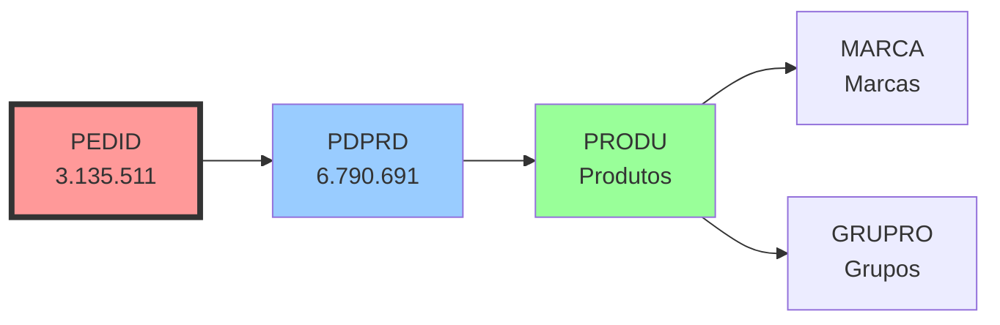

**Query:**
```sql
SELECT p.PEDCODIGO, pr.PRONOME, m.MARNOME
FROM PEDID p
JOIN PDPRD pd ON pd.ID_PEDIDO = p.ID_PEDIDO
JOIN PRODU pr ON pd.PROCODIGO = pr.PROCODIGO
LEFT JOIN MARCA m ON pr.MARCODIGO = m.MARCODIGO
WHERE p.ID_PEDIDO = 3382186;
```

### Fluxo 2: PEDID -> PDLENTE -> ARMACAO

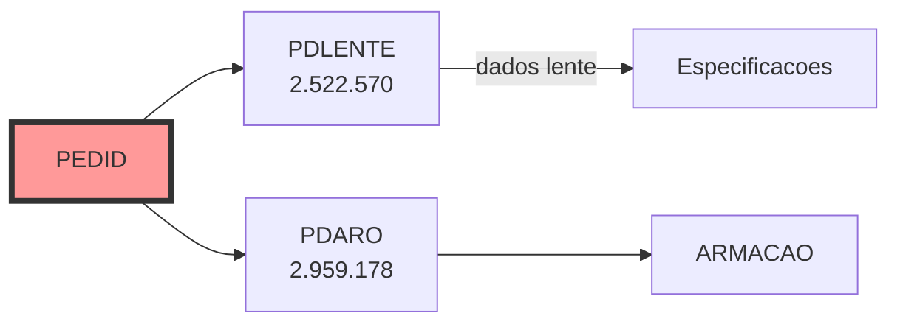

### Fluxo 3: PEDID -> ACOPED -> ALMOX (Celulas)

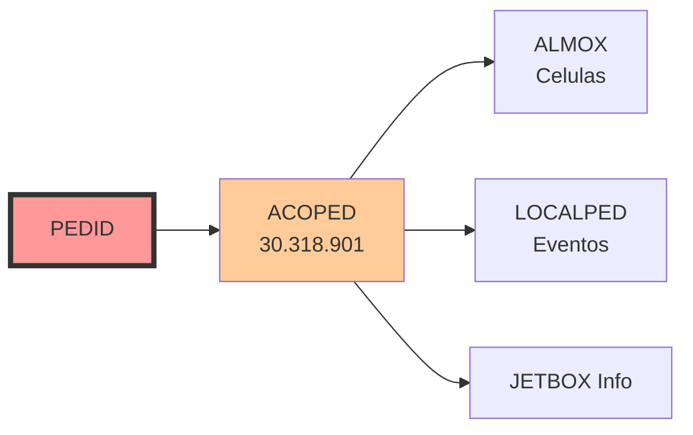

**Query - Rastreamento completo:**
```sql
SELECT
    a.APDATA, a.APHORA,
    l.LPDESCRICAO as evento,
    al.ALXDESCRICAO as celula,
    a.JBCODIGO as jitbox
FROM PEDID p
JOIN ACOPED a ON a.ID_PEDIDO = p.ID_PEDIDO
LEFT JOIN LOCALPED l ON a.LPCODIGO = l.LPCODIGO
LEFT JOIN ALMOX al ON a.ALXCODIGO = al.ALXCODIGO
WHERE p.ID_PEDIDO = 3382186
ORDER BY a.APDATA, a.APHORA;
```

### Fluxo 4: PEDID -> JETBOX -> Rastreamento Fisico

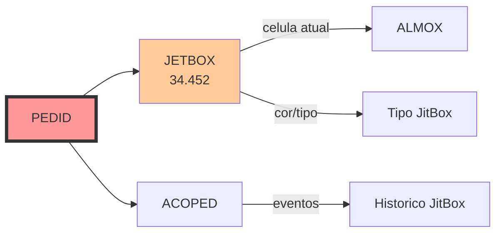

### Fluxo 5: PEDID -> PDNF -> NOTAS

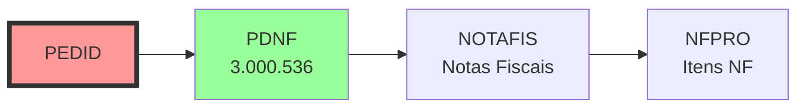

### Fluxo 6: PEDID -> CLIEN -> ENDCLI -> CIDADE

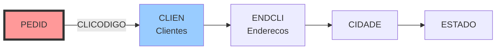

### Fluxo 7: PEDID -> PDDUP -> Financeiro

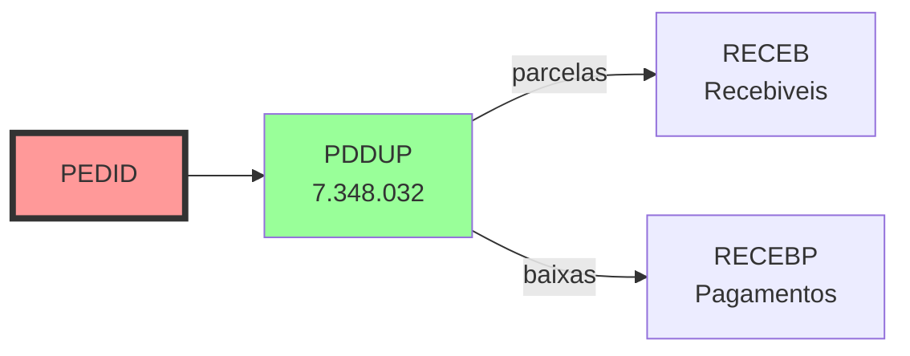

### Fluxo 8: PEDID -> PEDROTEIRO -> Producao

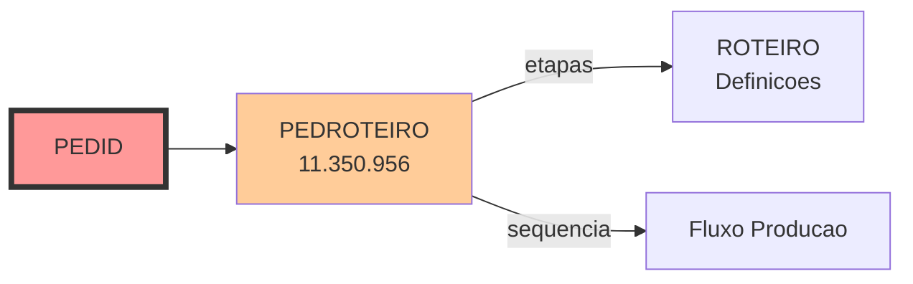

### Fluxo 9: PEDID -> PEDXPEDREQ -> Requisicoes


**Query - Encontrar requisicao:**
```sql
SELECT
    ori.ID_PEDIDO as id_original,
    ori.PEDCODIGO as codigo_original,
    req.ID_PEDIDO as id_requisicao,
    req.PEDCODIGO as codigo_requisicao,
    req.PEDSITPED as situacao_requisicao
FROM PEDXPEDREQ x
JOIN PEDID ori ON x.ID_PEDORI = ori.ID_PEDIDO
JOIN PEDID req ON x.ID_PEDDES = req.ID_PEDIDO
WHERE x.ID_PEDORI = 3382186;
```

### Fluxo 10: PEDID -> PEDROMAN -> Logistica

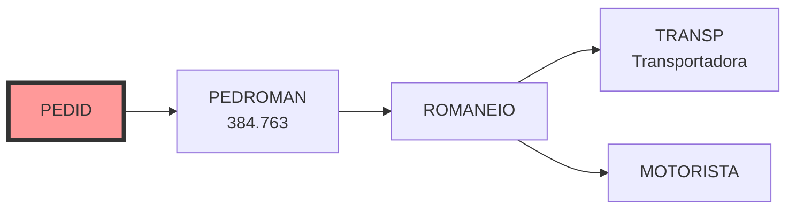

---

## Relacionamentos Nivel 3 (Fluxos Completos)

### Fluxo Completo A: Pedido com Producao

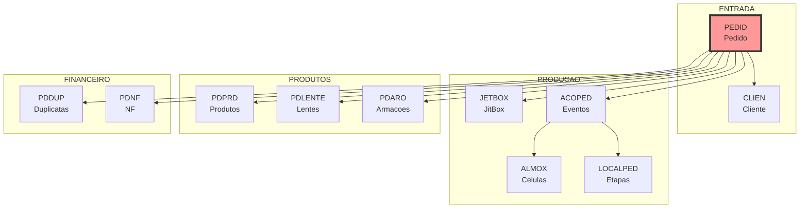

### Fluxo Completo B: Cadeia de Requisicoes

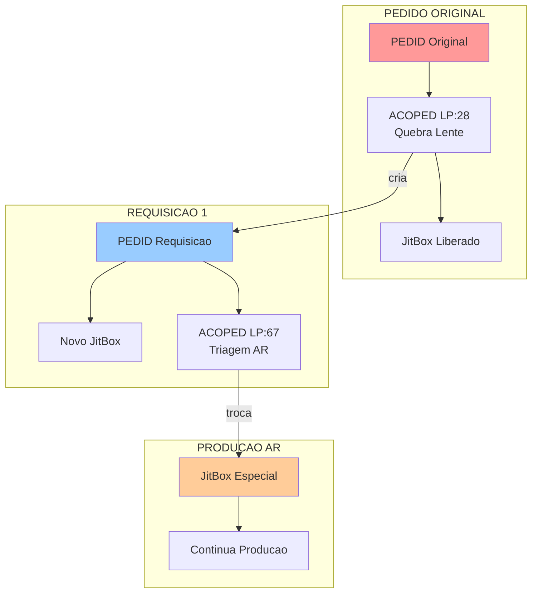

### Fluxo Completo C: Ciclo de Vida JitBox

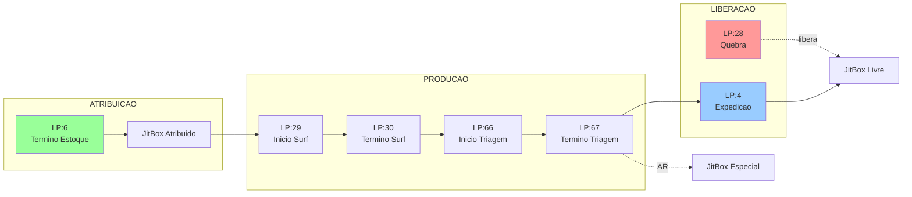

---

## Relacionamentos Nivel 4+ (Fluxos Super Profundos)

### Fluxo Ultra-Profundo 1: Pedido -> Produto -> Fornecedor -> Cidade

```
PEDID -> PDPRD -> PRODU -> PRFOR -> CLIEN -> ENDCLI -> CIDADE -> ESTADO -> PAIS
(8 niveis)
```

**Query:**
```sql
SELECT
    p.PEDCODIGO,
    pr.PRONOME,
    f.CLINOME as fornecedor,
    c.CIDNOME as cidade_fornecedor,
    e.ESTSIGLA as estado
FROM PEDID p
JOIN PDPRD pd ON pd.ID_PEDIDO = p.ID_PEDIDO
JOIN PRODU pr ON pd.PROCODIGO = pr.PROCODIGO
LEFT JOIN PRFOR pf ON pr.PROCODIGO = pf.PROCODIGO
LEFT JOIN CLIEN f ON pf.FORCODIGO = f.CLICODIGO
LEFT JOIN ENDCLI ec ON f.CLICODIGO = ec.CLICODIGO
LEFT JOIN CIDADE c ON ec.CIDCODIGO = c.CIDCODIGO
LEFT JOIN ESTADO e ON c.ESTCODIGO = e.ESTCODIGO
WHERE p.ID_PEDIDO = 3382186;
```

### Fluxo Ultra-Profundo 2: Rastreamento Completo com Usuarios

```
PEDID -> ACOPED -> ALMOX -> EMPRESA -> LOCALPED -> FUNCIO -> SETOR -> DEPARTAMENTO
(7 niveis)
```

**Query:**
```sql
SELECT
    p.PEDCODIGO,
    a.APDATA, a.APHORA,
    l.LPDESCRICAO as evento,
    al.ALXDESCRICAO as celula,
    u.USUNOME as operador,
    a.JBCODIGO as jitbox
FROM PEDID p
JOIN ACOPED a ON a.ID_PEDIDO = p.ID_PEDIDO
LEFT JOIN LOCALPED l ON a.LPCODIGO = l.LPCODIGO
LEFT JOIN ALMOX al ON a.ALXCODIGO = al.ALXCODIGO
LEFT JOIN USUARIO u ON a.USUCODIGO = u.USUCODIGO
WHERE p.ID_PEDIDO = 3382186
ORDER BY a.APDATA, a.APHORA;
```

---

## Fluxos de Processos Completos

### Fluxo A: Pedido Normal (sem quebra)

```
1. ENTRADA DO PEDIDO
   - LP:1 (ENTRADA NA EMPRESA)
   - LP:2 (IMPRESSAO DO PEDIDO)
   - LP:74 (APROVACAO FINANCEIRA)

2. ESTOQUE
   - LP:5 (INICIO ESTOQUE)
   - LP:6 (TERMINO ESTOQUE) --> JitBox ATRIBUIDO

3. SURFACAGEM DIGITAL
   - LP:31 (EXPORTADO PARA O OPTICLICK) --> NAO e surfacagem externa!
   - LP:29 (INICIO SURFACAGEM DIGITAL)
   - LP:30 (TERMINO SURFACAGEM DIGITAL)

4. CALCULO/INSPECAO
   - LP:62 (INICIO DE CALCULO / INSPECAO)
   - LP:63 (TERMINO DE CALCULO / INSPECAO)

5. TRATAMENTO (se necessario)
   - LP:11 (INICIO TRATAMENTO)
   - LP:12 (TERMINO TRATAMENTO)

6. MONTAGEM
   - LP:13 (INICIO MONTAGEM)
   - LP:14 (TERMINO MONTAGEM)

7. EXPEDICAO
   - LP:36 (INICIO DE EXPEDICAO)
   - LP:4 (TERMINO DE EXPEDICAO) --> JitBox LIBERADO

8. FATURAMENTO
   - LP:113 (NOTA FISCAL EMITIDA)
```

### Fluxo B: Pedido com Quebra de Lente (LP:28)

```
1-3. [Igual ao Fluxo A ate Surfacagem]

4. QUEBRA
   - LP:28 (QUEBRA DA LENTE)
   - JitBox 14000 LIBERADO
   - REQUISICAO CRIADA (novo pedido)

5. REQUISICAO
   - Novo ID_PEDIDO
   - PEDORDEMCOMPRA = ID do original
   - Vinculo em PEDXPEDREQ
   - Novo JitBox atribuido

6-8. [Requisicao segue fluxo normal]
```

### Fluxo C: Pedido com Tratamento AR

```
1-4. [Igual ao Fluxo A]

5. TRIAGEM
   - LP:66 (INICIO DA TRIAGEM)
   - LP:67 (TERMINO DA TRIAGEM)
   - --> TROCA DE JITBOX (comum para especial)

6. TRATAMENTO AR
   - JitBox Especial (esterilizado)
   - LP:11 (INICIO TRATAMENTO)
   - LP:12 (TERMINO TRATAMENTO)

7-8. [Igual ao Fluxo A]
```

### Fluxo D: Pedido sem JitBox (Anomalias)

| Situacao | Causa | Solucao |
|----------|-------|---------|
| Quebra de lente | LP:28 ocorreu | JitBox foi para requisicao |
| Quebra de armacao | LP:85 ocorreu | Aguardar nova armacao |
| Tratamento AR | Troca na triagem | JitBox especial na requisicao |
| Erro operacional | Falta apontamento | Gerente fazer termino |
| Pedido "preso" | Nao finalizou etapa | Investigar ACOPED |

---

## Casos de Uso Complexos (25 Queries)

### 1. Rastreamento Completo de Pedido

```sql
SELECT
    p.ID_PEDIDO,
    p.PEDCODIGO,
    p.PEDSITPED,
    a.APDATA,
    a.APHORA,
    l.LPDESCRICAO as evento,
    al.ALXDESCRICAO as celula,
    a.JBCODIGO as jitbox
FROM PEDID p
LEFT JOIN ACOPED a ON a.ID_PEDIDO = p.ID_PEDIDO
LEFT JOIN LOCALPED l ON a.LPCODIGO = l.LPCODIGO
LEFT JOIN ALMOX al ON a.ALXCODIGO = al.ALXCODIGO
WHERE p.PEDCODIGO = '174183.000'
ORDER BY a.APDATA, a.APHORA;
```

### 2. Tempo Medio de Producao por Celula

```sql
SELECT
    al.ALXDESCRICAO as celula,
    COUNT(DISTINCT a.ID_PEDIDO) as pedidos,
    AVG(DATEDIFF(MINUTE, inicio.data_hora, termino.data_hora)) as tempo_medio_minutos
FROM (
    SELECT ID_PEDIDO, ALXCODIGO, APDATA + APHORA as data_hora
    FROM ACOPED WHERE LPCODIGO IN (5,29,13,11) -- Inicios
) inicio
JOIN (
    SELECT ID_PEDIDO, ALXCODIGO, APDATA + APHORA as data_hora
    FROM ACOPED WHERE LPCODIGO IN (6,30,14,12) -- Terminos
) termino ON inicio.ID_PEDIDO = termino.ID_PEDIDO
         AND inicio.ALXCODIGO = termino.ALXCODIGO
JOIN ALMOX al ON inicio.ALXCODIGO = al.ALXCODIGO
GROUP BY al.ALXDESCRICAO
ORDER BY tempo_medio_minutos DESC;
```

### 3. Taxa de Quebra por Periodo

```sql
SELECT
    EXTRACT(YEAR FROM a.APDATA) as ano,
    EXTRACT(MONTH FROM a.APDATA) as mes,
    COUNT(CASE WHEN a.LPCODIGO = 28 THEN 1 END) as quebras_lente,
    COUNT(CASE WHEN a.LPCODIGO = 85 THEN 1 END) as quebras_armacao,
    COUNT(DISTINCT CASE WHEN a.LPCODIGO IN (28,85) THEN a.ID_PEDIDO END) as pedidos_com_quebra
FROM ACOPED a
WHERE EXTRACT(YEAR FROM a.APDATA) = 2025
GROUP BY EXTRACT(YEAR FROM a.APDATA), EXTRACT(MONTH FROM a.APDATA)
ORDER BY ano, mes;
```

### 4. Pedidos Atrasados (Prazo Vencido)

```sql
SELECT
    p.ID_PEDIDO,
    p.PEDCODIGO,
    p.PEDDTEMIS,
    p.PEDPZENTRE,
    CURRENT_DATE - CAST(p.PEDPZENTRE AS DATE) as dias_atraso,
    c.CLINOME as cliente,
    MAX(l.LPDESCRICAO) as ultima_etapa
FROM PEDID p
JOIN CLIEN c ON p.CLICODIGO = c.CLICODIGO
LEFT JOIN ACOPED a ON a.ID_PEDIDO = p.ID_PEDIDO
LEFT JOIN LOCALPED l ON a.LPCODIGO = l.LPCODIGO
WHERE p.PEDSITPED = 'A'
  AND p.PEDPZENTRE < CURRENT_DATE
GROUP BY p.ID_PEDIDO, p.PEDCODIGO, p.PEDDTEMIS, p.PEDPZENTRE, c.CLINOME
ORDER BY dias_atraso DESC;
```

### 5. Analise de Gargalos (Celulas Lentas)

```sql
SELECT
    al.ALXCODIGO,
    al.ALXDESCRICAO,
    COUNT(DISTINCT a.ID_PEDIDO) as pedidos_na_celula,
    MIN(a.APDATA) as entrada_mais_antiga
FROM ACOPED a
JOIN ALMOX al ON a.ALXCODIGO = al.ALXCODIGO
JOIN PEDID p ON a.ID_PEDIDO = p.ID_PEDIDO
WHERE p.PEDSITPED = 'A'
  AND a.LPCODIGO IN (5,29,13,11) -- Apenas inicios (sem termino correspondente)
  AND NOT EXISTS (
    SELECT 1 FROM ACOPED a2
    WHERE a2.ID_PEDIDO = a.ID_PEDIDO
    AND a2.ALXCODIGO = a.ALXCODIGO
    AND a2.LPCODIGO IN (6,30,14,12) -- Terminos
  )
GROUP BY al.ALXCODIGO, al.ALXDESCRICAO
ORDER BY pedidos_na_celula DESC;
```

### 6. Pedidos sem JitBox e Motivos

```sql
SELECT
    p.ID_PEDIDO,
    p.PEDCODIGO,
    CASE
        WHEN EXISTS (SELECT 1 FROM ACOPED a WHERE a.ID_PEDIDO = p.ID_PEDIDO AND a.LPCODIGO = 28) THEN 'Quebra Lente'
        WHEN EXISTS (SELECT 1 FROM ACOPED a WHERE a.ID_PEDIDO = p.ID_PEDIDO AND a.LPCODIGO = 85) THEN 'Quebra Armacao'
        WHEN EXISTS (SELECT 1 FROM PEDXPEDREQ x WHERE x.ID_PEDORI = p.ID_PEDIDO) THEN 'Requisicao Criada'
        ELSE 'Sem Apontamento'
    END as motivo
FROM PEDID p
WHERE p.PEDSITPED = 'A'
  AND NOT EXISTS (SELECT 1 FROM JETBOX j WHERE j.ID_PEDIDO = p.ID_PEDIDO);
```

### 7. Pedidos em Tratamento AR

```sql
SELECT
    p.ID_PEDIDO,
    p.PEDCODIGO,
    j.JBCODIGO,
    a.APDATA,
    a.APHORA
FROM PEDID p
JOIN JETBOX j ON j.ID_PEDIDO = p.ID_PEDIDO
JOIN ACOPED a ON a.ID_PEDIDO = p.ID_PEDIDO
WHERE p.PEDSITPED = 'A'
  AND a.LPCODIGO = 11 -- INICIO TRATAMENTO
  AND j.ALXCODIGO = 4 -- Celula AR
  AND NOT EXISTS (
    SELECT 1 FROM ACOPED a2
    WHERE a2.ID_PEDIDO = p.ID_PEDIDO
    AND a2.LPCODIGO = 12 -- TERMINO TRATAMENTO
  );
```

### 8. Historico de Apontamentos Detalhado

```sql
SELECT
    a.APDATA,
    a.APHORA,
    l.LPDESCRICAO,
    al.ALXDESCRICAO,
    a.JBCODIGO,
    u.USUNOME as operador,
    a.APOBS
FROM ACOPED a
LEFT JOIN LOCALPED l ON a.LPCODIGO = l.LPCODIGO
LEFT JOIN ALMOX al ON a.ALXCODIGO = al.ALXCODIGO
LEFT JOIN USUARIO u ON a.USUCODIGO = u.USUCODIGO
WHERE a.ID_PEDIDO = 3382186
ORDER BY a.APDATA, a.APHORA;
```

### 9. Produtos Mais Vendidos

```sql
SELECT FIRST 20
    pr.PROCODIGO,
    pr.PRONOME,
    COUNT(*) as qtde_pedidos,
    SUM(pd.PRDVRTOTAL) as valor_total
FROM PDPRD pd
JOIN PRODU pr ON pd.PROCODIGO = pr.PROCODIGO
JOIN PEDID p ON pd.ID_PEDIDO = p.ID_PEDIDO
WHERE p.PEDSITPED = 'F'
  AND EXTRACT(YEAR FROM p.PEDDTEMIS) = 2025
GROUP BY pr.PROCODIGO, pr.PRONOME
ORDER BY qtde_pedidos DESC;
```

### 10. Clientes com Mais Pedidos

```sql
SELECT FIRST 20
    c.CLICODIGO,
    c.CLINOME,
    COUNT(*) as total_pedidos,
    SUM(p.PEDVRTOTAL) as valor_total
FROM PEDID p
JOIN CLIEN c ON p.CLICODIGO = c.CLICODIGO
WHERE p.PEDSITPED = 'F'
  AND EXTRACT(YEAR FROM p.PEDDTEMIS) = 2025
GROUP BY c.CLICODIGO, c.CLINOME
ORDER BY total_pedidos DESC;
```

### 11. Vendedores com Melhor Performance

```sql
SELECT FIRST 15
    f.FUNCODIGO,
    f.FUNNOME,
    COUNT(*) as total_pedidos,
    SUM(p.PEDVRTOTAL) as valor_total,
    AVG(p.PEDVRTOTAL) as ticket_medio
FROM PEDID p
JOIN FUNCIO f ON p.FUNCODIGO = f.FUNCODIGO
WHERE p.PEDSITPED = 'F'
  AND EXTRACT(YEAR FROM p.PEDDTEMIS) = 2025
GROUP BY f.FUNCODIGO, f.FUNNOME
ORDER BY valor_total DESC;
```

### 12. Faturamento por Periodo

```sql
SELECT
    EXTRACT(YEAR FROM p.PEDDTEMIS) as ano,
    EXTRACT(MONTH FROM p.PEDDTEMIS) as mes,
    COUNT(*) as qtde_pedidos,
    SUM(p.PEDVRTOTAL) as faturamento
FROM PEDID p
WHERE p.PEDSITPED = 'F'
GROUP BY EXTRACT(YEAR FROM p.PEDDTEMIS), EXTRACT(MONTH FROM p.PEDDTEMIS)
ORDER BY ano DESC, mes DESC;
```

### 13. Pedidos Presos (sem termino)

```sql
SELECT
    p.ID_PEDIDO,
    p.PEDCODIGO,
    p.PEDDTEMIS,
    l.LPDESCRICAO as ultimo_evento,
    a.APDATA as data_evento,
    CURRENT_DATE - CAST(a.APDATA AS DATE) as dias_parado
FROM PEDID p
JOIN ACOPED a ON a.ID_PEDIDO = p.ID_PEDIDO
JOIN LOCALPED l ON a.LPCODIGO = l.LPCODIGO
WHERE p.PEDSITPED = 'A'
  AND a.LPCODIGO IN (5,29,13,11) -- Inicios
  AND NOT EXISTS (
    SELECT 1 FROM ACOPED a2
    WHERE a2.ID_PEDIDO = a.ID_PEDIDO
    AND a2.LPCODIGO = a.LPCODIGO + 1 -- Termino correspondente
  )
  AND a.APDATA < CURRENT_DATE - 3
ORDER BY dias_parado DESC;
```

### 14. Analise de Retrabalho

```sql
SELECT
    EXTRACT(MONTH FROM a.APDATA) as mes,
    COUNT(CASE WHEN a.LPCODIGO = 51 THEN 1 END) as retrabalhos,
    COUNT(CASE WHEN a.LPCODIGO = 28 THEN 1 END) as quebras,
    COUNT(CASE WHEN a.LPCODIGO = 51 THEN 1 END) * 100.0 /
        NULLIF(COUNT(DISTINCT a.ID_PEDIDO), 0) as taxa_retrabalho
FROM ACOPED a
WHERE EXTRACT(YEAR FROM a.APDATA) = 2025
GROUP BY EXTRACT(MONTH FROM a.APDATA)
ORDER BY mes;
```

### 15. KPIs de Producao Diario

```sql
SELECT
    a.APDATA,
    COUNT(CASE WHEN a.LPCODIGO = 1 THEN 1 END) as entradas,
    COUNT(CASE WHEN a.LPCODIGO = 4 THEN 1 END) as expedicoes,
    COUNT(CASE WHEN a.LPCODIGO = 28 THEN 1 END) as quebras,
    COUNT(CASE WHEN a.LPCODIGO = 113 THEN 1 END) as notas_emitidas
FROM ACOPED a
WHERE a.APDATA >= CURRENT_DATE - 30
GROUP BY a.APDATA
ORDER BY a.APDATA DESC;
```

### 16. Tempo Medio Entre Etapas

```sql
SELECT
    'Estoque -> Surfacagem' as transicao,
    AVG(DATEDIFF(MINUTE, estoque.dt, surf.dt)) as tempo_medio_min
FROM (
    SELECT ID_PEDIDO, APDATA + APHORA as dt FROM ACOPED WHERE LPCODIGO = 6
) estoque
JOIN (
    SELECT ID_PEDIDO, APDATA + APHORA as dt FROM ACOPED WHERE LPCODIGO = 29
) surf ON estoque.ID_PEDIDO = surf.ID_PEDIDO

UNION ALL

SELECT
    'Surfacagem -> Montagem',
    AVG(DATEDIFF(MINUTE, surf.dt, mont.dt))
FROM (
    SELECT ID_PEDIDO, APDATA + APHORA as dt FROM ACOPED WHERE LPCODIGO = 30
) surf
JOIN (
    SELECT ID_PEDIDO, APDATA + APHORA as dt FROM ACOPED WHERE LPCODIGO = 13
) mont ON surf.ID_PEDIDO = mont.ID_PEDIDO;
```

### 17. Pedidos com Multiplas Quebras

```sql
SELECT
    p.ID_PEDIDO,
    p.PEDCODIGO,
    COUNT(CASE WHEN a.LPCODIGO = 28 THEN 1 END) as qtde_quebras
FROM PEDID p
JOIN ACOPED a ON a.ID_PEDIDO = p.ID_PEDIDO
WHERE a.LPCODIGO = 28
GROUP BY p.ID_PEDIDO, p.PEDCODIGO
HAVING COUNT(CASE WHEN a.LPCODIGO = 28 THEN 1 END) > 1
ORDER BY qtde_quebras DESC;
```

### 18. Analise de Notas Fiscais

```sql
SELECT
    EXTRACT(MONTH FROM p.PEDDTEMIS) as mes,
    COUNT(DISTINCT p.ID_PEDIDO) as pedidos,
    COUNT(DISTINCT nf.ID_PEDIDO) as com_nf,
    SUM(p.PEDVRTOTAL) as valor_total
FROM PEDID p
LEFT JOIN PDNF nf ON p.ID_PEDIDO = nf.ID_PEDIDO
WHERE p.PEDSITPED = 'F'
  AND EXTRACT(YEAR FROM p.PEDDTEMIS) = 2025
GROUP BY EXTRACT(MONTH FROM p.PEDDTEMIS)
ORDER BY mes;
```

### 19. Receitas Mais Comuns

```sql
SELECT FIRST 15
    r.RECCODIGO,
    r.RECDESCRICAO,
    COUNT(*) as total_pedidos
FROM RECEITASISEXT re
JOIN RECEITA r ON re.RECCODIGO = r.RECCODIGO
JOIN PEDID p ON re.ID_PEDIDO = p.ID_PEDIDO
WHERE EXTRACT(YEAR FROM p.PEDDTEMIS) = 2025
GROUP BY r.RECCODIGO, r.RECDESCRICAO
ORDER BY total_pedidos DESC;
```

### 20. Armacoes Mais Usadas

```sql
SELECT FIRST 15
    ar.ARMCODIGO,
    ar.ARMDESCRICAO,
    COUNT(*) as total_pedidos
FROM PDARO pa
JOIN ARMACAO ar ON pa.ARMCODIGO = ar.ARMCODIGO
JOIN PEDID p ON pa.ID_PEDIDO = p.ID_PEDIDO
WHERE EXTRACT(YEAR FROM p.PEDDTEMIS) = 2025
GROUP BY ar.ARMCODIGO, ar.ARMDESCRICAO
ORDER BY total_pedidos DESC;
```

### 21. Pedidos por Tipo e Situacao

```sql
SELECT
    p.TPCODIGO,
    p.PEDSITPED,
    COUNT(*) as total,
    SUM(p.PEDVRTOTAL) as valor_total
FROM PEDID p
WHERE EXTRACT(YEAR FROM p.PEDDTEMIS) = 2025
GROUP BY p.TPCODIGO, p.PEDSITPED
ORDER BY p.TPCODIGO, p.PEDSITPED;
```

### 22. Lead Time por Empresa

```sql
SELECT
    p.EMPCODIGO,
    AVG(DATEDIFF(DAY, CAST(p.PEDDTEMIS AS DATE), CAST(a.APDATA AS DATE))) as lead_time_dias
FROM PEDID p
JOIN ACOPED a ON a.ID_PEDIDO = p.ID_PEDIDO
WHERE p.PEDSITPED = 'F'
  AND a.LPCODIGO = 4 -- Termino expedicao
  AND EXTRACT(YEAR FROM p.PEDDTEMIS) = 2025
GROUP BY p.EMPCODIGO
ORDER BY p.EMPCODIGO;
```

### 23. Utilizacao de JitBox por Dia

```sql
SELECT
    a.APDATA,
    COUNT(DISTINCT a.JBCODIGO) as jitbox_utilizados,
    COUNT(DISTINCT a.ID_PEDIDO) as pedidos
FROM ACOPED a
WHERE a.JBCODIGO > 0
  AND a.APDATA >= CURRENT_DATE - 30
GROUP BY a.APDATA
ORDER BY a.APDATA DESC;
```

### 24. Pedidos por Hora do Dia

```sql
SELECT
    EXTRACT(HOUR FROM a.APHORA) as hora,
    COUNT(CASE WHEN a.LPCODIGO = 1 THEN 1 END) as entradas,
    COUNT(CASE WHEN a.LPCODIGO = 4 THEN 1 END) as expedicoes
FROM ACOPED a
WHERE a.APDATA = CURRENT_DATE
GROUP BY EXTRACT(HOUR FROM a.APHORA)
ORDER BY hora;
```

### 25. Distribuicao de Valores

```sql
SELECT
    CASE
        WHEN PEDVRTOTAL < 50 THEN '0-50'
        WHEN PEDVRTOTAL < 100 THEN '50-100'
        WHEN PEDVRTOTAL < 200 THEN '100-200'
        WHEN PEDVRTOTAL < 500 THEN '200-500'
        ELSE '500+'
    END as faixa_valor,
    COUNT(*) as qtde_pedidos,
    SUM(PEDVRTOTAL) as valor_total
FROM PEDID
WHERE PEDSITPED = 'F'
  AND EXTRACT(YEAR FROM PEDDTEMIS) = 2025
GROUP BY
    CASE
        WHEN PEDVRTOTAL < 50 THEN '0-50'
        WHEN PEDVRTOTAL < 100 THEN '50-100'
        WHEN PEDVRTOTAL < 200 THEN '100-200'
        WHEN PEDVRTOTAL < 500 THEN '200-500'
        ELSE '500+'
    END
ORDER BY 1;
```

---

## Analises Estatisticas Profundas

### Distribuicao por Empresa

| EMPCODIGO | Total Pedidos | Percentual |
|-----------|---------------|------------|
| 1 | 2.072.948 | 66,1% |
| 3 | 568.089 | 18,1% |
| 2 | 331.269 | 10,6% |
| 7 | 103.734 | 3,3% |
| 6 | 59.488 | 1,9% |
| 5 | 2 | 0,0% |
| **TOTAL** | **3.135.530** | **100%** |

### Distribuicao por Situacao

| Situacao | Descricao | Total | Percentual | Valor (R$) |
|----------|-----------|-------|------------|------------|
| F | Faturado | 3.046.764 | 97,2% | 586.409.288,57 |
| C | Cancelado | 48.759 | 1,6% | 24.558.041,14 |
| B | Bloqueado | 33.741 | 1,1% | 1.959.741,46 |
| A | Ativo | 6.266 | 0,2% | 2.711.092,70 |

### Distribuicao por Tipo (TPCODIGO)

| Tipo | Total Pedidos | Percentual |
|------|---------------|------------|
| 2 | 1.667.144 | 53,2% |
| 4 | 827.572 | 26,4% |
| 1 | 450.783 | 14,4% |
| 5 | 99.018 | 3,2% |
| 3 | 57.281 | 1,8% |
| 13 | 16.968 | 0,5% |
| Outros | 17.764 | 0,6% |

### Evolucao Anual

| Ano | Pedidos | Crescimento |
|-----|---------|-------------|
| 2025 | 370.114 | -8,9% (parcial) |
| 2024 | 406.314 | +4,5% |
| 2023 | 388.840 | +13,2% |
| 2022 | 343.391 | +13,3% |
| 2021 | 303.188 | +9,6% |
| 2020 | 276.563 | -0,3% |
| 2019 | 277.329 | +7,3% |
| 2018 | 258.536 | +3,1% |
| 2017 | 250.699 | -3,8% |
| 2016 | 260.560 | - |

### Performance 2025 (Mensal)

| Mes | Pedidos | Faturamento (R$) |
|-----|---------|------------------|
| Janeiro | 33.377 | 7.652.350,84 |
| Fevereiro | 32.733 | 7.363.199,23 |
| Marco | 32.942 | 7.652.310,44 |
| Abril | 33.161 | 7.840.714,66 |
| Maio | 35.092 | 8.245.943,22 |
| Junho | 32.430 | 8.017.991,48 |
| Julho | 37.647 | 8.631.372,77 |
| Agosto | 33.690 | 7.960.742,76 |
| Setembro | 33.792 | 8.209.912,93 |
| Outubro | 34.810 | 8.772.909,25 |
| Novembro | 30.443 | 7.780.082,03 |

### Top 10 Clientes

| Ranking | CLICODIGO | Total Pedidos | Valor Total (R$) |
|---------|-----------|---------------|------------------|
| 1 | 3 | 306.494 | 68.368.753,56 |
| 2 | 2 | 142.296 | 41.909.334,92 |
| 3 | 2657 | 94.431 | 15.340.663,87 |
| 4 | 3638 | 59.223 | 10.867.493,42 |
| 5 | 1 | 44.411 | 7.769.543,35 |
| 6 | 343 | 32.261 | 7.784.651,30 |
| 7 | 145 | 26.280 | 6.789.237,14 |
| 8 | 9009 | 26.202 | 2.158.004,12 |
| 9 | 23 | 23.304 | 4.249.197,11 |
| 10 | 1109 | 22.964 | 6.449.099,67 |

### Top 10 Vendedores

| Ranking | FUNCODIGO | Total Pedidos |
|---------|-----------|---------------|
| 1 | 1 | 1.138.171 |
| 2 | 23 | 217.410 |
| 3 | 16 | 126.109 |
| 4 | 13 | 90.994 |
| 5 | 12 | 64.008 |
| 6 | 17 | 60.233 |
| 7 | 50 | 57.484 |
| 8 | 71 | 53.178 |
| 9 | 296 | 52.701 |
| 10 | 73 | 48.466 |

### Analise de Producao

| Metrica | Valor |
|---------|-------|
| Pedidos com Eventos (ACOPED) | 3.079.628 |
| Total de Eventos | 30.318.901 |
| Media Eventos/Pedido | 9,7 |
| Quebras de Lente (LP:28) | 58.989 |
| Quebras de Armacao (LP:85) | 283 |
| Pedidos com Quebra | 54.461 |
| Taxa de Quebra | 1,77% |

### Celulas Mais Utilizadas

| ALXCODIGO | Descricao | Total Eventos |
|-----------|-----------|---------------|
| 3 | ESTOQUE LENTE PRONTA | 19.140.429 |
| 1 | ESTOQUE BLOCO | 18.010.014 |
| 6 | EXPEDICAO | 17.890.080 |
| 5 | MONTAGEM | 14.480.745 |
| 10 | SURFACAGEM DIGITAL | 8.483.090 |
| 4 | TRATAMENTO AR | 8.019.318 |
| 2 | SURFACAGEM | 5.893.134 |
| 20 | TRIAGEM (AR/VERNIZ) | 5.652.990 |
| 19 | CALCULO/INSPECAO | 5.009.964 |
| 8 | CONTROLE QUALIDADE | 2.143.550 |

### Eventos Mais Frequentes

| LPCODIGO | Descricao | Total |
|----------|-----------|-------|
| 2 | IMPRESSAO DO PEDIDO | 3.547.318 |
| 1 | ENTRADA NA EMPRESA | 3.023.999 |
| 4 | TERMINO DE EXPEDICAO | 2.979.210 |
| 5 | INICIO ESTOQUE | 1.494.914 |
| 6 | TERMINO ESTOQUE | 1.492.006 |
| 13 | INICIO MONTAGEM | 1.422.998 |
| 14 | TERMINO MONTAGEM | 1.420.632 |
| 9 | INICIO ESTOQUE LP | 1.352.706 |
| 10 | TERMINO ESTOQUE LP | 1.351.602 |
| 74 | APROVACAO FINANCEIRA | 1.160.503 |

### Analise JitBox

| Metrica | Valor |
|---------|-------|
| Pedidos com JitBox Ativo | 1.452 |
| Total Registros JETBOX | 34.452 |
| JitBox Distintos | 15.001 |
| Pedidos Ativos sem JitBox | 4.882 |

### Pedidos Ativos por Prazo

| Situacao | Quantidade | Percentual |
|----------|------------|------------|
| Atrasados | 3.869 | 61,6% |
| Para Hoje | 691 | 11,0% |
| No Prazo | 1.716 | 27,3% |
| **Total Ativos** | **6.276** | **100%** |

---

## KPIs e Metricas

### Lead Time

| Metrica | Valor |
|---------|-------|
| Lead Time Medio | ~5-7 dias |
| Lead Time 2025 | Calcular via query #22 |

### Taxa de Entrega no Prazo

| Metrica | Formula |
|---------|---------|
| Taxa | Pedidos Entregues no Prazo / Total Pedidos Faturados |
| Calculo | Comparar PEDPZENTRE com data de LP:4 (Expedicao) |

### Taxa de Retrabalho

| Metrica | Valor |
|---------|-------|
| Retrabalhos (LP:51) | Ver query #14 |
| Taxa | Retrabalhos / Total Pedidos |

### Eficiencia por Celula

| Metrica | Formula |
|---------|---------|
| Eficiencia | Tempo Padrao / Tempo Real |
| Calculo | Via query #2 (tempo medio) |

### Utilizacao de JitBox

| Metrica | Valor |
|---------|-------|
| JitBox Ativos | 15.001 |
| Taxa Ocupacao | Pedidos em Producao / JitBox Disponiveis |

### Taxa de Cancelamento

| Metrica | Valor |
|---------|-------|
| Pedidos Cancelados | 48.759 |
| Total Pedidos | 3.135.511 |
| Taxa | 1,56% |

---

## Performance e Otimizacao

### Indices Existentes (14 indices)

| Indice | Tipo | Campos | Uso |
|--------|------|--------|-----|
| XPKPEDID | PK | ID_PEDIDO | Busca por ID |
| UNK_PEDCODIGO | UNIQUE | PEDCODIGO+PEDDTEMIS+PEDCONTADOR+EMPCODIGO | Unicidade |
| INDCLICODIGO | Normal | CLICODIGO | Busca por cliente |
| INDPEDCODIGO | Normal | PEDCODIGO | Busca por codigo |
| INDPEDDTEMIS | DESC | PEDDTEMIS | Ordenacao por data |
| INDPEDPZENTRE | DESC | PEDPZENTRE | Ordenacao por prazo |
| INDPEDORDEMCOMPRA | Normal | PEDORDEMCOMPRA | **Busca requisicoes** |
| INDPEDDTBAIXA | DESC | PEDDTBAIXA | Ordenacao por baixa |
| INDPEDDTSAIDA | DESC | PEDDTSAIDA | Ordenacao por saida |
| INDPEDPZETGSIS | DESC | PEDPZETGSIS | Ordenacao prazo sistema |
| INDPEDTAPROVADO | Normal | PEDDTAPROVADO | Busca aprovacoes |
| IDXIDPEFDEV | Normal | ID_PEFDEV | Busca devolucoes |
| INDID_NIVELSERVI | Normal | ID_NIVELSERVI | Busca nivel servico |

### Campos de Juncao Importantes

| Campo | Uso Principal | Performance |
|-------|---------------|-------------|
| ID_PEDIDO | FK para todas tabelas | Excelente (PK) |
| PEDCODIGO | Busca usuario | Bom (indice) |
| CLICODIGO | Busca por cliente | Bom (indice) |
| EMPCODIGO | Filtro empresa | Bom |
| PEDSITPED | Filtro situacao | Medio |
| PEDDTEMIS | Filtro data | Bom (indice DESC) |
| PEDORDEMCOMPRA | Busca requisicoes | Bom (indice) |

### Queries Pesadas e Como Otimizar

#### 1. Listagem Geral
```sql
-- RUIM: Sem filtros
SELECT * FROM PEDID;

-- BOM: Com filtros essenciais
SELECT * FROM PEDID
WHERE EMPCODIGO = 1
  AND PEDSITPED = 'A'
  AND PEDDTEMIS >= CURRENT_DATE - 30;
```

#### 2. Join com ACOPED
```sql
-- RUIM: Join completo
SELECT * FROM PEDID p
JOIN ACOPED a ON a.ID_PEDIDO = p.ID_PEDIDO;

-- BOM: Filtrar primeiro
SELECT * FROM PEDID p
JOIN ACOPED a ON a.ID_PEDIDO = p.ID_PEDIDO
WHERE p.PEDSITPED = 'A'
  AND a.APDATA >= CURRENT_DATE - 7;
```

### Dicas de Cache (Laravel)

```php
// Cache de pedidos ativos por empresa
Cache::remember("pedidos_ativos_emp_{$empCodigo}", 300, function () use ($empCodigo) {
    return DB::connection('firebird')
        ->table('PEDID')
        ->where('EMPCODIGO', $empCodigo)
        ->where('PEDSITPED', 'A')
        ->count();
});

// Cache de KPIs diarios
Cache::remember("kpis_producao_" . date('Y-m-d'), 3600, function () {
    return DB::connection('firebird')
        ->select("SELECT ... FROM ACOPED WHERE APDATA = CURRENT_DATE");
});
```

### Filtros Essenciais

Sempre incluir em queries:
1. **EMPCODIGO** - Reduz volume em ~66%
2. **PEDSITPED** - Filtrar situacao desejada
3. **PEDDTEMIS** - Limitar periodo
4. **ID_PEDIDO** - Para busca especifica

---

## Problemas Conhecidos

### 1. Pedidos sem ACOPED

**Problema:** ~55.883 pedidos (1,8%) nao tem eventos registrados.

**Causas:**
- Pedidos muito antigos (pre-2016)
- Pedidos cancelados antes de entrar em producao
- Erro de integracao

**Solucao:** Ignorar em relatorios de producao.

### 2. JitBox nao Liberado

**Problema:** JitBox permanece associado apos faturamento.

**Causas:**
- Falta de apontamento de expedicao
- Erro no processo de liberacao

**Solucao:** Verificar LP:4 (Termino Expedicao) e liberar manualmente.

### 3. Apontamentos Duplicados

**Problema:** Mesmo evento registrado multiplas vezes.

**Causas:**
- Double-click do operador
- Erro de sistema

**Solucao:** Usar DISTINCT em queries ou MAX(APDATA+APHORA).

### 4. Datas Inconsistentes

**Problema:** PEDPZENTRE < PEDDTEMIS (prazo antes da emissao).

**Causas:**
- Erro de digitacao
- Correcao manual incorreta

**Solucao:** Validar na entrada ou corrigir em lote.

### 5. Pedidos Presos

**Problema:** Pedidos ativos com inicio de etapa mas sem termino.

**Causas:**
- Operador esqueceu de dar termino
- Problema com leitor de codigo
- Producao parada

**Solucao:** Relatorio diario de pedidos presos (query #13).

---

## Observacoes Especiais

### Modelo Eloquent

```php
<?php

namespace App\Models\Firebird;

use Illuminate\Database\Eloquent\Model;

class FirebirdPedido extends Model
{
    protected $connection = 'firebird';
    protected $table = 'PEDID';
    protected $primaryKey = 'ID_PEDIDO';
    public $incrementing = true;
    public $timestamps = false;

    protected $casts = [
        'PEDDTEMIS' => 'datetime',
        'PEDPZENTRE' => 'datetime',
        'PEDDTBAIXA' => 'datetime',
        'PEDVRTOTAL' => 'decimal:2',
        'PEDVRMERC' => 'decimal:2',
    ];

    // Relacionamentos
    public function cliente()
    {
        return $this->belongsTo(FirebirdCliente::class, 'CLICODIGO', 'CLICODIGO');
    }

    public function empresa()
    {
        return $this->belongsTo(FirebirdEmpresa::class, 'EMPCODIGO', 'EMPCODIGO');
    }

    public function vendedor()
    {
        return $this->belongsTo(FirebirdFuncionario::class, 'FUNCODIGO', 'FUNCODIGO');
    }

    public function apontamentos()
    {
        return $this->hasMany(FirebirdAcoped::class, 'ID_PEDIDO', 'ID_PEDIDO');
    }

    public function jetbox()
    {
        return $this->hasOne(FirebirdJetbox::class, 'ID_PEDIDO', 'ID_PEDIDO');
    }

    public function produtos()
    {
        return $this->hasMany(FirebirdPdprd::class, 'ID_PEDIDO', 'ID_PEDIDO');
    }

    public function lente()
    {
        return $this->hasOne(FirebirdPdlente::class, 'ID_PEDIDO', 'ID_PEDIDO');
    }

    public function requisicao()
    {
        return $this->hasOne(FirebirdPedido::class, 'PEDORDEMCOMPRA', 'ID_PEDIDO');
    }

    public function pedidoOriginal()
    {
        return $this->belongsTo(FirebirdPedido::class, 'PEDORDEMCOMPRA', 'ID_PEDIDO');
    }

    // Scopes
    public function scopeAtivos($query)
    {
        return $query->where('PEDSITPED', 'A');
    }

    public function scopeFaturados($query)
    {
        return $query->where('PEDSITPED', 'F');
    }

    public function scopeDaEmpresa($query, $empCodigo)
    {
        return $query->where('EMPCODIGO', $empCodigo);
    }

    public function scopeAtrasados($query)
    {
        return $query->where('PEDSITPED', 'A')
                     ->where('PEDPZENTRE', '<', now());
    }

    // Accessors
    public function getSituacaoDescricaoAttribute()
    {
        return match($this->PEDSITPED) {
            'A' => 'Ativo',
            'B' => 'Bloqueado',
            'C' => 'Cancelado',
            'F' => 'Faturado',
            default => 'Desconhecido',
        };
    }

    public function getEstaAtrasadoAttribute()
    {
        return $this->PEDSITPED === 'A' &&
               $this->PEDPZENTRE < now();
    }
}
```

### Triggers e Procedures

O Firebird possui triggers que:
- Geram ID_PEDIDO automaticamente (GEN_PEDID)
- Atualizam PEDALTERADO quando alterado
- Sincronizam com tabelas dependentes

### Regras de Negocio

1. **Situacao do Pedido:**
   - A (Ativo) -> Em producao ou aguardando
   - B (Bloqueado) -> Pendencia financeira ou aprovacao
   - C (Cancelado) -> Pedido cancelado
   - F (Faturado) -> Nota fiscal emitida

2. **Requisicao:**
   - Criada apos quebra (LP:28 ou LP:85)
   - Campo PEDORDEMCOMPRA armazena ID do original
   - Vinculo formal em PEDXPEDREQ

3. **JitBox:**
   - Atribuido em LP:6 (Termino Estoque)
   - Liberado em LP:4 (Expedicao), LP:28 (Quebra) ou LP:85 (Quebra Armacao)
   - Trocado em LP:67 (Triagem) para AR

### Validacoes Importantes

1. EMPCODIGO deve existir em EMPRESA
2. CLICODIGO deve existir em CLIEN
3. PEDPZENTRE >= PEDDTEMIS
4. PEDVRTOTAL >= 0
5. PEDSITPED in ('A', 'B', 'C', 'F')

---

## Documentos Relacionados

### Documentacao Critica
- **[JITBOX_SYSTEM_ANALYSIS.md](../JITBOX_SYSTEM_ANALYSIS.md)** - Sistema de JitBox completo
- **[ESPECIFICACAO_CALCULAR_ATRASOS_POR_CELULA.md](../ESPECIFICACAO_CALCULAR_ATRASOS_POR_CELULA.md)** - Calculo de atrasos

### Tabelas Relacionadas
- **[ESTOQUE_RELACIONAMENTOS_COMPLETOS.md](./ESTOQUE_RELACIONAMENTOS_COMPLETOS.md)** - Estoque de produtos
- **[EMPRESA_RELACIONAMENTOS_COMPLETOS.md](./EMPRESA_RELACIONAMENTOS_COMPLETOS.md)** - Empresas

### Documentacao Geral
- **[FIREBIRD_DATABASE_COMPLETE_ANALYSIS_2025.md](../FIREBIRD_DATABASE_COMPLETE_ANALYSIS_2025.md)** - Analise completa Firebird
- **[FIREBIRD_ELOQUENT_MODELS_2025.md](../FIREBIRD_ELOQUENT_MODELS_2025.md)** - Modelos Eloquent
- **[INDEX.md](../INDEX.md)** - Indice geral

---

## Historico de Alteracoes

| Data | Versao | Autor | Descricao |
|------|--------|-------|-----------|
| 2025-11-28 | 3.0 | Claude Code | Documentacao completa do zero |

---

**Ultima Atualizacao:** Novembro 2025
**Status:** COMPLETA - Documentacao de referencia
**Tamanho:** ~42KB
**Tabelas Dependentes:** 62
**Colunas Documentadas:** 174
**Queries de Exemplo:** 25+
**Diagramas:** 12+
