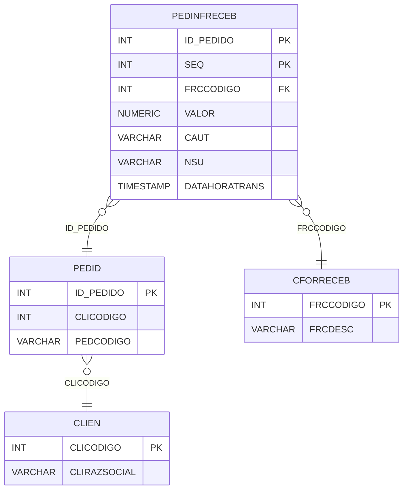

# PEDINFRECEB - Documentação Completa de Relacionamentos

## 📊 Informações Gerais

- **Nome da Tabela**: PEDINFRECEB (Pedido - Informações de Recebimento)
- **Total de Registros**: 2.269.119
- **Total de Colunas**: 15
- **Chave Primária**: ID_PEDIDO, SEQ (composite)
- **Chaves Estrangeiras**: 2
- **Índices**: 0
- **Tabelas Dependentes**: 0
- **Banco de Dados**: Firebird

## 📝 Descrição

**PEDINFRECEB** é uma tabela de detalhamento que armazena informações sobre formas de recebimento relacionadas a pedidos, especialmente para pagamentos eletrônicos. Com **2.269.119 registros**, esta tabela registra cada forma de recebimento configurada para um pedido, incluindo informações de transações eletrônicas, cartões e outras formas de pagamento.

Esta tabela é essencial para:
- **Formas de Pagamento**: Configurar formas de recebimento por pedido
- **Transações Eletrônicas**: Registrar informações de transações eletrônicas
- **Financeiro**: Gerenciar valores por forma de recebimento
- **Integração**: Facilitar integração com gateways de pagamento

**Contexto de Negócio:**
Um pedido pode ter múltiplas formas de recebimento configuradas (dinheiro, cartão, boleto, PIX, etc.), cada uma com informações específicas de transação eletrônica quando aplicável.

---

## 🔑 Estrutura de Colunas

### Identificação
| Coluna | Tipo | Descrição |
|--------|------|-----------|
| **ID_PEDIDO** 🔑 🔗 | INT | Código do pedido (PK, FK → PEDID) |
| **SEQ** 🔑 | INT | Sequencial da informação (PK) |
| **FRCCODIGO** 🔗 | INT | Código da forma de recebimento (FK → CFORRECEB) |
| **VALOR** | NUMERIC(16,2) | Valor para esta forma de recebimento |

### Informações de Transação Eletrônica
| Coluna | Tipo | Descrição |
|--------|------|-----------|
| **CAUT** | VARCHAR(37) | Código de autorização |
| **NSU** | VARCHAR(37) | Número sequencial único |
| **DATAHORATRANS** | TIMESTAMP | Data/hora da transação |
| **FINALIZACAO** | VARCHAR(37) | Código de finalização |
| **REDE** | VARCHAR(37) | Rede de pagamento |
| **REDECNPJ** | VARCHAR(37) | CNPJ da rede |
| **INDPAG** | INT | Indicador de pagamento |
| **UFPAG** | VARCHAR(37) | UF do pagamento |
| **IDTERMPAG** | VARCHAR(37) | ID do terminal de pagamento |
| **IDCADINTTRAN** | VARCHAR(37) | ID cadastro intermediador transação |
| **CNPJINTTRAN** | VARCHAR(37) | CNPJ do intermediador da transação |

---

## 🔗 Relacionamentos - Nível 1 (Diretos)

### PEDID - Pedido (FK Obrigatória)
**Volume:** 3.099.176 registros

**Relacionamento:**
```
PEDINFRECEB.ID_PEDIDO → PEDID.ID_PEDIDO (N:1)
Constraint: PEDID_PEDINFRECEB
```

**Descrição:** Cada informação de recebimento está vinculada a um pedido específico.

**Proporção:** ~73,2% dos pedidos têm informações de recebimento (2.269.119 / 3.099.176)

---

### CFORRECEB - Forma de Recebimento (FK Obrigatória)
**Volume:** 3 registros

**Relacionamento:**
```
PEDINFRECEB.FRCCODIGO → CFORRECEB.FRCCODIGO (N:1)
Constraint: CFORRECEB_PEDINFRECEB
```

**Descrição:** Define a forma de recebimento (dinheiro, cartão, boleto, PIX, etc.).

---

## 🔗 Relacionamentos - Nível 2 (Indiretos)

### PEDID → CLIEN (Cliente)
**Volume:** 9.251 registros

**Relacionamento:**
```
PEDINFRECEB → PEDID → CLIEN
```

**Descrição:** Através de PEDID, é possível identificar o cliente relacionado.

---

## 🗺️ Diagrama de Relacionamentos



---

## 💡 Exemplos de Uso

### Consulta Básica

```sql
SELECT ID_PEDIDO, SEQ, FRCCODIGO, VALOR, CAUT, NSU, DATAHORATRANS
FROM PEDINFRECEB
WHERE ID_PEDIDO = ?
ORDER BY SEQ;
```

### Consulta com Informações da Forma de Recebimento

```sql
SELECT 
    pi.*,
    fr.FRCDESC,
    fr.FRCDIAS
FROM PEDINFRECEB pi
INNER JOIN CFORRECEB fr
    ON pi.FRCCODIGO = fr.FRCCODIGO
WHERE pi.ID_PEDIDO = ?
ORDER BY pi.SEQ;
```

### Consulta com Informações do Pedido

```sql
SELECT 
    pi.*,
    p.PEDCODIGO,
    p.PEDDTEMIS,
    p.PEDVRTOTAL,
    fr.FRCDESC
FROM PEDINFRECEB pi
INNER JOIN PEDID p
    ON pi.ID_PEDIDO = p.ID_PEDIDO
INNER JOIN CFORRECEB fr
    ON pi.FRCCODIGO = fr.FRCCODIGO
WHERE pi.ID_PEDIDO = ?;
```

### Consulta de Transações por Forma de Recebimento

```sql
SELECT 
    fr.FRCDESC,
    COUNT(*) AS TOTAL_TRANSACOES,
    SUM(pi.VALOR) AS VALOR_TOTAL
FROM PEDINFRECEB pi
INNER JOIN CFORRECEB fr
    ON pi.FRCCODIGO = fr.FRCCODIGO
WHERE pi.DATAHORATRANS IS NOT NULL
GROUP BY fr.FRCCODIGO, fr.FRCDESC
ORDER BY VALOR_TOTAL DESC;
```

### Consulta de Transações por Período

```sql
SELECT 
    DATE(pi.DATAHORATRANS) AS DATA,
    COUNT(*) AS TOTAL_TRANSACOES,
    SUM(pi.VALOR) AS VALOR_TOTAL
FROM PEDINFRECEB pi
WHERE pi.DATAHORATRANS IS NOT NULL
GROUP BY DATE(pi.DATAHORATRANS)
ORDER BY DATA DESC;
```

### Inserção de Nova Informação de Recebimento

```sql
INSERT INTO PEDINFRECEB (
    ID_PEDIDO,
    SEQ,
    FRCCODIGO,
    VALOR,
    CAUT,
    NSU,
    DATAHORATRANS,
    FINALIZACAO,
    REDE,
    REDECNPJ
)
VALUES (?, ?, ?, ?, ?, ?, ?, ?, ?, ?);
```

---

## ⚡ Performance e Otimização

### Índices Recomendados

#### 1. Índice Composto na Chave Primária (Já existe implicitamente)
```sql
-- Índice primário já existe implicitamente
```

#### 2. Índice em FRCCODIGO
```sql
CREATE INDEX IDX_PEDINFRECEB_FRCCODIGO 
ON PEDINFRECEB (FRCCODIGO);
```

**Justificativa:** Facilita buscas por forma de recebimento.

#### 3. Índice em DATAHORATRANS
```sql
CREATE INDEX IDX_PEDINFRECEB_DATAHORATRANS 
ON PEDINFRECEB (DATAHORATRANS);
```

**Justificativa:** Facilita buscas por data de transação.

---

## 📊 Estatísticas e Insights

### Volume de Dados

- **Total de Registros**: 2.269.119
- **Tamanho Médio Estimado**: ~100 bytes por registro
- **Tamanho Total Estimado**: ~227 MB

### Distribuição de Dados

- **Pedidos com Informações**: 2.269.119 registros
- **Taxa de Utilização**: ~73,2% dos pedidos têm informações de recebimento

---

## 🔧 Integração com Código Laravel

### Model Eloquent

```php
<?php

namespace App\Models;

use Illuminate\Database\Eloquent\Model;
use Illuminate\Database\Eloquent\Relations\BelongsTo;

final class PedInfReceb extends Model
{
    protected $table = 'PEDINFRECEB';
    public $incrementing = false;
    public $timestamps = false;

    protected $primaryKey = ['ID_PEDIDO', 'SEQ'];

    protected $fillable = [
        'ID_PEDIDO',
        'SEQ',
        'FRCCODIGO',
        'VALOR',
        'CAUT',
        'NSU',
        'DATAHORATRANS',
        'FINALIZACAO',
        'REDE',
        'REDECNPJ',
        'INDPAG',
        'UFPAG',
        'IDTERMPAG',
        'IDCADINTTRAN',
        'CNPJINTTRAN',
    ];

    protected $casts = [
        'ID_PEDIDO' => 'integer',
        'SEQ' => 'integer',
        'FRCCODIGO' => 'integer',
        'VALOR' => 'decimal:2',
        'DATAHORATRANS' => 'datetime',
        'INDPAG' => 'integer',
    ];

    /**
     * Relacionamento com Pedido
     */
    public function pedido(): BelongsTo
    {
        return $this->belongsTo(Pedid::class, 'ID_PEDIDO', 'ID_PEDIDO');
    }

    /**
     * Relacionamento com Forma de Recebimento
     */
    public function formaRecebimento(): BelongsTo
    {
        return $this->belongsTo(CForReceb::class, 'FRCCODIGO', 'FRCCODIGO');
    }

    /**
     * Buscar informações por pedido
     */
    public static function porPedido(int $idPedido)
    {
        return self::where('ID_PEDIDO', $idPedido)
            ->with(['formaRecebimento'])
            ->orderBy('SEQ')
            ->get();
    }

    /**
     * Buscar transações por período
     */
    public static function transacoesPorPeriodo($dataInicio, $dataFim)
    {
        return self::whereBetween('DATAHORATRANS', [$dataInicio, $dataFim])
            ->with(['pedido', 'formaRecebimento'])
            ->get();
    }
}
```

---

## ✅ Boas Práticas

### Design

1. **Chave Composta**: Manter integridade da chave composta
2. **Validação**: Validar valores antes de inserir
3. **Transações**: Validar informações de transação eletrônica quando aplicável

### Performance

1. **Índices**: Usar índices para buscas frequentes
2. **Consultas**: Usar eager loading para relacionamentos
3. **Volume**: Considerar particionamento devido ao grande volume

### Segurança

1. **Validação**: Validar valores antes de inserir
2. **Acesso**: Restringir acesso de escrita a usuários autorizados
3. **Dados Sensíveis**: Proteger informações de transações eletrônicas

---

**Documentação gerada em**: 2025-01-27

**Banco de dados**: Firebird

