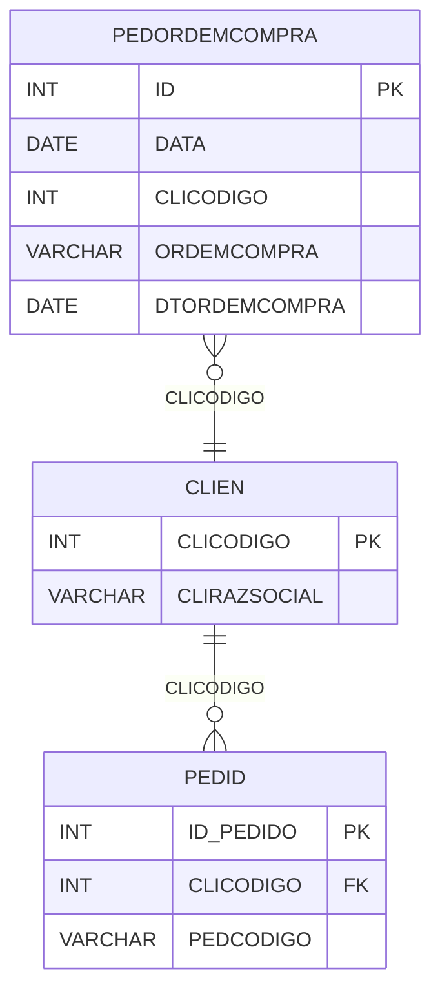

# PEDORDEMCOMPRA - Documentação Completa de Relacionamentos

## 📊 Informações Gerais

- **Nome da Tabela**: PEDORDEMCOMPRA (Pedido - Ordem de Compra)
- **Total de Registros**: 122.821
- **Total de Colunas**: 5
- **Chave Primária**: ID
- **Chaves Estrangeiras**: 0 (relacionamentos lógicos)
- **Índices**: 1
- **Tabelas Dependentes**: 0
- **Banco de Dados**: Firebird

## 📝 Descrição

**PEDORDEMCOMPRA** é uma tabela que armazena informações sobre ordens de compra relacionadas a pedidos. Com **122.821 registros**, esta tabela registra ordens de compra de clientes, permitindo rastrear quando um pedido está vinculado a uma ordem de compra específica.

Esta tabela é essencial para:
- **Rastreamento**: Rastrear ordens de compra de clientes
- **Conciliação**: Facilitar conciliação entre pedidos e ordens de compra
- **Relatórios**: Gerar relatórios de pedidos por ordem de compra
- **Auditoria**: Manter histórico de relacionamentos

**Contexto de Negócio:**
Pedidos podem estar vinculados a ordens de compra de clientes. Esta tabela gerencia essa relação, permitindo rastrear a origem do pedido através da ordem de compra.

---

## 🔑 Estrutura de Colunas

| Coluna | Tipo | Descrição |
|--------|------|-----------|
| **ID** 🔑 | INT | Identificador único do registro (PK) |
| **DATA** | DATE | Data do registro |
| **CLICODIGO** | INT | Código do cliente (relacionamento lógico → CLIEN) |
| **ORDEMCOMPRA** | VARCHAR(37) | Número da ordem de compra |
| **DTORDEMCOMPRA** | DATE | Data da ordem de compra |

---

## 🔗 Relacionamentos - Nível 1 (Diretos)

### Relacionamentos Lógicos

### CLIEN - Cliente (Relacionamento Lógico)
**Volume:** 9.251 registros

**Relacionamento Lógico:**
```
PEDORDEMCOMPRA.CLICODIGO → CLIEN.CLICODIGO (N:1)
```

**Descrição:** Cada registro está relacionado a um cliente específico.

---

## 🔗 Relacionamentos - Nível 2 (Indiretos)

### CLIEN → PEDID (Pedidos do Cliente)
**Volume:** 3.099.176 registros

**Relacionamento:**
```
PEDORDEMCOMPRA → CLIEN → PEDID
```

**Descrição:** Através de CLIEN, é possível identificar pedidos relacionados ao cliente.

---

## 🗺️ Diagrama de Relacionamentos



---

## 💡 Exemplos de Uso

### Consulta Básica

```sql
SELECT ID, DATA, CLICODIGO, ORDEMCOMPRA, DTORDEMCOMPRA
FROM PEDORDEMCOMPRA
WHERE ID = ?;
```

### Consulta com Informações do Cliente

```sql
SELECT 
    poc.*,
    c.CLIRAZSOCIAL,
    c.CLINOMEFANT
FROM PEDORDEMCOMPRA poc
INNER JOIN CLIEN c
    ON poc.CLICODIGO = c.CLICODIGO
WHERE poc.ID = ?;
```

### Consulta de Ordens de Compra por Cliente

```sql
SELECT 
    poc.*,
    c.CLIRAZSOCIAL
FROM PEDORDEMCOMPRA poc
INNER JOIN CLIEN c
    ON poc.CLICODIGO = c.CLICODIGO
WHERE poc.CLICODIGO = ?
ORDER BY poc.DTORDEMCOMPRA DESC;
```

### Consulta de Ordens de Compra por Período

```sql
SELECT 
    DATE(poc.DTORDEMCOMPRA) AS DATA,
    COUNT(*) AS TOTAL_ORDENS,
    COUNT(DISTINCT poc.CLICODIGO) AS TOTAL_CLIENTES
FROM PEDORDEMCOMPRA poc
WHERE poc.DTORDEMCOMPRA BETWEEN ? AND ?
GROUP BY DATE(poc.DTORDEMCOMPRA)
ORDER BY DATA DESC;
```

### Busca por Número de Ordem de Compra

```sql
SELECT 
    poc.*,
    c.CLIRAZSOCIAL
FROM PEDORDEMCOMPRA poc
INNER JOIN CLIEN c
    ON poc.CLICODIGO = c.CLICODIGO
WHERE poc.ORDEMCOMPRA = ?;
```

### Inserção de Nova Ordem de Compra

```sql
INSERT INTO PEDORDEMCOMPRA (DATA, CLICODIGO, ORDEMCOMPRA, DTORDEMCOMPRA)
VALUES (CURRENT_DATE, ?, ?, ?);
```

---

## ⚡ Performance e Otimização

### Índices Existentes

#### 1. Índice Único Composto
**Nome:** UNK_PEDORDEMCOMPRA
**Colunas:** DATA, CLICODIGO, ORDEMCOMPRA, DTORDEMCOMPRA
**Único:** Sim

**Justificativa:** Garante unicidade da combinação de campos e facilita buscas.

---

### Índices Recomendados

#### 1. Índice na Chave Primária (Já existe implicitamente)
```sql
-- Índice primário já existe implicitamente
```

#### 2. Índice em CLICODIGO
```sql
CREATE INDEX IDX_PEDORDEMCOMPRA_CLICODIGO 
ON PEDORDEMCOMPRA (CLICODIGO);
```

**Justificativa:** Facilita buscas por cliente.

#### 3. Índice em DTORDEMCOMPRA
```sql
CREATE INDEX IDX_PEDORDEMCOMPRA_DTORDEMCOMPRA 
ON PEDORDEMCOMPRA (DTORDEMCOMPRA);
```

**Justificativa:** Facilita buscas por data da ordem de compra.

---

## 📊 Estatísticas e Insights

### Volume de Dados

- **Total de Registros**: 122.821
- **Tamanho Médio Estimado**: ~50 bytes por registro
- **Tamanho Total Estimado**: ~6 MB

### Distribuição de Dados

- **Ordens de Compra Únicas**: 122.821 ordens
- **Taxa de Utilização**: Média (tabela de apoio)

---

## 🔧 Integração com Código Laravel

### Model Eloquent

```php
<?php

namespace App\Models;

use Illuminate\Database\Eloquent\Model;
use Illuminate\Database\Eloquent\Relations\BelongsTo;

final class PedOrdemCompra extends Model
{
    protected $table = 'PEDORDEMCOMPRA';
    protected $primaryKey = 'ID';
    public $incrementing = true;
    public $timestamps = false;

    protected $fillable = [
        'DATA',
        'CLICODIGO',
        'ORDEMCOMPRA',
        'DTORDEMCOMPRA',
    ];

    protected $casts = [
        'ID' => 'integer',
        'DATA' => 'date',
        'CLICODIGO' => 'integer',
        'ORDEMCOMPRA' => 'string',
        'DTORDEMCOMPRA' => 'date',
    ];

    /**
     * Relacionamento com Cliente
     */
    public function cliente(): BelongsTo
    {
        return $this->belongsTo(Clien::class, 'CLICODIGO', 'CLICODIGO');
    }

    /**
     * Buscar por cliente
     */
    public static function porCliente(int $cliCodigo)
    {
        return self::where('CLICODIGO', $cliCodigo)
            ->with(['cliente'])
            ->orderBy('DTORDEMCOMPRA', 'desc')
            ->get();
    }

    /**
     * Buscar por número de ordem de compra
     */
    public static function porOrdemCompra(string $ordemCompra): ?self
    {
        return self::where('ORDEMCOMPRA', $ordemCompra)
            ->with(['cliente'])
            ->first();
    }
}
```

---

## ✅ Boas Práticas

### Design

1. **Chave Primária**: ID deve ser único e sequencial
2. **Validação**: Validar CLICODIGO antes de inserir
3. **Unicidade**: Manter unicidade através do índice único composto

### Performance

1. **Índices**: Usar índices para buscas frequentes
2. **Consultas**: Usar eager loading para relacionamentos

### Segurança

1. **Validação**: Validar valores antes de inserir
2. **Acesso**: Restringir acesso de escrita a usuários autorizados

---

**Documentação gerada em**: 2025-01-27

**Banco de dados**: Firebird

