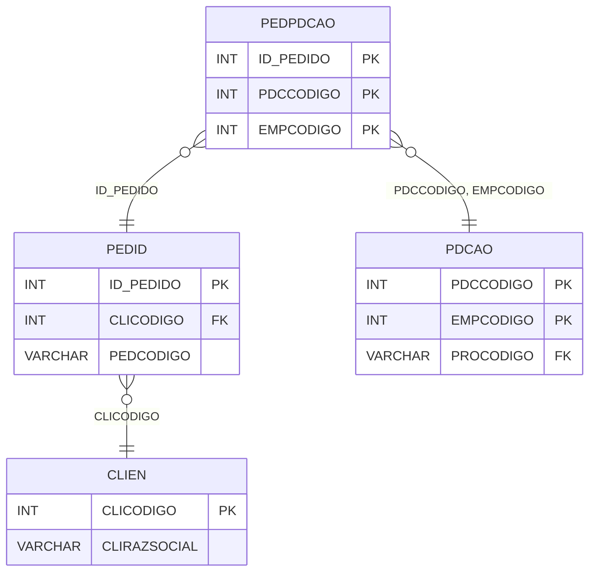

# PEDPDCAO - Documentação Completa de Relacionamentos

## 📊 Informações Gerais

- **Nome da Tabela**: PEDPDCAO (Pedido x Pedido de Compra)
- **Total de Registros**: 1.927.034
- **Total de Colunas**: 3
- **Chave Primária**: ID_PEDIDO, PDCCODIGO, EMPCODIGO (composite)
- **Chaves Estrangeiras**: 3
- **Índices**: 0
- **Tabelas Dependentes**: 0
- **Banco de Dados**: Firebird

## 📝 Descrição

**PEDPDCAO** é uma tabela de relacionamento que associa pedidos de venda com pedidos de compra (ordens de produção). Com **1.927.034 registros**, esta tabela permite rastrear quais pedidos de compra foram gerados a partir de pedidos de venda.

Esta tabela é essencial para:
- **Rastreamento**: Rastrear pedidos de compra relacionados a pedidos de venda
- **Produção**: Facilitar rastreamento de produção
- **Relatórios**: Gerar relatórios de pedidos por ordem de produção
- **Conciliação**: Facilitar conciliação entre vendas e produção

**Contexto de Negócio:**
Quando um pedido de venda é criado, podem ser gerados pedidos de compra (ordens de produção) para atender esse pedido. Esta tabela gerencia essa relação, permitindo rastrear a origem da produção.

---

## 🔑 Estrutura de Colunas

| Coluna | Tipo | Descrição |
|--------|------|-----------|
| **ID_PEDIDO** 🔑 🔗 | INT | Código do pedido de venda (PK, FK → PEDID) |
| **PDCCODIGO** 🔑 🔗 | INT | Código do pedido de compra (PK, FK → PDCAO) |
| **EMPCODIGO** 🔑 🔗 | INT | Código da empresa (PK, FK → PDCAO) |

---

## 🔗 Relacionamentos - Nível 1 (Diretos)

### PEDID - Pedido de Venda (FK Obrigatória)
**Volume:** 3.099.176 registros

**Relacionamento:**
```
PEDPDCAO.ID_PEDIDO → PEDID.ID_PEDIDO (N:1)
Constraint: PEDID_PEDPDCAO
```

**Descrição:** Cada registro relaciona um pedido de venda com um pedido de compra.

**Proporção:** ~62,2% dos pedidos têm relacionamento com pedidos de compra (1.927.034 / 3.099.176)

---

### PDCAO - Pedido de Compra (FK Obrigatória)
**Volume:** 3.201.636 registros

**Relacionamento:**
```
PEDPDCAO.PDCCODIGO, EMPCODIGO → PDCAO.PDCCODIGO, EMPCODIGO (N:1)
Constraint: PDCAO_PEDPDCAO
```

**Descrição:** Cada registro relaciona um pedido de compra com um pedido de venda.

**Proporção:** ~60,2% dos pedidos de compra têm relacionamento com pedidos de venda (1.927.034 / 3.201.636)

---

## 🔗 Relacionamentos - Nível 2 (Indiretos)

### PEDID → CLIEN (Cliente)
**Volume:** 9.251 registros

**Relacionamento:**
```
PEDPDCAO → PEDID → CLIEN
```

**Descrição:** Através de PEDID, é possível identificar o cliente relacionado.

---

### PDCAO → PRODU (Produto)
**Volume:** 178.187 registros

**Relacionamento:**
```
PEDPDCAO → PDCAO → PRODU
```

**Descrição:** Através de PDCAO, é possível identificar o produto relacionado.

---

## 🗺️ Diagrama de Relacionamentos



---

## 💡 Exemplos de Uso

### Consulta Básica

```sql
SELECT ID_PEDIDO, PDCCODIGO, EMPCODIGO
FROM PEDPDCAO
WHERE ID_PEDIDO = ?;
```

### Consulta com Informações do Pedido de Venda

```sql
SELECT 
    pp.*,
    p.PEDCODIGO,
    p.PEDDTEMIS,
    p.PEDVRTOTAL,
    c.CLIRAZSOCIAL
FROM PEDPDCAO pp
INNER JOIN PEDID p
    ON pp.ID_PEDIDO = p.ID_PEDIDO
INNER JOIN CLIEN c
    ON p.CLICODIGO = c.CLICODIGO
WHERE pp.ID_PEDIDO = ?;
```

### Consulta com Informações do Pedido de Compra

```sql
SELECT 
    pp.*,
    pdc.PDCDATA,
    pdc.PDCSITUACAO,
    pdc.PDCQTDADE,
    pr.PRODESCRICAO
FROM PEDPDCAO pp
INNER JOIN PDCAO pdc
    ON pp.PDCCODIGO = pdc.PDCCODIGO
    AND pp.EMPCODIGO = pdc.EMPCODIGO
INNER JOIN PRODU pr
    ON pdc.PROCODIGO = pr.PROCODIGO
WHERE pp.ID_PEDIDO = ?;
```

### Consulta de Pedidos de Compra por Pedido de Venda

```sql
SELECT 
    p.PEDCODIGO,
    COUNT(DISTINCT pp.PDCCODIGO) AS TOTAL_PEDIDOS_COMPRA,
    SUM(pdc.PDCQTDADE) AS QTDADE_TOTAL
FROM PEDID p
INNER JOIN PEDPDCAO pp
    ON p.ID_PEDIDO = pp.ID_PEDIDO
INNER JOIN PDCAO pdc
    ON pp.PDCCODIGO = pdc.PDCCODIGO
    AND pp.EMPCODIGO = pdc.EMPCODIGO
GROUP BY p.ID_PEDIDO, p.PEDCODIGO
ORDER BY TOTAL_PEDIDOS_COMPRA DESC;
```

### Inserção de Relacionamento

```sql
INSERT INTO PEDPDCAO (ID_PEDIDO, PDCCODIGO, EMPCODIGO)
VALUES (?, ?, ?);
```

---

## ⚡ Performance e Otimização

### Índices Recomendados

#### 1. Índice Composto na Chave Primária (Já existe implicitamente)
```sql
-- Índice primário já existe implicitamente
```

#### 2. Índice em ID_PEDIDO
```sql
CREATE INDEX IDX_PEDPDCAO_ID_PEDIDO 
ON PEDPDCAO (ID_PEDIDO);
```

**Justificativa:** Facilita buscas por pedido de venda (muito frequente).

#### 3. Índice Composto em PDCCODIGO e EMPCODIGO
```sql
CREATE INDEX IDX_PEDPDCAO_PDC_EMP 
ON PEDPDCAO (PDCCODIGO, EMPCODIGO);
```

**Justificativa:** Facilita buscas por pedido de compra.

---

## 📊 Estatísticas e Insights

### Volume de Dados

- **Total de Registros**: 1.927.034
- **Tamanho Médio Estimado**: ~30 bytes por registro
- **Tamanho Total Estimado**: ~58 MB

### Distribuição de Dados

- **Relacionamentos**: 1.927.034 relacionamentos entre pedidos de venda e compra
- **Taxa de Relacionamento**: ~62,2% dos pedidos de venda têm relacionamento com pedidos de compra

---

## 🔧 Integração com Código Laravel

### Model Eloquent

```php
<?php

namespace App\Models;

use Illuminate\Database\Eloquent\Model;
use Illuminate\Database\Eloquent\Relations\BelongsTo;

final class PedPdCao extends Model
{
    protected $table = 'PEDPDCAO';
    public $incrementing = false;
    public $timestamps = false;

    protected $primaryKey = ['ID_PEDIDO', 'PDCCODIGO', 'EMPCODIGO'];

    protected $fillable = [
        'ID_PEDIDO',
        'PDCCODIGO',
        'EMPCODIGO',
    ];

    protected $casts = [
        'ID_PEDIDO' => 'integer',
        'PDCCODIGO' => 'integer',
        'EMPCODIGO' => 'integer',
    ];

    /**
     * Relacionamento com Pedido de Venda
     */
    public function pedido(): BelongsTo
    {
        return $this->belongsTo(Pedid::class, 'ID_PEDIDO', 'ID_PEDIDO');
    }

    /**
     * Relacionamento com Pedido de Compra
     */
    public function pedidoCompra(): BelongsTo
    {
        return $this->belongsTo(PdCao::class, ['PDCCODIGO', 'EMPCODIGO'], ['PDCCODIGO', 'EMPCODIGO']);
    }

    /**
     * Buscar pedidos de compra por pedido de venda
     */
    public static function pedidosCompraPorPedido(int $idPedido)
    {
        return self::where('ID_PEDIDO', $idPedido)
            ->with(['pedido', 'pedidoCompra'])
            ->get();
    }

    /**
     * Buscar pedidos de venda por pedido de compra
     */
    public static function pedidosPorPedidoCompra(int $pdcCodigo, int $empCodigo)
    {
        return self::where('PDCCODIGO', $pdcCodigo)
            ->where('EMPCODIGO', $empCodigo)
            ->with(['pedido', 'pedidoCompra'])
            ->get();
    }
}
```

---

## ✅ Boas Práticas

### Design

1. **Chave Composta**: Manter integridade da chave composta
2. **Validação**: Validar ID_PEDIDO, PDCCODIGO e EMPCODIGO antes de inserir
3. **Unicidade**: Garantir que não haja duplicatas

### Performance

1. **Índices**: Usar índices para buscas frequentes (crítico devido ao volume)
2. **Consultas**: Usar eager loading para relacionamentos
3. **Volume**: Considerar particionamento devido ao grande volume

### Segurança

1. **Validação**: Validar valores antes de inserir
2. **Acesso**: Restringir acesso de escrita a usuários autorizados

---

**Documentação gerada em**: 2025-01-27

**Banco de dados**: Firebird

