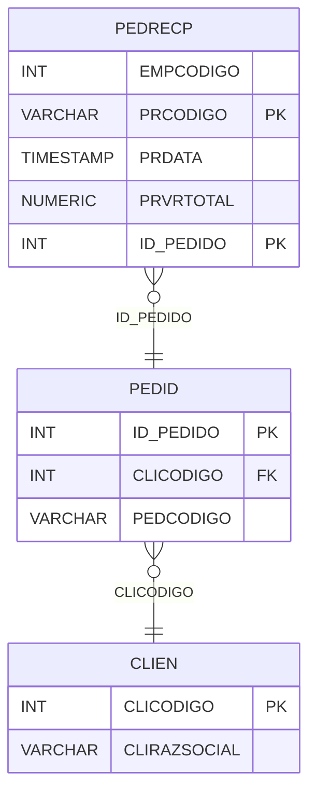

# PEDRECP - Documentação Completa de Relacionamentos

## 📊 Informações Gerais

- **Nome da Tabela**: PEDRECP (Pedido x Recibo)
- **Total de Registros**: 9
- **Total de Colunas**: 5
- **Chave Primária**: PRCODIGO, ID_PEDIDO (composite)
- **Chaves Estrangeiras**: 1
- **Índices**: 1
- **Tabelas Dependentes**: 0
- **Banco de Dados**: Firebird

## 📝 Descrição

**PEDRECP** é uma tabela de relacionamento que associa pedidos com recibos. Com apenas **9 registros**, esta tabela permite rastrear quais recibos estão relacionados a pedidos específicos.

Esta tabela é essencial para:
- **Rastreamento**: Rastrear recibos relacionados a pedidos
- **Conciliação**: Facilitar conciliação entre pedidos e recibos
- **Relatórios**: Gerar relatórios de pedidos por recibo
- **Auditoria**: Manter histórico de relacionamentos

**Contexto de Negócio:**
Pedidos podem estar relacionados a recibos emitidos. Esta tabela gerencia essa relação, permitindo rastrear a origem do recibo através do pedido.

---

## 🔑 Estrutura de Colunas

| Coluna | Tipo | Descrição |
|--------|------|-----------|
| **EMPCODIGO** | INT | Código da empresa |
| **PRCODIGO** 🔑 | VARCHAR(14) | Código do recibo (PK) |
| **PRDATA** | TIMESTAMP | Data do recibo |
| **PRVRTOTAL** | NUMERIC(27,2) | Valor total do recibo |
| **ID_PEDIDO** 🔑 🔗 | INT | Código do pedido (PK, FK → PEDID) |

---

## 🔗 Relacionamentos - Nível 1 (Diretos)

### PEDID - Pedido (FK Obrigatória)
**Volume:** 3.099.176 registros

**Relacionamento:**
```
PEDRECP.ID_PEDIDO → PEDID.ID_PEDIDO (N:1)
Constraint: PEDID_PEDRECP
```

**Descrição:** Cada registro relaciona um recibo com um pedido.

**Proporção:** Muito baixa (~0,0003% dos pedidos têm relacionamento com recibos)

---

## 🔗 Relacionamentos - Nível 2 (Indiretos)

### PEDID → CLIEN (Cliente)
**Volume:** 9.251 registros

**Relacionamento:**
```
PEDRECP → PEDID → CLIEN
```

**Descrição:** Através de PEDID, é possível identificar o cliente relacionado.

---

## 🗺️ Diagrama de Relacionamentos



---

## 💡 Exemplos de Uso

### Consulta Básica

```sql
SELECT EMPCODIGO, PRCODIGO, PRDATA, PRVRTOTAL, ID_PEDIDO
FROM PEDRECP
WHERE ID_PEDIDO = ?;
```

### Consulta com Informações do Pedido

```sql
SELECT 
    pr.*,
    p.PEDCODIGO,
    p.PEDDTEMIS,
    p.PEDVRTOTAL,
    c.CLIRAZSOCIAL
FROM PEDRECP pr
INNER JOIN PEDID p
    ON pr.ID_PEDIDO = p.ID_PEDIDO
INNER JOIN CLIEN c
    ON p.CLICODIGO = c.CLICODIGO
WHERE pr.ID_PEDIDO = ?;
```

### Consulta de Recibos por Período

```sql
SELECT 
    DATE(pr.PRDATA) AS DATA,
    COUNT(*) AS TOTAL_RECIBOS,
    SUM(pr.PRVRTOTAL) AS VALOR_TOTAL
FROM PEDRECP pr
WHERE pr.PRDATA BETWEEN ? AND ?
GROUP BY DATE(pr.PRDATA)
ORDER BY DATA DESC;
```

### Inserção de Relacionamento

```sql
INSERT INTO PEDRECP (EMPCODIGO, PRCODIGO, PRDATA, PRVRTOTAL, ID_PEDIDO)
VALUES (?, ?, ?, ?, ?);
```

---

## ⚡ Performance e Otimização

### Índices Existentes

#### 1. Índice em PRDATA
**Nome:** INDPRDATA
**Colunas:** PRDATA

**Justificativa:** Facilita buscas por data do recibo.

---

### Índices Recomendados

#### 1. Índice Composto na Chave Primária (Já existe implicitamente)
```sql
-- Índice primário já existe implicitamente
```

#### 2. Índice em ID_PEDIDO
```sql
CREATE INDEX IDX_PEDRECP_ID_PEDIDO 
ON PEDRECP (ID_PEDIDO);
```

**Justificativa:** Facilita buscas por pedido.

---

## 📊 Estatísticas e Insights

### Volume de Dados

- **Total de Registros**: 9
- **Tamanho Médio Estimado**: ~60 bytes por registro
- **Tamanho Total Estimado**: ~540 bytes

### Distribuição de Dados

- **Relacionamentos**: 9 relacionamentos entre pedidos e recibos
- **Taxa de Utilização**: Muito baixa (~0,0003% dos pedidos têm relacionamento com recibos)

---

## 🔧 Integração com Código Laravel

### Model Eloquent

```php
<?php

namespace App\Models;

use Illuminate\Database\Eloquent\Model;
use Illuminate\Database\Eloquent\Relations\BelongsTo;

final class PedRecP extends Model
{
    protected $table = 'PEDRECP';
    public $incrementing = false;
    public $timestamps = false;

    protected $primaryKey = ['PRCODIGO', 'ID_PEDIDO'];

    protected $fillable = [
        'EMPCODIGO',
        'PRCODIGO',
        'PRDATA',
        'PRVRTOTAL',
        'ID_PEDIDO',
    ];

    protected $casts = [
        'EMPCODIGO' => 'integer',
        'PRCODIGO' => 'string',
        'PRDATA' => 'datetime',
        'PRVRTOTAL' => 'decimal:2',
        'ID_PEDIDO' => 'integer',
    ];

    /**
     * Relacionamento com Pedido
     */
    public function pedido(): BelongsTo
    {
        return $this->belongsTo(Pedid::class, 'ID_PEDIDO', 'ID_PEDIDO');
    }

    /**
     * Buscar recibo por pedido
     */
    public static function porPedido(int $idPedido): ?self
    {
        return self::where('ID_PEDIDO', $idPedido)
            ->with(['pedido'])
            ->first();
    }
}
```

---

## ✅ Boas Práticas

### Design

1. **Chave Composta**: Manter integridade da chave composta
2. **Validação**: Validar PRCODIGO e ID_PEDIDO antes de inserir
3. **Valores**: Validar que PRVRTOTAL seja positivo

### Performance

1. **Índices**: Usar índice para busca por data (já existe)
2. **Consultas**: Usar eager loading para relacionamentos

### Segurança

1. **Validação**: Validar valores antes de inserir
2. **Acesso**: Restringir acesso de escrita a usuários autorizados

---

**Documentação gerada em**: 2025-01-27

**Banco de dados**: Firebird

