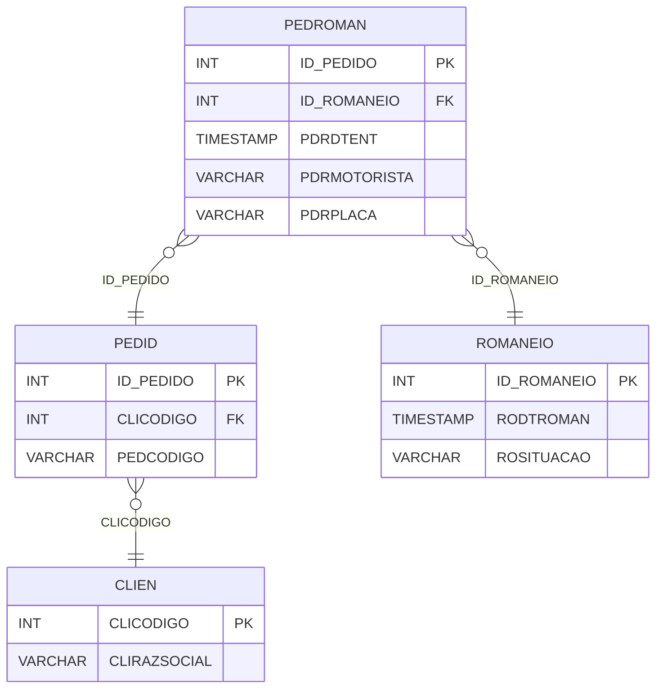

# PEDROMAN - Documentação Completa de Relacionamentos

## 📊 Informações Gerais

- **Nome da Tabela**: PEDROMAN (Pedido x Romaneio)
- **Total de Registros**: 381.271
- **Total de Colunas**: 5
- **Chave Primária**: ID_PEDIDO
- **Chaves Estrangeiras**: 2
- **Índices**: 0
- **Tabelas Dependentes**: 0
- **Banco de Dados**: Firebird

## 📝 Descrição

**PEDROMAN** é uma tabela de relacionamento que associa pedidos com romaneios de entrega. Com **381.271 registros**, esta tabela permite rastrear quais pedidos estão incluídos em cada romaneio de entrega, incluindo informações sobre motorista e veículo.

Esta tabela é essencial para:
- **Rastreamento de Entrega**: Rastrear pedidos em romaneios
- **Logística**: Facilitar gestão logística de entregas
- **Relatórios**: Gerar relatórios de entregas por romaneio
- **Auditoria**: Manter histórico de entregas

**Contexto de Negócio:**
Pedidos são agrupados em romaneios para entrega. Esta tabela gerencia essa relação, permitindo rastrear quais pedidos estão em cada romaneio e informações sobre a entrega (motorista, placa, data de entrega).

---

## 🔑 Estrutura de Colunas

| Coluna | Tipo | Descrição |
|--------|------|-----------|
| **ID_PEDIDO** 🔑 🔗 | INT | Código do pedido (PK, FK → PEDID) |
| **ID_ROMANEIO** 🔗 | INT | Código do romaneio (FK → ROMANEIO) |
| **PDRDTENT** | TIMESTAMP | Data/hora de entrega |
| **PDRMOTORISTA** | VARCHAR(37) | Nome do motorista |
| **PDRPLACA** | VARCHAR(14) | Placa do veículo |

---

## 🔗 Relacionamentos - Nível 1 (Diretos)

### PEDID - Pedido (FK Obrigatória)
**Volume:** 3.099.176 registros

**Relacionamento:**
```
PEDROMAN.ID_PEDIDO → PEDID.ID_PEDIDO (1:1)
Constraint: PEDID_PEDROMAN
```

**Descrição:** Cada registro relaciona um pedido com um romaneio. Relacionamento 1:1, onde cada pedido pode estar em no máximo um romaneio.

**Proporção:** ~12,3% dos pedidos estão em romaneios (381.271 / 3.099.176)

---

### ROMANEIO - Romaneio (FK Obrigatória)
**Volume:** 359.245 registros

**Relacionamento:**
```
PEDROMAN.ID_ROMANEIO → ROMANEIO.ID_ROMANEIO (N:1)
Constraint: ROMANEIO_PEDROMAN
```

**Descrição:** Cada registro relaciona um romaneio com um pedido.

**Proporção:** ~1,1 pedidos por romaneio em média (381.271 / 359.245)

---

## 🔗 Relacionamentos - Nível 2 (Indiretos)

### PEDID → CLIEN (Cliente)
**Volume:** 9.251 registros

**Relacionamento:**
```
PEDROMAN → PEDID → CLIEN
```

**Descrição:** Através de PEDID, é possível identificar o cliente relacionado.

---

### ROMANEIO → EMPRESA (Empresa - Relacionamento Lógico)
**Volume:** 6 registros

**Relacionamento Lógico:**
```
PEDROMAN → ROMANEIO → EMPRESA
```

**Descrição:** Através de ROMANEIO, é possível identificar a empresa relacionada.

---

## 🗺️ Diagrama de Relacionamentos



---

## 💡 Exemplos de Uso

### Consulta Básica

```sql
SELECT ID_PEDIDO, ID_ROMANEIO, PDRDTENT, PDRMOTORISTA, PDRPLACA
FROM PEDROMAN
WHERE ID_PEDIDO = ?;
```

### Consulta com Informações do Pedido e Romaneio

```sql
SELECT 
    pr.*,
    p.PEDCODIGO,
    p.PEDDTEMIS,
    r.RODTROMAN,
    r.ROSITUACAO
FROM PEDROMAN pr
INNER JOIN PEDID p
    ON pr.ID_PEDIDO = p.ID_PEDIDO
INNER JOIN ROMANEIO r
    ON pr.ID_ROMANEIO = r.ID_ROMANEIO
WHERE pr.ID_PEDIDO = ?;
```

### Consulta de Pedidos por Romaneio

```sql
SELECT 
    r.ID_ROMANEIO,
    r.RODTROMAN,
    COUNT(*) AS TOTAL_PEDIDOS,
    SUM(p.PEDVRTOTAL) AS VALOR_TOTAL
FROM ROMANEIO r
INNER JOIN PEDROMAN pr
    ON r.ID_ROMANEIO = pr.ID_ROMANEIO
INNER JOIN PEDID p
    ON pr.ID_PEDIDO = p.ID_PEDIDO
GROUP BY r.ID_ROMANEIO, r.RODTROMAN
ORDER BY TOTAL_PEDIDOS DESC;
```

### Consulta de Entregas por Motorista

```sql
SELECT 
    PDRMOTORISTA,
    COUNT(*) AS TOTAL_ENTREGAS,
    COUNT(DISTINCT ID_ROMANEIO) AS TOTAL_ROMANEIOS
FROM PEDROMAN
WHERE PDRMOTORISTA IS NOT NULL
    AND PDRMOTORISTA <> ''
GROUP BY PDRMOTORISTA
ORDER BY TOTAL_ENTREGAS DESC;
```

### Consulta de Entregas por Período

```sql
SELECT 
    DATE(PDRDTENT) AS DATA_ENTREGA,
    COUNT(*) AS TOTAL_ENTREGAS
FROM PEDROMAN
WHERE PDRDTENT IS NOT NULL
GROUP BY DATE(PDRDTENT)
ORDER BY DATA_ENTREGA DESC;
```

### Inserção de Relacionamento

```sql
INSERT INTO PEDROMAN (ID_PEDIDO, ID_ROMANEIO, PDRDTENT, PDRMOTORISTA, PDRPLACA)
VALUES (?, ?, ?, ?, ?);
```

---

## ⚡ Performance e Otimização

### Índices Recomendados

#### 1. Índice na Chave Primária (Já existe implicitamente)
```sql
-- Índice primário já existe implicitamente
```

#### 2. Índice em ID_ROMANEIO
```sql
CREATE INDEX IDX_PEDROMAN_ID_ROMANEIO 
ON PEDROMAN (ID_ROMANEIO);
```

**Justificativa:** Facilita buscas por romaneio.

#### 3. Índice em PDRDTENT
```sql
CREATE INDEX IDX_PEDROMAN_PDRDTENT 
ON PEDROMAN (PDRDTENT);
```

**Justificativa:** Facilita buscas por data de entrega.

---

## 📊 Estatísticas e Insights

### Volume de Dados

- **Total de Registros**: 381.271
- **Tamanho Médio Estimado**: ~50 bytes por registro
- **Tamanho Total Estimado**: ~19 MB

### Distribuição de Dados

- **Pedidos em Romaneios**: 381.271 pedidos
- **Taxa de Utilização**: ~12,3% dos pedidos estão em romaneios

---

## 🔧 Integração com Código Laravel

### Model Eloquent

```php
<?php

namespace App\Models;

use Illuminate\Database\Eloquent\Model;
use Illuminate\Database\Eloquent\Relations\BelongsTo;

final class PedRoman extends Model
{
    protected $table = 'PEDROMAN';
    protected $primaryKey = 'ID_PEDIDO';
    public $incrementing = false;
    public $timestamps = false;

    protected $fillable = [
        'ID_PEDIDO',
        'ID_ROMANEIO',
        'PDRDTENT',
        'PDRMOTORISTA',
        'PDRPLACA',
    ];

    protected $casts = [
        'ID_PEDIDO' => 'integer',
        'ID_ROMANEIO' => 'integer',
        'PDRDTENT' => 'datetime',
        'PDRMOTORISTA' => 'string',
        'PDRPLACA' => 'string',
    ];

    /**
     * Relacionamento com Pedido
     */
    public function pedido(): BelongsTo
    {
        return $this->belongsTo(Pedid::class, 'ID_PEDIDO', 'ID_PEDIDO');
    }

    /**
     * Relacionamento com Romaneio
     */
    public function romaneio(): BelongsTo
    {
        return $this->belongsTo(Romaneio::class, 'ID_ROMANEIO', 'ID_ROMANEIO');
    }

    /**
     * Buscar pedido por romaneio
     */
    public static function porRomaneio(int $idRomaneio)
    {
        return self::where('ID_ROMANEIO', $idRomaneio)
            ->with(['pedido', 'romaneio'])
            ->get();
    }

    /**
     * Buscar romaneio por pedido
     */
    public static function porPedido(int $idPedido): ?self
    {
        return self::where('ID_PEDIDO', $idPedido)
            ->with(['pedido', 'romaneio'])
            ->first();
    }
}
```

---

## ✅ Boas Práticas

### Design

1. **Chave Primária**: ID_PEDIDO deve corresponder a um PEDID válido
2. **Validação**: Validar ID_ROMANEIO antes de inserir
3. **Entrega**: Validar PDRDTENT quando preenchido

### Performance

1. **Índices**: Usar índices para buscas frequentes
2. **Consultas**: Usar eager loading para relacionamentos

### Segurança

1. **Validação**: Validar valores antes de inserir
2. **Acesso**: Restringir acesso de escrita a usuários autorizados

---

**Documentação gerada em**: 2025-01-27

**Banco de dados**: Firebird

